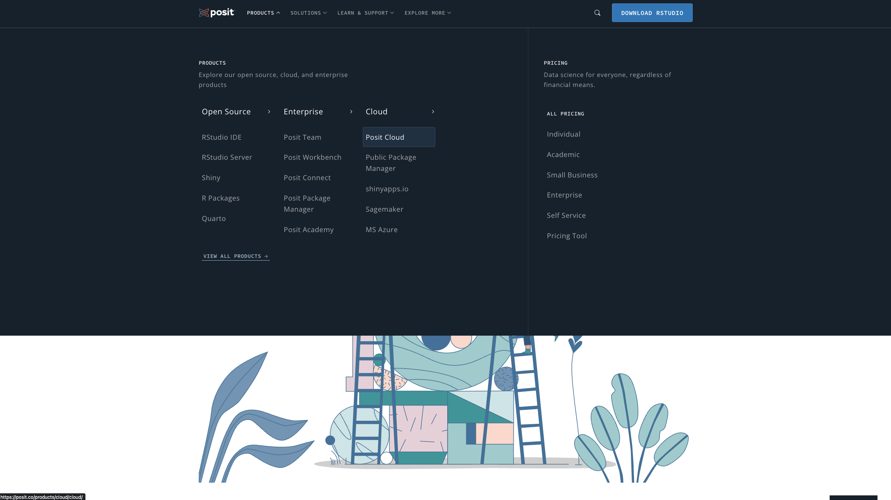
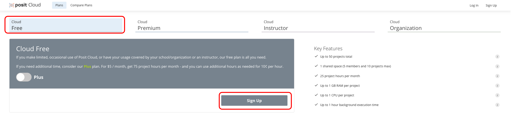
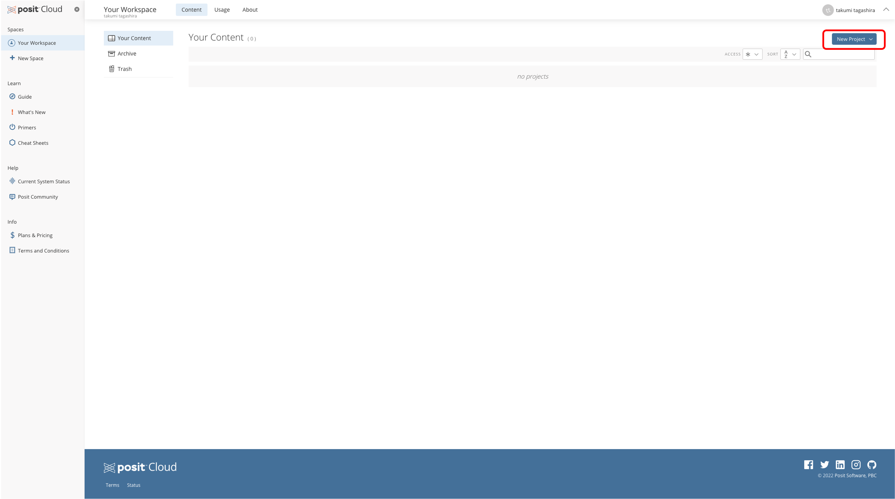
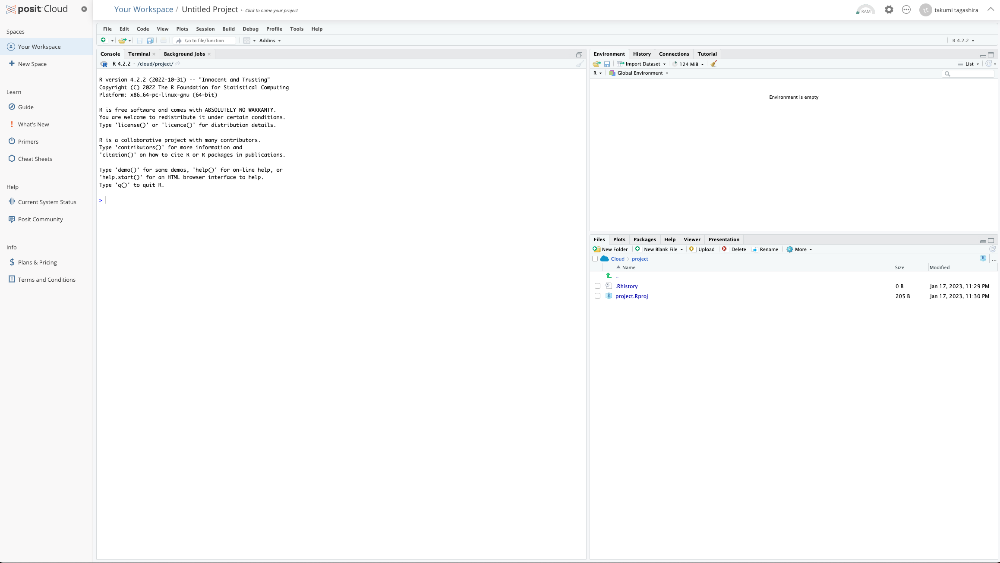
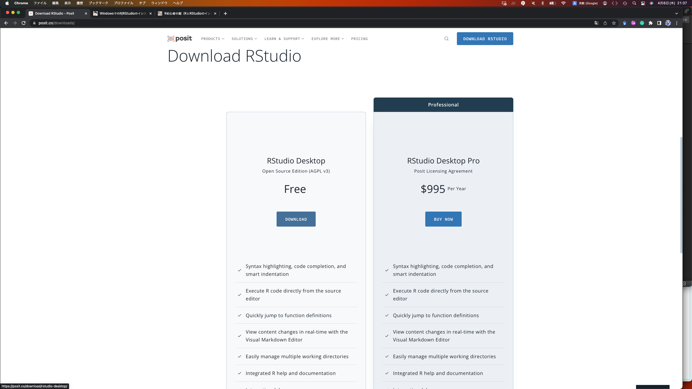
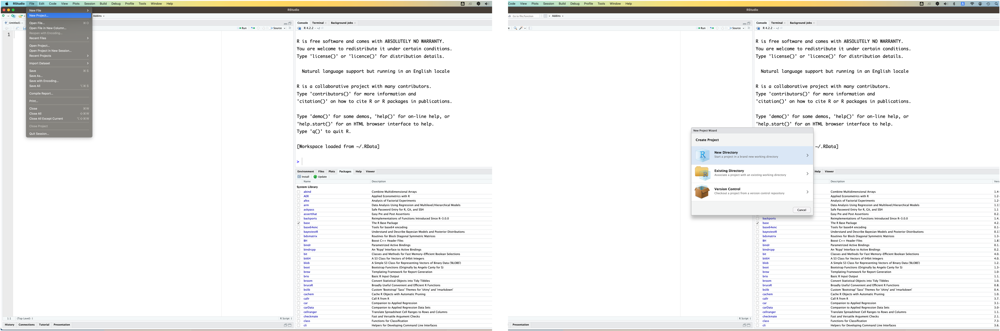
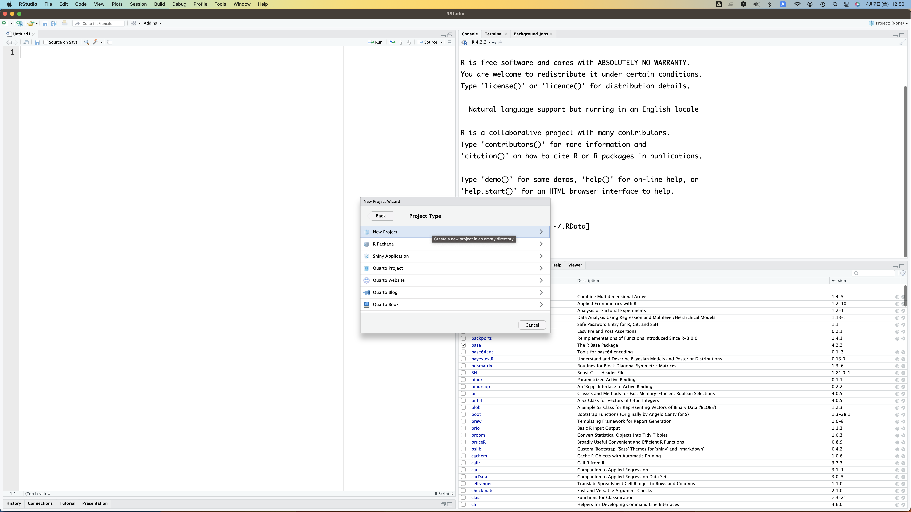
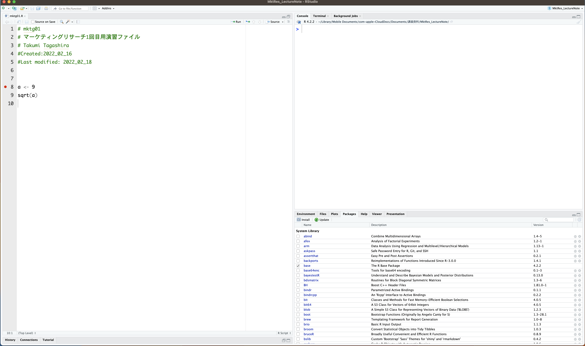

# R と R studioに慣れる{#rusage}

R（あーる）は統計、データ解析、統計グラフ作成のためのオープンソースソフトウェアである。Rは以下のサイト（<http://cran.ism.ac.jp/>）等からダウンロードし、インストールが可能である。ソフトウェアには、Windows用、Mac用、Linux用があり、ユーザー自身の環境に適したバージョンを選択してほしい。Rを用いる際には、多くの場合) R studio、Jupyter notebookや、Rコマンダーのようなユーザーインターフェイスが利用される。そしてRを使用する際には (Rコマンダーを使わないかぎりは) 基本的にソースコードを入力し計算、分析を行う。しかし、本講義においては後述する Cloud環境を利用するため、個人の意思でデスクトップ版をインストールする場合を除き、Rのインストールについては気にしなくて良い。

Rを用いる際に最もよく使われる環境（アプリケーション）のひとつがR studioである。そのため、本講義においても基本的にはR studioを用いることを前提とするが、R studioをデスクトップにインストールし利用する場合には、Rそのものもインストールしておく必要があることに注意が必要である。R studioは現在、Positとも呼ばれており、以下のサイトからアクセスが可能である（<https://posit.co/>）。

本講義では、Posit Cloudという、アカウント登録を行うことでブラウザ上でR studioを利用できる環境を勧める。R studio Desktop版 の利用においては、ディレクトリ設定などによってエラーが生じることが多々あり、個別のPC環境に合わせて対応、設定を行う必要がある。そのため、まとまった人数に対応する必要がある本講義においてはクラウド版を利用する。本講義を通じてRおよびR studioの使い方に慣れ、自身の研究や仕事等でデータ処理や分析を行う場合にはR studio デスクトップ版（通常はR studio IDEのフリーバージョンで十分）をインストールし、利用してほしい。もちろんはじめからデスクトップ版を利用してもらっても構わないが、その際には環境設定について色々と注意してほしい。本資料内では、第 \@ref(desktop) 節にて、デスクトップ版の利用についての説明をしているため、関心のある読者は参照してみて欲しい。

## Posit cloudを始める

R studioは、Rを利用するためのアプリケーションである。R単体で使うよりも便利な機能が搭載されており、R studioを使うことでプログラミング作業を容易にすることが可能になる。最も大きな特徴としては、Rでの操作、分析を実行するための「コンソール画面」と、実行したい操作、分析のコードを記述しておく「Rスクリプト」と呼ばれるテキストファイルを一つの画面内に同時に表示できることである。そのため、Rに実行してほしいコマンドをテキストデータのように記述、修正し書き溜めておける一方で、その実行もスムーズに行え、結果も同画面内で確認することができる。

R studioをより手軽に利用できるサービスがPosit Cloudである。Posit Cloudはブラウザを通じてR studio環境を利用できるサービスであり、アカウント登録をするだけでよく、コンピュータへのRおよびR studioのダウンロードとインストールが不要である。

Posit Cloudの利用方法はとても簡単である。大まかな利用までの流れは以下のとおりである。

- 以下のリンク（<https://posit.co/>）からサイトへアクセスし、ProductsタブからPosit Cloudを選択する。

{width=70%}

- その後、進んだ画面で "Get Started" $\rightarrow$ （特別な理由がなければ）Free planを選択し "Sign up" $\rightarrow$ 好きな方法でアカウントを作成する。

{width=70%}

- 登録が完了すると、自身のアカウントのホーム画面へ移動する。新しいR studio セッションを開始するためには、画面右上の New projectボタンを押し、"New Rstudio Project" を選択する。

{width=70%}

- New projectのセットアップが完了すると、Studio環境画面が表示される。

{width=70%}

Rstudioは、上記の図のような画面構成をしている。Rstudioの画面を構成する主なウィンドウはペインと呼ばれ、(1) RスクリプトでRコードの入力・編集に用いる"Source"、(2) Rの命令を直接入力し結果も表示される"Console"がなどが主な要素としてある。また、その他利用しているデータ情報、パッケージ、履歴など様々なタブが存在する。Rstudioの初回起動時にはSourceのペインは収納されているため、 Rスクリプトファイルを作成する必要がある。Rstudioは基本的に4分割画面で表示され、各ペインの配置については、Tools $\rightarrow$ Global option $\rightarrow$ Pane Layoutより変更が可能になる。Rstudioを操作する上で、基本的に重要となる情報は、(1) Source、(2) Console、(3) データやプロットに関する環境情報の3点であるので、以下のような配置がおすすめである。

- 左上 or 下: Source
- 左下 or 上: History (ただし、さほど重要ではないので畳んだ状態にしておく)
- 右上 or 下: Console
- 右下 or 上: 複数タブをまとめ

配置の目的はあくまで、必要な情報を同一画面上に表示することであるため、自身のやりやすい配置を考えてアレンジしてほしい。なお、本講義ノート内に掲載している R studio 操作画面のキャプション画像では、Posit cloudではなくデスクトップ版の画面を用いている場合もあるが、ご容赦いただきたい。

## （補足）R studio デスクトップ版の利用{#desktop}

Posit cloud のフリーアカウントには、利用可能な時間やデータ容量に制限が存在する。自身の利用スタイルを鑑みて、Posit cloudのフリープランでは不十分である場合には、有料版へのアップグレードやDesktop版のインストールによって対応する必要がある。ここでは、 R studio Desktop の利用について紹介する。

R studioをオフライン環境で使う場合には、R と R studioの両方をインストールする必要がある。Rは以下のサイト（<http://cran.ism.ac.jp/>）等からダウンロードし,インストールが可能である。ソフトウェアには、Windows用，Mac用，Linux用があり、ユーザー自身の環境に適したバージョンを選択してほしい。

R studio のインストールは、以下のリンクから "Download" ボタンをクリックすることで始まる（<https://posit.co/downloads/>）。なお、特別な事情がない限り、無料版で十分分析が可能である。
無料版のダウンロードが完了したら、指示に従いインストールを実施する。その際の設定はすべてデフォルトで構わない。

{width=70%}

ただし、WindowsでのRおよびR studioのインストールには注意が必要である。特に、Rを用いる講義を受け持っていると、新たなパッケージのインストールができないなどのトラブルが頻発する。これらの問題点に調べると、(1) 文字コードによる文字化けの問題、(2) ユーザーアカウントのホームディレクトリ名に日本語（全角）が利用されていること、(3) Rのライブラリが(勝手に) One drive 上に作成されることが原因であることが多かった。これに対して、 R の version 4.20以降からは、UTF-8の文字コードに対応したり、デフォルトでのRのインストール場所の変更（One drive上でない）が行われたりと、問題の改善が図られている。自身のホームディレクトリの名前が全角文字であるときは、ホームディレクトリ以外のローカルディレクトリを設定したほうが良い。この点に関する対応には、三重大学の奥村先生によって以下のウェブサイトに説明が記載されている（<https://okumuralab.org/~okumura/stat/R-win.html>）。


## （補足）デスクトップ版の利用とプロジェクト機能
R および R studio のインストールが完了したら、アプリケーションを起動する。R studio の利用方法については基本的に Posit cloudの説明と同様である。ただし、デスクトップ版で R studio を利用する際には、「プロジェクト」機能を使うことを勧める。プロジェクトは、互いに関連し合ったファイルの集まりを指す。Rを通じた分析では、たくさんのファイルを扱うことになる。例えば、複数のRスクリプトやデータセット、加工したデータセットの保存、分析結果、出力された図表などがある。これらのファイルを手作業で一括管理することは困難である。むしろそのような管理作業に認知的な負担を費やしたくないというのが分析者の本音である。プロジェクト機能を使うことにより、作業ディレクトリとファイルの保存先をひとまとまりに指定できるため、ファイル管理の手間がなくなる。

新しいプロジェクトを作成するシンプルな方法が、Fileから作成する方法である。具体的には、File -> New Project -> New Directory -> Create New Project ->Directory nameの指定 -> プロジェクトの設置場所（ディレクト）の指定、という手順で作成する。

{width=70%}

{width=70%}


R をデスクトップ上で利用する際には、基本的には自身のPC内にある（もしくはディレクトリにアクセス可能である）データの所在地（ディレクトリ）を特定することでデータの操作や分析を行う。これに対してプロジェクト機能を利用することでそのプロジェクトを実行している際に参照するワーキングディレクトリを固定することが可能になる。この機能によってR studioを通じたデータ処理や分析作業が容易になり、不要なトラブルを避けることが可能になるため、デスクトップでR studioを使う場合には可能な限りプロジェクト機能を利用してほしい。

## Rの基本操作

ここでは、Rを使用する上での基本的な操作方法を紹介する。Rはコマンド（命令）をconsoleを通じて実行することで動かすことができる。例えば四則演算であれば、以下のように命令し、計算が実行できる。

```{r Basic calculation}
1 + 2
5 - 10
3 * 8
1/2
```

基本的に一つのコマンドは1行に書き、数字、演算記号、スペースは半角で入力する。以下は、べき乗、平方根、自然対数を計算するためのコマンドで計算できる。

```{r Calculation2}
2^3
sqrt(2)
log(2)
```

Rは、ベクトルや行列の計算も可能である。c() という関数を用いると、ベクトルを作成できる。例えば、c(1, 3, 5) というコマンドによって(1, 3, 5)というベクトルが作成できる。作成したベクトルを使って以下のような計算も可能である。

```{r Vector}
c(1, 3, 5) + 1
```

ベクトルは、連続した数字の列を生成するための演算子である : を用いても作成することができる。例えば、1から100の整数を要素とするベクトルは以下のように作成することが可能である。

```{r Vector_integer}
1:100
```

また、ベクトルの要素は文字列でも構わない。
```{r character}
cities <- c("Tokyo","Osaka","Kobe")
cities
```


上記の計算方法に加え、Rが持つ重要な特徴に、オブジェクトの定義がある。Rでは、任意の行列、ベクトル、数値などに名前をつけ定義したうえで、それを用いた計算を行うことができる。なお、Console上で以下のように定義（実行）したオブジェクトはenvironmentタブ内に表示されるため、各自確認をしてほしい。なお、定義したオブジェクトの確認・出力も簡単に行えるが、大文字と小文字は区別されるため、注意が必要である。

```{r object}
a <- 1
b <- 2

a
```

```{r object_Error, error=TRUE}
A
```

また、定義したオブジェクトを用いた計算も実行できるため、各自以下の計算を実行し、結果を確認してほしい。

```{r object_calc, eval=FALSE}
a + b 
a / b 
a ^ b
```

なお、先程のベクトル操作と組み合わせ、ベクトル名 [i] とすることで、ベクトルの i 番目の要素にアクセスすることができる。例えば、以下のaとbというベクトルから特定の要素を取り出すことを考える。なおこの場合、同時に複数の要素を取り出すこともできる。
```{r}
a <- seq(10, 100, length = 10)
b <- 10:1
```
- aの2番目の要素
```{r}
a[2]
```
- bの2番目の要素
```{r}
b[2]
```
- aの3-5番目の要素
```{r}
a[3:5]
```
- aの1,3,5番目の要素
```{r}
a[c(1,3,5)]
```


分析で繰り返し必要になる機能がRで使えないときは、function()関数を使って、新たな関数を作成できる。例えば、最大値と最小値を並べて表示したい場合を考える。そのために、ここでは 'mm' という新たな(オブジェクトxの最小値と最大値で構成されるベクトルを返す)関数を作ってみる。

```{r newfunction}
mm <- function(x){
  c(min(x), max(x))
}
```

そして上記の関数を利用して、以下のオブジェクト a, b の最小値と最大値を出力する。

```{r mmdemonstration}
a <- c(1, 5, 100, 2, -8, 7)
b <- c(1, 6, 8, 0, 120)

mm(a)
mm(b)
```

しかし、すべての関数を自作するのは難しい。Rでは様々な計算を実行するための関数が用意されており、多くのマーケティング研究においては既存の関数を用いることで対応が可能である。実は上記のmm関数の中で使っている "min"や"max"も、それぞれ最小値と最大値を返す関数である。他にも例えば、meanや median があり、これらはそれぞれ平均値と中央値を計算するための関数である。

関数の利用においては例えば、'f()'のように関数名'f'のあとにカッコをつけて表記する。()の中には、引数（arguments）を用い、計算に必要な情報を指定することが必要となる。例えば、seq()という関数を用いて、2以上20以下の偶数の数列(sequence)を作ることが可能である。以下では、二通りの表記を提示するが、どちらも同じ結果を返す。
```{r seq_example}
seq(from = 2, to = 20, by = 2)

seq(2, 20, 2)
```

特定の関数に対する引数を確認したい場合は '?関数名'とconsoleに命令することで確認が可能になる。例えば、seq関数について知りたければ、'?seq' で確認できる。

Rに元から含まれている関数以外にも他者が開発してくれた関数も存在する。そしていくつかの関数をまとめたpackagesが多数存在する。これまで世界中の開発者たちが作成したパッケージを公開してくれている。パッケージは何らかの目的や課題を達成することを目的に構成されたコードライブラリであり、それらをインストールし、各セッションごとに起動することで利用できる。

CRANで公開されているパッケージは、install.packages()でインストール可能である。また、Rstudio の場合、ペインからpackagesタブ$\rightarrow$Install$\rightarrow$パッケージ名の入力という手順でもインストールが可能である。そしてインストール済パッケージは、`library()` によって起動することで、活用可能にある。ここで注意しておきたいのは、library()によるパッケージの起動はセッションごとに実行しないといけないという点である。まずは以下の通り、本講義で用いる "tidyverse" パッケージをインストールし起動してみる。"tidyverse"は、複数のパッケージから構成されているパッケージであり、データの整形・分析を行うために役立つ複数のパッケージをまとめてインストール・起動できる。

```{r tidyverse, eval = FALSE, message=FALSE}
install.packages("tidyverse")
library("tidyverse")
```


## R スクリプトのすゝめ
Rstudio環境で作業を行う際には、Consoleに直接コマンドを入力するのではなく、'.R' という拡張子のファイルを使って、「Rスクリプト」を作成することを勧める。RスクリプトはRでの分析に対応しRコマンドの集まりとして記されるファイルであり、SourceエディタからRスクリプトに記載されたコマンドを、Consoleを通じて実行する。

Rスクリプトを用いることの重要性は、コマンドの修正可能性と、分析の再現性という二点から理解できる。まず修正可能性として、そもそもコマンドを書くうえでは大小様々な誤りが付き物である。このような間違いに対応し適宜修正を加えていくためには、実行するコマンドを一つ一つ console に直接記載するのではなく、Rスクリプトとして分析過程を記録し、その内容に基づき記載、修正を加えることが好ましい。

第二に再現性においては、Rスクリプトとしてデータ整形・分析のプロセスを文書ファイルとして保存しておくことで研究者自身もしくは第三者が分析を再現することが可能になる。これは研究プロセスの客観性を高め、分析結果の信頼性を高めるために非常に重要な要素である。

これらに加え、Rスクリプトの利用は研究者個人の研究遂行上の利点もある。自身が行った研究であっても分析の細部に関しては時間経過とともに忘れてしまうものである。その際に、Rスクリプトによる分析プロセスの追跡可能性が役に立つ。また、同様の分析を再度別データで実施する場合も、既存のRスクリプトを応用することで効率的に分析が可能になる。これらに加え、共同研究において他の研究者と分析プロセスを共有する場合にもRスクリプトが役に立つ。

### Rスクリプトを書く

先述のRスクリプトの利点を活かすために、Rスクリプトの作成においては、いつ作成されたなんのためのファイルなのか、そしてファイル内に記載されているコマンドがどのような意図によるものなのかがわかるように書くべきである。そのための重要になるのがコメント機能である。一つの行の中で#記号よりも後ろの部分はコメントとして処理（コメントアウト）される。この機能を使い、コメントで自然言語による説明を加えることで、コマンドの説明や意図等、自分や他人がスクリプトを見返して内容を理解できるようにする。例えば、Xという変数の平均値を求める場合、以下のようにRスクリプトを書くようにする。

```{r mean, eval=FALSE}
#Xの平均値を求める。
mean(X)
```

Rスクリプトは、Rstudioの左上にある+ボタンから新規作成可能である。ここでは試しに、新規Rスクリプトを作成し、"mktg01.R" という名前で保存してほしい。保存したRスクリプトはファイルから開くことができる。"mktg01.R"ファイルを作成したら、試しに以下のコマンドを書き込み、実行してほしい。Rスクリプトからコマンドを実行する際には、コマンド記入後、Rスクリプト上で実行したい行にカーソルを合わせた状態でcommand (control) + Return (Enter)を入力する。もう一度同じキーを押すと、2行目のコマンドが実行される。これらを実行することで、Rコンソール上に、下記と同じ結果が出ていることを確認してほしい。なお、コマンドを記入の際には、こまめに command (control) + s により保存することを心がけるようにしてほしい。

```{r}
a <- 9
sqrt(a)
```


また、Rスクリプトを作成する際には、ファイルの冒頭に以下の説明を書き込む習慣をつけると後々見返すときに便利である。

- ファイル名
- 目的
- 作成者
- 作成日
- 最新更新日

例えば、上記の内容とコマンドを含めた "mktg01.R" ファイルは、以下のようになる。

{width=70%}


## 本章のまとめ

- Rはデータの管理、分析、図表の作成を行うことができる統計分析プログラミング言語である。
- Rを動かすには、コマンドと呼ばれる命令をコンソールを通じて実行する。
- コマンドは基本的にRスクリプトに書き込んでからcommand (control) + Return (Enter)で実行する。
- Rスクリプトにはコマンドだけでなくコメントを使った説明も追加する。
- 分析には既存の関数やパッケージを使うことが多い。

## 参考文献
- 浅野雅彦・矢内勇生 (2018) 「Rによる計量政治学」, オーム社.
- ランダージャレド（2015）「みんなのR 第2版」，高柳新市・牧山幸史・蓑田高志訳，マイナビ.
