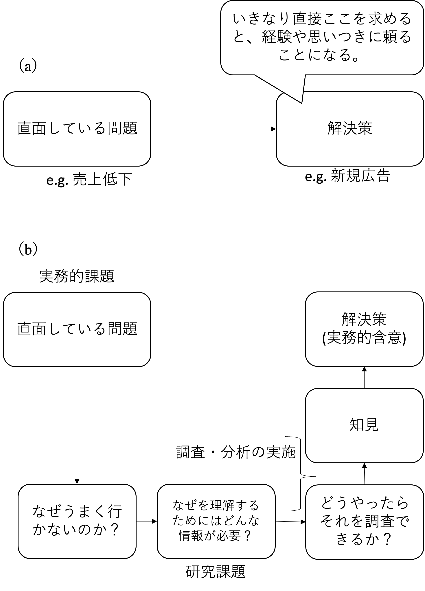

# リサーチデザイン{#design}
本講義は定量的マーケティングリサーチ過程の全体像を理解し、それを監督・実行できるようになることを目的とする。そのためには、基本的な分析方法およびその結果を適切に解釈できるようになることに加え、実証的なリサーチプロジェクトを管理・実行する前提知識が必要になる。ただ思いつきのままにデータを取り、それを羅列しても適切な定量的研究にはならない。特に、マーケティング・リサーチは、企業活動における顧客や市場のリサーチと、学術研究としてのリサーチが存在する。企業活動におけるリサーチにおいても、学術研究で培われるスキルや考え方は応用できる。そこで本章では、（1）マーケティング実務とリサーチの関係、（2）研究の全体像、（3）研究課題や仮説の導出に加え、（4）学術的研究に求められる科学哲学や理論に関する基礎的な考え方を提示する。本章の内容は研究者志望の大学院生にとって重要であることはもちろんだが、企業においてマーケティングリサーチに従事する人たちにとっても重要であると期待する。特に、本章では「マネジメントとリサーチの異なる視点」、「実務的課題と研究課題」といった実務的意思決定とリサーチ業務の対比によるマーケティングにおけるリサーチの考え方についての議論も提供している。筆者は、これらの内容は企業内でリサーチ業務を実施する際にも有用だと考える。

## マーケティング実務とリサーチ

### 実務とリサーチの異なる視点
経営学部や商学部などに在籍している学生であれば、「マーケティング」に関する様々な講義や教科書に触れているだろう。しかしながら、その際にそれらの講義や教科書がどのような視点でマーケティングを捉え、議論しているのかに注意することが重要になる。マーケティングを議論する際には、（1）マーケティング意思決定者の視点と、（2）マーケティングリサーチャーの視点が存在する。マーケティング意思決定者の視点からは、マーケティングに関する意思決定を行い、実行することを目的に議論が行われる。「マーケティング・マネジメント」はこの視点の典型的な領域である。ここでは、意思決定のサポートするための既存のフレームワークを紹介することが多い。例えば、マーケティングで紹介される4Ps（Product, Price, Promotion, Place）や、STP（Segmentation, Targeting, Positioning）などは、意思決定や実行を手助けするための指針となることを目的としている。そのために、提示される議論や枠組みの精緻さよりも実務的有用性が優先されることも多い。

第二に、マーケティングリサーチャーの視点では、マーケティングや消費者、顧客に関連する信頼度の高い情報や知識を得ることを目的に議論が行われる。「マーケティングリサーチ」や「マーケティングサイエンス」はこの視点の典型的な領域である。マーケティングに関する研究では、既存の知識を疑ったり、不足している知識を発見し補う事を求める。そのうえで、学術的研究の場合には発見物による一般化可能性を、企業での研究では自社顧客への深い理解を求めることが多い。そのため、この視点では議論されている内容の精緻さや文書内の論理的一貫性が優先される。

企業内におけるマーケティング実務においては当然マーケティング意思決定者の視点が優先されるわけだが、マーケティングリサーチもこれと無関係ではない。企業内におけるマーケティングリサーチは、実務的な意思決定を助けるために実施される（Malhotra, 2019）。マーケティング意思決定者は通常、マーケティングに関する実務的課題（\@ref(question)節参照）を抱えておりそれを解決したいと考えている。しかしながら、意思決定者は闇雲にマーケティング戦略や戦術を決定すれば良いわけではなく、市場や消費者、既存顧客などに関する情報をもとにより効果的な方策を模索している。企業としてのマーケティングリサーチでは、（1）実務的課題から必要な情報（研究課題）の特定化、（2）情報（調査結果）の提供、を通じてマーケティング意思決定者をサポートすることが期待される。

マーケティング実務においては、「どうするべきか」という行動に即した問いや規範的な議論が注視されるが、「どうするべきか」という規範的な問いに直接的に答えるようにリサーチを設計することは避けたほうが良い。そのためにも、「リサーチの結果に基づく含意として実務的な指針が導かれる」ということを意識すると実務的にも関連性の高いリサーチを設計しやすい。

例えば、「どのような広告内容を採用するのが良いか」という問いに対して直接的に答えるリサーチを計画するのは好ましくない。この問いが問題である理由はいくつか存在する。第一に、これは分析手法においても説明するが、リサーチにより正確に未来を予測することは不可能である。そのため、「こうすべき」という規範的な回答は基本的に避けたほうが良い。規範的な問いに対しては、研究の結果得た知識をもとに議論を行うことで得る「実務的含意」に基づき迫ることが好ましい。なお、企業内での研究ではもちろんだが、学術的な研究においても結果から得る実務的含意はとても重要である。マーケティングに関する研究は社会科学の応用領域である。そのため、我々が行っている研究およびその結果がどのように社会や実務につながるのかについて、研究者は意識的になる必要がある。

第二に、問題設定が不明確である点についても問題を指摘することができる。何を良しとするかの基準が明確ではなく、消費者が商品に対して覚えてくれる（想起集合に入る）ことや、好意を抱く（態度形成）、買いたいと思う（購買意図の形成）に加え、実際に買う（選択）など、何を目的とするのかが明確でなく、何をもって「良い広告」とするのかが漠然としている。同様に、広告設計において企業が調整できる内容も様々ある。広告内で用いるメッセージや、有名人利用の有無から、広告内で用いる文字のフォントやサイズまで、色々なものを選択しなければならない。このように、「何と何の関係を捉えようとしているのか」が曖昧であることも上記の問いの問題点である。学生の中には、「網羅的かつ包括的にこの問題を捉えたい」という志のもと、上記のような曖昧な問いを採用するケースも散見される。しかしながら基本的には、曖昧な問いからなにか明確な回答を得ることは困難である。つまり、包括性の名のもとにこのような問いを設計してしまうと、結局は実務的にも何も言えない結果しか得ることができないことに注意が必要である。

本節のこれまでの内容をまとめると、「実務的課題と研究課題は別物だが、研究によって得る実務的含意は重要である。」と言える。企業内でのマーケティングリサーチは意思決定者をサポートするために実行される（Malhotra, 2019）。そのため、リサーチ結果が意思決定者に指示を与えるわけではないということに注意が必要である。以下の図（a）のように、実務家が直面している課題に対していきなり解決策を求めようとすると、個人や組織の勘や経験、思いつきに頼ることになる。このような意思決定を避けようとするのが、基本的なマーケティング・マネジメントの考え方である。そこで、直面している問題の背後に存在する理由について推察し、どのような情報を得る（問いに答える）ことができればその理由が正しいか否かを理解できるのかを考えることがまず必要になる。つまり、問題の背後にある何らかのメカニズムについて仮説を構築し、その仮説自体を検証するための問いを考えることが重要になる。その後、どうやったらその問いに答えるための方法を考察・実行し、得た結果を知見として整理する。ここでもう一つ重要になるのが、研究結果として得る情報自体は必ずしも直接的な解決策にはならないという点である。研究上の問いは、あくまで問題の背後にあるなんらかのメカニズムを捉えていた。そのため、研究の結果得られるのは、メカニズム対する何らかの知識である。研究者は得た結果に基づき、「このようなメカニズムがなりたっているという前提で考えるならば、実務としてはこのような方法が好ましいのではないか」という提案を考察することが好ましい。下記図（b）は、実務的含意と問題設定の関係について示したものである。

{width=70%}

上記の問題設定について、ソーシャルメディアにおける炎上（以下、炎上）を例に取り考えてみる。例えば、「炎上に直面した企業はどのように対応すれば良いか？」問いは曖昧な実務的問いであるといえる。上述の原則から考えると、この問いに直接的に答えるような研究を試みるのは避けるべきである。炎上と言っても様々な論点が存在するが、ここではマーケティングらしく、炎上における消費者の行動についてもう少し考えてみる。

企業の立場から炎上を捉えると、自社への批判が拡大することで自社の価値や成果を損ねることは避けたいのは当然だが、炎上には企業にとって正の影響がある可能性を示した研究も存在する。これは、炎上した企業に対する批判が集まる中でその企業を擁護する人々も存在し、批判者と擁護者による議論の拡大が広告機会につながるというものである（Scholz and Smith, 2019）。しかしながら、消費者によるソーシャルメディア上での発言と、（購買などの）オフラインかつプライベートな行動との間には一貫性があるのだろうか？政治的な文脈では、2016年のアメリカ大統領選挙におけるトランプ前大統領に対する隠れ支持者の存在が話題になった。ソーシャルメディア上ではトランプ前大統領を批判するが、実際には彼に投票した有権者が多く存在したとされた（Enns et al., 2017）。このようなオンラインとオフラインでの一貫しない行動を炎上の文脈に置き換えれば、「ソーシャルメディア上では文句を言うのに、その企業の製品・サービスを買う個人」
も存在するのではないかと考えられる。

そこで、（a）炎上の文脈における隠れ支持者（ソーシャルメディア上で企業に対して批判を行うが、実際にはその企業の製品を買う人）はいるのだろうか？そして、（b）もしいるのであればその行動はどのようなメカニズムで説明できるのだろうか？という問いを考える。これら２つの問いは、（a）同じ情報（炎上）に対して、異なる文脈（ソーシャルメディアと購買）において異質な反応が見られるのか、（b）その異質な行動の先行要因は何か、という問いは探索的であるが、実際の研究では先行研究のレビューを通じて重要になる特定し、より具体的かつ検証可能な問いを立てることになる。ちなみに、異なる文脈における実際の消費者行動を追跡するのは非常に難しく、現実的な調査手段として消費者へのアンケート調査が有効になるかもしれない。

Tagashira et al. (2023) による消費者へのアンケート調査を利用した未刊行論文内では、功利主義（utilitarianism）的倫理観の高い個人においては、炎上を起こした企業を批判するツイートを拡散したり、自ら投稿する意図が高い一方で、その企業の製品を購入する意図も高いことが示された。そのため、功利主義的（物事の善悪を出来事の結果生じる自身や社会にとっての利益や福祉に基づき判断する）傾向の高い人は、「炎上に対して文句を言うが買う」という傾向が強いことがわかった。一方で、形式主義（formalism）傾向の強い個人は、ソーシャルメディア上での拡散や投稿意図は低いものの、当該企業への購買意図も低いことがわかった。つまり形式主義的（物事の善悪を、出来事の結果に関わらず行動そのものが原理原則から考えて良いか悪いかに基づき判断する）人々は、ソーシャルメディア上では活発に発言しないが、その企業の製品・サービスを買う可能性が下がると言える。

これらの結果は、「どのような消費者がどんな行動を取りやすいか」という情報を記述的に示しているのみであり、結果自体が実務的な提案そのものではないことを理解してほしい。しかしながら、この情報から実務的に有効そうな施策を推測することは可能である。例えば、企業がソーシャルメディア上の批判を沈静化させたい場合、本結果に基づけば、功利主義的な人が騒いでいる可能性が高いために、消費者ないしは社会的な便益を改善するようなメッセージの提示が有効になるかもしれない。一方で、批判せずに購買から遠ざかってしまう消費者を食い止めたいと企業が考えるのであれば、倫理的な原則に基づく謝罪や説明、対応を示すほうが良いかもしれない。このような、研究結果から推察・議論できる何らかの提案を「実務的含意」と呼ぶ。

ただし、実務的含意として述べられている方策の有効性自体は検証していないことには注意が必要である。例えば、「企業は消費者や社会への便益を向上させるような対応やメッセージを発信すべきか？」という実務的課題に着目するならば、「消費者や社会への便益を向上させるような対策やメッセージが功利主義的な傾向の強い個人による批判的な投稿や拡散を阻害するのか？」という研究課題を扱うことが考えられる。研究は基本的に、ある問いを立ててそれに答えるという構造を有しており、ある研究を達成したことによって生じた新たな問いはまた別の研究によって回答することが重要になる。なお、学術的な論文であってもマーケティング領域においてはこの実務的含意を議論することが求められるため、研究者志望の大学院生もこの点を十分に理解することが求められる。

### 実務とリサーチの分離

マーケティング研究を通じた実務的意思決定への知見の提供では、同一企業内で調査・分析を実施する場合もあれば、調査会社等にそれらをアウトソースする場合もある。いずれの場合においても、企業活動のためにマーケティング研究を実施する際には、「マネジメントとリサーチの分離」が重要になる。マーケティング実務に関する調査分析を行う場合、研究を発注する主体でありマネジメントを主な仕事とする「クライアント」と、それを受け研究に従事する「リサーチャー」が存在する。リサーチャーは、クライアントが直面している実務的問題に基づき研究課題を設計し、調査や分析を実行する。そしてその研究成果をレポートにまとめ、クライアントに報告する必要がある。

リサーチャーは、レポート執筆において「ありのままを書く」必要がある。具体的には研究方法、結果、結論について正確に記述し情報を提供しなければならない。データや結果の改ざんは重大な研究不正である。企業におけるリサーチであっても読み手であるクライアントが期待する、または望んでいる結果にレポートの内容を書き換えてはいけない。しかしこの問題は、個人の倫理観だけではなく、リサーチャーとクライアントを取り巻く環境にも関係して論じられるべき問題である。例えば、クライアントにとっては特定のマーケティング戦略（例、モバイル広告）を実行し成果をあげることに自身の出世や昇給がかかっており、モバイル広告がその企業にとって有益であるというエビデンスを「欲しがっている」かもしれない。その上で、リサーチャーによる調査と分析の結果、モバイル広告による成果の向上が確認されなかった場合を仮定する。このとき、クライアントとリサーチャーの間に利害関係がなければ、「ありのまま」を伝えるのは難しくないかもしれない。しかしながら、もしこのクライアントがリサーチャーの直属の上司であるならばどうだろうか。ひどい場合であれば、クライアントの不利になる結果を提示したとしてリサーチャーが悪い評価を受けるかもしれないし、客観的な評価に影響がなくても、個人的な反感を買うかもしれない。もしくは、リサーチャー自身がこのような可能性を危惧し、「ありのまま」を伝えることに躊躇してしまうこともあるだろう。大前提として、研究結果に基づき（クライアントとリサーチャーどちらも）従業員の評価を行うことは避けるべき問題であり、研究結果は研究結果として受け入れることが重要である。しかしながら、人間である以上このような正論では割り切れない部分も出てくるかもしれない。そのため、クライアントとは利害関係のないリサーチャーに研究を発注することが何より重要であり、クライアント側の組織においても研究結果に基づき人事的評価を行わないという前提やルール作りが必要になる。これらが満たされていないと、クライアントにとって都合の良い結果を求めることで適切な研究が設計されなかったり、不利な研究結果受け入れないといった行動を取る誘因がクライアント側に存在することになる。

上記の例は、企業内における利害関係を捉えたものであるが、学術的研究においても注意が必要である。自身の経験や知識に基づいて、「このマーケティング戦略は効果があるはずだ」や「この戦略の有用性を示したい」と考えている場合、意識的もしくは無意識的に自身の都合の良い方法や結果を選別してしまうかもしれない。また、研究者が企業との共同研究に従事している場合には、先述のクライアントとリサーチャーの関係と同様の問題に直面するかもしれない。そのため、あなたが企業、学術どちらの研究に従事するとしても、マネジメントとリサーチとを分離し、研究結果をありのままに記述、報告できる状況を整えることが何より重要である。

<!-- ## 研究におけるマーケティング的視点 -->

<!-- 前節では、マーケティング実務におけるリサーチの役割と、実務とリサーチをきちんと分離することの重要性を述べた。 -->

## リサーチデザインと論文の構成

良い研究を遂行するためには、自身の立てた研究上の問い、議論される仮説、調査・分析手法や結論といった、研究を構成する要素間の一貫性を保った形でリサーチデザインを決定する必要がある。そのためには、研究に取り組む前に、研究の全体像を把握しておく必要がある。そこで、本章では、研究の全体像を把握・理解するために学術論文の構成を整理しつつ、それぞれの構成要素の役割について把握する。なお、ここで紹介される論文の構成は修士・卒業論文の執筆においても応用できる。また、本節の後半では実務的なマーケティングリサーチレポートにおける注意点も追記する。

マーケティングに関する学術論文は（様々な形態があるが、一般的には）以下の構成として整理できる。なお、以下の内容はマーケティングに関する定量的な実証研究についての形式であるため、アプローチが異なれば構成は変わると考えられる。例えば、定性的なアプローチを用いたテキストとしてはベルクほか（2016）による著書が挙げられる。また、項目の順番も論文の特性によって前後することもある。

- イントロダクション
- 現実的（substantive）トピックの文献レビュー
- 理論的（theoretical）基盤の文献レビュー
- 仮説の提示
- 調査分析手法
- 分析結果
- まとめと議論

イントロダクションの役割は論文としての「問い」と、その問いにどのように回答するかを簡潔かつ明示的に説明することである。そのうえで、その問いについて答えることがなぜ重要なのか、どのような価値があるのかについて、論文の読み手に理解させる必要がある。そのためには、（1） 論文として着目する問題（および問題の背景）の明示、（2） 研究課題の提示、（3） どのような研究群にどんな貢献を与えるのかについての説明、（4） 論文の概要（実際にどんな結果を得たかなど）の説明、が必要になる。

第二に、現実的（substantive）なトピックの文献レビューについてだが、ここでは着目する現象や実務的課題に対応した先行研究のまとめを記述する。マーケティング研究における文献レビューは主に、（1） substantive なトピックベースで先行研究の潮流をまとめ、課題を見出すレビューと、（2） theoretical （理論的）な議論を整理したり、理論的課題を見出すレビューとに分けることができる。例えばあなたが、「ソーシャルメディアでの炎上における消費者行動を、Fluency theory （Schwarz, 2004; Schwarz et al., 2021） を用いて研究をする」という研究目的を持っていたと考える。このとき、「ソーシャルメディアでの炎上」に関する研究群を網羅的にレビューし、批判的検討を行うことは、substantive な文献レビューであると考えられる。多くの場合、substantiveな文献レビューによって、「そのトピックにおいて今までなにがわかっていて、何がわかっていないのか」を明確にし、研究課題を導出することが多い。一方で、Fluency theory とはどういうものであり、これまでどのような研究蓄積があるのかを整理し議論するような文献レビューは、theoretical な文献レビューであるといえる。

マーケティング領域の研究では、substantiveな文献レビューによって研究課題の明確化、提示している論文が多いものの、理論の精緻化の必要性から課題を明確化することももちろん可能である。つまり、文献レビューと言ってもその役割は大きく分けて二つあり（substantive vs. theoretical）、自身がどのような目的を持ってレビューを行っているのかについてその都度自覚的になる必要がある。その上でこのパートでは、「今までなにがわかっていて、何がわかっていないのか」を明示的に伝える必要がある。このパートではイントロダクションでは説明しきれないより詳細な既存研究の整理を行う。そのためには、著者自身が着目している研究領域や潮流を明確化し、提示した研究課題およびそれへの回答が、どのような貢献をその研究領域に与えるのかについて説明することが求められる。

第三の理論的基盤の文献レビューは先述の theoretical  な文献レビューに相当する。このパートにおいては、著者の研究課題を解明するために依拠する理論やメカニズムを提示することが求められる。ここでは主に、研究の文脈に依存しない抽象度の高い理論的枠組みを定義、整理し、議論する。そのため、理論的基盤の参照のためにはマーケティングや経営領域に限らない分野の研究を参照することになる。例えば、先述のFluency theoryとは、人々の情報処理や思考過程を捉えたメタ認知理論であり、主観的な情報処理の容易さ（流暢性）により、態度形成や意思決定に影響を与えることが知られている（Schwarz, 2004）。Fluency theoryはソーシャルメディアにおける炎上固有の理論ではなく、様々な異なる文脈において議論、分析されてきた（Schwarz et al. 2021）。理論的基盤の議論ではこのような抽象度の高い議論について、説明的な記述をすることで、どのような見方で研究対象を論じるのかを明確にすることが求められる。また、理論の定義や潮流の整理に加えて、着目している理論の精緻化や拡張可能性などを見出した場合には、それも議論し、精緻化されたモデルを提示することが好ましい。

第四の仮説の提示においては、先述の理論的枠組みに基づき具体的な変数^[変数の定義については色々とあるが、ここではデータにおける観測対象となっている情報とする（倉田・星野、2011）。]に対応する仮説を提示する。なお、「理論」と「仮説」は3.5節で説明するように、根本的には同じものだと考えられる。しかしここでは理解のしやすさを優先し、便宜上研究文脈に依存しない抽象的な議論を理論、それよりも具体的で文脈依存的な予想を仮説と仮定する。仮説は通常、「H1: 〇〇が高まると、〜〜が高まる。」というような説明として提示される事が多い。なお、この仮説で用いられる〇〇などは、分析で扱う具体的な変数と一致していることが求められる。

これに加えて、このパートでは仮説のみではなく、「なぜ、もしくはどのようにして仮説のような予想が可能なのか」という、仮説導出に関わる論拠や理屈を説明することが求められる。論文内で複数の仮説を提示する場合には、各仮説ごとにその論拠も含めて明示的に提示するこが求められる。また、例外や対抗仮説（別の有力な理論）がある場合にはそれも提示し、どのような結果になれば、対抗仮説ではなく著者が依拠する理論仮説が支持されることになるかについても論じるとよい。

第五の調査分析手法の説明において研究者は、自身の立てた仮説を検証するために使う変数をどのように測定、観察（データとして収集）するのかについて、具体的に説明する必要がある。例えば、データ収集方法として、仮説検証のための証拠となるデータを、誰が、どこで、どのような方法で集めた、どんなデータなのかを説明することが求められる。マーケティングにおけるデータ収集では、二次データ（企業のIR情報、政府統計など）、質問紙調査（郵送、オンライン）などを活用することが多い。データの種類についての詳細は「データの種類とアンケートデザイン」節で説明する。これに加えてこのパートでは、どのような分析手法を用いるのかについても説明する必要がある。統計的な分析を実施する場合には、その分析モデルや手法についても明示することが求められる。

第六の分析結果パートでは、分析の結果をありのまま提示し、それが論文内で主張している仮説と整合的な（仮説を支持する）結果なのかを評価し、説明する。統計的な分析を行う場合には、統計学的な原則と自身が提示する結果の解釈が整合的であるかどうかに注意が必要となる。また、ここでは必要な情報を網羅しながらも、表などを用いながら簡潔に読みやすく構成することが求められる。

最後に議論パートでは、この研究がどのような理論的貢献と、実務的含意を有しているのかについて説明する。
理論的貢献では、本研究が既存の知識体系にどのような新たな知見を提供したのかを明示的かつ簡潔に説明する。実務的含意では、研究結果に基づく解釈として、マーケティング実務者へ具体的にどのような行動指針を提示できるかを述べる必要がある。また、このパートでは、研究の限界（手法上の限界など）についても説明する必要がある。なお、限界を説明する場合にはその限界に基づき、どのような将来的な研究機会を見いだせるのかについても説明することが好ましい。

企業におけるリサーチレポートでは、学術論文と異なるいくつかの工夫が必要になる。第一に、レポートの読者層を特定しその読者に向けて書く必要がある。例えば、企業におけるリサーチレポートを書くのであれば、主な読者はマーケティング意思決定者（管理職従事者）である。彼/彼女らは基本的に忙しく、かつ必ずしも統計的分析手法の専門家とは限らないため、レポートは簡潔かつ平易な言葉で書く必要がある。そのため、一般的に不必要な専門用語は避け、直感的かつ説明的に書くことが好ましい。どうしても技術的説明が必要になる場合には、脚注に記す等の工夫が必要になる。また、図表のような視覚的コンテンツで内容を補強することも有効である。第二に、企業におけるリサーチレポートでは、学術論文とは重視する点が異なる。特に、企業におけるレポートでは、既存の文献レビューや理論的議論については多くの場合不要であり、最低限に留める必要がある。このようなレポートでは、文献レビューや理論的議論のかわりに、実務的課題、研究課題、知見、実務的含意（助言）が簡潔かつ明示的に提示されることが好ましい。第三に、レポートの構成も学術論文とは異なることが多い。最もフォーマルな形式のリサーチレポートは、（1）序文、（2）本文、（3）付録という構成で作成される　（Malhotra, 2019）。序文パートでは、タイトルページ、カバーレター、目次、エグゼクティブサマリー（要約や概要）、主な発見物や含意（助言等）、などを記載する。本文パートでは、問題背景と研究課題から始まり、調査・分析手法、結果、限界と留意点、結論と含意を説明する。最後に付録では、調査で用いたアンケート項目や詳細な分析結果表など、読み飛ばすことも可能だが、研究内容を詳細に理解するためには不可欠な情報を追加する。企業でのマーケティングリサーチレポートの場合、これらの工夫が必要になるが、リサーチを実行する際に経るプロセスについては学術的研究と共通する部分も多い。そのため、実際にリサーチを実行する前に、本節で紹介したリサーチの全体像を把握することが必要になる。

上記で紹介した構成は、研究を行い、それを文章化する上で必要な情報を捉えている。そのため、研究者は、現実的なトピック、理論、手法の三つの側面について知識を蓄積し研究に望むことが求められる。

## 研究課題（問い）の設定 {#question}

研究は、「問いを立てる」ことから始まる。「問いを立てる」というと、自身の疑問を提示することであり「そんなのは簡単だ」と感じる人もいるかもしれない。しかし、本資料は研究課題（研究上の問い）として、特に実証的に検証可能な問いに着目し、「問いを立てるのはなかなか難しい」という立場を取る。研究者は問いをただ闇雲に思いつくままに述べればいいわけではない。なぜならば、研究課題はその後のリサーチデザイン設計にも深く関わることになるためである。言い換えると、リサーチデザインは、自身の立てた研究課題にきちんと回答できるように設計すべきである。自身の立てた研究課題とその後のリサーチデザインや議論との一貫性を保つことは存外難しく、多くの人にとっては何度か失敗を繰り返しながら学ぶものになる。また、本節で説明する「実務的課題」と「研究課題」との関係は、（意思決定者のサポートとしての）企業におけるマーケティングリサーチにおいても重要になる。クライアントが抱える実務的課題に対して効果的な助言（含意）を提供するためには、直面する実務的課題に則した研究課題の設定が必要になる。そのため、本節の内容は企業におけるマーケティングリサーチ課題の設計方法としても役立つと考えられる。

マーケティング研究における問いを適切に立てるためには、「実務的課題」と「研究課題」という二つの異なる課題のタイプが存在することを理解すべきである。この2つの課題弁別は、前章で説明したマーケティングに関わる二つの視点に準拠するものである。実務的課題とは、マーケティングに関する意思決定についての課題であり、主に意思決定者が何をすべきなのかを捉えている。例えば、ある企業における製品の市場シェアが減少していたとする。ここで、「どうればよいのか？」という問いは典型的な実務的課題だと考える。また、たとえ具体的な方策に着目した問いを立てたとしても、例えば、「モバイル広告を実施すべきか？」や「どうすればオムニチャネル化を推進できるか？」といった問いも実務的課題だといえる。マーケティングに興味を持つ学生の場合、このような実務的課題に関連する、問題を解決するための手段やアイデアを扱うことに慣れているかもしれない。しかし、これら問いに直接的に答えることが必ずしも研究にはならないということを理解する必要がある。

一方で研究課題（ここでは特に実証的な研究課題）とは、実証的に検証可能なものであり、現実社会で何が起きているのかについて、定量/定性的調査を通じて得た情報を用いて結論を提示できる問いを指す。例えば、「ファストリテイリングは何年から有明倉庫を稼働させたか？」という問いは、事実を調べることで回答できる。また、「新しいパッケージデザインは以前のものよりも消費者の購買意図を高めるか？」という問いも研究課題の例であり、消費者を対象とした実験調査によって回答可能である。多くの場合前者のような問いは単純すぎて研究課題として利用されない。問いの価値は、3.2節で説明したように、その問いに答えることでどのような含意が得られるか、という視点から substantive と theoreticalの両側面から評価される。

ここで本資料が強調したいのは、研究の実行においては研究課題の提示が絶対に必要なのだが、我々が経営学という応用学問領域に属している以上、実務的課題も重要だという点である。マーケティングにおいては多くの場合、社会や実務で起こっている問題に対し何らかの示唆を与える研究を行うことが求められる。そのため、研究のための研究ではなく、社会や実務への含意を見いだせるような研究が重視される傾向にある。つまり我々にとっては実務的課題も重要になるものの、先述の通り実務的課題のままでは研究課題として機能しない。そこで、実務的課題を実証的研究課題に変換することが求められる。問いの変換方法として、ここでは浅野・矢内（2018）で提示されている二つの方法について取り上げる^[浅野・矢内（2018）では、規範的議論と実証的議論との対比で以下の内容を提示している。規範的議論に関心がある場合は、浅野・矢内（2018）を参照してほしい。]。

第一の方法が、「参照枠組みを変える」という方法である。具体的には、実務的課題から議論の対象となる主体を特定し、彼/彼女らの評価について情報を収集する形に問いを変換するような方法だと言える。例えば、「企業は環境負荷に配慮されたチョコ製品を販売すべきか？」という実務的課題を考える。このとき例えば、企業が販売したチョコ製品を購入する主体である既存顧客を、問いの中心となる主体として設定することで、「既存顧客のチョコ製品選択に対し、企業による環境対応の有無は影響を与えるか？」という問いに変換することができる。この変換後の問いであれば、既存顧客へのアンケート等でデータを集め実証可能であるため、研究課題として機能すると考えられる。同様の問いを特定の企業活動に限定しない形で提示するならば、例えば「企業の環境、社会・ガバナンス（ESG）活動はチョコレート菓子市場における消費者の購買意図を向上させるのか？」という問いも設定可能である。

第二の方法は、「背後に想定されている暗黙の前提を問う」というものである。これは、実務的問いの背後に暗黙的に仮定されている理屈やメカニズムに自覚的になり、それ自体を問うものである。例えば、「どうすればオムニチャネル化を推進できるか（or すべきか）？」という実務的課題があったと考える。この問いの背後には、「オムニチャネル化が企業成果に好ましい影響を与えるはずだ」という暗黙の前提が置かれているかもしれない。オムニチャネルに限らず、多くのビジネス書などで話題になる戦略では、このような成果に対する暗黙の前提が置かれ、その用語だけが独り歩きして流行ることも散見される。では「そもそもオムニチャネル化は本当に企業成果に影響があるのかだろうか」、もしあるのだとすれば「どのような成果に対して影響があるのか」という問いは、暗黙の前提を問うものであり、非常に素朴だが重要な研究課題である。これに関連する研究として、「オムニチャネル化（チャネル間統合）は小売企業の売上成長率に影響するのか？」（Cao and Li, 2015）や「オムニチャネル化（チャネル間統合）は小売企業の費用効率性に影響するのか？」（Tagashira and Minami, 2019）といった研究課題が実際に扱われ、論文化されている。

暗黙の前提を捉えた別の具体的な研究例として、Lim et al. （2020） による、顧客満足度が成果へ与える影響について捉えた論文が挙げられる。顧客満足度はマーケティングにおいて非常に重要視される概念である。顧客満足度の企業にとっての重要性は、顧客満足度が高まることによって顧客による再購買が増え、企業のマーケティング費用が効率化される、というロジックによって説明されてきた。しかしながらそれは本当だろうか、というのが Lim et al. （2020） の研究課題である。Lim et al.（2020）の結果が気になる場合はぜひ論文を読んでみて欲しい。このように暗黙の前提を問うような研究課題の設定は、非常に素朴な問いになるがそれだけに、もしそれが既存研究で未解決である場合には大きな理論的貢献につながる可能性を持つ。

本節では、研究課題の設定について説明した。本講義で扱う研究課題は、検証可能であり実務的課題とは異なるものであるという点を理解してほしい。また、次章（4.1節）ではリサーチデザインと研究課題との関連について説明しているため、そちらも合わせて研究課題設計について理解してほしい。次節では自ら立てた問いと整合的な議論を提示するための理論や仮説構築について説明する。

## 問題と分析をつなげる仮説の提示

マーケティングに関する実証分析は、依拠した理論に基づく仮説を提示し、データを用いた分析によって仮説を検証するという形式が取る事が多い。言い換えると、事象を観察し、論理的な説明としての仮説を提示ししたうえで、それを客観的・科学的と考えられる手順で検証するというプロセスを通じて証明を行う。そのため、マーケティング研究における仮説は、検証可能かつ研究課題や研究が依拠する理論と整合的である必要がある。

本資料では、理論を事象の原因と結果に関する一般的（抽象度の高い）理屈であると考える（浅野・矢内, 2018）。詳しくは後述するが、理論について詳細に考察すると、理論は現在広く受け入れられている仮説だと考えられる。そういった意味で、「理論」と「仮説」の間に本質的な違いはないといえる。しかしながら、マーケティング領域では、様々な具体的変数に応用できる「抽象度の高い構成概念同士の関係」を理論と呼び、「より具体的な変数間の関係」を仮説と呼ぶことが多い。ここでいう構成概念とは心理学的研究アプローチにおいて用いられる、直接観測することはできないがその存在を仮定することで測定や観測を可能にするために構成された抽象的概念のことである。例えばマーケティング分野では、「顧客満足」や「顧客エンゲージメント」といった構成概念が用いられる。そのため、本資料では説明の容易さのために、理論と仮説という言葉を区別して用いる。具体的には、理論とは抽象度の高い概念同士の関係を表し、仮説（作業仮説）は、理論を検証するために引き出された特定の変数間の関係に関する記述を指す（浅野・矢内, 2018）。そのうえで仮説は、データに基づく検証のベースとなる記述であるため、その内容は入手可能な変数間の関係として記述することが大切になる。

ここで、「お金がある人ほど衝動買いをする」という理論があったと仮定して、作業仮説化について考えてみる。作業仮説化においては、この理論と整合的かつ測定（検証）可能な変数を捉えた記述であることが重要だと述べた。それを踏まえ、以下の二つの作業仮説例を考える。

1. 「年収」の高い人ほど「衝動買い性向の程度」が高い
2. 「買い物時の予算」が多い人ほどその買い物における「非計画購買購入額」が高い

（1）の例は、年収という個人属性と衝動買い性向という心理尺度を捉えており、個人の特性を表す二変数間の関係を示した仮説である。一方で、（2）はある購買客の入店時予算とその買い物時に発生した非計画購買額を捉えている。この二つの例は、作業仮説化において重要な要素である「分析単位の一貫性」を満たしている。基本的に作業仮説化で捉える変数は同一の分析単位である必要がある。どちらの例も、特定の消費者に関する（1）属性と心理尺度と、（2）買い物時の予算と購買額、という形で測定単位が一致している。これがもし、消費者個人の特徴と店舗での売上との関係を記述した仮説である場合、分析単位が異なるため、データによる分析と仮説検証が困難になる。したがって、特別な場合を除き分析単位の一貫性を守ることは重要となる。

先述の二つの仮説は分析単位の一貫性は守っていた一方で、「理論を正確に参照する」という点においては注意が必要である。「お金がある人ほど衝動買いをする」という理論では、「お金」と「衝動買い」という二つの概念間の正の関係が示唆されている。それに対して一つめの仮説では、「年収」という個人属性を示す変数で「お金」という概念を捉えており、個人の心理的傾向としての「衝動買いのしやすさ」を「衝動買い」の変数として扱っている。他方で二つめの仮説では、「特定の購買時点での予算」と、その買い物での「非計画購買の額」を捉えている。「お金がある人ほど衝動買いをする」という理論から導出された仮説としては、どちらもある程度の一貫性がありそうだが、両者は全く違う変数を捉えている。この場合、どちらか一方もしくはどちらも不正確に理論を参照している可能性がある。もしかしたらその理論を提唱している最初の論文を正確に参照すれば、消費者の所得と心理的性向を捉えたものであることがわかり、一つめの仮説化が適切であることが判明するかもしれない。しかしながら、「お金」や「衝動買い」という曖昧で自分にとって理解しやすい別の言葉に置き換えて理論を参照している状態では、その判断もつかない。そのため、抽象度の高い理論に関する論文が難解であったとしても、できる限り正確に、論文が述べていることをそのまま理解する必要がある。また、無意識的にしろ意識的にしろ、研究者にとって都合の良い（測定しやすい）文脈に理論を読み違えて仮説化してしまう場合も散見される。このような問題を避けるためにも、その理論が具体的にどのような視点に基づき議論を展開しているのかについてできるだけ正確に内容を理解することが必要になる。

多くのマーケティング研究では、抽象度の高い理論に基づき仮説を提示し、データを用いて仮説を検証する。仮説の提示においては、着目する研究課題、理論、分析単位の一貫性を保つことが重要になる。本節の後半では特に、理論を正確に参照することの重要性について強調した。本章の以降の節では、学術的研究を実行するために必要となる、マーケティング研究に関する知識や考え方を紹介する。具体的には、学術的研究を実施するうえで特に重要になる科学哲学や、理論的貢献の提示について説明する。

## 学術的研究のための留意点
### マーケティング研究と科学哲学

本資料では、主にマーケティングに関する定量的な調査・分析手法を紹介している。それでは、これらの手法によって明らかにされた知見はどのような意味を持つのだろうか。人によっては、データに基づき定量的に示された結果は、揺るぎないこの世の真実であると考えるかもしれない。しかしながら、そのような捉え方は科学的とは言い難い。そのために本節では、研究を行うことそのものの目的について学術的視点から考えることで、社会科学における科学的姿勢とはどのようなものかを概観する。

「科学的であるということはどういうことか。」この問題について考える領域は科学哲学と呼ばれており、本節では社会科学における科学哲学（吉田, 2021）とマーケティング研究におけるパラダイム議論（宇野ほか, 2022）の議論を整理した内容を紹介する。そのため、この議論に関心のある場合には、これらの文献およびそこで提示されている関連図書を参照してほしい。なお科学哲学に関する議論は、学術的研究を実施する際に特に重要な内容である。そのため、本節は大学院修士・博士課程に在籍、または今後進学を考えている読者に特に理解してほしい。科学哲学の潮流においては、論理実証主義、反証主義、解釈主義、などいくつかの主要な考え方が存在する。宇野ほか（2022）によると、マーケティング領域においては実証主義と解釈主義という二つの主義が主流のパラダイムとして存在する。実証主義では研究者は現象から独立した存在という立場のもと、普遍的な法則見出すことで知識を形成すること目指す。一方で解釈主義では、研究者が現実から独立し事象を観察することは困難であるという立場をとる。

その上で本資料では、より広範な社会科学における科学哲学との関連で議論が可能になるように、吉田（2021）の議論に従い、主に自然主義と解釈主義という二つの考え方に大別し議論を整理する。第一に、自然主義は現在の社会科学研究における有力な立場であり、社会現象は自然現象と同じように研究できると考える。これは、特に数学や物理学を中心に自然科学として蓄積されてきた方法論や考え方を採用することで社会現象に関する客観的かつ信頼性の高い知識の蓄積を試みる考え方である。上述の実証主義はこの自然主義的潮流に含まれる、19世紀に論じられた哲学である。その後様々な批判や社会変化を受け修正されることで、20世紀前半には論理実証主義という形で論じられるようになった。論理実証主義では、論理的に推測されたものが客観的な経験的事実に基づいて証明されたとき、それを科学的に正しいと捉える。そのうえで、このパラダイムでは再現可能性が重視された。しかし現実的には、科学的に正しいとされた検証結果が後に覆ることもある。その際、元々正しいとされた結論をどのように受け止めるべきなのかという問題が残る。また、論理実証主義的立場からは、観察・検証できないものは科学でないと切り捨てざるを得ない。

これらの問題を克服すべく議論されたのが、ポパーによる反証主義である（ポパー, 1980; 吉田, 2021）。反証主義においては、科学的であることの条件として「反証可能性」を重視する。これは、ある主張が科学的であるためにはその主張が間違っていることを証明される可能性を有している必要があるとする考え方である。反証可能性の詳しい説明と具体例については後述するが、このように自然科学的科学観に基づき社会現象を研究しようとする考え方を総じて自然主義と呼び、現代の社会科学研究の主流となっている（吉田,2021）。なお、宇野ほか（2022）によると、2016年から2021年に出版されたマーケティング領域のトップジャーナル8誌^[Journal of Consumer Psychology，Journal of Consumer Research，Journal of Marketing，Journal of Marketing Research，Journal of the Academy of Marketing Science，Marketing Science，International Journal of Research in Marketing，Journal of Retailing]に掲載された論文のうち、96%以上が実証主義的アプローチに基づくものであったとされている。

第二の解釈主義は、社会現象の研究には独自の手法が必要であるとする立場である。本資料では解釈主義に関する詳細な説明は避けるが、この考え方では特に社会現象においては因果的説明だけでなく、社会現象を構成する人々への内的な理解も必要であると考えられている。また、解釈主義的立場は反実証主義的立場を取り、社会科学研究においては研究者や研究対象者の意図を排除することはできないので、自然科学のように客観的かつ中立的な研究を実施することはできないと主張する。社会科学は自然科学とは異なり、社会現象を研究対象としている。この社会現象の特殊性が、解釈主義者が自然主義を批判する根拠となる。特に社会現象においては、「意図せざる結果」の影響が自然科学に比べて強いということが言われている。この意図せざる結果は主に「自己成就的予言」と「自己破壊的予言」に分けて説明することができる。自己成就的予言とは、たとえ事実に基づかない予言であっても、何らかの発言（予言）を行うことでそれが実現してしまうことである。例えば社会的不安を煽るデマ情報が流布され、その情報を目にした民衆がその不安を信じ込んでしまうことで、本来は根拠ないデマであった予言が実現してしまうことである。一方で自己破壊的予言は、予言されたことによってそれが実現されなくなることである。例えば、根拠があるものの楽観的な予想が提示されたことによって、当事者が油断しまいその予言が実現しなくなることが典型的な例として挙げられる。

解釈主義者が主張するように社会現象と自然現象には違いがある。違いがあること自体は事実であるため、社会科学がただ暗黙的に自然科学と全く同じ手法を踏襲するということが好ましくない場合もあるかもしれない。しかしながら、だからといって自然科学で蓄積されてきた客観的かつ信頼性の高い手法を放棄すべきだということはあまりに極端な主張であるとも考えられる。これらの主義については唯一絶対の正解が存在するわけではなく、継続的な議論や批判による発展が必要になる。しかしながら吉田（2021）は、現時点において社会科学分野で科学的研究を行うためには、研究プロセスは最低限、推測と反駁の方法として「反証可能性」を有している必要があると主張する。この反証可能性は、先述の通り反証主義的考え方であり、「漸進的な発展を想定した科学観」を反映している。反証可能性はテスト可能性などとも呼ばれ、科学的理論それ自体が正しいのか誤っているのかを確認することができる可能性を表す。反証可能性はポパーによる反証主義において科学的基本として捉えられており、科学的な理論や主張はそれを反証する余地を有する必要があると議論されている。つまり、科学とは何らかの真理に至るための方法論であり、何らかの絶対的な真理を前提とすることは科学的ではないと考える。そしてこの反証可能性が科学的か非科学的かを分ける決定的な違いであると捉えられている。

反証可能性を有していない議論の例としては、フロイトによる精神分析が有名である。精神分析は常に正しい理論であるため、科学的ではないと言われている。この点について伊勢田（2003）は、以下のように説明している。精神分析の枠組みでは、人間の心は自我（意識的欲求）、超自我（社会的・道徳的行動統制）と、イド（無意識の欲求）によって構成されている。この理論において、研究者が潜在的な無意識の欲求が本当に存在するのかという問いに関心をもったと想定する。研究者による調査・分析によって、その潜在的な欲求を示唆する行動が観察されれば潜在的欲求仮説は支持される。しかし、そのような行動が観察できない場合、どのように結論付けられるのか？フロイトの理論では、「無意識の欲求は存在するが、超自我によって統制されて顕在化しない」と説明される。すなわち、無意識の欲求の存在についてこの理論は反証可能性を有していないことになる。このように反証されるリスクを背負っていない主張は、反証可能性を軸とした科学哲学に基づくと科学的ではないということになる。

例えば、「AはBを高める」という予想があったとしよう。この予想が科学的である場合、特定の手続きを経て調査・分析を行い、ある結果が出ればこの予想を受けいれ、それ以外の結果であればこの予想が誤っていると結論づけることができる。このように、ある理論が科学的であるためには、絶えず反証による理論の修正や、新たな理論の提案を行うことが可能であることが重要となる（ポパー, 1980; 吉田, 2021）。その上で本資料では自然主義的な立場を取りつつも、社会現象が持つ独自性をもつことも認める。そのうえで吉田（2021）の議論の通り反証可能性をもつことが科学的知識の条件として考える。そのため、調査・分析の結果も唯一絶対の真理ではなく常に反証される可能性を有している、という理解のもと本資料の内容が構成されていることを理解して欲しい。本節では、我々が調査によって明らかにする知見・理論が持つ特性や目的について、主に反証可能性という概念の重要性を論じてきた。次節では、次節では、学術的研究において重要になる理論および理論的貢献について説明・紹介する。

## 研究における理論の利用と精緻化

実証的なマーケティング研究では、結果や議論との間の論理的整合性に寄与する「理論」が重要になる。本講義では理論を、何らかの客観的真理を探求するための主張だとする「実在論」的な立場に基づき捉える。しかしながらここで強調したいのは、科学的な理論が「絶対的かつ不変の真理を意味しない」ということである。言い換えると、理論はあくまで暫定的な仮説に過ぎず、経験的な整合性などの観点から絶えず批判にさらされながら改善していくことが求められる。なお、実在論と相反する立場として「道具主義」という考え方も存在する（吉田, 2021）。道具主義では、科学理論を予想や説明のための便利な道具として捉えるため、用いている理論の経験的正しさは問題視しない。これらの異なる立場に対する優劣を決めるのは困難である。しかしいずれの立場においても、可謬性という、「知識についての主張は原理的に誤りうる」という性質を受け入れ、自己批判と相互批判に基づきより良い理論を目指すことが重要ではないかと言われている（吉田, 2021）。

本資料では、先述の通り、理論を事象の原因と結果に関する一般的（抽象度の高い）理屈であると考える（浅野・矢内, 2018）。マーケティング領域では様々な分野から理論を応用することになるのだが、学術的研究では理論的貢献として、着目する理論的議論や理解を前進させることが求められる。広義の経営学領域における理論的貢献に関して  Fisher and Aguinis （2017） は、theory generation（理論生成）、theory testing（理論検証）、theory elaboration（理論精緻化）という3種類のアプローチを紹介している。Theory generationは、ゼロから新たに検証可能な理論や概念を提示することを目的とする。これは、まだ既存の理論がなく説明されていない現象について、新たな構成概念の導出や概念間の関係について論理的かつ十分に納得の行く議論を展開することで新たな知見を提示するアプローチである。一方で theory testing は、既存の理論を検証することを目的とするアプローチである。既存の理論から具体的な仮説を導出し、データを収集し分析することで、提示した仮説的関係が支持されるかを検証するアプローチである。

Fisher and Aguinis （2017） では、theory generation（理論の生成） と theory testing（理論の検証） よりも特に、既存の理論を洗練させ、拡張することに重点を置いたtheory elaboration（理論の精緻化）の重要性が強調された。Theory elaboration は、theory generation や theory testing よりも、漸進的な理論のアップデートについて捉えた考え方であり、既存の理論からの積み重ねによって理論を改善していくプロセスとして期待される。Theory
 elaboration の主な実施アプローチとして Fisher and Aguinis （2017） は、「対比（Contrasting）」「構成要素の特定（Construct specification）」「構造化（Structuring）」の3つを提示した。

「対比」アプローチでは、異なる理論や構成要素を比較し、類似点や相違点を明らかにする。このアプローチに関連する具体的なプロセスとして、水平的対比と垂直的対比がある。水平的対比は、既存の理論を異なる文脈で検討することで、その理論がどのように適合するかを調べるプロセスである。これにより、異なる文脈での理論の有用性や限界が明らかになる。垂直的対比は、同じ文脈内で異なるレベルの抽象度を持つ理論や構成要素を比較することで、新しい洞察を得るプロセスである。これにより、より具体的または抽象的なレベルで理論を分析し、新しい仮説や洞察を導き出すことが期待される。

「構成要素の特定」アプローチでは、構成要素定義の洗練化や明確化によって構成要素の妥当性を向上させることを目的とする。このアプローチに関連する具体的なプロセスとして、新しい構成要素の指定や構成要素の分割が考えられる。新しい構成要素の指定は、既存の理論で考慮されていなかった新しい概念を特定し、それを定義することである。これにより、既存の理論がカバーしていなかった現実世界の側面を捉えることができる。一方で構成要素の分割は、既存の理論内の概念をより明確に区別し分けて捉えることである。これにより、類似した概念間の区別が明確化され、それらが異なる現象を説明するために使用できることを示すことで、理論の妥当性や範囲を向上させる。

「構造化」アプローチでは、構成要素間の関係をより体系的に整理することを目指す。このアプローチに関連する具体的なプロセスとして、「特定の関係の構造化」、「連続的関係の構造化」、「循環的関係の構造化」などがある。「特定の関係の構造化」では、二つの概念間の特定の関係を明確に定義する。これにより、異なる概念間の関係性がより明確になり、理論が現実世界にどのように適合するかが明らかになる。「連続的関係の構造化」は、概念やイベントに関する一連や順序的な共起関係を説明することである。これにより、現象やイベントがどのように発生し、その結果として次にどのように進行していくかを説明することができる。
最後に、「循環的関係の構造化」は、二つ（以上）の概念間での相互作用（双方向の因果）を説明する。これにより、理論が現実世界でどのように適合し、相互作用がどのように進行するかを説明することができる。

本節では、理論を何らかの真理を探求するためのものだと捉えた。しかしながら、理論は唯一絶対の真理を意味せず、経験的な整合性などの観点から絶えず批判にさらされながら改善していくものである。その意味において理論と仮説は本質的には同質的であるものの、マーケティング領域では、抽象的で様々な分野へ応用可能な概念間の関係を理論、より具体的な変数間の関係を仮説と言う事が多い。また本節では、先行研究から理論をただ援用するだけではなく、既存研究へ理論的貢献を与えるための theory elaboration について説明した。Theory generation や theory testing だけでなく、より漸進的 な理論のアップデートについてその具体的なアプローチも重ねて理解することで、より発展的な論文執筆に役立つことを期待している。

## 参考文献

浅野雅彦・矢内勇生 (2018) 「Rによる計量政治学」, オーム社.

伊勢田哲治 (2003) 「疑似科学と科学の哲学」, 名古屋大学出版会.

宇野舞・グェン フォン バオ チャウ・趙雅欣・六嶋俊太・福川恭子（2022）『マーケティング研究領域におけるパラダイムの現状と課題 : より活発な理論発展へ向けて』,「一橋商学論叢」, 17(2), 14-30.

倉田博史・星野崇宏（2011）「入門統計解析」、新世社.

ポパーカール (1980) 「推測と反駁-科学的知識の発展」, 藤本隆志・石垣壽郎・森博訳, 法政大学出版局.

ベルクラッセル・フィッシャーアイリーン・コジネッツロバート（2016）「消費者理解のための定性的マーケティング・リサーチ」，松井剛訳，碩学社.

吉田敬 (2021) 「社会科学の哲学入門」, 勁草書房.

Cao, L., & Li, L. (2015). The Impact of Cross-Channel Integration on Retailers' Sales Growth. *Journal of Retailing*, 91(2), 198-216.

Enns, P. K., Lagodny, J., & Schuldt, J. P. (2017). Understanding the 2016 US presidential polls: The importance of hidden Trump supporters. Statistics, *Politics and Policy*, 8(1), 41–63.

Fisher, G., & Aguinis, H. (2017). Using Theory Elaboration to Make Theoretical Advancements. *Organizational Research Methods*, 20(3), 438-464.

Hui, S. K., Inman, J. J., Huang, Y., & Suher, J. (2013). The Effect of In-Store Travel Distance on Unplanned Spending: Applications to Mobile Promotion Strategies. *Journal of Marketing*, 77(2), 1-16.

Lim, L. G., Tuli, K. R., & Grewal, R. (2020). Customer Satisfaction and Its Impact on the Future Costs of Selling. *Journal of Marketing*, 84(4), 23-44.

Malhotra, N. (2019) *Marketing Research: An Applied Orientation*, Pearson Education Limited.

Schwarz, N. (2004). Metacognitive Experiences in Consumer Judgment and Decision Making. *Journal of Consumer Psychology*, 14(4), 332-348. 

Schwarz, N., Jalbert, M., Noah, T., & Zhang, L. (2021). Metacognitive experiences as information: Processing fluency in consumer judgment and decision making. *Consumer Psychology Review*, 4(1), 4-25. 

Scholz, J., & Smith, A. N. (2019). Branding in the age of social media firestorms: How to create brand value by fighting back online. *Journal of Marketing Management*, 35(11-12), 1100–1134.

Tagashira, T., & Minami, C. (2019). The Effect of Cross-Channel Integration on Cost Efficiency. *Journal of Interactive Marketing*, 47, 68-83.

Tagashira, T., Fukukawa, K., & Matsui, T. (2023). Hidden Supporters in Online Firestorms: Investigating the Effects of Ethical Problem Recognition and Ethical Predispositions in Public and Private Spheres. *Working Paper*, Available upon request.