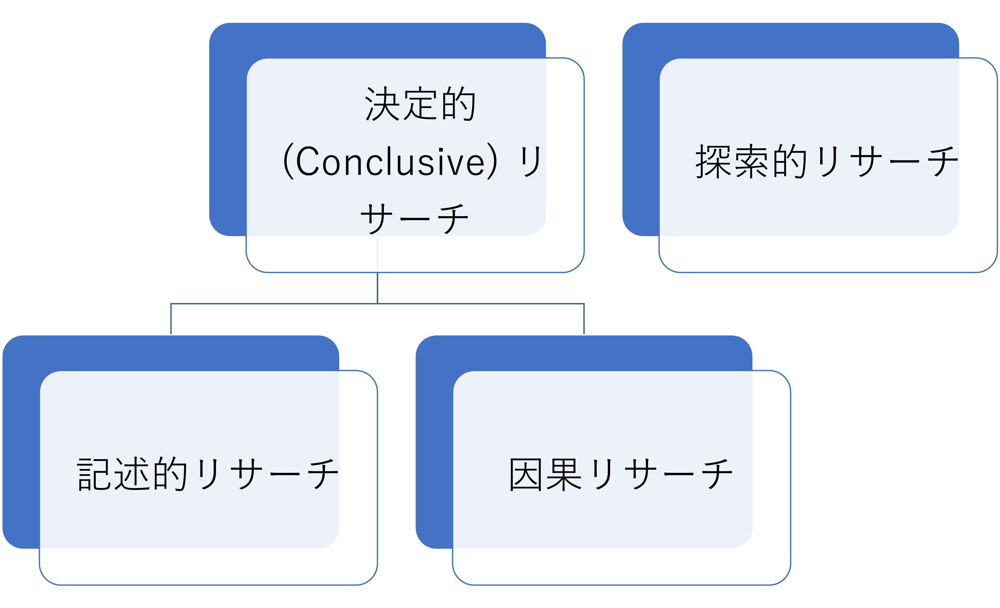
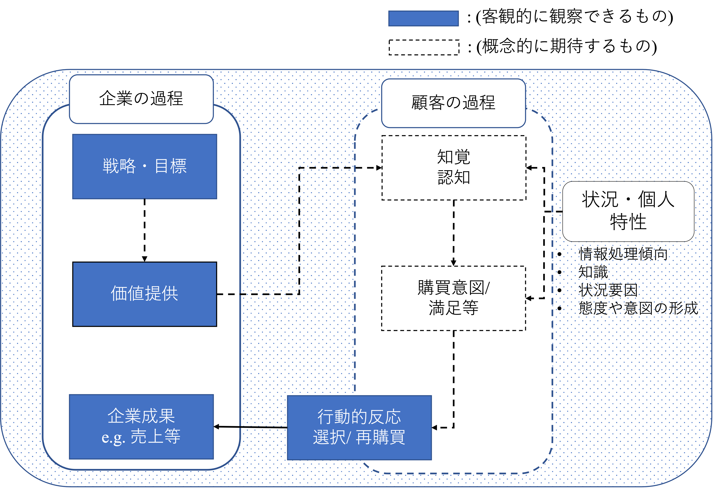
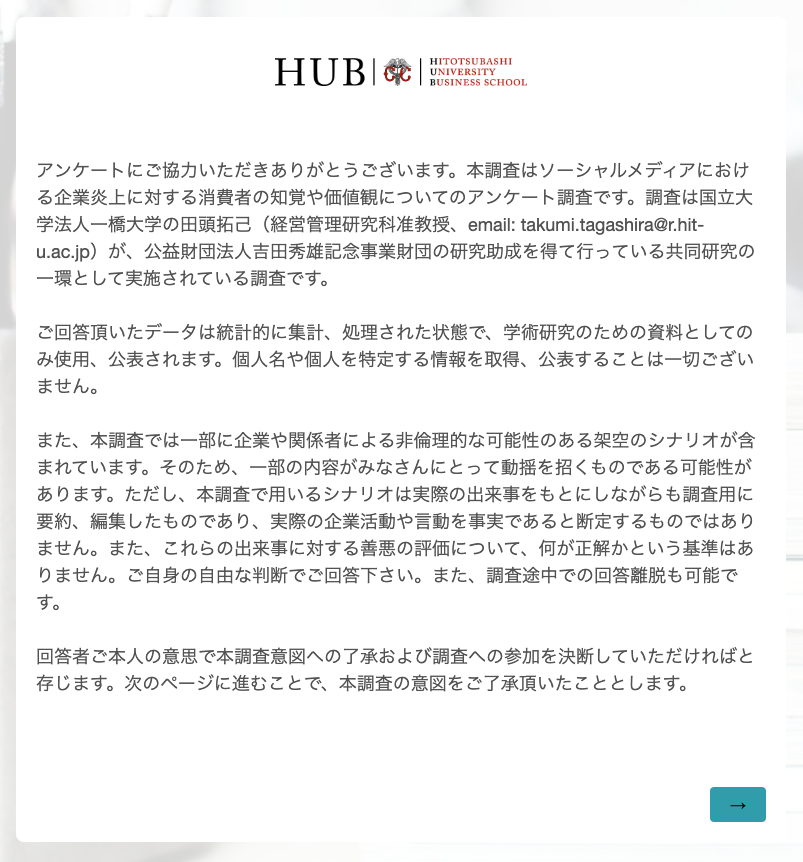
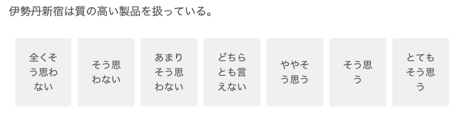

# データの種類とアンケートデザイン{#survey}

研究においては、変数間の関係について分析、記述することが多い。仮説を提示する際の注意点においても、分析に用いる変数と整合的であることが重要であると述べた。そこで重要なのは、自身が用いる変数がどのような特徴を持つ尺度であり、どのように事象を測定しているかを理解することである。以下の表は、主な尺度のタイプとその特徴をまとめたものである。

```{r datatype, echo=FALSE, message=FALSE}
x1 <- c("名義", "順序", "間隔", "比率")
x2 <- c("対象の識別と分類", "対象の相対的ポジション", "対象間の大小関係比較（原点は定まっていない）", "連続的関係（原点が定まっており、比率計算も可能）")
x3 <- c("性別・職種", "好み順位・ランキング", "態度・指数・気温", "所得・売上")
tab_data <- cbind(x1,x2,x3)
colnames(tab_data) <- c("尺度", "特徴", "例")
knitr::kable(tab_data, caption = "尺度表", align = "lcc")

```

上表における間隔尺度や比率尺度は一般的に量的尺度と分類される。売上高はマーケティング研究における最も典型的な「比率尺度」の例である。この尺度は大小にも間隔にも意味があり、かつ比率にも意味があるため、四則演算に対応する尺度である。一方で「間隔尺度」は正の整数で表される尺度であり、その値の大小関係と間隔にも意味があるものの、原点が定まっておらず、比率計算に耐えない尺度である。マーケティング研究においては、アンケート調査における質問項目や、質問項目の合計値（およびそれを項目数で割ったもの）である合成変数が間隔尺度の典型的な例である。

一方でマーケティング研究においては、必ずしも量的ではない情報に着目して分析を行うことも多い。そのような場合には、質的尺度を用いて観察対象のカテゴリを分類することで分析可能にする。例えば、消費者の購買行動に関する東京、大阪、北海道という地域（都道府）間の差を分析する場合を考える。このとき、「地域の違い」に数量的な違いは存在しないものの、地域の違いを表すために東京 = 1, 大阪 = 2, 北海道 = 3 のような地域コードを用いる事が多い。しかしながら、この変数がとる数値そのものに本来的な意味はなく、東京が大阪と北海道よりも低い値を取っているという解釈は適切でない。この変数はあくまで異なる地域に分類されることを示しているのみである。このような属性の分類や有無を表すための尺度を「名義尺度」と呼ぶ。また、観測対象が特定の属性に対応する場合（例、男性）には 1 を、そうでない場合には 0 を取るような、1 と 0 で分類された名義尺度のことを特に「ダミー変数」と呼ぶ。ダミー変数は分析結果の解釈が容易になる利点もあるが、詳しくは後述する。質的尺度のもうひとつの例が「順序尺度」である。順序尺度は、観察対象の序列や大小関係を表す尺度であるが、その数値の間隔に意味はない。例えば 1  が最低であり、4 が最高となるような金融商品の等級において、商品 A は　ランク 4、商品 B はランク 1 だとする。このとき、 B は A よりも高い評価を受けているということは言えるが、A は B の 4倍優れているという議論は不適切である。このように、各対象間の推移性を表現するときに用いるのが、順序尺度である。

次に、データの収集や取得という観点に基づくデータ分類基準を提示する。研究の遂行においては、研究者の関心や研究課題のために収集されたデータを用いることもあれば、別の目的で収集されたデータを用いることもある。前者のようなデータを「一次データ」、後者を「二次データ」と呼ぶ。一次データは研究上の問いに回答するために実施された調査、実験や観察に基づき収集形成されたデータある。一方で二次データは、業務上蓄積されたデータ、民間リサーチ会社の統計データや、政府統計などに代表される他の目的で収集された、ないし継続して収集されているデータを指す。現在は、様々な二次データがアクセス可能であり、二次データを利用することで研究上の問いに回答できる可能性も十分にある。例えば、企業の視点にたてば、組織内部の二次データ（業務活動で得たデータ: Point of sales (POS) データ、webサイトへのアクセス記録など）と外部の二次データ（民間リサーチ会社の統計データや政府統計など）が存在する。その他にも、オープンソース化されているデータも様々存在する。そのため、本書では一時データを収集する前に、関連する二次データとしてどのようなものが存在しアクセス可能なのか検討することを勧める。しかしながら、二次データではすでに集計や加工をされたデータしか入手できず、raw データ（収集されたまま加工されていないデータ）にアクセスできない場合もある。そのため、入手可能な二次データが本当に自身の研究課題や仮説で議論されている内容および集計レベルと整合的なのか、という点については慎重に検討する必要がある。

データのタイプは、集計レベル（分析単位）に基づいて分類することもできる。この分類では、個人の行動や回答を捉えた「非集計データ」と、非集計データをある単位でまとめ、計算や整理を施した「集計データ」とを捉えることができる。非集計データの例としては、ID-POSデータ（ロイヤルティカード（アプリ）などによる顧客の個人IDと、購買製品、価格、数量などの情報が含まれたPOSデータを結合したもの）や、消費者個人を対象としたアンケートデータなどが挙げられる。一方で企業成果・業績などの財務データは、企業レベルで集計されたデータだと言える。自身の研究課題や仮説がどのような集計レベルのデータに対応するものなのかを考え、研究内容と一貫したデータを用いることが必要になる。

## 記述的リサーチデザイン

コンピュータやソフトウェアが発展した現代においては、データを収集し、ある変数についての情報を要約、分析すること自体はさほど難しいことではない。しかしながら、実務的ないし学術的に意義のある研究を行うのは容易ではない。そのためには、研究課題について慎重に吟味しつつ、適切なリサーチデザインを決定する必要がある。リサーチデザインとは、研究プロジェクトを実行するための枠組みや計画案のことである（Malhotra, 2019）。経営学分野におけるリサーチデザインは、田村(2006) にて検討されている。ここでは、Malhotra (2019) を参照に記述的リサーチデザインを中心に説明する。

Malhotra (2019)　は、マーケティング・リサーチのタイプとして、大きく分けて　(1) 探索的リサーチ、(2) 決定的 (conclusive) リサーチがあるとし、決定的リサーチの中にさらに (3) 記述的リサーチと (4) 因果リサーチがあるとした。探索的リサーチでは、その研究プロセスが非構造（または半構造）的かつ柔軟であり、一般的に定性的方法が用いられることが多い。研究者は、研究や実務に関するアイディアやインサイトの発見、仮説の構築、未開拓領域における研究課題の定義、等を目的にこのタイプの研究を採用することが多い。一方で決定的リサーチを採用する研究者は、特定の仮説を検証したり、変数同士の関係についての分析を目的とすることが多い。このアプローチでは、リサーチプロセスはより構造化され、定量的な分析手法が用いられることが多い。

{width=70%}

決定的リサーチの中でも、記述的リサーチは、特定の変数や複数の変数間の関係を明らかにすることで、実証的な問いに回答しようと試みる。記述的リサーチを用いた研究目的の例としては、(1) 関連するグループ（顧客や商圏）の特徴を説明する、 (2) 顧客全体のうち特定の行動を取る顧客の比率はどの程度なのか明らかにする (e.g. ヘビーユーザーの比率)、(3) 企業の操作するマーケティング変数と顧客の購買意図との関係を明らかにする、などが挙げられる。これらはあくまで例であるため、あえて抽象的な表現を用いているが、実際に記述的リサーチ課題を提示する際には、検証可能なレベルにまで焦点を絞ることが必要になる。そして、本書ではおもにこの記述的リサーチに焦点を合わせて、手法を紹介する。

一方で因果リサーチでは、相関関係と因果関係を区別し、先行要因が結果変数へ与える効果について因果関係を想定した形で分析することを指す。相関関係とは、2つの変数XとYの間に、比例や反比例といった共変関係があることを指す。一方で、要因Xを変化させることで要因Yが変化する時、Xを原因でYを結果とする因果関係がある（X$\rightarrow$Yと示す）という。つまり相関関係とは異なり、因果関係ではどちらが先行要因であるかという前後関係がはっきりしている。このような因果関係を明らかにする分析手法は一般的に因果推論と言われ、記述的リサーチよりも高度な調査設計・統計的手法が必要となる。本講義は、マーケティングにおける因果推論の応用は扱わないため、別資料を参照してほしい。

リサーチデザインは、研究上の問いと整合的である必要がある。言い換えると、記述的リサーチにより自身の立てた問いにきちんと答えるためには、記述的リサーチで回答可能な問いを考えなければならない。例えば、「Eコマースにおける製品品質補償の提示は新規顧客の獲得につながるのか？」という問いは補償サービスと新規顧客によるEコマースサイトの選択率という2つの変数間の関係にまで論点を落とし込んだ問いとなっており調査・分析が可能である。しかしながら、学生のレポートでは、「Eコマースにおいて顧客獲得に重要な要素はなにか？」のような問いが散見される。このような（何か、なぜか、どのような等）広範な視座を持つ問いは探索的に検討すべきものであり、記述的リサーチによって検証可能な形に具体化がされていない。そのため、このような問いに整合的な回答を提示するためには、探索的リサーチデザインが必要になる。高度な研究では、混合メソッド（Mixed method）アプローチとして、探索的リサーチ（例、インタビューや理論的整理）を行ったあとに記述的リサーチ（例、質問紙調査）を実施するような方法も存在する。しかしながら、本書では単一のリサーチメソッドの採用に焦点を合わせ、記述的リサーチと整合的な問いを立てることを推奨する。

「何か、なぜか、どのような」を捉えた問いは研究者の素朴な疑問が表出しており、研究者の現実的・理論的情報のインプットが不足していることにより提示されることが多い。そのため、先行研究や実務的情報をインプットしたあとに、より具体的で重要性の高い問題を捉えることが、より意義のある検証可能な研究課題につながる。優れたリサーチデザインは、自身の立てた問いに対してどのように調査・分析を行えば整合的な回答を提示できるかを具体化したものであり、研究全体の以下の要素間の一貫性や整合性を保つことができる。

- 着目する事象（実務的課題）
- 研究課題
-  （理論と）仮説
- 採用する具体的な変数
- 調査・分析手法

基本的には、リサーチデザインそのものに優劣はなく、「ある方法を採用しているから別の方法よりも優れている」ということはない。ただし、方法そのものがアップデートされたり、ある手法が誤っていると研究によって明らかになることがある。そのような場合を除きどのようなリサーチデザインを採用しているから優れているないし劣っている研究であるということは言えない。そのため、リサーチデザインの決定においては、「自身の立てた問いにきちんと回答できるか」という問いとの整合性が重要になる。この点に注意をして研究課題とリサーチデザインの設計をセットで考えるようにクセづけてほしい。


## アンケート設計

マーケティングにおける記述的リサーチアプローチとして広く用いられれているのが、質問紙（アンケート）調査である。マーケティングにおける調査や研究では行動データ等では捉えきれない消費者の態度や知覚について知ることを目的とする場合も多い。このような目的を達成するため、これまでの研究では伝統的に質問紙調査によって情報を得てきた。質問紙調査とは、データ収集のための構造化された手法で、回答者が回答する一連の質問（書面または口頭）から構成される。質問紙調査は、研究者と回答者との間のコミュニケーションとして捉えられる。

オンラインでの通販サイト（例、Amazon）やプラットフォームサービス（例、Google）が大規模化しデータ収集・分析能力が向上したことによって、現代のマーケティングでは（購買、クリック、検索などの）行動を捉えたビッグデータ分析が盛んになっている。一方でGoogle社が運営するYoutubeでの動画視聴中にアンケートの回答を求められた経験のある方も多いのではないだろうか。データ収集・分析能力に長けるGoogleがなぜわざわざアンケートという古典的な方法を用いるのだろうか。この点について本資料では、アンケート調査には得意な領域があるのだろうと考える。企業のマーケティング施策とその成果のプロセスについて、以下の図のように簡易的に示す。

{width=70%}

企業は自社の戦略・目標に基づいて具体的なマーケティング・ミックスを策定し顧客へ価値を提供する。客観的データとしてはその提供物（品質・価格、広告など）に対する反応（購買、買い物かごへの選択など）として観察できる。しかしながら、どのように/なぜその行動に至ったのかという消費者の内的な心理的プロセスについては観察できない。たとえばYoutubeにおいて提示される広告動画をどのアカウントが何秒視聴し、その後リンクをクリックしたか否かは行動として確認できる。しかし、その広告によってどの程度の視聴者がその企業を認知または記憶したのか、もしくは好意的な態度を形成したのかという心理的過程における行動への先行要因については観察できない。そのため、Youtube内において、「以下のリストのうち知っている企業は...」というようなアンケートが行われるのだと考えられる。言い換えるとアンケート調査は上図内顧客の過程における点線部分に関する調査を得意とするのだと考えられる。一方で、「企業による施策が消費者の行動的反応や企業成果へ与える直接的な効果を判別したい」というような目的の研究では、アンケート調査は適切ではないと考えられる。自身の着目する研究課題に適したリサーチ方法を採用する必要がある。

なお、観察可能な行動に基づく調査・分析方法も点線で示されているプロセスを無視しているわけではない。経済学的なアプローチでは、個人の意思決定に関する首尾一貫性についての仮定を満たすことで個人の選択行動が自身の効用を最大化するような合理的な意思決定として分析・再現・予測できるという理論を用いる。つまり、観察できない人間の内的プロセスにおいては理論的なモデル化を行うことで対応し、観察可能な刺激（提供物の属性など）と選択行動との関係についての分析を分析を行う。このようなアプローチにより消費者の効用関数や市場の需要関数を推定し、「仮に価格がxx円からyy円に変化したら個人の選択確率や市場での需要量はどのように変化するか」を予測できることも可能になる。このことからも、アンケートが一方的に優れているもしくは劣っているということではなく、研究者自身が持つ理論的な視点や研究課題に応じて適切な調査・分析アプローチを採用することが求められる。

質問紙調査では、調査者が求める情報を、回答者が回答できる一連の具体的な質問に変換することを目的とする。調査の実施において研究者は、回答者が相互コミュニケーションに参加し、協力し、面接を完了するように意欲を高め、動機を与え、奨励すると同時に、回答誤差を最小化する必要がある。研究者はこの双方向的なコミュニケーションにおいて、下の図のようなノイズが生じることを理解し、それを削減する努力を講じることが求められる。

{width=70%}

アンケートによるデータ収集は、社会科学における「人を対象にした研究」に該当するため、人を対象にした研究としての研究倫理規則を守る必要がある。例えば、一橋大学における研究倫理規則は以下のリンクから確認できる（<https://www.hit-u.ac.jp/academic/research_ethics/index.html>）。ここでは、主に調査協力者の身体的・精神的負担を最小化し、彼らに不利益が生じないよう留意する必要がある。また、データを収集する際には、研究対象者から同意（インフォームド・コンセント）を得る必要がある。インフォームド・コンセントにおいては、、調査を行う主体、目的、調査により得た情報の管理方法、公開有無や方法について明示し、この条件について回答者から許諾を得る必要がある。ただし、大規模な無記名アンケート調査など、研究者が、回答者から個人名を記載した形の同意書を得ることが困難な場合がある。その場合は慣習として、調査開始前に上記の点について説明し、調査回答へ進むことで同意を得たことと代替する事が多い。ただし、このような対応方法に関する適切性の議論も、時代の経過とともに変化することが考えられるため、研究倫理については研究者自身が継続的に学習し、適切な手法を採用していくことが求められる。以下は、実際に田頭が使用したアンケートにおけるカバーレターであり、インフォームド・コンセント文の例である。

{width=70%}

アンケートのデザインは主に以下のプロセスを経る。

1. 質問トピックを決める
2. 質問と回答方式を決める
3. ワーディングを決める
4. 質問の順番を決める
5. アンケートのレイアウトや装丁を決める
6. プレ調査の実施
7. アンケート（本調査）の実施

上記のステップに対し、ここではまず質問と回答方式について説明する。なお質問トピックは、研究課題に深く関わるため、本資料にてすでに議論されている内容を参照してほしい。アンケートでは、主に自由回答式質問、選択肢型質問、尺度型質問、といった方式の質問が用いられる。自由回答式質問は、回答者が自身の言葉で自由に回答できる質問であり、回答に関する事前の選択肢は設定されていないタイプの質問である。回答者は、このような質問に対して一言で簡潔に回答するか、詳細に長く回答するかなど、回答方法に裁量を持つことになる。例えば、「出身はどちらですか？」という問いに対して回答者は、「東京都」と都道府県レベルで答えることも、「東京都町田市」と市区町村レベルで答えることも可能である。また、典型的な自由回答式質問の例として、理由や動機を問う設問がある。例えば「なぜ、この航空会社を選びましたか？」といった質問に対して回答者は「機内食」のように一言で回答することも、長い文章を用いて回答することも可能である。選択肢型質問は、回答者に質問に対する回答のための2つ以上の選択肢を与え、その選択肢から択一させるものである。例えば、回答者の特定のサービスの利用経験について「1. はい、2. いいえ」からいずれかを選ばせたり、学歴について複数の選択肢から一つを選ばせるというものがこのタイプの質問に該当する。

一方で尺度型質問は、消費者による企業への態度や満足などを捉えるためにマーケティング分野で広く用いられている質問方式である。ここでは、ある質問に対する点数を回答者に選ばせることで、その質問で捉えようとしている性向の程度を測るものである。尺度の形成方法としては、グラフィックを用いるもの、項目別に評価するものなどが存在するがここでは、マーケティング領域で広く用いられている項目別評価尺度について説明する。項目別評価尺度においてよく用いられる尺度はリッカート尺度とSemantic differential (SD) 法と呼ばれる尺度である。リッカート尺度では、調査者は回答者に文章を提示し、回答者がその文章の内容にどの程度同意するかについて情報を得る。設問では、「全くそう思わない,...,とてもそう思う」や「全くあてはまらない,...,とても良くあてはまる」という選択肢について5点尺度や7点尺度で回答させることが多い。以下は、7点のリッカート尺度による質問の例である。

{width=70%}

一方でSD法は、両極の意味を持つ一連の尺度を用いて、回答者の評価を得る方法である。例えば、「冷たい-温かい」や、「弱い-強い」というような対極にある言葉を両極に設定して、5点や7点尺度によって回答を得る方法が一般的である。以下は、7点のSD法による質問の例である。

{width=70%}


マーケティングにおける研究では、アンケートを通じて、顧客満足や企業態度などの抽象度の高い構成概念を捉えようと試みることも多い（南・小野, 2010）。その場合、研究者は複数の質問項目を用いてひとつの概念を捉えるが、このような項目の扱いには、専門的な知識や先行研究による知見が必要になる。例えば、2010年代以降よく用いられる概念に、消費者によるブランドエンゲージメントがある。ブランドエンゲージメントは「消費者が特定のブランドをどの程度自分自身の一部のように大事に捉えているか」を表す概念である (Sprott et al., 2009, p. 92)。このような抽象的な概念は多面的な視点から包括的に捉えるが多く、例えば Sprott et al. (2009) では、以下の8つの質問項目を用いて、ブランドエンゲージメントを捉えていた。

- I have a special bond with this brand.
  - 私はこのブランドと特別なつながりを持っている。
- I consider this brand to be a part of myself.
  - 私はこのブランドを自分の一部として考える。
- I often feel a personal connection between this brand and myself.
  - 私はこのブランドと自分自身の間に個人的な関係を感じる。
- Part of me is defined by this brand in my life.
  - 私の人生の一部はこのブランドによって規定されている。
- I feel as if I have a close personal connection with this brand I most prefer.
  - 私が最も好きなこのブランドとは、まるで個人的な関係を持っているかのように感じる。
- I can identify with this brand in my life.
  - 私の人生において、このブランドに共感できる。
- There are links between this brand and how I view myself.
  - このブランドと私自身との間には繋がりがある。
- This brand is an important indication of who I am.
  - このブランドは、私がどういう人間かを示す重要なものである。

このことから、研究者は、包括的かつ多面的な概念を、より具体的な複数の質問を使って様々な側面から捉えようとしていることが伺える。このような構成概念を用いた分析では、概念を構成する項目の合計値や算術平均を用いて、ひとつ合成変数を作成することでその後の分析に用いる場合や、共分散構造分析（Covariance-based Structural Equation Modeling: CB-SEM）という高度な手法を用いることがある。しかし、本書では共分散構造分析は扱わないため、別のテキスト等を参照してほしい。また、複数項目によって構成概念を捉える場合、それらの項目が十分に似ているか（共通の概念に寄与しているか）をチェックする必要がある。そのようなチェックにおいては、探索的因子分析や確認的因子分析が用いられる。探索的因子分析については、本書の後半で扱う。一方で、確認的因子分析は、通常共分散構造分析の一種として扱われることが多い手法なので本書では扱わない。

## 質問におけるワーディング

本節では、アンケート作成におけるより実務的な注意点を説明する。具体的には、ここではアンケート内で使用する言葉やフレーズについての注意点を説明する。これは、データ収集前に吟味し、修正する必要がある。研究者がアンケート内で用いる言葉や表現の複雑さは、調査のトピックや対象となる回答者特性に合わせて調整すべきである。研究者はよく犯すアンケートにおける言い回し（ワーディング）誤りとして、以下のものが挙げられる。

- 曖昧な質問
- ダブルバレル質問
- 誘導的な表現

曖昧な質問は、質問文の解釈が一意に定まらないような文章による質問を指す。このような曖昧かつ多義的な質問をしてしまうと、回答者と調査者が質問に対して異なる意味を見出してしまうことで、不適切かつ予想外の回答を得る可能性が高まる。例えば、「あなたはいつケーキを買いますか？」という質問を考える。この質問で問われている「いつ」が曖昧であるといえる。回答者はこの質問に対して、一年間のうち特定の月やタイミングを答えるべきなのか、次にいつ（例えば、2週間後等）ケーキを買うと答えるべきなのかが曖昧である。この場合、仮に研究者の意図が後者であったとしても、適切な回答を得ることができないかもしれない。

ダブルバレル質問は一つの質問の中に2つの論点が含まれているような質問を指す。このような質問の場合、回答の含意が一意に定まらず、回答に対する適切な解釈が提示できない。例えば、ホテルにおいてリピート客に対してサービスを評価してもらうようなアンケートを考える。そこで、ホテルの調査担当者以下のような質問と回答選択肢を

- 「当ホテルの食事や接客サービスにおいて、以前利用した際と比べて何か改善は見られましたか？」
-  「(1) はい (2) いいえ (3) わからない」

この質問の問題点を明確にするために、ある回答者が「 (2) いいえ」と回答した場合を考える。この回答の含意には、以下の3つの可能性を見出すことができる。

1. 食事とサービスどちらにも改善がない。
2. 食事に改善があってもサービスにはない。
3. サービスに改善があっても食事にはない。

しかしながら、(2) いいえ、という回答が上記のどの理由によって提示されたのかは識別できない。また、このような質問は、回答者を混乱されることにもつながるため、回答にかかる精神的労力を高めるという点からも好ましくない。この場合、「食事に関する改善」と「接客サービスに関する改善」とを別々の質問として問うことが好ましい。

誘導的な質問は、回答者を特定の答えに誘導する傾向のある質問を指す。例えば、以下のような消費者による小売業態への評価や利用に関するアンケートを実施することを考える。

- 「ドン・キホーテのような安価なディスカウントストアをどの程度利用しますか？」

上記の質問は、質問文による誘導のリスクを含む。「安価」や「ディスカウント」という言葉を強調しており、回答者が頻繁に行くと答えにくいと感じてしまう可能性がある。また、特定の企業を想起させることで、特定の企業に対する評価を誘導してしまう可能性がある点にも注意が必要である。

誘導的な質問は質問文と回答選択肢の組み合わせによっても生じる可能性があるため注意が必要である。例えば、ある政策に対する評価を確認するため、以下のような質問と回答選択肢を考える。

- あなたの〇〇政策を支持していますか？
- 「(1) はい (2) いいえ (3) わからない」

この質問は、選択肢による誘導のリスクを含む。その問題点を理解するために、まず「(2) いいえ」という回答を得た場合を考える。「いいえ」という回答では、その回答者がこの政策に対して積極的に不支持なのか、それとも積極的に支持しているわけではないのかがわからない。つまり、「(1) はい」には、積極している支持している層しか観察されず、いいえに回答が集まりやすい設計になっていることがうかがえる。このような場合、例えば「賛成-反対」を両極とするSD法によって回答を得ることで、回答者が当該政策に対してどのような立場に立っているのかがわかりやすくなる。

暗黙の前提を含む質問は、研究者と回答者とで異なることを想定し、適切な回答を得ることができない可能性を高める。例えば、研究者が一般消費者の固定電話の利用頻度を知りたいと考えている状況を仮定し、そのために「あなたの電話の利用頻度について教えてください」と質問したとする。この質問における「電話」とは何を想定しているのだろうか。質問において聞かれているのは自宅等に置かれている固定電話、もしくは携帯電話の利用頻度なのかが不明確である。これは、「曖昧な質問」にも通じる問題も含まれるが、研究者が電話という言葉に対して暗黙的に固定電話を仮定していることが原因で生じた問題だと理解できる。このような問題を避けるために、例えば質問の前に固定電話についての説明やフィルター質問（事前質問）を提示することで、回答者が同じ対象（固定電話）を想定できるように調査プロセスを設計することも有効である。

本書は、実際にアンケートを実施する際にはまず先行研究を調べ参照することを強く勧める。マーケティングに関する多くの尺度はすでに対応する質問文が開発されている。それらのほとんどは信頼性や妥当性の分析をクリアした質問内容なので、それらを引用するのが一番確実である。平たく言えば、とにかくまずは先行研究を探すべきだと言える。先行研究については主に、国際的な査読誌（海外ジャーナル）と、国内の文献とに分けることができる。海外ジャーナルに掲載された論文は、Google scholarや図書館システムから検索しアクセスすることが可能である。こちらの方がそもそもの論文量も多く、また、競争率および査読の水準の高いジャーナルの審査を乗り越えたという点から質の高い論文も多い。ただし、これらで参照できる論文及び尺度は英語で書かれているため、日本語で尺度を引用する場合には、日本語への翻訳と、バックトランスレーションによる日本語訳の適切性チェックが必要になる。一方で国内文献はCiniiや図書館システムから検索及びアクセスすることが可能である。こちらの方が相対的に量は少ないが、すでに適切な翻訳プロセスや、信頼性・妥当性チェックを経た尺度を提示しているものもあり、そのような尺度の場合、追加的努力を節約する形で既存の尺度を引用できる。

## アンケートデザイン

前節では個別の質問項目設計に関する注意点を紹介したが、ここでは複数の質問やアンケート全体の構成についての説明を行う。アンケートで用いる各質問項目を確定したら、それをどのような順番で構成するのかについて考えることが必要になる。質問の掲載順においては、できるだけ回答者の回答への心理的負担を下げるような工夫を考慮する必要がある。そのため、基本的には答えやすく単純かつ興味を引く質問を最初に尋ね、広範な質問から特定的な質問へ移行し、難しい質問やセンシティブないしプライベートな情報を問う質問は最後に聞く、というような工夫が求められる。特に、アンケートの最初の質問には興味深く簡潔で威圧的でないものを選ぶと良い。例えば、回答者の素朴な意見や感想を聞く質問が有効であり、仮に調査には不必要であってもこの手の質問を最初に聞くことが有効になる場合もある。また、特定のトピックや製品・ブランドに関する項目はまとめて質問したり、時系列に関する質問は時系列順に問うなどの論理的な順番を守る構成も回答者の認知・心理的負担を減らすことに貢献すると考えられる。

アンケートの構成の他にも、レイアウトや回答の回収方法についても決定する必要がある。アンケート全体のフォーマット、文字スペースや質問文の配置などの装丁は、回答者にとっての可読性および回答率に影響を与えると考えられる。基本的にはシンプルかつ読みやすいレイアウトを心がけてデザインすることが必要になる。また、アンケート自体をいくつかのパートに分けつつ、各質問に番号を割り振るなどの工夫をすることで、回答者がアンケート回答の進捗を把握でき、途中離脱を防ぐことができるかもしれない。

次に回収方法は、大きく分けてオフラインとオンラインによる回収に区別することができる。オフラインでの回答回収には、対面質問（家庭訪問や商業施設での接触設問）、電話、郵送といった方法が存在する。対面法では、回答者と調査員とのやり取りが可能になるため、回答回収率が高かったり、質問に関する理解を促すような即時的なコミュニケーションが可能になるという利点もあるが、一回答あたりの費用が高いことや調査員の介在によるバイアスといった欠点もある。電話による調査は広範囲への調査と比較的高い回収率につながる方法として利用されたが、近年では用いられなくなっている。郵送法は、回答者に印刷された質問票と返信用封筒（切手添付または料金受取人払手続き済み）を送付し、回答後に調査者の住所に回答結果を返送してもらうという方法である。この方法であれば、回答者が好きなタイミングで回答でき、かつ広範囲への調査が可能になる。しかしこの方法には、回答状況を統制できない、回収率が相対的に低いといった欠点も存在する。

一方でオンラインでの回答回収は、eメールによってアンケートを送付する方法と、回答者にアンケートサイトにアクセスしてもらい、回答させる方法とに大別できるが、近年ではアンケートサイトにアクセスを促し回答を回収する方法が主流である。オンラインでの調査の場合、回答者はインターネット環境が整っていれば、いつでもどこでも回答することができる。また、調査者はページの見出し、セクション紹介と進捗バーを組み合わせることで回答者が回答をやめないように工夫する事ができる。加えて、調査者はオンラインであれば、画像、音声、映像やアニメーションなどの要素を含めることが可能である。一方で、調査者はアンケートに関わるプライバシーポリシーについて回答者に説明することが必要になる。ただし、オンラインでのアンケートでは、オンライン調査に参加するようなタイプの回答者からの回答しか収集できないという、回答者の傾向についてのバイアスについても理解する必要がある。

以上のような点に気をつけつつ、実際の調査項目やデザインを決定するのだが、アンケートを通じたデータ収集とそれを用いた分析においてよく観察される失敗とその対策について説明する。ここでは、研究者がアンケートにより得た情報に基づき、
ある二つの変数間の関係を捉える場合を考える。例えば、あなたが「顧客の知覚サービス品質と満足度との間には正の関係ある。」という理論に関心があったとする。ここで着目されている変数（概念）はサービス品質と満足度であり、財務データでは観察不可であるため、一般的に研究者はアンケートを通じた調査が用いることで情報を得る。この2変数間の関係を捉えるために研究者はアンケートをデザインする必要があるのだが、「一つの質問でまとめてこの関係を捉えようとする」、という誤ったアプローチを採用することがよく観察される。例えば、初めてアンケートを実施する学生は「あなたは、品質が高いサービスを経験すると満足しますか？」のような質問項目を設定しがちである^[テキストにこのように書かれていると、「自分はこんなことをしない」と思うだろうが、実際にアンケート設計をさせるとこのような誤りを犯す学生は存外多いので注意されたい]。

このような質問項目は、この項目に対する回答を基にどのように二変数間の関係を検証するのかが明確ではない（検証できない）という点で問題がある。複数の変数間の関係を捉えたい場合、各変数ごとの質問を別々に作成し、それぞれの質問への回答データを用いて二変数間の関係を統計的に分析するというプロセスを経る。この点については、財務データに基づく二変数間関係の分析と対比させるとわかりやすい。例えば、研究者が小売企業の店舗数と売上高の関係に関心があるとする。このとき研究者は企業レベルの店舗数と売上高についてそれぞれ別の変数として情報を集め、これらの変数間の関係を回帰分析などの手法で分析しようと試みるだろう。おそらく、多くの人が、店舗数と売上高の関係を分析するために、これら両方の情報を内包した一つの変数に関する情報を収集しようとは考えないはずである。アンケートによる調査・分析においても原則としては同様であり、特定の変数を排他的に捉えるような質問項目を作成し、それらに対して得た回答を基に、分析を行っていく必要がある。

変数間の関係を捉えるための調査設計について、もう少し具体的な説明を例とともに提示する。ここではあなたが「具体的な小売店舗の属性（価格）とその店舗へのロイヤルティとの関係」に関心があると仮定する。このとき、先述の悪い質問に該当する質問例は「あなたは、価格の低いお店を利用しますか？」や「あなたは、価格の低いお店をどの程度利用しますか？」である。これらの質問は、価格とロイヤルティの関係を検証できるデザインになっていない。では、具体的な店舗の特徴とその店舗への評価や利用状況をアンケートによって捉えるためにはどのようなデザインが考えられるのだろうか。本書では、以下の2つの対応例を紹介する。

1. 回答者が利用している店舗を特定し、その店舗について回答してもらう。
2. 研究者が準備したシナリオや実験刺激としての店舗情報などを提示して、その店舗について回答してもらう。

1の方法の場合、アンケートにおいて回答者が想定する企業は回答者ごとに異質である。この方法では、回答者が頻繁に利用する店舗について特定化するような質問をしたあとに、その店舗についての評価や利用状況を尋ねるという階層的な質問構造を形成する。例えば、以下のような質問を構成することが考えられる。

- 「Q1 あなたは過去3か月間に次のどのスーパーの店舗に、最も良く食料品を買いに行きましたか。（回答は1つ）食料品を買うスーパーについて伺います。:リストを提示」
- 「Q2 あなたが食料品を買う際に最もよく利用する店舗【Q1スーパー名引用】でのお買い物の状況について、お答えください。週間の間にあなたがその店舗で食料品の買い物をする頻度をお答えください：1. １回未満, 2. 1回, 3. 2回,…」
- 「Q3 最もよく利用する店舗【Q1スーパー名引用】での食料品購入額が、ご家庭の食料品購入額全体の何％を占めているか、それぞれお答えください。: 選択肢を提示」
- 「Q4 最もよく利用する【Q1スーパー名引用】の店舗は従業員のサービスが手厚い：1. 全く当てはまらない,…, 7. とてもよくあてはまる」
- 「Q5 最もよく利用する【Q1スーパー名引用】は取扱製品の品質が高い：1. 全く当てはまらない,…, 7. とてもよくあてはまる」

一方で、2. のシナリオを提示する方法は、シナリオ実験アプローチと言われ、基本的な調査の構造は投薬の実験などと同様であり、ある刺激を受ける群と受けない群とでその後の結果に差があるかを捉える。このアプローチの場合、回答者が想定する店舗やその他の状況は特定化され、コントロールされている。この方法では、とある購買状況を想定してもらうための、全ての回答者に共通したシナリオを想定しつつ、検証したい施策のみ変化させた（施策あり vs. 施策なし）２種類のシナリオを準備する。そして研究者は、回答者を検証したい施策ありのシナリオを読むグループ（トリートメント群）と施策なしのシナリオを読むグループ（コントロール群）とにランダムでわけ、それぞれのグループ間で、回答者が異なる情報に直面するように調査を設計する。回答者はシナリオ読了後、成果変数に相当する質問に回答する。そして、成果変数に関するトリートメント群とコントロール群間での差を統計的に分析する、というアプローチを取る。ここでは、例として企業の活動に関するシナリオを読ませるという方法を紹介したが、この方法はシナリオに限らず、何かを実際に体験させたり、回答者にタスクを課すなど、様々な調査設計に応用する事が可能になる。

具体的なアンケートデザインが固まると、研究者は次に実際にデータを収集する段階に移る。ここでは第1に母集団を定め、次に、サンプルについて決定する必要がある。母集団は、研究者が求める情報を持つ要素や物の集合体と考えられ、研究課題に応じて研究者によって決定される。ここでは、研究者が求める情報を有しているのはどのような人たちかという母集団の要素（日本の一般消費者か、東京都内の国立大学の学部生か、等）や、適切な母集団の単位（個人、家計など）はなにかについて定義する必要がある。

母集団という集合体全体を捉えることは通常困難であるため、研究者は母集団に対応するアクセス可能な標本（サンプル）の情報を得る。サンプルに対するデータ収集プロセスでは、サンプリングフレーム、サンプリングテクニック、サンプルサイズを決定する必要がある。サンプリングフレームとは、対象となる母集団の要素を表現したものであり、対象となる母集団を特定するためのリストによって構成される。例えば、電話帳や調査会社から購入した個人や組織のリストがサンプリングフレームの例である。次に、サンプリングテクニックは、サンプルフレームから特定のサンプルをピックアップする方法である。サンプリングテクニックは非確率的サンプリングと確率的サンプリングに大別できる。比較率的サンプリングは、サンプルをランダムな選択により抽出しない方法であり、コンビニエンスサンプリングとスノーボールサンプリングがその典型例である。コンビニエンスサンプリングは、研究者にとって便利な要素のサンプルを集める方法であり、適切なタイミングで適切な場所にいたという理由で回答者が選ばれる。たとえば、学生やある組織の構成員を使った調査や、ショッピングモールでのインターセプトインタビューはその典型的な例である。次に、スノーボールサンプリングは、最初の回答者をランダムで選んだ後、その後の回答者は、最初に選ばれた人による紹介や情報提供によって選ぶ方法である。これらの方法は最もお金も時間もかからないという利点を持つが、サンプルセレクションバイアスに注意することが必要である。一方で確率的サンプリングは研究者による恣意性を排除した抽出方である。この代表例がランダムサンプルである。ランダムサンプルでは、サンプリングフレームからランダムな手順でサンプルを抽出する方法であり、すべての回答者は他の回答者とは独立して選択される。これにより、サンプルは、互いに独立で同一の確率分布に従う。また、システマティックサンプリングと呼ばれるサンプリングフレームからの開始点がランダムで決定され、そこから任意の *i* 番目の要素がピックアップされる方法も存在する。サンプルサイズは、抽出する標本の数を決定する。サンプルサイズの決定においては、予算の都合、回答者属性に基づく割付、慣習等の歴史的経緯、などの非統計的要因が影響する場合もある。一方で、統計的な要因としては、分析結果において想定される効果量を所与とし、確率的な計算に基づいて適切なサンプルサイズを決定する方法も存在するが、本書で詳しい内容は扱わない。基本的な方針としては、サンプルサイズが多いほど精度が高くなるという前提のもと、必要な精度を達成するために十分なサンプルサイズを抽出するというものになる（池尾等, 2010）。


## 参考文献


池尾恭一・青木幸弘・南知惠子・井上哲浩（2010）「マーケティング」, 有斐閣.

田村正紀 (2006) 「リサーチ・デザイン: 経営知識創造の基本技術」, 白桃書房.

南知惠子・小野孔輔 (2010) 『日本版顧客満足度指数（JCSI）のモデル開発とその理論的な基礎』, 「マーケティングジャーナル」,30(1), 4-19.


Malhotra, N. (2019) *Marketing Research: An Applied Orientation*, Pearson Education Limited.


Sprott, D., Czellar, S., & Spangenberg, E. (2009). The importance of a general measure of brand engagement on market behavior: Development and validation of a scale. *Journal of Marketing Research*, 46(1), 92–104.
