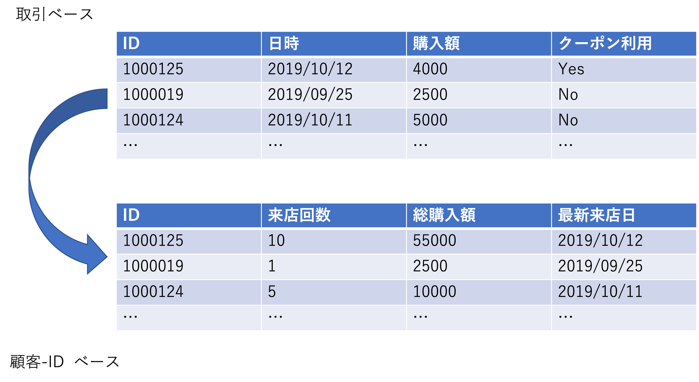
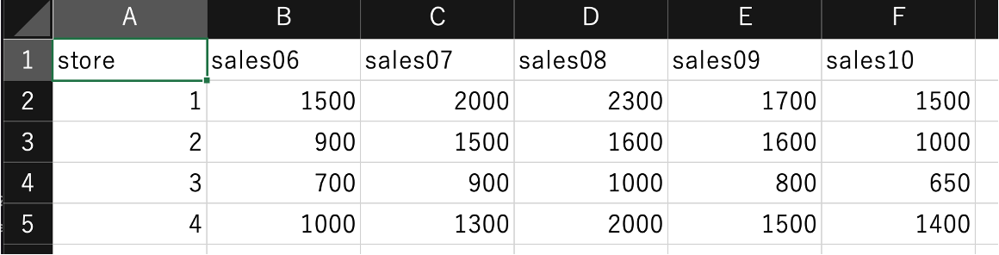

# データ処理と顧客関係管理（CRM）{#handling}
これまでの本書の内容は、データを収集するまでの注意点や方法を説明した。しかしながら、収集したデータをただ眺めているだけでは、定量的な知見を得ることはできない。そのため、以降の節では主にデータ処理や分析手法について説明する。まず我々は、データセットの構築から学ぶ。例えばあなたがアンケートを実施したならば、そのアンケートからデータセットを構築する努力が必要になる。アンケート結果に基づくデータセット構築において研究者はコーディング、トランスクライビング、データクリーニングのプロセスを経る。

コーディングは、回答を分析可能なフォーマットへ変換する作業であり、通常回答に対して数値を当てはめる作業を伴う。例えば、回答者が男性ならば 1 を、女性ならば 0 をとるようなダミー変数を作成する作業がこれに当てはまる。コーディングは、不必要な情報を減らすことでデータ化プロセスを担う。トランスクライビングは、質問紙に記載された回答をデータ入力していく作業である。入力に関するヒューマンエラーは起こるものとして考える必要があるため、通常このプロセスは二人一組でダブルチェックをしながら行う。なお、オンラインアンケートの際はこのプロセスは自動で行われるため、不要になる。データクリーニングでは、研究者は不適切な回答のチェックを行う。例えば、回答可能範囲から外れた回答（例、7点尺度における8点回答）や、論理的に非整合的な回答（例、回答者が利用したことないと答えているサービスについて評価している場合） がないかをチェックする。また、欠損値という回答がない観測についてもチェックする必要がある。マーケティング分野においては欠損値のあるサンプルを削除するという方法も用いられるが、欠損値の扱いは奥が深く、いくつかの対応法がある。本書ではその詳細については扱わないが、欠損値に対応するためのデータ処理についての専門書も存在するため、関心のある読者はそれを参照してほしい（高橋・渡辺,  2017）。


データセットの構築が完了したあとは、本書では基本的にRを通じて様々な作業を行う。Rには、様々な計算を実行するための関数が用意されており（例、mean, median, sqrt 等）、これらを使えば、実際に我々分析者が各コマンドもシンプルになる。関数の利用においてはf(argument)のように関数名fのあとにカッコをつけて表記する。なお、argumentは日本では引数とよばれ、計算に必要な情報の指定である。関数の利用において作業者は具体的な関数名とそれに対応する引数を指定する必要がある。また、我々は通常、パッケージをインストール・起動することで他者が作った関数を利用することが多い。関数とパッケージについての説明や実行例は「Rの基本操作」節で紹介しているのでそちらを参照してほしい。

本章では、Rを用いてデータを整理・処理することで、複雑な統計分析を行わなくてもマーケティング的知見を得られることを、顧客関係管理を例に紹介する。ここで学ぶRでの作業は主に以下の通りである。なお、これらの作業は、統計的な分析を実行する前のデータ前処理にも使われるものなので、データ分析をしたいと考える人達にとってはとても重要なスキルになる。そのため、顧客関係管理に興味関心のない読者も、以下の手法について学習することを勧める。

1. データの読み込み（csv, excel, etc.）
2. dplyrの利用とデータ整形
3. パイプ演算子を用いた複数処理の実行
4. Wide vs. Long data format (おまけ)

## データの読み込み

本節で用いるパッケージをまだインストールしていない読者は、以下のコマンドを用いてインストールしてほしい。また、インストールを完了したら、library()関数によって各パッケージを起動すること。

```{r installPackages, eval=FALSE, message=FALSE}
install.packages(c("tidyverse","readr","readxl"))
```

```{r, warning=FALSE,message=FALSE}
library(tidyverse)
library(readr)
library(readxl)
```


ここからは、データセットを用いた分析を行う。基本的な操作においては、R外部で作成されたデータを取り込み利用するのだが、あるソフトウェアで作成・保存されたデータセットが他の環境で利用できるとは限らないという点に注意が必要である。具体的には、エクセルファイルが誰にでも開けるとは思ってはいけない。そのため、ソフト特性に依存しない汎用的な形式を使うことが好ましい。汎用性の高いファイル形式の代表的な例がCSV (comma separated values) である。以下は、mktData.csvという架空のファイルをdfというオブジェクト名で取り込むための、見本コードである。ここで用いる関数は、readrというパッケージのread_csv() という関数である。なお、以下のコードは、実在しない 'mktData.csv'というデータセットを引数に利用した見本コードであるため、このコードをそのまま実行してもエラーを返すだけであることに注意をしてほしい。実際には、自身が利用するファイル名を指定してファイルを読み込むことになる。なお、以下のコードの2行目は、データの1行目に変数名（列名）が含まれていない場合の引数の指定方法である。

```{r readcsv, eval=FALSE, message=FALSE}
df1 <- readr::read_csv("mktData.csv")
df2 <- readr::read_csv("mktData.csv", col_name = FALSE)
```

なお、デスクトップ版を利用している場合には、ファイルが格納されているディレクトリ名も指定する必要がある。Rにおいては様々なファイルを入力・出力することになるため、利用するディレクトリが一貫していないとそれだけで作業が煩雑になる。そのため、「（補足）デスクトップ版の利用とプロジェクト機能」節で紹介している「プロジェクト機能」必ずを活用するようにほしい。

本講義では、大学の学務ポータル（manaba）を通じて教員が配布したデータを学生各自のコンピュータにダウンロードし、それを post.cloudに各自がアップロードするという手順によって分析用データを利用する。Manabaからのデータのダウンロードは各自で済ませてほしい。Posit.cloudはR studio 画面を表示する段階でプロジェクトが作成される。ここではまず、分析に利用するデータを格納するディレクトリを作成するコードを紹介する<デスクトップ版を使用している場合も、Project を指定していれば、以下のコードで全く同じ結果を得ることができる。> 具体的は、以下の通りdir.create() を使って新たに data というディレクトリ（フォルダ）を作成する。

```{r directory, eval=FALSE}
dir.create("data")

```

新たなディレクトリを作成したら、そこに、ポータルよりダウンロードしたデータを入れてほしい。ここではまず "2022idpos.csv"というデータを用いる。データが無事 data ディレクトリに含まれたら、以下のコマンドによってそのデータファイルをR の作業スペースに読み込み、それに "idpos" というオブジェクト名を定義する。なお、ここで分析実行社はディレクトリを指定することも必要になる。また、コード内の na は、欠損値がどのように保存されているかを指定するための引数であり、もし欠損値が空欄であればnaによる指定は必要ない。

```{r importidposdata, message=FALSE}
idpos <- readr::read_csv("data/2022idpos.csv", na = ".")
```

問題なくデータを読み込むことができたら、そのデータの冒頭数行を head() 関数によって表示する。head() 関数の結果によると、このidposデータは、3000行、5列のデータセットであることがわかる。なお、同様の情報は R studio 画面内の Environment タブから確認することできる。

```{r headidpos}
head(idpos)
```

また、読み込んだデータ特徴の確認は他の関数でも実行できる。例えば、name() 関数を使えば、データ内の変数名 (列名) を確認できるし、tidyverseに含まれる glimpse() 関数によってもデータの冒頭数行を含むいくつかの情報を返してくれる。

```{r idposcheck}
names(idpos)
glimpse(idpos)
```

なお、このidposデータは、POS (Point of sales) という小売店レジでの取引データとロイヤルティプログラムなどの会員IDを含むID-POSと呼ばれるデータを想定し作成した、簡易的な人工データである。データには、小売店舗での取引日（date）、金額（spent）、クーポン利用の有無 (coupon)、性別 (gender) が含まれている。本来のPOSデータは、より詳細な日時や具体的な製品単品レベルの取引品目など、より詳細な情報が含まれているはずだが、ここでは簡単化のためにこのようなデータにしている。また、もしスプレッドシート形式で表示したい場合には View() 関数をconsoleに直接入力することでそれが可能になる。例えば、idposデータを用いて以下のようなコードを入力することで、Sourceウィンドウに新しいタブができ、そこにデータセットが表示される。

```{r view, echo=FALSE, message=FALSE}
View(idpos)
```

## データの整形
データの整形には、tidyverseパッケージ群に含まれるdplyrというパッケージを用いる。しかしながら、tidyverseのインストール・起動しておけばdplyrも利用できるため、特に心配する必要はない。dplyr には、いくつもの便利な関数がふくまれているが、本節では主に以下の関数および機能を紹介する。

1. summarize()
2. mutate()
3. filter()
4. select()
5. arrange()
6. パイプ演算子 %>%

summarize は、ある変数の平均値や標準偏差などの記述統計量を計算することができる関数である。例えば、dataというデータセットに含まれる var_name という変数の平均値を計算し、それを M という変数名として定義する場合、以下のコマンドを用いる（以下のコマンドは見本コードである）。
```{r summirize, eval=FALSE, message=FALSE}
summarize(data, M = mean(var_name))
```

mutate は、データセットに引数内で指定した定義の変数（列）を追加する関数である。例えば、dataというデータセットに対し、definition で定義した変数をnew_varとして追加するには、以下のコマンドを用いる（以下は見本コードである）。実際にdefinitionを定義する場合には、様々な関数や論理式を利用する必要がある。例えば、"new_var = var1/100" という定義を用いれば、var1を1/100倍した値をnew_varとして定義することになる。また、"new_var = var1 – mean(var1)"という定義を用いれば、var1の観測値からvar1の平均値を引いた値をnew_varとしている。なお、このような操作化を一般的に「中心化」と呼ぶ。

```{r mutate, eval=FALSE, message=FALSE}
mutate(data, new_var = definition)
```

mutate関数の利用においては、条件分岐を用いた変数の作成を行うこともある。そのように、研究者がある変数の値に応じて異なる値を変数を作成するときには、mutate内で、ifelse()関数を用いるのが良い。ifelse() 内の第一引数は条件、第二引数は条件が満たされたときの処理、第三引数は条件が満たされないときの処理をそれぞれ表す。なお、特定の条件の指定には "==" （同値）, ">="（以上）, "<="（以下） を使う。具体的には、var1 が2ならば1をとり、それ以外であれば０をとるという条件でnew_varを作成するという指示は、以下のようになる（以下は見本コードである）。

```{r mutateIfelse, eval=FALSE, message=FALSE}
mutate(data, new_var = ifelse(var1 == 2, 1, 0))
```

filter関数は、データから特定の条件に合致する行だけ取り出す場合に用いる関数である。例えば、男性（gender == "male"）のサンプル情報のみ抽出したい場合には以下のような指示になる。

```{r filter, eval=FALSE, message=FALSE}
filter(data, gender == "male")
```

なお、特定の条件以外のものを指定したいときは、 という論理式 "!=" (not equal) を使う。男性以外の行を選ぶための指示は、以下の通りになる。

```{r filterNotequal, eval=FALSE, message=FALSE}
filter(data, gender != "male")
```

select関数は、特定の変数（列）を選んで新たなデータフレームを作成することができる関数である。例えば、dataというデータセットから、var1、var2、var3 という変数（列）を抽出して、data2というdataframeとして定義するには、以下のような指示になる。

```{r select, eval=FALSE, message=FALSE}
data2<- select(data, var1, var2, var3)
```

反対に、取り除きたい変数を指定するときには、以下のように "-" を使う。

```{r selectNegative, eval=FALSE, message=FALSE}
data2<- select(data, -var1)
```

列の指定方法には、いくつかのやり方が存在する。並んでいる列をまとめて指定するときは:（コロン）を使う。例えば、var1からvar5までの列をまとめて抽出し、それをdata2として定義するのは以下のようにできる。

```{r selectcolon, eval=FALSE, message=FALSE}
data2<- select(data, var1:var5)
```

また、tidyverseのstarts_with()（ends_with()）を使うことで、変数名の冒頭（末尾）が特定の文字列から始まる変数を指定するようなことも可能である。例えば、"v" という文字から始まる変数を取り出すための指示は、いかのようになる。
```{r selectstring, eval=FALSE, message=FALSE}
data3<- select(data, starts_with("v"))
```

arrangeは、データの並べかえを可能にする関数である。例えば、以下ではvar1の値が小さい順（昇順）に並べ替えるような指示を示す。一方で、降順にする場合は、desc(var1)と引数を指定する必要がある。

```{r arrange, eval=FALSE, message=FALSE}
data2 <- arrange(data, var1) 
data2 <- arrange(data, desc(var1)) 
```

また、tidyverse環境において、変数名を変更することも、rename() 関数で可能になる。

```{r rename, eval=FALSE, message=FALSE}
data3 <- rename(data2, var1 = sales)
```

Tidyverse 内の dplyr を使うことでパイプ演算子（%>%）が使える（ショートカット: Command (control) + Shift + m）。パイプ演算子は、左側の処理結果を演算子右側の関数の第一引数として利用するための指示である。たとえば、以下のコマンドではまず $\small 10-6$ が計算され、その結果である "4" が `sqrt()` の引数として利用される（sqrt(4) は 2）。

```{r pipe}
(10-6) %>% sqrt()
```

パイプ演算子は、複数のデータ操作処理を連続して行う際に便利である。例えば、顧客の情報を含むデータセット(data)から、男性に該当する情報のみを抽出し、var1(例、購買額)についてのランキングを作成したうえでいくつかの変数を含んだデータセット（new_data）を作成する場合を考える。その際に実行すべき作業とそれらに対応する関数は以下のように示すことができる。

1. 男性の情報だけ抜き出す(filter)
2. Var1の値について降順に並べ替える(arrange)
3. 第一位から最下位までの順位を割り当てた　ranking 変数を作る(mutate)
4. var1 , var2, var3, var4, orderだけ残し(select) new_dataとして定義する

上記の作業を一気に行うためのコードをパイプ演算子を使わずに書くと以下の様になる（以下は見本コード）。

```{r wopipes, eval=FALSE}
new_data <- select(
　mutate(
　　arrange(
　　　filter(data, gender == "male"),
　　　desc(var1)),
　　　ranking = 1:n()),
　 var1, var2, var3, var4, order)
```

パイプ演算子を使わない場合、先に実行する処理が内側に来ており、一見して何を行っているのか理解するのが難しい。一方でパイプ演算子を使い、左側の処理結果を演算子右側の関数の第一引数として利用すると、以下のように書き換えることができる。

```{r withpipes,eval=FALSE}
new_data <- data %>%
 filter(gender == "male")%>%
 arrange(desc(var1)) %>%
 mutate(ranking = 1:n()) %>% 
 select(var1, var2, var3, var4, order)
```

パイプ演算子の利用により、各関数の処理を一つの行で示せる。また、処理の順番通りに関数を記載することが可能なので、コードの記述容易性と可読性の両方が高まる。また、パイプ演算子による操作は次の関数の第一引数以外に反映されることも可能である。第一引数以外の引数に左側の処理結果を反映させる際には、該当する箇所に "." （ドット）を使う。たとえば、$\small 10-2$の計算結果を用いて2から8の偶数で構成されるベクトルを返すためのコードは以下のように書くことができる。

```{r pipeExample}
(10-2) %>% 
  seq(from = 2, to = ., by = 2)
```

データの整形・処理作業が終わったら、そのデータを自身のコンピュータ内のストレージに保存したいと考えるかもしれない。Rでは、外部への書き出しという形でデータを保存することが可能である。例えば、df という名前のデータフレームをnew_dataというファイル名で、dataというディレクトリにcsv形式を用いて保存するためには、以下のようなコードを用いる（以下は見本コード）。また、csv以外にもファイル形式は選択可能であり、例えばRのデータ形式(.Rds)で保存する場合には、"#Rds" 以降のコードを用いる。


```{r writecsv, eval=FALSE}
readr::write_csv(df, path = "data/new_data.csv")

#Rds
readr::write_rds(df, path = "data/new_data.Rds")
```

## 統計的検定を用いない顧客分析

### データの構造変化とソート
顧客の購買データを用いて、（統計的な分析を要さず）重要顧客や顧客層を発見することが、小売企業を中心に行われている。ここでは基本的に、ID-POSデータを用いたデータベースの正規化と集計2焦点を合わせる。特に、顧客個人に関する情報を用いながら企業や店舗にとって重要な顧客を特定し、その顧客との関係性を深めた場合を考える。店舗の運営効率から考えると、単に来店客数を増やすだけでなく、より頻繁に、より高額の買い物をする顧客を特定し、その人（達）の購買を促進することが効果的になる。言い換えると、企業や店舗は、ロイヤルカスタマーを特定し、その顧客との関係性を構築したいと考えるのである。そのためにはまず、ロイヤルカスタマーを特定する作業が必要になる。そこで本節では、データから企業にとって価値のある顧客を発見する方法について、データの前処理技術を応用する形で紹介する。

本節では簡単に、単純なデータハンドリングから顧客インサイトを得る方法を考える。特に、データ処理とソーティング（順番の入れ替え）を用いる方法を用いる。本節ではID-POSデータを用いた分析として、デシル分析とRFM分析を紹介する。デシル分析は、支出額をもとに上位から顧客を並べ替え、その順番に基づき顧客を10分割することで、上位の支出額を担うランクに属する顧客を特定する。なお、他の指標で同様の分析を実行することも可能だが、一般的には支出額を用いることが多い。例えば、月当たり5000人の顧客がいるとすると、500人ずつのグループに分け、購買額の大きい順にデシル1〜10 (10〜1の場合もある) とする形でランク分けする方法がこれにあたる。このとき、各顧客の情報がポイントカードやアプリで紐付いているのであれば、最も購買額の多いグループの特徴を整理することで、現在購入額の高い顧客がどんな特徴を持つのか理解できる。

一方、RFM（Recency, Frequency, Monetary）分析は、取引情報から、最近いつ買ったか、どれだけの頻度で買い物するか、どれだけ支出しているかといった情報を総合的に勘案し、どの顧客が最重要かを特定する方法である。これらの指標は、ロイヤルティや再購買確率が高い顧客を判別するのに役立つ3つの指標である。例えば、最終購買日から時間が経っている顧客は離反しているかもしれないし、購買頻度や購買額が高いと、ロイヤルティが高い可能性が高い。また、クーポンや割引利用の有無の情報と紐付けることができれば、当該顧客がチェリーピッカーか否かも判断することができる。

ID-POSデータは、各顧客の会員IDについての情報はありながらも取引ベースで情報が整理されている。このようなデータに対して以下の手順を用いてデータを集計・ソーティングする。

1. 顧客IDごとに、各取引情報を集計する。
2. 顧客ID情報についてまとめたデータベースにおける順番をソートし、重要顧客を識別する。

このようなデータの集計は、データ構造を取引ベースから顧客IDベースに変換することを可能にする。下図は、取引ベースのID-POSデータを、集計作業によって顧客IDベースのデータ構造に変換するイメージを示したものである。ID-POSデータは、顧客ID情報が含まれていながらも、データの行（観測）は各取引を示している。そのため、仮に同じIDの顧客がデータ収集期間に複数回取引を行っている場合、同じIDを含む観測がいくつも見られることになる。一方で下部の顧客IDベースのデータは、ID-POSデータを顧客ID情報によって集計したものであり、一定期間中に特定のIDを持つ顧客がどのような購買行動を示していたかを捉えたデータである。そのため、データの行は各顧客IDを示している。本節では、まずはじめにこのようなデータ構造の変換について説明する。


{width=70%}

ここでは、先程利用した idpos データを用いて作業を進める。改めて、当該データを以下のコマンドで確認する。

```{r}
head(idpos)
```

ここで、date変数を用いて直近で何日前の来店かを示す変数を作成する。このデータは、2019年09月01日 から 2019年10月01日までの一ヶ月間、とある店舗で記録された取引データであると仮定し作成されている。そのため、データ収集終了最新時点（2019-10-2）と来店日時の差を表す変数を作成する (ここでの処理にエラーが出る場合は、`idpos$date <- as.Date(idpos$date)` というコマンドを事前に試してから変数の定義を行ってほしい)。head関数により出力された結果によって新たな変数（datediff）が追加されたことがわかる。

```{r datediff}
idpos$datediff<-
  as.numeric(difftime("2019-10-02",idpos$date,units="days"))
head(idpos)
```

続いて、パイプ演算子を使ったデータ処理によって顧客IDベースの形へ集計する。ここでは特に、group_by() という関数を使い、顧客id (今回は性別情報も残したいので gender も加えている)をグループ化の基準と指定する形で集計を行う。また、CRM分析で使う変数のために、idレベルでの集計という形で以下の変数を作成する。そして、以下の変数を用いて集計した新たなデータセットを "idpos_cust" として定義する。

- frequency：各idの出現頻度をn()でカウントする
- monetary：spentの合計をsum()で計算する
- cherry (picker)：クーポンの利用回数の合計をsum()で計算する
- recency：datediffの最小値をmin()で求め、直近でいつ来たかを判別


```{r idbased, message=FALSE}
idpos_cust <- idpos %>% 
  group_by(id) %>% 
  summarize(frequency = n(), 
            monetary = sum(spent), 
            cherry = sum(coupon), 
            recency = min(datediff)
            )
head(idpos_cust)
```

上記の操作によって、元々のidposデータから、顧客ベースのデータ構造（idpos_cust）に変換できたはずである。しかしこれだけでは、まだ我々は誰が重要顧客か特定できない。そのため、次に我々はデータの並べかえを行う。具体的には、支出額が高い順に並び替えたあとに上位20人の顧客を表示する。

```{r monetary}
idpos_cust_m <- idpos_cust %>% 
  arrange(desc(monetary))

##Customers in the top 20 (Monetary) 
idpos_cust_m[1:20,]

```

### データ結合

ここまでの結果からは購買額の高い顧客IDを特定することができた。しかしながら、これらの顧客がどのような特徴を持っているのかについては推察できない。そのため、別で管理されていた顧客情報を捉えたデータセットと結合することでこれらの顧客についての属性を把握する。
以下では、今回使用する顧客情報データセットを読み込み、その概要を示している。このデータセットには、3000人分の会員登録済み顧客情報が蓄積されており、以下の変数を含む：

- id: 顧客ID
- gender: 性別
- age: 年齢
- famsize: 世帯人数

```{r iddata,message=FALSE}
id_data <- readr::read_csv("data/id_data.csv", na = ".")
str(id_data)
```

ここで、顧客データと購買データを `left_join()` を用いて、`idpos_cust` をメインとする形で `id` によって結合する。`left_join()` は左側に指定したデータフレームに存在知するキーの行を返す形でデータの結合を行う。言い換えると、左側のデータセットに存在する行（観測）はすべて残され、そこに新たな変数を加える形でデータフレーム間の結合を行う。

```{r leftjoin}
idpos_cust <- left_join(idpos_cust,id_data, by = "id")
head(idpos_cust)
```

上記の通り、顧客ベースの取引情報に、各顧客の属性情報が追加された事がわかる。これを利用し、以下のように上位20顧客の性別比率を以下のように確認する。これによって、主要顧客に占める性別比率が確認できる。

```{r gender ratio}
idpos_cust_m <- idpos_cust %>% 
  arrange(desc(monetary))

#gender ratio in the top 20
table(idpos_cust_m[1:20,]$gender)
```


続いては先述のデシル分析を実行する。具体的には、idpos_custに対し、cut()関数を使うことで、monetaryの大きさに基づきサンプルを10等分し、新たに "decile_rank" という変数（列）をデータに追加し、その新たなデータセットを "idpos_cust_m"と定義する。なお、次節にてこのデータを改めて使うため、データをprojectのdataディレクトリ内に保存しておいてほしい。
```{r decile}
idpos_cust_m$decile_rank <- 
  cut(idpos_cust_m$monetary,
      quantile(idpos_cust_m$monetary, (0:10)/10,na.rm=TRUE),
      label=FALSE,include.lowest=TRUE)
head(idpos_cust_m)
readr::write_csv(idpos_cust_m, "data/idpos_customer.csv")
```
head()関数によって新たな変数の追加を確認したあとは、各デシルの店舗売上への貢献度を確認する。ここでは、decile_rankをグループ化の基準として設定し、summarize() によって集計する方法を用いる。その後、各デシルの売上比率を計算し、高い順に並び替える。集計・分析の結果は、上位20%の顧客で、ID-POSに計上されている売上の57%を締めていることを示した。

```{r decileshare}
decile <- idpos_cust_m %>% 
  group_by(decile_rank) %>% 
  summarize(freq = n(),
            monetary = sum(monetary)) 
total <- sum(decile$monetary)

decile2 <- decile %>% 
  mutate(percent = monetary/total*100) %>% 
  arrange(desc(decile_rank))

decile2
```

本節で示したように、高度な統計的分析を実行せずとも重要顧客を特定する事が可能になる。本節では特に、データの集計や処理技術を使った方法を紹介した。このような分析によって回答できる問いは「企業にとっての重要顧客は誰か」というものだろう。この問いは非常に興味深く実務的にも有意義なものであるが、以下の点に注意することが重要である。第一に、何をもって顧客の重要性を定義するかという問題である。本節では特にRFMなどの基準を用いて、観察可能な購買結果をもとに重要顧客を識別する方法を捉えた。しかしながら、例えば購買頻度と購買額では異なる側面を捉えており、どの指標を用いて分析するかによって（通常は）結果が異なる。そのため、研究者自身が「重要性」をどのように定義するのかを注意深く判断し、なおかつそれをレポートやプレゼンテーション内できちんと明示する必要がある。さらに、データでは捉えきれない側面は分析結果に反映されないという点についても注意が必要である。例えば日本には江戸時代から続く小売企業もいくつも存在する。仮に、そのような小売企業と、長期間代々取引を続けている顧客（一族や企業）がいたとして、さらにその顧客が分析による上位顧客に含まれなかったとする。その場合、この顧客を重要顧客でないと切り捨てて良いのでだろうか。災害、国家の統治体制の変化、戦争、などの激動を経てなお取引が続いている顧客は重要でないと言い切れるのだろうか。もちろん、このような顧客を重要でないと捉えることも、経営判断として間違ったものではない。しかしながら、少なくともデータを用いた分析結果を過信しすぎず、データによって何が捉えられており、何が捉えきれていないのかについて研究者・意思決定者のどちらも自覚的になることが必要になる。

第二に、分析を行うだけでマーケティング実務が完結するわけではないという点についても注意が必要である。「重要顧客を特定する」という研究課題の背後には、「CRMを実行して収益性を向上させる」という実務的課題が存在しているはずである。そのため、今回の発見物をもとに、マーケティング活動への示唆を与えていくことが重要になるのだが、誰が重要顧客か、という問いに答えるだけでは具体的な活動指針（アプリを通じた囲い込みや、訪問販売等）を与えるのは難しい。そのため、重要顧客のライフスタイルや価値観などの彼/彼女らの特徴に踏み込んだ調査を行うことも必要になるかもしれない。昨今のロイヤルティプログラム（ポイントシステム）では、モバイルアプリを通じて個人の様々な行動履歴が記録されたり、アンケートへの回答を促されたりすることがあるだろう。これらの情報とID-POSデータをうまく接合できれば、重要顧客を特定しつつ、それらの顧客に適したCRM方策を策定できるかもしれない。


## (おまけ) Wide型とLong型データセット
インターネットを通じて、とても都合の良いかつ信頼できるデータセットが入手できたとしても、それが分析のために望ましい形で保存されているとは限らない。特に、横長(wide)と縦長(long)データが存在し、それらのデータの型の違いには注意が必要である。我々人間がデータを眺め、解釈を与える場合にはwide型データのほうが扱いやすいのだが、コンピュータやソフトウェアがデータを分析する際には、long型のほうが好ましい。例えば、下図は4店舗のある年の6月から10月までの売上情報（単位：千円）を示したデータセットである。これは、複数サンプル-複数時点という構造のデータだが、各時点の観測値が横に並んでおり、wide型データだといえる。


{width=70%}

手元にあるWide型データをLong型に変換したい場合の対応策として、ここでは tidyverseに含まれているtidyrのgather()関数を用いる方法を紹介する。この関数の利用方法を実演するためにManabaにアップされている sales_wide.csv をダウンロードし、プロジェクト内のdataディレクトリに移して欲しい。データを読み込むと、以下のようにデータ構造を確認することができる。

```{r sales_wide}
sales_wide <- readr::read_csv("data/sales_wide.csv", na = ".")
sales_wide

```

ここで用いる gather()関数は、以下の引数を指定する：
- data: 変換元のデータ
- key: 変数を１列にまとめたあと、元の列を区別するための列につける名前
- value: 変数を１列にまとめたあと、値が入る列につける名前
- どの範囲を一列にまとめるかの範囲指定

その上で、さきほどのsalesデータをLong型に変換するために、以下のようなコマンドを利用する。

```{r gather}
sales_long<- gather(data = sales_wide, key = "month",
               value = "sales", starts_with("sales"))
sales_long

```

編集された縦長データは上記の通り示されるが、その中身を見ると、monthの列にsales06などの情報が記載されており、好ましくない。この問題は、元のデータにおける変数名に該当する情報を新しいkey列の値に使うというgather関数の仕様に影響するものである。この問題に対しては、パイプ演算子を使ってgatherの実行前に、列名を年だけの形に変更することで対応可能である。以下が、修正版のコードであり、出力結果より、先述の問題点が解決されたことが確認できる。ただし、gather関数の実行において、下記コード内では範囲の引数の指定についても修正されていることに注意が必要である。

```{r gatherV2}
sales_long <- sales_wide %>% 
  rename(`06` = sales06,
         `07` = sales07,
         `08` = sales08,
         `09` = sales09,
         `10` = sales10) %>% 
  gather(key = "month",value = "sales",
         `06`:`10`) %>% 
  arrange(store)
sales_long
```

一方で、Long型データからWide型データへ変換するためには、tidyrのspread()を用いることが多い。spread() では、主に以下の引数を用いる。

- data: 変換元のデータ
- key: 変数を複数列にわけるとき、列を区別するための変数
- value: 複数列に分ける値

例えば、以下のコードで先程の sales_long データをwide型に変換することができる。

```{r spread}
wide_test <- sales_long %>% 
  spread(key = "month", value = "sales") %>% 
  rename(sales06 = `06`,
         sales07 = `07`,
         sales08 = `08`,
         sales09 = `09`,
         sales10 = `10`)
wide_test
```


## 参考文献
高橋将宜・渡辺美智子 (2017). 「欠測データ処理」, 共立出版.

松村優哉・湯谷啓明・紀ノ定保礼・前田和寛（2021）「改訂2版 RユーザのためのRStudio[実践]入門〜tidyverseによるモダンな分析フローの世界」，技術評論社.