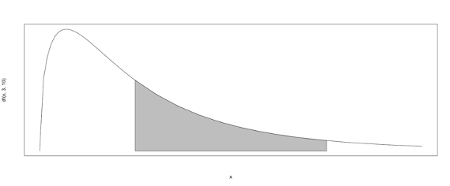
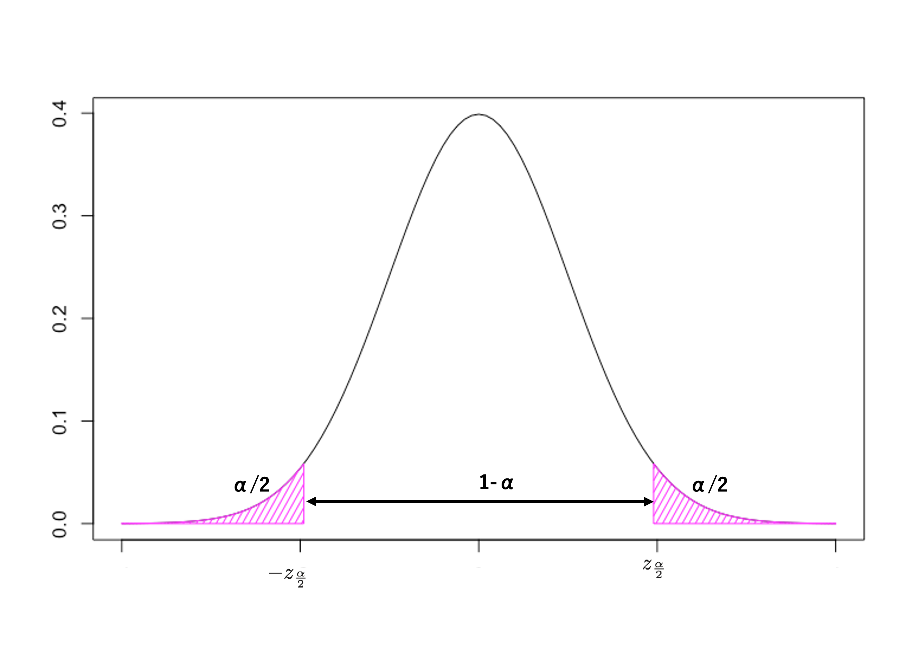
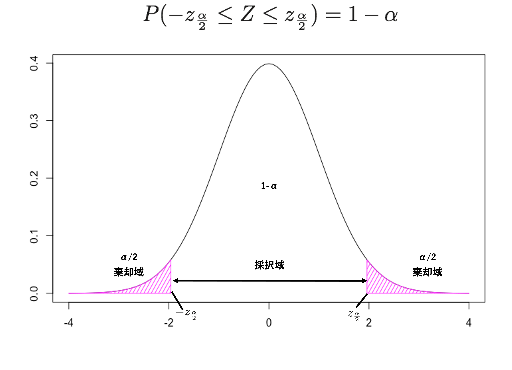
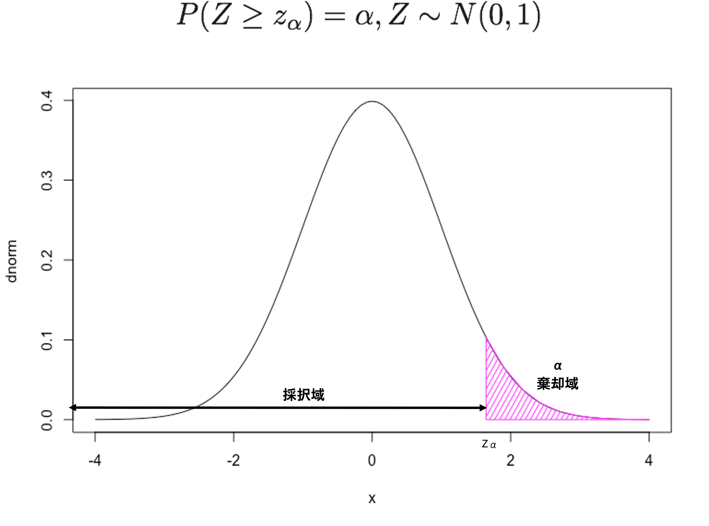

# 基礎統計学復習{#test}

Rを用いて、統計的な分析（区間推定や検定）を実行すること自体はさほど難しくない。基本的な分析に必要な関数は基本パッケージに搭載されており、コードの書き方（引数の設定など）もネット上で検索すれば容易に知ることができる。しかしながら、あなた自身もしくは他者実行した分析をきちんと理解するためには、基礎的な統計学の内容を理解している必要がある。本資料は、基礎統計学を履修済みの学生を想定して書かれているが、本章でいくつかの基礎的な統計学の知識を復習する。また、本資料ではあくまで簡易的に説明を加えるのみなので、統計学を未習の場合は、基礎統計学の図書や講義で学習することを強く推奨する。また、章末に統計学や計量経済学の学習に役立つ参考文献を提示しているので、各自の学習に役立ててほしい。

## 確率モデル、期待値と分散

伝統的なデータ分析では、標本から得た情報に基づき母集団の性質について推測する。母集団とは確率分布であり、標本はその確率分布に従う確率変数、データはその確率変数の実現値だと解釈できる（倉田・星野、2011）。そのうえで確率とは、起こりうる事象の集合内において、各事象の起こりやすさの度合いを0以上1以下の実数で表したものである。より詳細な定義として、標本空間を $\small \Omega$、任意の事象 *A* に対して実数 *P(A)* が定まっていて、以下の三つを満たすとき、*P(A)*は事象 *A* の確率という：

1. 確率は非負であり、以下を満たす：
$$0\leq P(A)\leq 1$$
2. 全事象を $\Omega$、空事象を $\emptyset$ とするとこれらの確率は以下の様に示される：
$$P(\Omega)=1,~~ P(\emptyset)=0$$
3. 事象 $A_1,A_2,...$ が互いに排反ならば、これらのうち少なくとも１つが起こる事象 $A_1\cup A_2\cup ...$ の確率は以下となる：

$$
P(A_1\cup A_2\cup ...)=P(A_1)+P(A_2)+...
$$

確率変数とは、ある標本空間上で定義される取りうる各事象に対してそれぞれ一定の確率と対応関係のあるような変数である。例えば、細工のないサイコロを投げるとき、出た目の値を $x$ とすると、$x$ は1から6までの整数を取りうる変数だと言い換えることができる。この場合標本空間は、取りうる出目に対応した6個の標本点からなる。またこれらの標本点には、それぞれ対応する確率が以下のように付与されている。

```{r dice, echo=FALSE, message=FALSE}
dice <- matrix(c("確率", "1/6", "1/6", "1/6", "1/6", "1/6", "1/6"), nrow = 1)
colnames(dice) <- c("x", "1", "2", "3", "4", "5", "6")
knitr::kable(dice, caption = "サイコロの確率分布", align = "ccccccc")
```

このように、確率変数の取る値に対応して確率が付与されるルール（ $x$ の関数としての確率 $P(x)$ ）を確率分布や確率分布関数という。確率変数は主に、離散確率変数と連続確率変数に分けることができる。離散確率変数は、サイコロのように、取りうる値が離散的な確率変数である。一方で、連続確率変数は、ある範囲の中で連続的にどんな値も取りうる確率変数である。離散確率変数では、サイコロの表で示されているように、取りうる特定の値に対応する確率を確率分布に基づき計算できる。

一方で連続確率変数の場合、取りうる値の数が無限に存在する。例えば、-1 から 1 までの区間を取りうる値の範囲とする連続確率変数があったとする。この変数は例えば、0.90という値を取りうるが、同様に、0.91 や 0.900001 といった値も取りうる。このように、連続確率変数が取りうる値の数は無限に存在するため、取りうる特定の値に対応する確率は0になる。もし取りうる各値に確率が付与されていると、確率の合計が無限大になってしまうという問題に直面する。そのため、連続確率変数の場合、取りうる区間に対して確率が付与される。これを踏まえて連続確率変数を捉え直すと、連続確率変数は、その取りうる任意の区間に対して一定の確率が対応するような変数であるといえる。また、連続確率変数における取りうる区間の起こりやすさには「確率密度」が対応することで計算可能になる。言い換えると、確率変数 $x$ の値に確率密度がどのように対応するのかという関係は、$f(x)$ という確率密度関数（probability density function: PDF）として示される。PDF $f(x)$ を持つ連続確率変数 $x$ が区間 [a, b] を取る確率 $P(a\leq x \leq b)$ は、以下の積分計算で求められる。

$$
P(a\leq x \leq b)=\int^b_a f(x) dx
$$

以下の図はPDFの例であり、図内の曲線はPDFを、灰色に塗られている面積はある区間の確率を示している。なお、上記の式で示されている関係から、PDFを特定（仮定）することで、ある確率に対応する区間 [a, b] を求めることも可能である。以降の節で紹介する統計的分析では、この関係を用いて分析することもあるが、詳しくは後述する。


{width=70%}

連続確率変数を用いた具体的な確率計算例を紹介するために、ここでは一様分布（uniform distribution）を用いる。区間 [a, b] を持つ一様分布に従う確率変数 $x$ のPDFは以下のように示される。

$$
f(x) =
\begin{cases}
\frac{1}{b-a} & a\leq x \leq b\\
0 & otherwise
\end{cases}
$$
{width=70%}

具体的な計算を実行するために、ここで区間 [-1, 3] を持つ一様分布を考える。この一様分布のPDFは、$\small f(x)=\frac{1}{4}~for~-1\leq x\leq 3$（その他の区間の確率は0）となる。このとき、$x$ が区間 [0, 2] を取る確率は、以下のように求められる。

$$
P(0\leq x \leq 2) = \int^2_0 \frac{1}{4} dx=\left[\frac{x}{4}\right]^2_0=\frac{1}{2}-0=\frac{1}{2}
$$
次に、期待値を求める。期待値とは確率の考え方を含む理論的な平均値（$\mu$）といえる。確率分布 $P(x)$   を持つ離散確率変数 $x$ の期待値 $E(x)$ は一般的に以下のように定義することができる:

$$
E(x) = \sum_x x \cdot P(x)=\mu 
$$
一方、PDF $f(x)$ を持つ連続確率変数 $x$ の期待値 $E(x)$ は一般的に以下のように定義することができる:

$$
E(x) = \int_{-\infty}^\infty x \cdot f(x) dx=\mu 
$$
この定義に基づき、先程の区間 [-1, 3] を持つ一様分布の期待値を以下のように求める。

$$
E(x)= \int^3_{-1} \frac{x}{4} dx=\left[\frac{x^2}{8}\right]_{-1}^3=\frac{9-1}{8}=1
$$

期待値 $E(x)$ は一般的に、$a$ を定数、$g(x)$ と $h(x)$ を $x$ の関数とするとき、以下が成り立つ：

- $E(a) = a$
- $E[a\cdot g(x)]=a\cdot E[g(x)]$
- $E[g(x)+h(x)]=E[g(x)]+E[h(x)]$

これらの性質により、確率変数 $x$ の分散（$\sigma^2$）は以下のように求まる。つまり、分散は二乗の期待値から期待値の二乗を引くことで計算できる。

$$
\sigma^2=E\left[\bigl(x-E(x)\bigr)^2\right]=E\left[(x-\mu)^2\right]=E(x^2)-E(x)^2
$$


## 統計的推測

前節で述べた通り、我々は研究の対象となる集団全体ではなく、その一部から情報を取得し分析を行う。このとき、その集団全体を母集団、母集団から抽出した一部を標本と呼ぶ。統計的な分析においては、確率分布を用いて母集団をモデル化し、標本をその確率分布に従う確率変数とみなすことで母集団と標本の関係を捉える。そのため、データ分析は標本を対象とするものの、分析者の関心は、母集団の特徴である母数（parameter）についてであることが多い。母集団の平均（$\mu$）や分散（$\sigma^2$）は母数の代表例である。しかし、母数は通常未知であり直接知ることはできないため、標本の情報を用いて母集団の特徴について推測する。このプロセスを統計的推測と呼ぶ。統計的推測を行うためには、原則として母集団からの無作為標本抽出（random sampling）が必要になる。統計的推測では、互いに独立に同一の分布に従う（Identically Independently Distributed: IID）ような標本が好ましく、無作為標本は、IIDを満たすことが知られている。

統計的推測においては、「推定」、「統計量」、「推定量」、「推定値」などの似たような言葉が利用されるが、これらはそれぞれ異なる意味を持つ。推定とは、標本の情報に基づき母数について把握しようとする作業そのものを示す。一方で、標本として得られるデータに基づき計算できる値（計算式）を一般的に統計量というのだが、その中でも特に推定に用いる統計量を推定量という。そして推定値は、推定量についてデータから求めた実際の計算値を表す。また、推定には「点推定」と「区間推定」がある。点推定とは、未知の母数について１つの数値に基づいて推定する方法である。例えば、標本平均は母平均（$\mu$）を点推定するための推定量である。一方で区間推定は、未知の母数を一定の確率で含む区間を推定する方法である。これは、点推定では捉えきれない統計的誤差を考慮して区間を推定する方法であり、母平均の信頼区間の測定は区間推定の代表例である。

## 点推定

点推定は特定の推定量によって母数を捉えようとするが、どのような推定量を用いるべきなのだろうか。本節では、不偏性（unbiasedness）、一致性（consistency）、効率性（efficiency）という統計的に重要な推定量の性質について説明する。なお、以下の説明では、未知パラメータ $\small \theta$（シータ）に対する推定量 $\small \hat{\theta}$（シータハット）を考える。不偏性とは、推定量の「期待値」が未知パラメータの真の値に等しいという性質であり、以下のように示すことができる。

$$
E(\hat{\theta})=\theta
$$

つまり、実際の推定量の実現値がどうかは置いておいて、期待値の下では推定量が未知パラメータを示していることを表すものであり、サンプルサイズに関係のない推定量の性質である。そして、不偏性を満たす推定量のことを不偏推定量（unbiased estimator）という。なお、上記の定義から、統計的なバイアス（B）は、以下のように定義できる。

$$
B=E(\hat{\theta})-\theta
$$

第二に一致性とは、サンプルサイズが十分に大きいとき、推定量が未知パラメータの真の値と等しくなる確率が1に近づくという性質である。この性質について詳しく論じるには、漸近理論を学ぶ必要があるため、本書では詳細を省略するが、サンプルサイズを大きくすると未知パラメータの真の値に近づくような推定量を示した性質だと解釈できる。なお、任意の$\small \epsilon >0$（$\small \epsilon$: イプシロン）に対して以下のような性質を持つ推定量を一致推定量という。

$$
\lim_{n\rightarrow \infty} P\left(|\hat{\theta}-\theta|\leq \epsilon \right)=1
$$

第三に効率性は、推定量の分散の小ささを示している。分散の小さい推定量の方が、期待値から離れた値を取りにくく、好ましい推定量と考えられる。複数の不偏推定量や一致推定量がある場合、効率性を元に好ましい推定量を考える。

なお、代表的な推定量である標本平均は母集団期待値の推定量として好ましい性質（不偏性と一致性）も持っている。以下では、期待値 $\mu$、分散 $\sigma^2$ の確率分布に従う母集団からの無作為標本 $\small X_1,...,X_n$を考える（つまり、$\small E(X)=\mu$, $\small Var(X)=\sigma^2$）。このとき、標本平均（$\small \bar{X}$）の普遍性は以下のように示すことができる。

$$
E(\bar{X})= \left[\frac{1}{n}(X_1+X_2+...+X_n)\right] = \frac{1}{n}~\left[E(X_1)+E(X_2)+...+E(X_n)\right] = \frac{1}{n}\cdot n\mu=\mu.
$$

また標本平均の分散については、以下となることが知られている（計算は省略）。

$$
Var(\bar{X})=\frac{\sigma^2}{n}
$$

上記と同様の無作為標本による標本平均の一致性については、任意の $\small \epsilon>0$ に対していかが成り立つことが知られている。

$$
\lim_{n\rightarrow \infty}P(|\bar{X}-\mu|\leq \epsilon)=1
$$
言い換えると、サンプルサイズが増えることで標本平均 $\small\bar{X}$ は母集団の真の平均 $\small \mu$ と等しくなる確率が1に近づく。なお、標本平均がもつこの特性は「大数の法則（Law of Large Number）」として知られている。

また、標本平均はその分布の収束に関しても重要な特性を持っている。ここで、期待値 $\small \mu$、分散 $\small \sigma^2$ を持つ確率分布に従う母集団からのn個の無作為標本 $\small X_1,.., X_n$ を考える。サンプルサイズが十分に大きい場合、 $\small \bar{X}\sim N(\mu,\sigma^2/n)$（$\small \bar{X}$ が平均 $\small \mu$、分散 $\small \sigma^2/n$の正規分布に従う）となることが知られている。この性質を「中心極限定理（Central Limit Theorem）」という（詳細な証明や定義は省略）。また、この定理を以下のような$\small \bar{X}$ を標準化した確率変数に応用することも可能である。

$$
Z=\frac{\bar{X}-\mu}{\sqrt{\sigma^2/n}}\sim N(0,1)
$$
中心極限定理より、サンプルサイズが十分に大きい場合、*Z* の分布関数は標準正規分布（*N(0,1)*）の分布関数に収束する。詳細については割愛するが、サンプルサイズが十分に大きい場合、「標本平均」や「標本平均を標準化した確率変数」の確率分布が正規分布や標準正規分布に近似できるという定理は、統計的な推定や検定において重要なものである。

また、母集団分散の推定量としては、不偏標本分散が使われる事が多い。上記と同じ無作為標本に対し、標本分散 $S^2$ と、不偏標本分散 $s^2$ は以下のように定義される。

$$
S^2=\frac{1}{n}\sum_{i=1}^n (X_i-\bar{X})
$$

$$
s^2=\frac{1}{n-1}\sum_{i=1}^n (X_i-\bar{X})
$$

そして、それぞれの推定量の期待値は以下のようになることが知られている（計算省略）。そのため、母集団分散の推定量として、不偏標本分散（$s^2$）が用いられる。

$$
E(S^2)=\frac{n-1}{n}\sigma^2
$$

$$
E(s^2)=\sigma^2
$$


## 推定量もまた確率変数

次に、推定値と母数との関係を標本平均（$\small \bar{X}$）を使って考える（標本平均の定義は、「記述統計」の節を参照）。ある母集団からランダムサンプルを収集し、標本平均を計算することを考える。ここで計算された数値は真の母平均を捉えた唯一の値なのだろうか。
結論としては、点推定の推定値は母数そのものではなく、ひとつのある実現値でしかないことに注意が必要である。この理由は、「確率変数から計算される推定量もまた確率変数である」という事実から理解することができる。

例えば、我々が一橋大学商学部生の一ヶ月あたりの平均収入（仕送りは除く）に関心があるとする。（実現可能性は置いておいて）商学部全体を母集団とする無作為標本を100件収集し、標本平均を計算した結果 $\small \bar{X}=$ 0 だったとする。もしこのような極端な結果を得た場合、多くの人が「標本平均の実現値は必ずしも真の母平均そのものではない」という説明に納得がいくだろう。同様の調査（100件のランダムサンプリング）をもう一度行い平均収入を計算し直すと、おそらく0とは異なる推定値を得る可能性が高い。仮に、$\small\bar{X}=$ 50,000 だった場合、その結果をどのように解釈するだろうか。仕送りを除く大学生の月当たり収入の平均が5万円だという結果はなんとも尤もらしい。しかしながら、たとえ尤もらしい結果を得たとしても、それはひとつの分析結果であり、真の母平均を示す唯一の値ではない。

確率変数から計算される推定量もまた確率変数であるという点を直感的に経験するために、細工のない6面サイコロを（バーチャルに）振ってもらう。なお、コード内では、出力結果を少し見やすくするために、`knitr` というパッケージを利用しているため、以下のようにインストールしてほしい。
```{r knitr, eval=FALSE}
install.packages("knitr")
```


標本平均についての議論を行う前に、理論的な期待値を求める。6面サイコロの出目の期待値 $\mu$ は以下の通りである。

$$
\mu = 1\cdot \frac{1}{6}+2\cdot \frac{1}{6}+...+6\cdot \frac{1}{6}=3.5
$$

ここで、以下のようなコマンドを用いてR内でサイコロを振ってみてほしい（実際にサイコロを振ってもらっても構わないが、面倒くさい）。

```{r rolladie}
set.seed(442)# 乱数の再現性確保のための指示。関数内の数字に特に意味はないため各自別の値を使っても良い。
die <- 1:6
d <- sample(die,size=1,replace = TRUE)
d
```

この講義ノート内では以上で示されている通り、6という出目を得た。上記のコマンドを実施した各自がそれぞれ異なる値を得ているだろう。ここで得た6という数字は、サイコロの出目という確率変数の実現値（$n=1$）である。そのため、本データの標本平均も6であり、真の期待値とは異なる。ただし、読者によっては1件の標本による標本平均という表現を直感的に理解しにくいかもしれない。そのため、以下のように サイコロを10回振る試行を3回実施し、各サンプリング結果に基づき標本平均を以下のように計算する。 

```{r rolldice}
set.seed(352) 
d1 <- sample(die,size=10,replace = TRUE)
d2 <- sample(die,size=10,replace = TRUE)
d3 <- sample(die,size=10,replace = TRUE)
d_mean <- matrix(c(mean(d1),mean(d2),mean(d3)),nrow = 1)
colnames(d_mean) <- c("d1の平均", "d2の平均", "d3の平均")
knitr::kable(d_mean, caption = "サイコロの標本平均比較", align = "ccc")
```

上記の通り、d1, d2, d3 いずれの標本平均も互いに異なるものであり、また3.5とも異なる。このことからも、確率変数（サイコロの出目）を用いて計算された推定値（標本平均）もまた確率変数であり、推定値と未知パラメータとの間にはズレ（誤差）が生じうることがわかる。なお、中には3.5と等しい標本平均を偶然得た読者もいると考えられるが、それもあくまで一つの実現値である。

では、標本平均の推定値がサンプルサイズによってどれだけ真の期待値に近づくのかについて、サイコロの試行回数を10回、100回、1,000回と増やして確認する。以下の結果を見ると、サンプルサイズ（試行回数）が増えるごとに真の期待値に近づいていることが伺える。ただし、これらの結果もあくまで確率的な試行結果の実現値である。そのため、読者によっては異なる傾向を示すような結果を得る可能性があることに注意が必要である。

```{r llnsimulation}
set.seed(541) 
d10 <- sample(die,size=10,replace = TRUE)
d100 <- sample(die,size=100,replace = TRUE)
d1000 <- sample(die,size=1000,replace = TRUE)
d_lln <- matrix(c(mean(d10),mean(d100),mean(d1000)),nrow = 1)
colnames(d_lln) <- c("10回試行の平均", "100回試行の平均", "1,000回試行の平均")
knitr::kable(d_lln, caption = "サイコロの標本平均比較２", align = "ccc")
```

## 補足（いくつかの確率分布の関係性）
統計的な分析の際によく用いられる確率分布として、正規分布、カイ二乗分布、t分布、F分布間の関係性について簡単に紹介する。なお、各分布の確率密度関数などは記載しないため、関心のある読者は参考文献を参照してほしい。

### 正規分布
正規分布は、様々な分布の基準として用いられる重要な分布である。期待値を中心に左右対称であり「ベルカーブ」と言われる形状を持つ。また、平均0、分散1の正規分布は特に標準正規分布と言われ、正規母集団からの無作為標本の標本平均等の分布を特定する際などに用いられる。

### カイ二乗分布
標準正規分布からの無作為標本の二乗和はカイ二乗分布に従う。カイ二乗分布は、正規母集団からの無作為標本の不偏標本分散の分布を特定する際などに用いられる。

### t分布
標準正規分布とカイ二乗分布の比はt分布に従う。t分布は、正規母集団からの無作為標本による標本平均と不偏標本分散の比の分布を特定する際などに用いられる。

### F分布
カイ二乗分布の比はF分布に従う。F分布は、異なる正規母集団からの無作為標本の不偏標本分散の比の分布を特定する際などに用いられる。


## 区間推定
点推定の節で示した通り、推定値と未知パラメータの間には、ずれ（誤差）がある。標本平均の様に好ましい性質（不偏性や一致性）を持つ推定量であっても、計算の結果示された一つの推定値がどの程度信頼できるものなのかはわからない。そこで区間推定という、未知パラメータ（母平均等）を一定の確率（信頼水準）で含む区間を計算する方法を用いて、統計的な誤差を加味した母数への検討を試みる。区間推定においては、「信頼水準zz%で、xx以上、yy以下という区間は真の母数を含む」という区間[xx, yy]を調べる。このような区間は信頼区間（confidence interval）と呼ばれ、多くの統計分析において用いられている。

Rで信頼区間を求める事自体は難しくない。最も手間のかからない方法としては、`t.test()`（詳細は後述）の分析結果を用いて、`conf.int()`によって信頼区間が計算できる。信頼区間の計算を実行するために、倉田・星野（2011, p.248）で提示されている以下の電球の製品寿命に関する例を考える。ある製品（電球）の寿命は平均1700（時間）である。企業は性能を改良するために新型の電球が開発したが、新型化に伴い製品寿命も変化したのかについては不明である。ただし、この製品の寿命は新型も旧型のものも正規分布に従い、その標準偏差は $\sigma=$ 180（時間）であると仮定する。
工場で生産された新型製品を16個無作為に選びその寿命を計測した所、以下の結果を得た。

```{r bulb,echo=FALSE}
bulb_alt <- matrix(c(1873, 1685, 2275, 1760, 1769, 2176, 1748, 1760, 1994, 1473, 1715, 1771, 1784, 1684, 2038, 1850),nrow = 1)
knitr::kable(bulb_alt)
```

このデータは、平均が $\small \mu$、分散が $\small 180^2$ である正規分布（$\small N(\mu, \sigma^2=180^2)$ と表記する）からの無作為標本 $X_1,..., X_{16}$の実現値とみなすことができる。なお、このデータの標本平均は1,835（時間）、不偏標本標準偏差は 200である。このデータに基づく、新型電球寿命の期待値に関する95% 信頼区間（95%の確率で真の母数を含む区間）は`t.test()` 関数を用いると以下の様に求まる（ただし後述するが、この方法はこの例に対しては適切ではない）。

```{r bulb_confint}
bulb <- c(1873, 1685, 2275, 1760, 1769, 2176, 1748, 1760, 1994, 1473, 1715, 1771, 1784, 1684, 2038, 1850)

bulb_ci <- t.test(bulb) #t検定の実施と格納
bulb_ci$conf.int #信頼区間の出力（デフォルトで95%信頼水準）
```

出力されている `[1] 1728.235 1941.140` が信頼区間、`## attr(,"conf.level") ## [1] 0.95` が今回計算に用いられた信頼水準（confidence level）（もしくは信頼係数（confidence coefficient）ともいう）である。 分析の結果、95%の確率で真の新製品寿命期待値が 1728.2 から 1941.1 の間に含まれることがわかった。したがって、どうやら新製品寿命は平均的に旧型製品（1,700）よりも長そうである。では、ここで示された区間がどのように計算され、どのようなことを意味するのだろうか。以下では、一度電球の例から離れ、もう少し一般的な形で信頼区間の導出や解釈を説明する。

はじめに、標準正規分布に基づくある区間の確率の求め方を説明する。 $Z_1,Z_2,...,Z_n$ は、N(0, 1) （標準正規分布）に従う母集団からの無作為標本とする。このとき、標準正規分布がある区間 [$-\infty,~z_\alpha$] をとる確率は、以下の式および図のように示すことができる^[ただし、標準正規分布の確率密度関数 $\small f(z)$ は、$\small 1/\sqrt{2\pi}\exp\left(-z^2/2\right)$ だと知られている。]。なお、$\small z_\alpha$ は、確率$\small \alpha$ に対応する標準正規分布上の上側確率 $\small \alpha$ 点とする。このとき、この分布における $\small z_\alpha$ 以下（以上）の範囲を取る確率は 1 $\small -\alpha$（$\small \alpha$） である。

$$
P(Z\leq z_\alpha) = \int^{z_\alpha}_{-\infty}~f(z)~dz =\int^{z_\alpha}_{-\infty}~\frac{1}{\sqrt{2\pi}}\exp\left(-\frac{z^2}{2}\right)~ dz = 1-\alpha
$$


{width=70%}

同様に、以下のような関係も捉えることができる。この場合、斜線部で示されている範囲の確率は両側合わせて $\small \alpha$ であり、その内側の確率は 1 $\small - \alpha$ である。

$$
P(-z_{\alpha/2} \leq Z\leq z_{\alpha/2}) = \int^{z_{\alpha/2}}_{-z_{\alpha/2}}~f(z)~dz = 1-\alpha
$$

{width=70%}

上述の関係を、区間推定に応用するために、あるデータの標本平均に関する議論を捉える。標準正規分布に従う確率変数は、正規分布に従う確率変数を標準化することで得ることができる。ここで、$\small X_1,...,X_n$ を、期待値 $\small \mu$、分散 $\small \sigma^2$ の正規分布に従う母集団からの無作為標本とする。これまで学んだ標準化および標本平均の特性から、以下の通り、標本平均を標準化したものは標準正規分布に従うことがわかる。

$$
\frac{\bar{X}-\mu}{\sqrt{\sigma^2/n}}\sim N(0,1)
$$
このことから、先述の標準正規分布における確率計算の関係を応用し、以下を得る。

$$
P\left(-z_{\alpha/2}\leq \frac{\bar{X}-\mu}{\sqrt{\sigma^2/n}}\leq z_{\alpha/2}\right)=1-\alpha
$$

上記の式に基づき、未知の母平均 $\small \mu$ についての区間として整理すると、以下の式を得る。

$$
P\left(\bar{X}-z_{\alpha/2}\cdot \frac{\sigma}{\sqrt{n}}\leq \mu \leq \bar{X}+z_{\alpha/2}\cdot \frac{\sigma}{\sqrt{n}}\right)=1-\alpha
$$
したがって、区間 [$\small \bar{X}\pm z_{\alpha/2}\cdot \sigma/\sqrt{n}$] は、確率 $\small 1-\alpha$ で未知の母平均 $\small \mu$ を含むと解釈できる。また、上記の関係から任意の確率 $\alpha$ を指定することで、区間の上限と下限（$\pm z_{\alpha/2}$）の具体的な値を（統計学テキスト巻末などに記載されている）標準正規分布表などから求めることができる。 そして、このような区間を「信頼区間」といい、信頼区間の計算にて仮定された確率 $\small 1-\alpha$ を「信頼水準」もしくは「信頼係数」という。信頼係数は、信頼区間の計算のために研究者によって事前に選択される。慣習としては、90%, 95%や99% ($\small \alpha =$ 0.10, 0.05, 0.01)を用いる事が多い。なお、信頼係数を大きくすると、信頼区間も広くなる。

上記の区間推定は母分散 $\sigma^2$ が既知である場合に計算可能であるが、多くの場合母分散は未知である。そのような場合には、自由度 n-1 の「t分布」を用いて、両端の確率 $\small \alpha$ 点を $\small t_{\alpha/2}(n-1)$ とする信頼区間を求める。$N(\mu,\sigma^2)$ に従う母集団からの無作為標本を考えるが、今回は母分散が未知である場合を仮定する。このような場合は、母分散 $\small \sigma^2$ のかわりに母分散の不偏推定量である不偏標本分散 $\small s^2$ を用いた以下の統計量 *t* をもとに信頼区間を計算する。このとき、統計量 *t* は自由度 n-1 の *t* 分布に従うことが知られている（t分布に関する詳細および証明は省略）。

$$
t=\frac{\bar{X}-\mu}{\sqrt{s^2/n}}\sim t(n-1)
$$

ここで、先述の標準正規分布に基づくある区間の確率計算と同様の計算を、自由度 $\small n-1$ のt分布に基づき実行すると、以下のような確率と区間の関係に書き換えることができる。

$$
P\left(-t_{\alpha/2}(n-1)\leq \frac{\bar{X}-\mu}{s^2/n}\leq t_{\alpha/2}(n-1)\right)=1-\alpha
$$

上記の式に基づき、未知の母平均 $\small \mu$ についての区間として整理すると、以下の式を得る。

$$
P\left(\bar{X}-t_{\alpha/2}(n-1)\cdot \frac{s}{\sqrt{n}}\leq \mu \leq \bar{X}+t_{\alpha/2}(n-1)\cdot \frac{s}{\sqrt{n}}\right)=1-\alpha
$$

信頼区間を求めるための手順は標準正規分布の場合もt分布の場合も同様だが、標準正規分布のかわりに *t* 分布を用いた場合、特定の確率に対応する閾値が変わることが知られている（$\small z_{\alpha/2}\neq t_{\alpha/2}(n-1)$）。 *t*分布は、左右対称であり標準正規分布よりもテールが厚いという特徴を持つが、自由度が大きくなると正規分布に近づくことが知られている。標準正規分布と、自由度の異なる *t* 分布との関係は以下のように図示化できる。自由度（df）3の *t* 分布よりも自由度20の *t* 分布のほうが標準正規分布に近い形状であることが伺える。

```{r normandt,echo=FALSE}
curve(dnorm, -4, 4, type = "l", col = 1, lwd = 3, xlim=c(-4,4), ylim=c(0,0.4))
par(new=T)
curve(dt(x, 3), -4, 4, type="l", col = 2, lwd = 3, xlim=c(-4,4), ylim=c(0,0.4), ann = FALSE)
par(new=T)
curve(dt(x, 10), -4, 4, type="l", col = 3, lwd = 2, xlim=c(-4,4), ylim=c(0,0.4), ann = FALSE)
legend("topleft", legend=c("N(0, 1)", "t(df = 3)", "t(df = 20)"), lty=1, col=1:3)
title("Z vs. t")
```

標準正規分布と *t* 分布によってある確率に対応する閾値が異なるということは、ある信頼水準に対応する信頼区間も仮定する分布によって異なるということである。新型電球の例では正規分布を仮定しているため、標準正規分布により信頼区間を求める。
先述の通り、標準正規分布に基づく信頼区間は以下のように示すことができる。

$$
\bar{X}\pm z_{\alpha/2}\cdot \sigma/\sqrt{n}
$$
このとき、仮定より $\small \bar{X}=1835$, $\sigma=180$ であることがわかっている。また、慣習より95%信頼水準を仮定すると、確率 $\small \alpha = 0.05$となる。そのため、区間推定の計算で必要な要素のうち現時点で不明なのは、 $z_{\alpha/2}=z_{0.025}$の値である。この値は、任意の確率に対応する区間の閾値を表している。今回の場合、分布が左右対称の分布であり正負どちらか一方の値さえ分かればよいため、閾値（$z_{0.025}$）以上の区間を取る確率が2.5%になるような閾値に着目する。このような閾値は、Rによって以下のように求める（なお先述の通り、統計学教科書に掲載されている分布表を使っても同様の数値を求めることができる）。

```{r qnorm}
qnorm(0.025, lower.tail=FALSE)
```

これにより、計算に必要な情報が揃ったため、以下の要領で信頼区間を出力できる。

```{r ci_bulb}
n <- length(bulb)
z <- qnorm(0.025, lower.tail=FALSE)
xbar <- mean(bulb)
sigma <- 180
#信頼区間の計算
upper <- xbar+z*(sigma/sqrt(n))
lower <- xbar-z*(sigma/sqrt(n))
#結果のまとめと出力
ci.bulb <- matrix(c(lower,upper),nrow=1)
colnames(ci.bulb) <- c("ci.lower", "ci.upper")
knitr::kable(ci.bulb, caption = "Bulb data CI（95%）", align = "cc")
```
分析の結果、新型製品の平均寿命に関する95%信頼区間は、標準正規分布と *t* 分布どちらの分布を仮定しても旧型の平均1700（時間）を含まず、それよりも大きい値を取るものであった。したがって、新型製品は製品寿命の面においても95%の確率で旧型製品よりも優れていると考えられる。

では、この95%信頼区間は、そもそもどのように解釈すべきだろうか。結論から述べると、95%信頼区間の直感的解釈については以下のように説明できる：

"「母集団からサンプルを取り平均値の95%信頼区間を構築する」という手順を100回繰り返すと考える。95%という信頼水準（確率）が示していることは、計算された区間が100回に95回は母数を含むということである。言い換えると、今回得た標本平均に基づき計算された信頼区間がはずれ（真の母数を含まない区間）である可能性が5%存在するということである。"

95%信頼区間の解釈として、「分析対象としている母数の値がこの区間の値をとる確率が95%である」という旨の説明を行う人がいるが、これは$\color{red}{\text{誤り}}$である。確率的な議論を母数に適応するのは適切ではない。確率的に変動するのはあくまで区間の両端である点を理解しなければならない。なぜならば、$\small \bar{X}$ が確率変数であるため、そこから計算される区間の両端もまた確率変数となるためである（岩田，1996）。ここで示されている信頼水準は、計算された区間が真の母数を含んでいる確率である。つまり、信頼水準は、サンプルを収集し、信頼区間を求めるという「手順そのものに対する信頼度」を表す指標であると解釈できる。


また、分析の結果、`t.test` によって出力された信頼区間よりも短い区間を得た。これは、*t* 分布のほうがテールが厚く、中心より遠い値を取る確率密度が高いことから、95%水準における臨界値が標準正規分布に比べて大きくなるためである。また、*t* 分布の自由度が大きくなるにつれ、正規分布との差が小さくなる。


## 統計的仮説検定

データを用いた研究では、統計的分析によって提示した仮説が支持できるか否かを判断したいという目的を持つこともある。その時に用いられる方法が統計的仮説検定である。本節ではまず検定の手順について説明したあと、分析結果の意味や解釈について説明する。統計的仮説検定は、基本的に以下の手順によって実施される。

1. 仮説（帰無仮説・対立仮説）を設ける。

2. 仮説を検定するための統計量を選ぶ。

3. 統計量の値について、有意確率に基づく臨界値を設定する。

4. 帰無仮説が正しいと仮定した上で統計量を計算し、その値が棄却域と採択域のどちらの領域に入るかを分析する。

統計的仮説検定で重要になる仮説は、帰無仮説と対立仮説である。理解を容易にするために、「問題と分析をつなげる仮説の提示」という節で議論した仮説を「作業仮説」と呼ぶ。作業仮説は、リサーチクエスチョンに答えるための論理的予測である。例えば、「女性に比べ男性の方が新製品購買意図が高い。」のような予測が考える。このような仮説を検証する場合、男女（グループ）間で購買意図の平均値を比較することが現実的な分析方法として考えられる。

帰無仮説と対立仮説は、統計的仮説検定の基準になる母集団の統計的特徴に関する仮説であり、検定という手続き上ではこれらの仮説に着目する。特に、帰無仮説は、統計的仮説検定の考察、分析の基準となる仮説であり、この仮説を棄却（否定）できるか否かを調べることが基本的な統計的仮説検定の枠組みだと言える。帰無仮説は棄却しうる仮説であり、$\small H_0$ という記号で表される事が多い。また、多くの場合において「差がない」、「効果がない（0である）」や、「特定の値と等しい」といった仮説が設計される。一方で対立仮説は、帰無仮説とは排反な仮説であり、帰無仮説が棄却された際に採用される推測であり、$\small H_1$や$\small　H_a$という記号で表される。データ分析を用いた研究においては対立仮説と作業仮説は論理的に整合的ないしは等しいことが好ましい。つまり、作業仮説という研究上重要な論理的推測を検証するために、その作業仮説とは排反な帰無仮説を設計し統計的仮説検定を実施する必要がある。それによってもしその帰無仮説が棄却されたならば、対立仮説ひいては作業仮説がデータ分析によって支持されたと解釈することが可能になる。

先述の男女間の購買意図の差に関する作業仮説について、男性における購買意図の期待値を $\small \mu_m$、女性における購買意図の期待値を $\small \mu_f$とすると、帰無仮説と対立仮説は以下のように示すことができる。

- $H_0:~\mu_m=\mu_f$
- $H_1:~\mu_m\neq\mu_f$

$\small H_0$ は、男性における購買意図の期待値と女性における期待値が等しいというものであり、 $\small H_1$はそれらが等しくないということを示している。そのため上記の二つの仮説は、どちらも未知パラメータについての関係を捉えており、$\small H_0$ と $\small H_1$ は互いに排反であることがわかる。その上で、もし帰無仮説が棄却され、男性の平均値のほうが女性よりも高い場合には、作業仮説が支持されたと解釈することができる。つまり統計的な検定においては、作業仮説として提示している推測を直接検証するのではなく、作業仮説と排反な帰無仮説を設計し、それが棄却されるならば暫定的に作業仮説の主張を指示しようという立場で検証を行う。なお対立仮説として$\small H_1:~\mu_m>\mu_f$ を設定することも可能である。このような仮説に基づく検定方法は片側検定と呼ばれ、その詳細については後述する。

ここで改めて、より一般的な形でマーケティングリサーチで用いられる仮説と検定で用いられる仮説との関係を整理する。

- 分析上の基準である帰無仮説は何かをきちんと理解し定義する。
- それが棄却された際にはどのような結論（対立仮説）が採用されるのかを理解する。
- そしてその結論が自身の立てた作業仮説と帰無仮説・対立仮説の関係が整合的かを考える。

言い換えると、自身の立てた作業仮説を帰無仮説・対立仮説の対比という分析手続きで証明できるような調査・分析法を採用する必要がある。ただし、レポートや論文には、帰無仮説・対立仮説を記載せず、作業仮説のみを記載することがほとんどである。

先程の新型電球の例を再度使い母平均の検定を実施する。新型電球について我々が関心を持っていたのは、新型電球の製品寿命が旧型の寿命（1700時間）より長いか否かである。そのため、新型電球の製品寿命の期待値を $\small \mu$ とすると、帰無仮説と対立仮説は以下のように設計できる。

- $H_0:~\mu=1700$
- $H_1:~\mu\neq1700$

改めて以下の通り、新型電球に関する16個の無作為標本から得た製品寿命の平均値を計算すると、$\small \bar{X}=1835$ であった。では、この1835は 1700 から十分に離れていると言えるのだろうか？もし、十分に離れていると判断されれば帰無仮説を棄却するが、この差が十分でなければ帰無仮説を採択する。

```{r bulb_confirm}
mean(bulb)
```

Rを用いて統計的検定を実行すること自体は難しくない。母平均の検定は `t.test()` で実施することが可能である。母平均が特定の値を取るか否かについての検定では、`mu=` という引数を使って帰無仮説に対応する値を指定する。今回の分析に関するコマンドおよびその結果は以下のとおりである。

```{r bulb_ttest}
t.test(bulb, alternative = "two.sided", mu = 1700)
```

分析結果の `t=` と `df =` はそれぞれt値（検定統計量の推定値）と自由度を表している。`p-value`はp値と呼ばれるある確率を表しており、この確率が小さい場合、帰無仮説を棄却する。また、`t.test()` は、信頼区間や標本平均も出力してくれるため、これらの結果に基づき解釈を行うことも可能である。帰無仮説の棄却に至るp値の基準は慣習的に、0.10（10%）、0.05（5%）、0.01（1%）が用いられる。今回の結果では、p値が0.016であり、5%水準で帰無仮説を棄却することができるため、新型電球の寿命は旧型（1700時間）よりも有意に高いと結論づけることができる。では、このp値とはどのような確率を示しているのだろうか？この点を理解するために統計的仮説検定についてもう少し深掘りしていく。

検定における統計量や有意確率について理解するために、再度新型電球の例を用いる。上述の `t.test()` は母分散が未知である際に用いられる検定方法である。この点は、信頼区間において説明した内容と同様である。なお実際のデータ分析作業においては多くの場合母分散は未知であるため、`t.test()` を用いることが多い。しかしながら、電球の例では母集団の分散は $\small 180^2$ であることを仮定した。そのため、ここからは母分散が既知（$\small \sigma^2=180^2$）であることを仮定した標準正規分布に基づく母平均の検定を軸に説明していく。

「区間推定」節の信頼区間の説明でも述べた通り、今回のように正規分布に従う母集団からの無作為標本 $\small X_1,...,X_n$ の標本平均は以下の分布に従うことがわかっている^[平均 $\small \mu$、分散 $\small \sigma^2/n$の正規分布]。

$$
\bar{X}\sim N\left(\mu,\frac{\sigma^2}{n}\right)
$$

また、これまでの議論の通り、$\small \bar{X}$を標準化した統計量*Z*は以下の分布に従うことが知られている。

$$
Z=\frac{\bar{X}-\mu}{\sqrt{\sigma^2/n}}\sim N(0,1)
$$
ただし、今回の例においては、 $\small \bar{X}=1835$、$\small= \sigma=180$ であることがわかっている。統計的仮説検定においては、この標準化された統計量を検定統計量（検定に用いる統計量）として用いて計算を行うのだが、我々の関心の中心でもある $\small \mu$ は未知であり、通常この統計量を計算することはできない。すなわち、未知であるパラメーターを何かしらの値で代替しなければ、上記の検定統計量は計算できない。そこで、統計的な仮説検定では、「帰無仮説が正しいと一旦仮定」した上で統計量を計算するというプロセスを経る。言い換えると、未知のパラメーターについて帰無仮説で示されている値を代入することで、検定統計量を計算可能にする。

電球の例においては、$H_0:~\mu=1700$と設計していたため、検定統計量 *Z* は以下の通りに書き換えることができる。

$$
Z=\frac{1835-1700}{\sqrt{180^2/16}}
$$

そして、もし「帰無仮説が正しければ」*Z*は標準正規分布に従うはずであり、言い換えると *Z* の計算結果は0に近い値を取る可能性が高いはずである。そこで、この *Z* を計算し、$\small |Z|$ がある閾値 *c* よりも大きい（十分に0から離れている）場合には帰無仮説を棄却する。なお、ここで用いる閾値 *c* のことを一般的に臨界値と呼ぶ。つまり、検定統計量 *Z* の計算結果に対して、以下の方針で仮説検定を行うといえる。

$$
\begin{cases}
|Z|>c & \Rightarrow \text{H0を棄却する。}\\
|Z|\leq c & \Rightarrow \text{H0を採択する。}
\end{cases}
$$

臨界値 *c* の求め方は区間推定と同様、分析に対応する確率分布（今回であれば標準正規分布）に基づくある区間の確率計算で求まる。研究者はまず、任意の確率 $\small \alpha$ を決める。この確率は「有意水準（significance level）」と呼ばれ、この有意水準と標準正規分布に基づく確率計算によって臨界値（下図内では $\small \pm z_{\alpha/2}$）を求める。その上で、統計量の計算結果が臨界値より外側（下図における斜線部）にある場合には帰無仮説を棄却する。そのため、斜線部のような領域を棄却域、確率 $\small 1-\alpha$ に対応する範囲を採択域と一般に呼ぶ。 

{width=70%}


また、ここまでの例では対立仮説を $H_1:~\mu\neq1700$ とし、左右対称の分布の両端に棄却域を設定した。このような検定方法を一般的に両側検定と呼ぶ。しかし、現実的ないしは理論的な根拠をもとに、ある値よりも高い（もしくは低い）ことが事前に予測できる場合がある。その場合には、例えば $\small \mu>1700$ や $\small \mu<1700$といった対立仮説を設定することも可能である。このような対立仮説を利用した検定方法を一般的に片側検定と呼ぶ。ここでは、仮に$\small \mu>1700$という対立仮説を立てた場合を考えるが、$\small \mu<1700$のような対立仮説を設計しても正負を入れ替えることで同様の議論ができる。なお、片側検定において帰無仮説が棄却された場合、直ちに帰無仮説の値よりも大きい値を取ると判断する。しかしながら、たとえ異なる対立仮説を提示しても、採用する検定統計量や帰無仮説に基づく分布の仮定などは同じである。
片側検定を利用した場合の特殊性はその棄却域に現れる。片側検定の場合の棄却域は以下の図のように片側のみとなる。なお、その場合分布の両端に棄却域を設ける必要がないため、正の方向に $\small \alpha$ 分の棄却域を設定する。

{width=70%}


ここで再び話を両側検定に戻し、統計的検定において用いられる有意水準について説明する。ここまでの内容をまとめると、帰無仮説を仮定して検定統計量を計算する場合、帰無仮説が正しければ、棄却域内の値を取る確率は $\small 100\times \alpha$%であると言える。そして、検定統計量の計算結果が棄却域に含まれる場合、帰無仮説を棄却するという判断を下す。そのため、統計的に帰無仮説を棄却したからと言って、その結果が必ず正しいとは言い切れない。統計的検定には、根本的に第一種の誤り（Type 1 error）と第二種の誤り（Type 2 error）という二種類の誤りの可能性が内包されている。

第一種の誤りとは、帰無仮説が真であるにも関わらず、帰無仮説を棄却してしまう誤りである。一方で第二種の誤りは、帰無仮説が真ではないのにも関わらず、帰無仮説を採択してしまう誤りである。例えば、ある薬に期待される効果があるかどうかを検証する場合を考える。この時、帰無仮説は「投薬による効果がない」、対立仮説は「投薬による効果がある」と設計する。この場合における第一種の誤りとは、「本当は効き目のない薬を効くと判断してしまう誤り」であり、第二種の誤りとは、「本当は効き目のある薬を聞かないと判断したしまう誤り」である。


```{r errortypes, echo=FALSE, message=FALSE}
reject <- c("H0を棄却", "H0を採択")
t <- c("Type 1 error","✓")
f <- c("✓","Type 2 error")
tab_error <- cbind(reject,t,f)
colnames(tab_error) <- c(" ", "H0が真", "H0が偽")
knitr::kable(tab_error, caption = "検定の誤り", align = "ccc")

```

どちらの誤りも見過ごすことのできないものではあるが、第一種の誤りによる損失と、第二種の誤りによる損失を比較し、一般的な統計的検定においては、第一種の誤りの確率を下げることに注視する。なお、研究によっては下記にある検定力という指標に着目し、第二種の誤りに対応した議論を提示することもあるが、本書では割愛する。仮説検定では特に、第一種の誤りの確率を有意水準 $\small \alpha$ と設定し分析する。また有意水準は、先述の通り棄却域の特定に用いられる。つまり、統計的仮説検定とは、帰無仮説が正しいと仮定した上で有意水準 $\small \alpha$ の分だけ第一種の誤りの確率を許容したうえで仮説が正しいか否かを確認する作業である。

上記の統計的検定に関わる誤りは、$\small T_0$ は統計量 *T* の観測値、*R*は$\small H_0$ の棄却域、*A*は$\small H_0$の採択域とし、以下のように示される。

- 有意水準: $\alpha$
$$
P(T_0\in R|H_0~\text{is True})=\alpha
$$

- 第二種の誤りの確率: $\beta$
$$
P(T_0\in A|H_0~\text{is False})=\beta
$$

- 検定力: $1 - \beta$
$$
P(T_0\in R|H_0~\text{is False})=1-\beta
$$

ここで、先程の新型電球の例に対し、仮説検定に関わる有意水準を $\small \alpha=0.05$ と設定し、適応する。帰無仮説が正しいという条件のもとで、帰無仮説を棄却する確率であるため、有意水準は以下のように示すことができる。

$$
\alpha=P(|Z|>c|\mu=1700) =0.05
$$
しかしながら、このままだと確率計算が複雑になるため、上式を以下のように書き換える。

$$
1-\alpha=P(|Z|\leq c|\mu=1700) = \int^c_{-c}f(Z)dZ~_{|\mu=1700}=0.95
$$
再掲になるが、上式の関係を表した図が、以下のものになる。

{width=70%}


このとき、検定統計量 *Z* は帰無仮説が正しければ標準正規分布に従うはずである。したがって、臨界値 $\pm c$ は、$\pm z_{0.025}$ として分布表などより導出が可能である。Rにおいては前節と同様、`qnorm()` により、$z_{0.025}=1.96$ だとわかる。すなわち、検定統計量の計算結果が 1.96（-1.96）を上回る（下回る）場合には、帰無仮説を棄却するが、そこには第一種の誤りを犯す確率が5%残されていると解釈できる。

ここまでの議論を踏まえ、新型電球に関する統計的検定を標準正規分布に基づき以下のように実施する。

```{r bulb_test}
n <- length(bulb)
z <- qnorm(0.025, lower.tail=FALSE)
xbar <- mean(bulb)
sigma <- 180
mu <- 1700

#Test statistic
Z <- (xbar - mu)/(sigma/sqrt(n))
Z
```
分析の結果、検定統計量 *Z* の実現値が5%有意水準に基づく臨界値（1.96）よりも大きいことが示されたため、5%有意水準で帰無仮説が棄却された。つまり、5%の第一種の誤りの確率を残した上ではあるが、新型電球の製品寿命は旧型製品の寿命よりも長いと言える。このような結果は一般的に、「統計的に有意な結果」と表現される。

ここまでは、有意水準の意味を踏まえ、検定の手順及び結果の解釈について説明した。上述の例では、ある有意水準のもと帰無仮説を棄却できる「統計的に有意な」結果を得た。しかしながら、統計的に有意でない（帰無仮説を棄却できない）結果を得たときには、その解釈について注意が必要である。具体的には、統計的に有意でないからと言って、帰無仮説が正しい（つまり $\small \mu =1700$ である）と結論づけることはできない。ここまでの説明の通り、有意水準とは第一種の誤りを犯す確率であり、有意水準に基づく統計的検定では主にこの確率に対応した分析を行っている。そのため、第二種の誤りである、本当は $\small \mu \neq 1700$ であるにも関わらず、$\small \mu =1700$ と判断している可能性については未対応である。これらの点から「有意でない」ということを理由に、帰無仮説が正しいと結論づけることは適切ではない。そのため、もし今回の仮説検定で帰無仮説を棄却できていなかったとしたら、その結論は「新型電球寿命の平均は1700時間ではないとは言えない」となる。なんとも歯切れの悪い結論だということは理解できるが、統計的検定の特性上、このような解釈を提示しないといけない。


なお、この電球の例のように母集団の分散が既知の場合、検定統計量は標準正規分布に従うと仮定できる。
しかし母集団の分散が未知の場合は、信頼区間での議論と同様、標準偏差の不偏推定量を用いて、自由度 n-1 の *t* 分布を仮定した分析を行う。そして、t分布に基づく母平均に関する検定を一般的に「t検定（t-test）」と呼ぶ。

なお、`t.test()` を用いた分析例でも紹介したが、R (他のソフトウェアでも)で統計的検定を実行すると "p-value"（p値）という値を得る。p値については、もう少し詳しい説明が必要であり、解釈にも注意が必要である。
p値は、計算された検定統計量の実現値を臨界値とし、有意水準を計算していると解釈できるが、棄却域と有意水準の関係に基づきもう少し詳細に述べると、以下のように説明することができる（cf. 西山など, 2019）。有意水準を小さく取ると、棄却域は狭くなる。例えば、ある仮説検定において、5%有意水準では帰無仮説を棄却できるが、1%ではできない場合がある。計算された検定統計量の実現値に基づき、有意水準を変えながら検定を行っていくと、これ以上有意水準を小さくすると帰無仮説が棄却されなくなるという有意水準の限界を見つけることができる。この限界をp値と呼ぶ。そのため、p値によって示されている確率は有意水準と同様のものを捉えているのだが、その計算過程が異なるという点において注意が必要である。

ここで改めて、標準正規分布を用いた母平均の検定に着目し、統計的仮説検定についてのより一般的な説明を提示する。$\small X_1,..,X_n$ を正規母集団 $N(\mu, \sigma^2)$ からのサンプルサイズ n の無作為標本とする。このとき、帰無仮説の下でのパラメータの値を$\mu_0$として、以下の帰無仮説と対立仮説を設計する。

$$
H_0:~\mu=\mu_0,~~~H_1:~\mu\neq\mu_0
$$
このとき、検定統計量 *Z* を以下のように定義する。

$$
Z=\frac{\bar{X}-\mu_0}{\sqrt{\sigma^2/n}}
$$
そのうえで、有意水準 $\small \alpha$ に基づく両側臨界値 $\pm z_{\alpha/2}$ を設定し、以下の方式で検定する。

$$
\begin{cases}
|Z|>z_{\alpha/2} & \Rightarrow \text{H0を棄却する。}\\
|Z|\leq z_{\alpha/2} & \Rightarrow \text{H0を採択する。}
\end{cases}
$$

## 平均値に関するその他の検定
これまでは、母平均が特定の値を取るか否かに着目し、統計的仮説検定の基礎について説明した。しかしながら本章の冒頭でも例に挙げた通り、平均値をあるグループ間で比較したいと考えることも多い。本節では、期待値の比較に着目し、平均の差の検定と、分散分析について説明する。これらの検定では、用いる検定統計量は先述のものと異なるが、統計的仮説検定そのものの手順や、肝となる考え方は共通である。

前節で考えた、「女性に比べ男性の方が新製品購買意図が高い。」という作業仮説を再度考える。このとき、我々が観察可能なのは男性グループの標本平均（$\small \bar{X}$）と女性グループの標本平均（$\small \bar{Y}$）であるが、検定においてはそれぞれの期待値（$\small \mu_x$ と $\small \mu_y$）に着目し、帰無仮説を作成する。なお、$\small X_1,...,X_n$ は$\small N(\mu_x,\sigma^2_x)$に従う母集団からの無作為標本であり、$\small Y_1,...,Y_n$ は$\small N(\mu_y,\sigma^2_y)$に従う母集団からの無作為標本であるとする。また、$\small X_1,...,X_n$ と $\small Y_1,...,Y_n$ は互いに独立であり、母分散は未知であるとする。

先述の男女間の購買意図の差に関する作業仮説について、男性における購買意図の期待値を $\small \mu_x$、女性における購買意図の期待値を $\small \mu_y$とすると、帰無仮説と対立仮説は以下のように示すことができる。

$$H_0:~\mu_x=\mu_y,~~H_1:~\mu_x\neq\mu_y$$
統計的検定の手順と直感的な検定統計量の作り方は前節の内容と同じである。そのため、検定における推定量と帰無仮説条件下での未知パラメータの値を特定し検定統計量を定義したい。この検定ではグループ間の平均の差を捉えているため、標本上での情報として $\small \bar{X}-\bar{Y}$ という関係を捉える。したがって、上記の帰無仮説と対立仮説は以下のように書き直すことができる。

$$H_0:~\mu_x-\mu_y=0,~~H_1:~\mu_x-\mu_y\neq0$$
また、母分散が未知である場合にはt検定を行うということも前節と同様である。このことから、以下の検定統計量を用いる。

$$
t=\frac{(\bar{X}-\bar{Y})-(\mu_x-\mu_y)}{\sqrt{s^2\left(\frac{1}{m}+\frac{1}{n}\right)}}\sim t(𝑚+𝑛−1)
$$

ただし、$s^2$ は標準誤差と呼ばれる母集団の標準偏差の推定量である。なお、$s^2$は母分散を捉えた推定量であるが、母分散が両群で等しい（等分散: $\small \sigma^2_x=\sigma^2_y=\sigma^2$）である場合には上記の検定統計量を自由度（$\small m+n-1$）の*t*分布として分析可能である。一方で等分散出ない場合には、Welchのt検定と呼ばれる、自由度の計算を修正した分析方法を用いる。なお、Welchのt検定で用いられる自由度の式は複雑なのでここでは省略する。

このとき、帰無仮説が正しいという仮定のもとでは、$\small \mu_x-\mu_y=0$である。そのため、上記の検定統計量は以下のように観察可能な情報のみで構成される形で書き換えることができる。また、帰無仮説が正しければ、この検定統計量は自由度（$\small m+n-1$）の*t*分布に従うと考えられる。

$$
t=\frac{(\bar{X}-\bar{Y})}{\sqrt{s^2\left(\frac{1}{m}+\frac{1}{n}\right)}}\sim t(𝑚+𝑛−1)
$$

そのため、データに基づき計算された検定統計量*t*の実現値を用いて、以下の方式で検定を行う。

$$
\begin{cases}
|t|>t_{\alpha/2}(m+n-1) & \Rightarrow \text{H0を棄却する。}\\
|t|\leq t_{\alpha/2}(m+n-1)& \Rightarrow \text{H0を採択する。}
\end{cases}
$$
Rにおいて平均の差の検定を行うことはさほど難しくない。先程の等分散性についても、`var.equal=TRUE`または`var.equal=FALSE`という引数で設定できる。`var.equal=` 引数についてはTRUEが等分散性を仮定するが、デフォルトでは、FALSEとなっている。

平均の差の検定では、 `t.test(outcome ~ category)` のように、はじめに着目する成果変数を、その後 ~（チルダ）のあとに着目するカテゴリ変数を指示することで、どの変数（outcome）の平均の差をどのカテゴリ変数（category）で検定するのかが特定化できる。ここでは、以前の章で利用したidposデータを利用して、総支出額の平均が男女間で異なるか否かを以下のように分析する。

```{r meancomparison,message=FALSE}
idpos_cust <- readr::read_csv("data/idpos_customer.csv")
t.test(monetary ~ gender, data = idpos_cust)
t.test(monetary ~ gender, data = idpos_cust,var.equal=T)
```

分析の結果、等分散性を仮定するか否かで、計算結果は微妙に異なるが、どちらの検定結果においても10%有意水準で帰無仮説を棄却できなかった。そのため、本データにおいて総支出額に関する男女差があるとは言えない。

なおRにおいては、等分散性に関する検定も`var.test(outcome ~ category)`で実行可能である。先程のidposデータに関する男女差について、等分散性の分析を以下のように実施する。

```{r Homoscedasticity}
var.test(monetary ~ gender, data = idpos_cust, ratio = 1)

```
等分散性の検定では、ひとつのグループの分散ともう一方のグループの分散の比が1（等分散）であるという帰無仮説を設計する。詳細は割愛するが、帰無仮説が正しい場合には両グループの不偏標本分散の比が自由度（$m-1$, $n-1$）のF分布に従う。分析の結果、帰無仮説は棄却されたため、等分散とは言えないと結論づけることができる。そのため、平均の差の検定においては、Welchのt検定を利用した分析結果を採用して議論することが好ましい。


## 分散分析

ここまでの内容では、２グループ間の平均の差に関する分析を捉えた。しかしながら、三つ以上のグループ間の平均の差に関心があることもある。例えば、異なる地域における売上高の差を比較したい場合が挙げられる。このような目的を持つ場合によく用いられるのが分散分析（Analysis of Variance; ANOVA）である。本節では、ANOVAの実行方法を中心に説明を行う。なお、ANOVAに関するより詳細な説明は別添の補足資料を参照してほしい。
ANOVAの構造については、要因と水準という二つの要素から説明が行われる。要因とは、観測値に影響を与えていると考えうるカテゴリ変数のことを指し、水準とは、要因を構成するいくつかの条件やグループを指す。例えばある小売企業における各店舗の一定期間内の売上高が出店エリア特性によって差があるのかという問いに関心があるとする。その際各店舗を、都市エリア、郊外エリア、農村エリアという三つのグループに分類し、それぞれのグループにおける標本平均を求めれば、エリアごとの差を分析できるだろう。この場合、「地域」が売上高に影響を与えうる要因であり、「都市、郊外、農村」という三つのグループが水準だと言える。


分析において取り上げる要因が一つである分散分析を一元配置分散分析と呼ぶ。二元配置分散分析については本資料では扱わないため、補足資料を参照してほしい。なお、分散分析をRで実行することは難しくない。ここでは、`reshape2`というパッケージに内包されてる tipping データを用いてANOVAを実行するため、以下のように`reshape2`パッケージをインストールして欲しい。

```{r reshape2, eval=FALSE,warning=FALSE,message=FALSE}
install.packages(reshape2)
```

パッケージをインストールしたら、以下のように`reshape2`を起動し、今回使用する `tips` データを確認する。本データに含まれている変数は以下の通りである。

- total_bill: 支払料金（ドル）
- tip: チップ額（ドル）
- sex: 支払い者の性別
- smoker: グループ内に喫煙者がいるか
- day: 曜日
- time: 時間帯
- size: 人数

```{r tippingdata,warning=FALSE,message=FALSE}
library(reshape2)
str(tips)
```

ここでは、以下の通りチップ額が曜日によって異なるか否かを分析する。ANOVAの実行においては`aov()`関数によって分析するモデルとデータを指定し、`anova()` によって分析結果を出力する（`summary()` を用いることも可能である）。なお、上記のデータサマリーより、`day` という要因には四水準 (levels) 含まれていることがうかがえる。

```{r anova}
s <- aov(tip ~ day, data = tips)
anova(s)
```

分析結果における `Sum Sq` は、水準間変動和（i.e.,平方和）と呼ばれ、特定要因の水準間によって説明される観測値の変動を表している。 `Mean Sq` は平均平方と呼ばれ、Sum SqをDF(自由度)で割ったものである。`F value` は F値という検定統計量の実現値であり、`Pr(>F)` は本検定の p値を表している。また、`Residuals` の行で示されているのは、残差平方和と呼ばれ、郡内変動、つまり同グループ（水準）内での値のばらつきの程度を表している。

分析の結果、チップ額について曜日による統計的に有意な差は確認されなかった。それでは、ANOVAでは具体的にどのような帰無仮説を用いた検定を行っているのだろうか？結論を先に述べると、「すべての水準間で平均値は同じ」という帰無仮説を検定しており、仮に帰無仮説が棄却された場合、「少なくとも一つの水準では値が異なる」という対立仮説を指示する。そのため、ANOVAにおける帰無仮説の棄却は、少なくとも1つの群は全体と異なる平均値を持っているという結論につながる。そのため、ANOVAの検定結果だけでは具体的にどの水準間に差があるのかはわからない。そこで、ANOVAを用いた研究では事後分析として、多重比較と呼ばれる分析を行うことが多い。しかし、この多重比較には統計的な問題が伴うと言われている（詳細は補足資料参照）。その問題に対応した手法として広く用いられているのが、Tukeyのpair-wise 比較である。Rではこの分析を、`TukeyHSD()` という関数で実行できる。具体的には、`aov()` でストアしたANOVAの分析結果を用いて以下のように実施する。また、`plot()`を用いて、pair-wise比較の結果を95%信頼区間とともに図示化することもできる。

```{r tukeys}
tukey_result <- TukeyHSD(s)
tukey_result
plot(tukey_result)
```

分析結果における `diff` 列は平均値の差を表している。 `lwer` と `upr` は信頼区間の下限と上限を表しており、一番右の列はp値を示している。分析の結果、P-valueが10%水準よりも低い結果がないため、どのペアに関する検定でも有意な差は確認できなかった。したがって、分析結果は必ずしもチップ額が曜日によって変化するとは言えないことを示した。この結果は、アメリカにおけるチップ額が会計額に対する割合や提供されたサービス品質によって決まるという慣習から考えると妥当な結果である。しかしながら、前節で注意した通り、このような統計的に非有意な結果をもって「曜日はチップ額に影響を与えない」と結論づけるのは不適切である。


なお、今回の分析においてはANOVAもTukeyのpair-wise比較も有意な結論を得ることができなかったという点で、両者の結果に一貫性があった。しかしながら、ANOVAでは有意だが、Tukeyの分析ではどの組み合わせも有意ではないという一見整合でない結果を得ることもある。その場合には、慣習としてTukeyの多重比較結果を優先して解釈を提示することが多い。しかしながら、研究者が自身の実施した検定の「意味」を理解し、解釈や議論を提示することも重要である。例えば、ANOVAとTukeyでは用いている帰無仮説が異なるため、異なる比較対象を用いた検定を実施している。そのため、自身が実行した分析がどのような帰無仮説を採用しており、何と何の比較を行っているのかを正確に把握し、実施した検定の意味に適した解釈や議論を展開する事が重要になる。

本章では、基礎的な統計学の復習として、主に区間推定と統計的仮説検定について説明した。区間推定では、主に信頼区間の計算に着目し、信頼区間の意味についてきちんと理解、解釈することの重要性を強調した。また、統計的仮説検定では、母平均の検定を起点とし統計的検定の基礎的な構造と考え方について説明した。検定においては、母集団の統計的特徴に関する予測である帰無仮説と対立仮説を設計することが重要である。また、グループ間の差異に着目した検定を行う場合には、関心のある未知パラメータについての差や比に着目し検定統計量を作成する事が多いが、基本的な統計的検定の考え方と手順は変わらないという点についても説明した。

## 参考文献

- 浅野正彦・矢内勇生（2018）「Rによる計量政治学」，オーム社.
- 岩田暁一（1996）「経済分析のための統計的方法 第２版」，東洋経済新報社.
- 倉田博史・星野崇宏（2011）「入門統計解析」，新世社.
- 西山慶彦・新谷元嗣・川口大司・奥井亮（2019）「計量経済学」，有斐閣.
- 宮川公男（2002）「基本統計学」，有斐閣.
