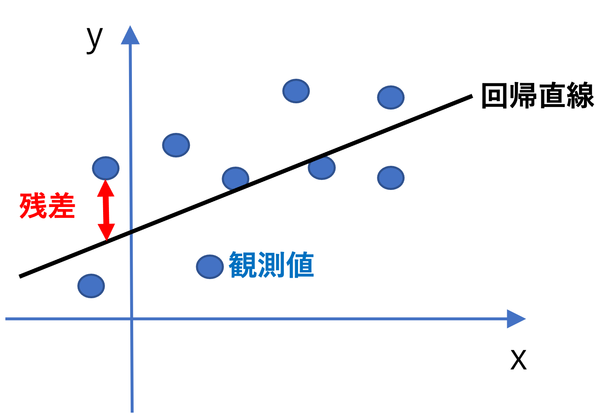
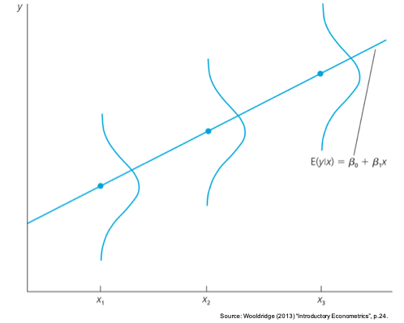
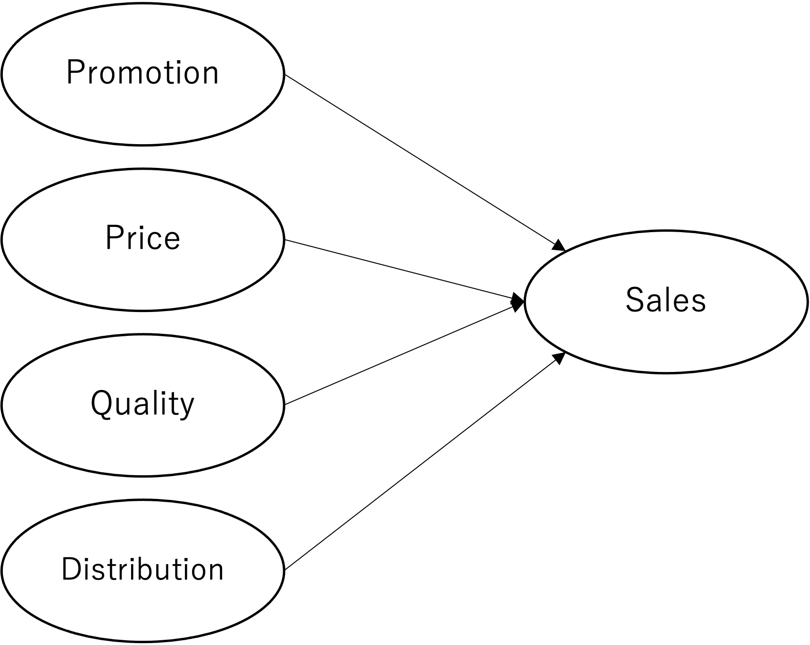
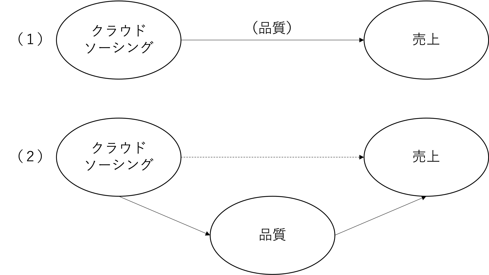

# 回帰分析{#regintro}
本章では、変数間の関係を捉える回帰分析について、そのモデルの基礎と統計的推測に基づく解釈を説明する。回帰分析結果から得られる含意は、「予測」と「検証」の二つに大別することができる。その上で特に本書では、「検証」という側面、特に「研究上関心のある説明変数の係数の解釈」を重視する立場を取る。立場が異なれば、回帰分析上何を重視するかという観点も異なるため、特に回帰分析による予測に関心のある読者においては別の図書を参照してほしい。

なお、本節では、`MktRes_firmdata.xlsx`という企業データを用いた分析を行う。次節に移る前に以下の要領でデータを読み込んでほしい。

```{r dataxlsx}
firmdata <- readxl::read_xlsx("data/MktRes_firmdata.xlsx")
```


このデータは、小売・サービス分野の企業約160社（企業数は年によって異なる）に関する2010年から2019年までの財務データである（計1440件）。このデータは、日本生産性本部における顧客満足度調査の対象になっている企業リストを作成し、その企業の中から金融領域の企業や、データを入手できなかった一部の企業を教育的意図から排除したものである。したがって、日本の小売・サービス分野において全国的に知名度のある代表的な企業の財務データ（の一部）だと考えられる。

なお、本データには以下の変数が含まれており、データ内の単位は従業員数（人）を除き百万円である。

- fyear: 決算年
- legalname: 企業名
- ind_en: 日経業種名（英文）
- parent:親会社名（もしあれば）
- fiscal_month: 決算月
- current_liability: 流動負債
- ltloans: 長期借入金
- total_liability: 負債合計
- current_assets: 流動資産
- ppent: 有形固定資産
- total_assets: 資産合計
- net_assets_per_capital: 純資産合計／資本合計
- sales: 売上高
- sga: 販売費及び一般管理費
- operating_profit: 営業利益
- net_profit: 当期純利益
- pnet_profit: 親会社株主に帰属する当期純利益（連結）／当期利益（単独）
- re: 利益剰余金
- adv: 広告・宣伝費
- labor_cost: 人件費
- rd: 研究開発費
- other_sg: その他販売費及び一般管理費
- emp: 期末従業員数
- temp: 平均臨時従業員数
- tempratio: temp/(emp+temp)
- indgrowth: 産業成長率
- adint: 広告集中率（adv/sales）
- rdint: 研究集中率（rd/sales）
- mkexp:  (sga - rd) / sales
- op: operating_profit / sales
- roa: pnet_profit / total_assets 

本データセットは、複数年にわたる複数サンプルからのデータであり、一般的にこのような構造のデータをパネルデータという。パネルデータの分析は本講義の範囲外なので、本章では主に、2019年のデータ抽出し、クロスセクショナルデータとして用いる。以下の様に全データから2019年の情報を抽出してほしい。

```{r data2019}
library(tidyverse)

firmdata19 <- firmdata %>% 
  filter(fyear == 2019)
```

データを用いた分析を行う場合、取得したデータの記述統計や分布を確認する必要がある。本来であれば研究上重要な変数を対象にデータの特徴を整理するが、ここでは複数の変数の特徴を一括で整理、図示化する方法を提示する。この方法では、`GGally`というパッケージの`ggpairs()`という関数を用いるため、以下のようにパッケージをダウンロードしてほしい。
```{r GGally, eval = FALSE}
install.packages("GGally")
```

`firmdata19` データセットから、例として四つの変数を抽出して、ggpairsを実行する。これにより、各変数のヒストグラム（密度形式）と、それぞれの変数間の相関係数と散布図が同図内で示されている。また、`ggpairs()`内の引数設定によって様々な図示形式を指定できるため、興味のある人は調べてみてほしい。

```{r ggpairs, message=FALSE}
firmdata19 %>% 
  select(sales, mkexp, emp, operating_profit) %>% 
GGally::ggpairs()+ labs(title = "ggpairs example")
```

なお、記述統計については既出の `summary()`関数にデータフレームを指定することで、データセット全体の記述統計を出力する。ここでは例として先程と同じ変数の記述統計を以下のように出力してみる。
```{r summary}
ds1 <- firmdata19 %>% 
  select(sales, mkexp, emp, operating_profit) %>% 
  summary()
knitr::kable(ds1, align = "cccc")
```

## 回帰モデル概要
本章では、二変数間の関係について「予測」と「検証」の二点からより深掘りしていく方法を紹介する。マーケティングを実行する企業の立場に立てば、マーケティングに関連する方策や投資を導入することで成果（売上や利益）を向上させたいと考えるだろう。しかしながら、マーケティングの施策により得られる成果や、そのために投入される労働力、金銭、時間などの資源は、採用する施策案により異なる。そのため、企業も闇雲に意思決定を行うわけには行かず、その意思決定によって、どの程度の成果の向上を見込めるかの予測ができると良い。最も基本的な予測の形式は、ある説明変数（先行要因）が被説明変数（成果）に対してどのような影響を与えるのかを特定し、それに基づき予測値を算出するという方法である。

二変数間の関係を捉える分析手法として6章では相関係数を紹介した。相関係数は二変数間の線形関係を表す -1から 1 の値を取る指標である。 しかしながら、相関係数は線形関係の強さ（どれだけデータが直線上に近く分布しているか）を表しているものの、示されている直線の切片や傾きといった線形関数の特徴は捉えられない。例えば、下図の二つのデータは異なる切片と傾きを有しているが、相関係数は等しくなるはずである。

{width=70%}

ここで、二つの異なる変数 $y,~x$ の関係を $\small y=f(x)$ のように$y$を$x$の関数（$f(x)$）で示すというアイディアで分析を行う。このとき $y$ を「被説明変数（Explained variable）もしくは従属変数（dependent variable）」、$x$ を「説明変数（Explaining variable）もしくは独立変数（independent variable）」という。そして、被説明変数と説明変数の関係を特定化した式のことを一般的に回帰モデルという。最も基本的な関数型の特定方法は以下のような一次関数による特定化である。

$$
y=\beta_0+\beta_1x
$$
このとき、$\small \beta_0$ は切片、$\small \beta_1$ は傾きを表す係数であり、回帰係数と呼ばれる。


回帰モデルは線形の関係を捉えているものの、実際にデータを入手し散布図を作成すると、以下のように、直線とは異なる結果を得る。そのため、上記のモデルは正確な表現でないことがわかる。

```{r scatterplot, echo=FALSE, message=FALSE}
rho <- 0.6
set.seed(1)
x <- rnorm(n=300,mean=0,sd=3)
e1 <- rnorm(n=300,mean=0,sd=3)
y <- sqrt(rho)*x+sqrt(1-rho)*e1
datap1 <- data.frame(cbind(x,y))
p <- ggplot(data = datap1, mapping = aes(x=x,y=y))
sc1 <- p + geom_point() + labs(x = "x", y = "y", title = "Scatter plot example")
sc1
```


分析者がデータとして得る情報は、$y$ や $x$ の実現値であり、回帰モデルの切片や傾きの値は直接はわからない。そこで、モデルで捉えた直線と実現値のズレを考え、得たデータから回帰モデルのパラメータ（係数）を推定するという方針をとる。モデルで捉えた直線による（係数の推定値に基づく）$y$ と$x$ の関係は、$\small x=x_i$ のとき、$y_i$ の予測値である$\small \hat{y}_i$（ワイハット）と、係数の推定値 $\small \hat{\beta}_0$、 $\small \hat{\beta}_1$ を用いて以下のように定義できる。

$$
\hat{y}_i=\hat{\beta}_0+ \hat{\beta}_1 x_i
$$

係数の推定値 $\small \hat{\beta}_0$ と $\small \hat{\beta}_1$ を求めるための計算方法は、（最尤法や積率法など）いくつかあるものの、本書では最小二乗法（Ordinary least square: OLS）という方法に着目し紹介する。OLS推定量（OLS Estimator: OLSE）の求め方の直感は、以下の図の通り、観測値と回帰直線間の距離の合計（残差平方和）を最小にするように計算される。

{width=70%}


予測値のモデルで示されているのは、データを分析した結果求めたOLSEに基づく説明変数 $x_i$ と、$\small \hat{y}_i$ との関係である。$\small \hat{y}_i$ は被説明変数 $y_i$ の「予測値（predicted value）」や「理論値（fitted value）」と呼ばれるものであり、$y_i$ の観測値とは異なる値であることに注意が必要である。このとき、観測値と予測値のズレ（$\small y_i-\hat{y}_i$）を「残差（residual）」という。OLSは残差を $\hat{u}_i$ とし、以下で示される、残差平方和（二乗和）を最小にするように推定量を求める方法である。なお、OLSEの計算仮定については、秋山（2018）が詳しく説明をしてくれている。

$$
\sum_{i=1}^n\hat{u}_i^2=\sum_{i=1}^n(y_i-\hat{y}_i)^2=\sum_{i=1}^n\left(\hat{y}_i-(\hat{\beta}_0+ \hat{\beta}_1 x_i)\right)^2
$$
これを解くと、以下のような推定量を得る。
$$
\hat{\beta}_0=\bar{y}-\hat{\beta}_1\bar{x}
$$

$$
\hat{\beta}_1=\frac{\sum_{i=1}^n(x_i-\bar{x})(y_i-\bar{y})}{\sum_{i=1}^n(x_i-\bar{x})^2}
$$

Rによる回帰分析は、`lm()`という関数（linear model）を用いて簡単に実行できる。この関数内では、`lm(y ~ x, data = df)` という要領で、説明変数と被説明変数を $\sim$（チルダ）で繋いでモデルを指定する。例えば、先程の企業データにおける2019年の観測を用いて、従業員数と売上高の関係について分析するためには、以下のように分析を実行する。

```{r reg1}
reg1 <- lm(sales ~ emp, data = firmdata19)
coef(reg1)
```


分析の結果、定数項（Intercept）は 22809.7 で、傾きは 58.1 であることがわかった。つまり、従業員数を一単位増やすと、売上高が58.1（百万円）増えることを示唆している。仮に従業員数が10人であれば、売上高の「予測値」は以下のように計算できる。

$$
22809.7+58.1\times 10=23390.7
$$

回帰分析によって被説明変数の予測値を計算が可能なことを説明したが、この予測値は実際の観測値とは異なる。では、ここで求められた予測値はどのように解釈できるものなのだろうか。それを理解するために、残差と予測値に関する以下の四つの性質を紹介する。

1. 残差の和は0：

$$
\sum_{i=1}^n\hat{u}_i=0
$$

2. 残差と説明変数の積和は0：

$$
\sum_{i=1}^n　x_i\hat{u}_i=0
$$

  - 1と2より：

$$
\sum_{i=1}^n　\hat{y}_i\hat{u}_i=0
$$

3. 予測値の平均と観測値の平均は等しい:

$$
\bar{y}=\bar{\hat{y}}
$$

4. 回帰直線は（$\bar{x}, \bar{y}$）の座標を通る:

$$
\bar{y}=\hat{\beta}_0+\hat{\beta}_1\bar{x}
$$
つまりOLSでは、回帰直線と各観測値のプラス方向のズレとマイナス方向のズレが釣り合う（残差の和が0）ような予測を行っている。その上で、予測値は、説明変数 $x$ が与えられたとき、被説明変数が「平均的に」どんな値を取るのかを示していると解釈できる。回帰モデルと平均との関係については次節で確率的側面からより詳しく説明を加える。

回帰分析による予測による精度を調べるために、分析したモデルがどの程度被説名変数全体の分散を説明しているかという指標によってモデルの適合度を測る。一般的には、決定係数（$\small R^2$）という指標によってモデル適合度が示される。$\small R^2$ は以下のように定義される。

$$
R^2=1-\frac{\sum(y_i-\hat{y}_i)^2}{\sum(y_i-\bar{y})^2}=\frac{\sum(\hat{y}_i-\bar{y})^2}{\sum(y_i-\bar{y})^2}
$$

この指標は、被説明変数の分散を説明変数がどの程度説明するかの割合を表しており、0以上1以下の値を取る。例えば $\small R^2$ が0.80であるならば、被説名変数の変動の80%をモデルが説明しているということになる。そのため、$\small R^2$ は、回帰モデルの説明力として解釈される。しかしながら、予測という目的に対して近年は、機械学習などの発展的な手法が応用される事が多く、$\small R^2$ を軸に予測を行うことは少なくなってきている。

また、予測ではなく説明変数の効果（係数）についての検証や解釈に関心がある場合、回帰分析における $\small R^2$ の重要性は低くなる。特に、ビジネス分野における研究では、係数の推定や検定に焦点をあわせることが多い。本書においても、予測よりも係数に関する検証を重視する立場を取る。社会科学領域での分析では、$\small R^2$ が低くなることは珍しくない。そんな中で、「$\small R^2$ が低いからその回帰分析結果は意味がない」ということにはならない。研究者の目的が、関心のある変数同士（例、市場志向と企業成果）の関係性（有意性や影響の強さ）を検証したいというものである場合、仮に $\small R^2$ が低くても、きちんと両変数の関係を分析できる調査設計や分析を実行しているならば、その検証は有意義なものになる。つまりここで強調したいのは、係数の検証や解釈を重視して研究を行う場合、「$\small R^2$ がいくつ以上（以下）だから良い（ダメ）」という議論は目的と整合的ではなく、重要ではなくなるということである。
本節では、OLSを中心にデータから回帰係数を推定するプロセスに目を向け、予測値と決定係数について紹介した。しかしながら、先述の通り我々は多くの場合特定の変数が成果変数に与える影響の検証に関心がある。次節では確率的な視点から理論的に回帰分析を理解する事により、回帰分析の結果の解釈についてより詳しく学ぶ。

## 回帰分析における推定と検定
回帰分析によって係数を推定すると、それが真の（母集団での）値であると勘違いしてしまう人もいる。しかし、分析の結果傾きの係数が正の値だったとしても、母集団においては0と相違がないかもしれない。したがって、説明変数が被説明変数に与える影響を検証するためには回帰係数を計算するだけでは不十分であり、区間推定や検定を行う必要がある。そこで本節では回帰分析に関わる理論的な説明を行う。以下は、我々の着目する回帰モデルである。

$$
y_i = \beta_0+\beta_1x_i+u_i,
$$
ただし、$\small u_i$ は誤差項、$\small \beta_0$切片、$\small \beta_1$は傾きのパラメータである。つまり、このモデルは母集団での統計的特徴を反映した理論的モデルだと理解できる。なお、通常レポートや論文内に回帰モデルを記載する際には、上記のような回帰パラメータと誤差項を含んだ理論モデルを用いる。理論的なモデルは $\small y$ を説明する要素として確率的な誤差項 $u$ を含んでおり、被説明変数 $\small y$ は確率変数として捉えられる。一方で、説明変数 $\small x$ は、定数として扱う。また、前節で紹介した回帰係数の推定量（OLSE）は、 $\small y$ や $\small \bar{y}$ を含んでいる ため、推定量（OLSE）もまた確率変数であると考えられる。

```{r plotLine, echo=FALSE}
sc2 <- p + geom_point() + geom_abline() + labs(x = "x", y = "y", title = "Plot and regression line")
sc2
```

$y$ の値が確率的にバラつくと考え誤差項を含んでいるのだとしたら、回帰直線は何を表しているのだろうか。理論的には、ある $x$ の値が与えられたとき、$y$ の「平均値（期待値）」と $x$ の間には線形の関係があることを捉えている。より具体的には、回帰直線は以下のように $x$ を所与とした際の $y$ の条件付き期待値として表される。

$$
E(y|x)=\beta_0+\beta_1x
$$
この関係は、以下の図のように示すことができる（Wooldridge, 2013）。


{width=70%}


したがって、回帰モデルは、ある $x$ の値に基づき $y$ の期待値（平均）示してくれるが、具体的にどのような値を取るかは確率的に決まるものだと言える。つまり、回帰分析の結果によって言えることは、例えば、「身長（$x$）の高い人は、$\color{red}{\text{平均的に}}$重い（$y$）」ということである。

なお、モデル化に際して誤差項について以下のようないくつかの仮定が存在する。なお、5つめの仮定は回帰係数の検定の際に用いられる。

1. $E(u)=0$
2. $E(u|x)=0$
3. $Var(u)=E(u^2)=\sigma^2$
4. $Cov(u,x)=E(xu)=0$
5. $u$ は正規分布に従う

このような仮定に従うOLSEは、以下の統計的性質を持つ。

- 不偏性:
  - $E(\hat{\beta})=\beta$

- 漸近的性質:
  - $\hat{\beta}$ は、サンプルサイズ $n$ が十分大きいときには正規分布 $N(\beta,~se(\hat{\beta})^2)$ に従う（$se(\hat{\beta}$)は、OLSEの標準誤差）。

先述の通り、推定されたOLSEは、モデルの真の値ではない。そのため、仮に分析の結果得た推定値が正の値であっても、母数においては0と大差がないかもしれない。そのため、統計的検定や推測を用いて、未知パラメータに対する検討を行う。なお、Rで回帰係数の検定結果を得るのは非常に簡単である。 `lm()` 関数の実行結果をストアしたオブジェクトに対して、`summary()` 関数を実行することで統計的検定結果を得ることができる。先程分析した `reg1` を再度利用すると、以下のような結果を得る。

```{r regtest}
summary(reg1)
```

回帰係数の推定と検定に関する結果は `Coefficients:` の下に記載されている。推定・検定結果は行列形式で表示されており、`Estimate` の列は回帰係数の推定結果、`Std. Error` は標準誤差（詳細は省略するが、誤差項の分散推定量の平方根）、 `t value`はt値、 `Pr(>|t|)`はp-value をそれぞれ示している。そして、出力結果下欄には決定係数（`R-squared`）や自由度調整済み決定係数（`Adjusted R-squared`）、F検定結果、といったモデル適合度に関する結果が提示されている（詳しくは次節で説明する）。


上記の結果を解釈するために、回帰分析における検定について説明する。ソフトウェアで自動的に出力される統計的仮説検定は、基本的には以下の帰無仮説と対立仮説を採用したものである（添字は省略）。
$$
H_0:\beta=0,~~H_1:\beta\neq0
$$
なお、R以外のソフトウェアを用いて回帰分析を実行しても係数に関する検定結果を返すが、通常はこの帰無仮説を採用した検定結果を出力する。

検定では、以下のような検定統計量を用いる。

$$
t=\frac{\hat{\beta}-\beta}{se(\hat{\beta})}
$$

$H_0$ が正しいと仮定する（$\small \beta=0$）と、検定統計量 *t* は計算可能であり、自由度（$\small n-2$）のt分布に従う。検定の手順は 7.8 節で紹介したのと同様、有意確率に基づく臨界値を定めた後、t 値を計算し、棄却域と採択域のどちらに入るのかを確認する。

$$
\begin{cases}
|t|>t_{\alpha/2}(n-2) & \Rightarrow \text{H0を棄却する。}\\
|t|\leq t_{\alpha/2}(n-2)& \Rightarrow \text{H0を採択する。}
\end{cases}
$$

これを踏まえて分析結果を確認すると、`emp` が `sales` に与える影響（係数: 58.132）は有意に0とは異なると理解できる。また、切片の係数（Intercept）は大きな値を取っているが、統計的には0ではないとは言えないことが示されている。この項は、従業員数が0のときの企業の売上を示しており、この結果が統計的に有意ではないということは、我々の直感とも整合的である。

上記の検定によって、どうやら `emp` の係数は0ではなさそうだということが伺えた。しかし、具体的にどのような値を取るのだろうか。おおよその値だけでも把握したいのが人情である。そこで、信頼区間を求め、おおよその確率（95%など）で真のパラメータが含まれている区間を確認したい。OLSEの漸近的性質と中心極限定理により、サンプルサイズが十分に大きいとき、先述の統計量 *t* は標準正規分布にに近づく（西山ほか,2019）。

そのため、7.6節で紹介した、標準正規分布に基づく信頼区間の推定を応用できる。信頼係数を $\small \alpha$ とすると、以下の確率と区間の対応関係を得る。

$$
P\left(\left|\frac{\hat{\beta}-\beta}{se(\hat{\beta})}\right|\leq z_{\alpha/2}\right)=1-\alpha
$$

そして、上記を $\small \beta$ に関する不等式に変換すると、以下の信頼区間を得る。

$$
P(\hat{\beta}-se(\hat{\beta})\cdot z_{\alpha/2}\leq\beta\leq\hat{\beta}+se(\hat{\beta})\cdot z_{\alpha/2})=1-\alpha
$$

したがって、$\small [\hat{\beta}\pm se(\hat{\beta})\cdot z_{\alpha/2}]$ という観察可能な情報によって信頼区間推定できる。Rによって信頼区間を得るには、回帰分析の結果に対して、`confint()` 関数を用いる（デフォルトで95%信頼係数が設定されている）。例えば、先程の `reg1`の結果を用いて、99%信頼区間を得ると、以下のような結果を得る。

```{r reg1confint}
confint(reg1,level = 0.99)
```

したがって、`emp` の99%信頼区間が [51.45, 64.81] であることがわかった。すなわち、企業の従業員が一名多いと、売上高が 51から64 百万円高くなりそうだと解釈できる。一方で、`(Intercept)` の信頼区間には0を含んでいることが伺える。なお、`confint()` 関数によって計算される信頼区間の計算では上述の通り正規分布が仮定されており、詳しくはヘルプ（`?confint`）で確認できる。

## 重回帰モデル1


ここまでは、回帰分析の概要や係数の検定・推定について説明した。回帰分析を実行することで得る情報は前節の内容がほとんどなのだが、モデルの特定化に関して、もう一つ重要な点が存在する。それが本節で扱う重回帰モデル（multiple regression model）の採用である。重回帰モデルとは、二つ以上の説明変数を含む回帰モデルのことである。一方で、前節で扱ったような説明変数が一つの回帰モデルのことを単回帰（simple regression model）という。回帰分析を用いた研究を行う際には、基本的に単回帰分析ではなく、重回帰分析を実行することが好ましい。通常の分析においては、ある被説明変数に対して考慮すべき説明変数は一つだけではなく、複数の説明変数を考慮すべき状況が多い。しかし、分析に不慣れ学生においては、複数の説明変数に関心がある場合であっても、複数の単回帰モデルを分析することで、それぞれの変数についての分析結果を得ようとすることが散見される（例えば、三つの説明変数の影響を捉えるために単回帰モデルを三本分析する等）。しかしながら本書は、基本的にはこのような分析アプローチは好ましくなく、複数の説明変数を含めた一本の重回帰分析を実施すべきだと主張する。本節では、この主張の理由と、重回帰モデルの特徴・結果解釈について説明していく。

### 重回帰モデル概要

ある成果変数を説明するために、複数の説明変数が必要になることは、マーケティングリサーチにおいても珍しいことではない。例えば、ある製品のパフォーマンスを月次売上高で測るとする。マーケティング部門として、売上高に対してプロモーション施策がどれだけ貢献しているかを分析する際、プロモーションと売上高の関係を回帰分析で捉えるというアプローチが実現可能な分析方法として考えられる。しかしながら、売上高を説明する変数として、プロモーションだけで十分だろうか。マーケティング変数に着目するだけでも、価格や製品品質、流通網など、異なる変数が売上に関係していることが考えられる。例えば、一見プロモーションによる効果のような結果を得たとしても、実際には同時期に実行していたディスカウント（価格）の影響であり、プロモーションそのものにはあまり効果がないかもしれない。そのため、他の要素の影響を排除した上での純粋なプロモーション効果を明らかにすることは務的有意義な研究課題となりうる。そしてこのような研究課題に対応する分析方法が、重回帰分析である。本節ではまず、重回帰モデルに関する特徴を整理する。

{width=70%}

重回帰分析においても単回帰同様、回帰モデルを記述する。*k* 個の説明変数を含む重回帰モデルは、以下のように示される。

$$
y_i = \beta_0+\beta_1x_{1i}+\beta_2x_{2i}+...+\beta_kx_{ki}+u_i
$$

論文やレポート内に重回帰モデルを記載する際にも、多くの場合上記の誤差項を含む理論モデルを用いる。

以下ではまず、重回帰モデルの係数、予測値や、残差に関する性質について説明する。係数の推定は、以下のような行列モデルで捉えることで、単回帰モデルと同様OLSで求められることができる（詳細は省略）。

$$
Y = X'\beta + u
$$

$$
\hat{\beta}=(X'X)^{-1}X'Y
$$
重回帰分析を実行すると、各説明変数に対応する係数が推定される。各OLSE（$\small \hat{\beta}$）は 未知パラメータ（$\small \beta$）の不偏推定量である。また、それらの検定や区間推定では、各変数に対応する係数の検定・推定を個別に行う。OLS推定に関わる残差と予測値はそれぞれ以下のように意義される。

- 予測値: 
$$
\hat{y}_i = \hat{\beta}_0+\hat{\beta}_1x_{1i}+\hat{\beta}_2x_{2i}+...+\hat{\beta}_kx_{ki}
$$

- 残差:
$$
\hat{u}_i=y_i-\hat{y}_i =y-( \hat{\beta}_0+\hat{\beta}_1x_{1i}+\hat{\beta}_2x_{2i}+...+\hat{\beta}_kx_{ki})
$$
そして、残差は以下の $k+1$ 個の制約を満たす。

- $\sum_{i=1}^n\hat{u}_i=0$
- $\sum_{i=1}^n x_{1i}\hat{u}_i=0,~\sum_{i=1}^nx_{2i}\hat{u}_i=0...,~\sum_{i=1}^nx_{ki}\hat{u}_i=0$

そのため、重回帰モデルの残差の自由度は $n-(k+1)$ となる。

### 重回帰分析におけるモデル適合度

単回帰モデルにおけるモデル適合度指標として前節では決定係数を紹介した。しかしながら、この指標は致命的な欠陥を有している。それは、モデルに含む説明変数の数が増えると決定係数も上昇する（より正確には、説明変数の数に対して非減少）ということである。つまり、被説名変数と全く関係ない変数をモデルに加えても、決定係数は上昇し、そのモデルの説明力が高いという結論に至ってしまう。そのため、通常の決定係数から説名変数の数を調整した指標である調整済み決定係数（Adjusted R-squared: $\bar{R}^2$）を用いて適合度を検討する。この指標は、以下のように定義される。

$$
\bar{R}^2= 1 - \left(\frac{\sum(y_i-\hat{y}_i)}{n-k-1}\cdot \frac{n-1}{\sum(y_i-\bar{y})}\right)
$$

モデルの適合度を考えるもう一つの分析として、Rの分析結果で出力されていたF検定について説明する。回帰分析の結果として必ず出力されるF検定は、重回帰モデルにおける$\small \beta_0$（定数項） 以外の係数が全て0であるか否かをチェックする検定である。この検定では、k個の説明変数を含む回帰モデル（$\small y_i = \beta_0+\beta_1x_{1i}+\beta_2x_{2i}+...+\beta_kx_{ki}+u_i$）に対して（これをフルモデルと呼ぶ）、以下のような帰無仮説と対立仮説を用いた検定を行う。

$$
H_0:~\beta_1=...=\beta_k=0,~H_1:\text{少なくともどれか一つの係数は0ではない}
$$
帰無仮説が正しいと仮定した場合、重回帰モデルは以下のようになり、この定数項のみのモデルをモデル0と呼ぶ。

$$
y_i = \beta_0+e_i
$$

そして、フルモデルとモデル0の残差平方和の比を取った統計量は、帰無仮説が正しいときには自由度（$k,~n-k-1$）の F分布に従うことが知られている。この性質を活かし、回帰分析においては自由度（$k,~n-k-1$）のF分布を前提とした統計検定を行い、それをF検定（F-test）と呼ぶ。回帰分析結果にて出力される `F-statistic:`は、この検定統計量の実現値である。なお、この検定の検定統計量は、以下のように示される。

フルモデルとモデル0の残差平方和（$SSR_1$と$SSR_0$）をそれぞれ以下のように定義する。

- $SSR_1=\sum\hat{u}^2_i=\sum\left[y-( \hat{\beta}_0+\hat{\beta}_1x_{1i}+\hat{\beta}_2x_{2i}+...+\hat{\beta}_kx_{ki})\right]^2$

- $SSR_0=\sum\hat{e}^2_i=\sum(y_i-\bar{y})^2$

そして、以下の統計量 *F* は帰無仮説が正しければ、自由度（$k,~n-k-1$）の F分布に従うことが知られているため、これを検定統計量として用いて検定を行う。

$$
F=\frac{(SSR_0-SSR_1)/k}{SSR_1/(n-k-1)}=\frac{SSR_0-SSR_1}{SSR_1}\cdot\frac{n-k-1}{k}
$$

## 重回帰モデル2

### 回帰係数の解釈
ここからは、重回帰分析の係数の解釈について説明する。ここで説明する解釈は、なぜ基本的には重回帰モデルを採用すべきなのか、を理解するために重要な内容である。結論から述べると、重回帰分析における説明変数の係数は、同モデル内の「他の変数の効果をコントロールしたうえで」説明変数が被説明変数へ与える影響を表している。そして重回帰分析のこの特徴が、学術的にも実務的にも重要な含意を与えうる分析手法として機能する。

重回帰モデルにおける各説明変数の係数は、パーシャル効果として解釈できる。以下では、このパーシャル効果の直感について、Wooldridge（2013）を参考に説明する。まず、以下のような説明変数が二個である重回帰モデルを考える。

$$
y_i=\beta_0+\beta_1x_{1i}+\beta_2x_{2i}+u
$$
そして、上モデルの予測値は以下のように示すことができる。

$$
\hat{y}_i=\hat{\beta}_0+\hat{\beta}_1x_{1i}+\hat{\beta}_2x_{2i}
$$

このとき、説明変数 $\small x_1$ と $\small x_2$ の変化を $\small \Delta x_{1i}$ と $\small \Delta x_{2i}$ とすると、予測値の変化（$\small \Delta \hat{y}$）は以下のように表すことができる。

$$
\Delta\hat{y}_i=\hat{\beta}_1\Delta x_{1i}+\hat{\beta}_2\Delta x_{2i}
$$

ここで、$\small x_2$ を固定（$\small \Delta x_{2i}=0$）すると、以下を得る。

$$
\Delta\hat{y}_i=\hat{\beta}_1\Delta x_{1i}
$$
つまり、重回帰モデルにおける $\hat{\beta}_1$ は、別の説明変数をコントロール（$\small \Delta x_{2i}=0$）した上で、$\small x_1$ が $\small \hat{y}$ に与える影響（$\small x_1$ が変化した際の $\small \hat{y}$の変化の程度）を捉えていると解釈できる。また、$\small \hat{\beta}_2$ についても同様に解釈できる。そしてこの特徴は、*k*個の説明変数を用いたモデルにも同様に適応できる。なお、パーシャル効果に関するもう少し詳細な説明は本書では割愛する。

では、このパーシャル効果という重回帰モデルの特徴は、どのように応用できるのだろうか。多くの実証研究では、重回帰モデルの特徴を利用し、「コントロール変数」を用いた分析を行っている。本節では、先程の企業データを用いて、「企業の広告支出が営業利益に与える影響を明らかにする」という問いを考える。まずは、学習的意図から以下のように単回帰分析を実施してみる（通常の論文・レポートであればこのようなプロセスを記載する必要はない）。

```{r Regprofit}
reg2 <- lm(operating_profit ~ adv, data = firmdata19)
summary(reg2)
confint(reg2)
```

分析の結果、広告支出（`adv`）の係数は正に有意であり、その95%信頼区間は [0.83, 1.68] であることが確認できた（8.325719e-01は0.8325719）。

しかしながら、このモデル化は不十分であり他の要素も考慮すべきである。営業利益に影響を与えうる要因は色々とあり
、実際の研究においては先行研究を参照しつつ、コントロールすべき変数を含める形で回帰モデルを特定する必要がある。しかしながら、ここでは便宜上いくつかの要因にのみ焦点を合わせて簡単に特定化する。本データは主に小売・サービス産業の企業に焦点を合わせている。そのため、対人サービス水準は企業のパフォーマンスに影響を与えうる要因である。そのため、従業員に関する変数（従業員数: emp、パートタイム従業員数: temp）と人件費（labor_cost）をモデルに含める。また、資産合計（total_assets）、研究開発費（rd）もモデルに含める。今回の回帰モデルは以下のように示される。

$$
\text{opretating_profit}_i = \beta_0 + \beta_1 adv_i + \beta_2emp_i+\beta_3temp_i+\beta_4\text{labor_cost}_i+\beta_5\text{total_assets}_i+\beta_6rd_i+u_i
$$
Rにおいて重回帰分析を実行するのは簡単である。`lm(y ~ x1 + x2 + x3)` のように $+$ 記号と変数を追加すれば、重回帰モデルとして分析を実行してくれる。

```{r Regprofit2}
reg3 <- lm(operating_profit ~ adv + temp + emp + labor_cost + total_assets + rd, data = firmdata19)
summary(reg3)
confint(reg3)
```

見ての通り、結果の出力方式も単回帰分析のものとほぼ同様である。回帰係数の結果下にあるモデル適合度については前のサブセクションを参照して欲しい。

分析の結果、広告支出の係数は「負」に有意であり、その信頼区間も [-2.01, -0.84] であった。したがって、本データの分析によると、労働や資産に加え研究開発といった側面を一定とすると、広告支出は営業利益に負の影響を与えることがわかった。他の変数に着目すると、従業員数に関する変数はどちらも負に有意であった。一方で、人件費と総資産、研究開発費は正に有意な影響を与えることが示された。これらの結果から、単純に従業員数を増やしても営業利益には負の影響を与える一方で、従業員数を一定とした上で人件費を上げるほうが営業利益が高いことが示された。また、資産や研究開発費も営業利益につながることが示された。

このように、重回帰モデルを採用し複数の説明変数を含めることで、各係数の持つ含意が大きく変わることに注意して欲しい。また、`reg2` と `reg3`の比較のように、特定の説明変数に対応する係数の符号が変わることも珍しくない。そのため、回帰モデルの定式化には非常に慎重になる必要があり、先述の通り、先行研究を参照して必要な変数をコントロールすることが求められる。

また、これらの結果を踏まえて、3.1節で強調した「マネジメントとリサーチの分離」の重要性を思い出して欲しい。あなたが `reg2` と `reg3`の分析を実施したリサーチャーであり、本リサーチのクライアントがマーケティング・広告部門の部長だっとしよう。そして、（1）あなた自身もマーケティング部門の社員であり、クライアントは直属の上司、（2）あなた自身はクライアントとは無関係の立場、という二つの異なる立場に立っている状況を想像して欲しい。（1）の場合、逆恨みによるあなた自身への不利益を恐れて重回帰分析の結果を「ありのまま」伝えられないかもしれない。もちろん研究倫理に基づけば、都合の良い研究成果を作為的に発表することは問題であり、そのようなことはすべきではない。したがって研究成果を「ありのまま」を伝えるべきであり、都合のいい結果を発表する決断をした人（リサーチャー）が悪い。しかしながら、その背後にある利害関係を鑑みれば、`reg2`
の結果を報告したくなる人がいることも理解できる。個人の判断を批判するだけでなく、このような研究不正を働く誘因や構造についても考慮すべきである。例えば、上記のようなリサーチャーをとりまく利害関係には気をつけなければならない。なお、定量的な分析に慣れている研究者からすると、特別な理由がないにも関わらず重回帰でなく単回帰分析を用いるのは不自然な分析アプローチである。そのため、 もし調査・分析の設計上意図的に単回帰分析を実施する場合には、その意図と有用性をきちんと説明すると良い。

### 重回帰モデルにおける変数選択

重回帰モデルでは、複数の説明変数を採用することができるため、どの変数をモデルに含めるべきかという点を考察しモデルを特定化する必要がある。このような説明変数の選択に関わる問題として、本サブセクションでは、欠落変数バイアス、多重共線性、過剰統制の三つを紹介する。まず、欠落変数バイアスについてだが、本来含めるべき変数を含めずにモデルを定式化し推定を行うと、推定された係数にバイアスが生じ、OLSEが不偏推定量でなくなるという問題が生じる。また、このバイアスの方向（正負）は欠落された変数と被説明変数との真の関係（欠落された変数が被説明変数に対して持つ母集団での回帰係数）と、モデルに含まれる説明変数と欠落変数との相関で決まる（Wooldridge, 2013）。以下で欠落変数バイアスについての簡単な説明を提示する。

はじめに、以下の式が正しいモデルだと仮定する。
$$
y=\beta_0+\beta_1x_1+\beta_2x_2+u
$$
これに対して$x_2$を含まずに欠落変数モデルを推定した場合、以下のような結果を得る。

$$
\tilde{y}=\tilde{\beta}_0+\tilde{\beta}_1x_1
$$
このとき、真のモデルの推定値（$\small \hat{\beta}_1$）と $\small \tilde{\beta}_1$ の間には、以下の関係がある。

$$
\tilde{\beta}_1=\hat{\beta}_1+\hat{\beta_2}\tilde{\delta_1}
$$
ただし、$\small \tilde{x}_2=\tilde{\delta}_0+\tilde{\delta}_1x_1$とする。つまり、$\small \tilde{\delta}_1$ は $\small x_1$ の $\small x_2$ に対する回帰係数の推定値である。したがって以下のように、欠落変数モデルでは推定結果に$\small \beta_2\tilde{\delta}_1$ の分だけバイアスが生じる。

$$
E(\tilde{\beta}_1|x_1,x_2)=E(\hat{\beta}_1)+E(\hat{\beta_2} \tilde{\delta_1})=\beta_1+\beta_2\tilde{\delta}_1
$$
そして、欠落変数によってバイアスが生じるということが、重回帰分析の重要性を主張する根拠となる。そのため、仮に研究課題上ではあまり重要でない変数であっても、自身の関心のある説明変数の影響を分析するためにコントロール変数をモデルに含めることが重要になる。

第二の論点として、単回帰分析の際には存在しなかった多重共線性（multicollinearity）という問題がある。これは説明変数同士の相関が高いことによる推定上の問題であり、Variance Inflation Factor という指標^[後述する $\small R^2_{j}$ を用いて、$VIF_j=1/(1-R^2_{j})$ と定義される。]を使ってその程度を測ることもある。また、マーケティング領域の研究においてはまれに「多重共線性があるから、説明変数を除外すべきだ」という主張を聞くことがある。しかしながら、本書はできる限り説明変数の除外を行わないほうが良いという立場を提示する。詳しくは後述するが、分析の対象となる説明変数によって極端にVIFが高くなる場合には、次の段落にあるようにその変数の意義を検討し、その変数をそのまま残す、何かで比を取る、対数化する（詳しくは次章）などの変数変換の工夫をしながら、その変数をモデルに含めるということが現実的かつ実践的な対応となる。なおこの立場は、本書が回帰分析における係数の検証や解釈に注視していることに大きく依存するため、注意してほしい。

多重共線性について語る際には、(1) 説明変数同士が完全に相関している（相関係数が 1 もしくは -1）場合と、(2) 完璧ではないが相関係数が高い場合、という二つの異なる状況を区別し理解する必要がある。まず一つ目の場合、そもそも係数の推定値が計算できないという問題が生じる。そのため、完璧に相関しあっている変数を同時にモデルに含めることは出来ず、変数の除外を考えないといけない。この問題は言い換えると「同じ変数を同モデル内に複数入れてはいけない」という制約だと理解できる（西山ほか, 2019）。では（2）の場合にはどのような問題が生じるのか。結論から述べると、説明変数同士の相関は、推定量の分散 $\small Var(\hat{\beta}_j)$ を高めてしまう（Wooldridge, 2013）。しかし、 $\small Var(\hat{\beta}_j)$ は、多重共線性だけでなく以下の三つの要素から影響を受ける。第一に、誤差項の真の分散（$\small \sigma^2$）、第二に独立変数間の相関^[より具体的には説明変数 $x_{ji}$を従属変数に、その他の全ての説明変数を独立変数として回帰分析をした際の決定係数 $R^2_j$、。なお、先述のVIFはこの$R^2_j$の関数である。]、第三に、独立変数の変動（$\small SST_j=\sum(x_{ji}-\bar{x}_j)^2$）である。第一と第二の指標が高い場合には、推定量の分散は大きくなる。一方で、第三の要素である$\small SST_j$ が高い場合には $\small Var(\hat{\beta}_j)$ は小さくなる。そのため、$\small Var(\hat{\beta}_j)$ を改善するためには、サンプルサイズを大きくし$\small SST_j$ を大きくすることも有用な対処方法となる。しかしながら、社会科学分野においてはデータ取得可能性の観点からそれが難しいことも多い。そのときには、推定量分散の増加と説明変数除外による弊害とのトレードオフを考慮して意思決定することになる。そのうえで本書は、先述の通りできる限り説明変数を除外することは避けるほうが良いという立場を取る。必要な説明変数を含めずに回帰分析を行うと、欠落変数バイアスの問題が生じる。また、もし分析における主な関心が、着目する説明変数 $\small x_{ji}$ の　$y_{i}$ への効果を検証・解釈することであり、かつそれをきちんと捉えるために他の説明変数の存在が必要なのであれば、VIFは無視して構わない（cf. Wooldridge, 2013）。そのため、「VIFが10以上^[慣習としてよく用いられる閾値]だから、多重共線性があり、変数を除外すべきだ」というような考えは、上記の研究上の関心に対しては恣意的であり有意義でないと考える。そもそも先述のように、VIFによって生じる問題は$\small Var(\hat{\beta}_j)$ の増加であるが、この分散は他の要素にも影響を受けるため、VIFが10以上だから必ず $\small Var(\hat{\beta}_j)$ が大きすぎて推定量が有用でないということはない。これらのことから、回帰モデルに含む変数選択は、VIFの値に依存して判断するよりも、分析モデルの意図や用いる変数の理論的・分析的意義について検討し決断されるべきものだと考える。

第三に過剰制御は、モデル内での係数解釈の変化を捉えた問題である。ここまでの説明では、欠落変数バイアスの議論を中心に、基本的には変数をモデルに含めることの重要性を説明してきた。しかしながら、重回帰分析の係数の解釈（パーシャル効果）を鑑みると、主要な説明変数の効果に関する理論的なメカニズムにおいて中間経路として機能する変数をモデルに含めることには注意が必要である。例えば、製品開発におけるクラウドソーシングという非専門家（一般消費者）の意見を製品開発に活用する戦略（e.g., Nishikawa et al., 2017）が製品の売上に与える影響を、製品レベルデータを用いて分析する場合を考える。その際、クラウドソーシングの有効性に関するメカニズムとして、実際の製品ユーザーである消費者の意見を反映することで、品質の高い製品を開発でき、結果として売上向上につながるというものを考えているとする。つまり、クラウドソーシングが売上に与える中間経路として、製品の品質が機能するというメカニズムを考えていることになる。しかしながら、売上を被説明変数とする回帰モデルを考える際に、製品品質も売上に影響を与えうる変数なので説明変数として回帰モデルに含めたいと考えるかもしれない。このような考えが、過剰制御の問題につながる。製品品質は、クラウドソーシングから売上への影響に関する中間経路として機能する変数であり、これをコントロールしてしまうことは、クラウドソーシングの係数の解釈を大きく変えてしまう。具体的には、このようなモデルでは、製品品質を一定とした上でクラウドソーシングが売上に与える影響を捉えることになってしまう。上記の関係は以下の図のように示される。

{width=70%}

製品品質以外のクラウドソーシングの効果が研究の関心と整合的であるならば、品質を含めた定式化で問題はない。しかしながら、重回帰モデルの変数選択では、自身が論じているメカニズムと係数解釈の整合性を保つように、中間経路変数を含めることで過剰制御の問題に陥っていないかを慎重に検討する必要がある。

重回帰モデルに含める変数の指針について、西山ほか（2019, p.186）は以下の表のように整理している。なお、本書においては主に欠落変数バイアスと係数の解釈という観点から変数選択に関する考え方を整理した。これは、研究上関心のある変数の効果（係数）について検証・解釈するという観点に基づく議論である。しかしながら、「予測」という側面に着目すれば推定や予測の精度を高める（誤差を小さくする）ことが重要になり、変数選択の基準も変わる。そうなれば、欠落変数による問題や係数の解釈の変化はあまり重要でなくなるかもしれない。このように、立場が変わることによって回帰モデルの特定化の基準も変化することを最後に付け加えておく。

```{r variablechoice, echo=FALSE, message=FALSE}
beta <- c("y に影響を直接与える", "y に影響を与えない")
cor <- c("必ず含める（欠落変数を防ぐ）","含めないほうが良い（ただし推定誤差は増えるがバイアスは増えない）")
mediate <- c("含めていけない（過剰制御）","左と同様")
nocor <- c("含めることで推定誤差は減る（含めなくてもバイアスは増えない）","左と同様")
tab_varchoice <- cbind(beta,cor,mediate,nocor)
colnames(tab_varchoice) <- c(" ", "x に影響を与える or x と同時決定", "x から影響を受ける", "x とは無相関")
knitr::kable(tab_varchoice, caption = "変数選択の指針", align = "cccc")

```


## 参考文献

秋山裕（2018）「Rによる計量経済学 第2版」，オーム社.

西山慶彦・新谷元嗣・川口大司・奥井亮（2019）「計量経済学」，有斐閣.

Nishikawa, H., Schreier, M., Fuchs, C., & Ogawa, S. (2017). The Value of Marketing Crowdsourced New Products as Such: Evidence from Two Randomized Field Experiments. *Journal of Marketing Research*, 54(4), 525-539.

Wooldridge, J. (2013) *Introductory Econometrics A Modern Approach*,Cengage Learning.