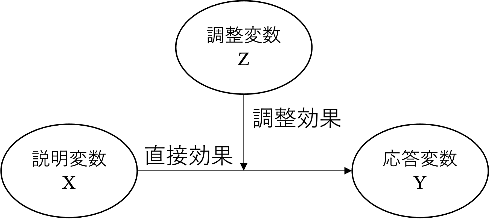
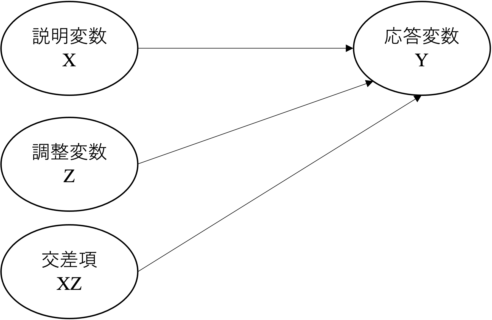
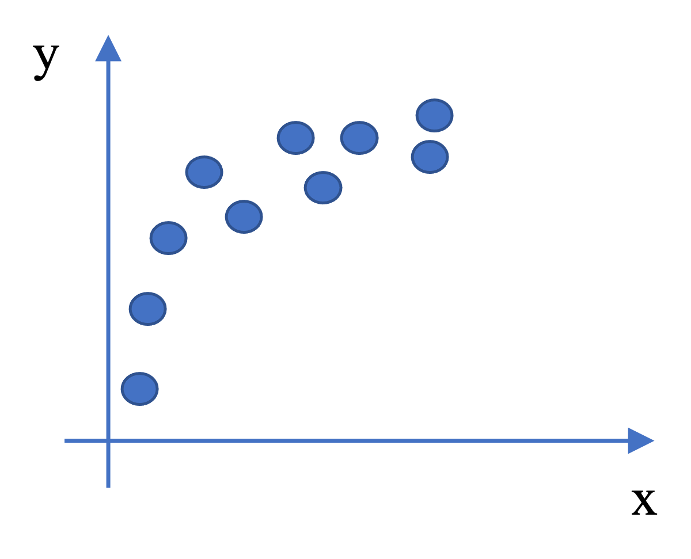
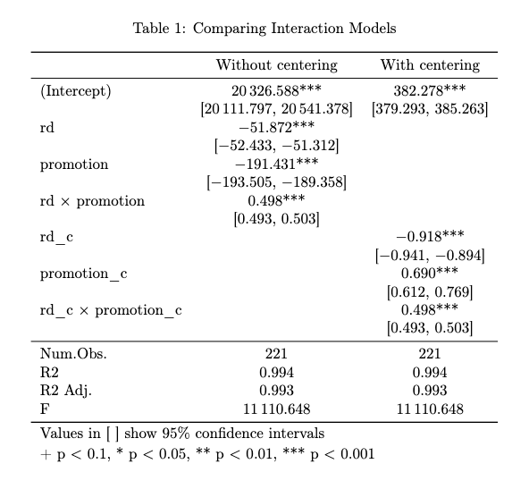
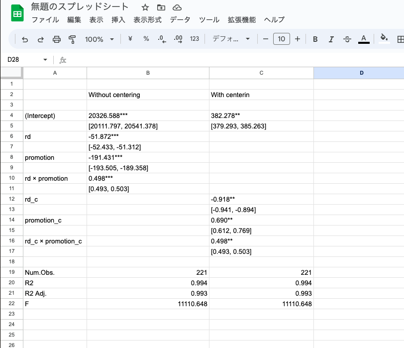

# 回帰分析上の工夫紹介{#regtechnic}

前章で説明した通り、回帰分析はビジネス領域におけるデータ分析手法として有力なものである。本章では、回帰分析を用いたマーケティング研究においてよく利用されるモデルの定式化や分析上の工夫について紹介する。具体的には、ダミー変数、交差項を用いた回帰モデル、対数線形モデル、について説明する。なお、章末にRを用いた分析結果表の作成方法も紹介しているので、参照してほしい。

## ダミー変数

本節では、説明変数としてカテゴリ変数を用いる場合の方法と、その結果の解釈について説明する。マーケティング領域の研究においては、あるカテゴリに属することが成果変数にどのような影響を与えるのかに関心を持つことも多い。そのような場合には、「ダミー変数」と呼ばれる形にカテゴリ変数を定義し、分析することが多い。ダミー変数とは、特定のカテゴリに属するならば1を、それ以外なら0を取るような変数を指す。例えば、女性ならば1、それ以外の性別であれば0を取るようなダミー変数を、「女性ダミー」として扱うことができる。ダミー変数 *D* を用いた回帰モデルは以下の様に表すことができる、

$$
y_i=\alpha+\beta x_i + \gamma D_i+u_i
$$
ただし、$x_i$ は連続尺度の説明変数である。ダミー変数は取りうる値が1か0に限定されているため、*y* の条件付期待値は以下のように解釈できる。

$$
E(y_i|D_i=1)=\alpha+\beta x_i + \gamma
$$

$$
E(y_i|D_i=0)=\alpha+\beta x_i 
$$

つまり、ダミー変数に対応する回帰係数はベースライン（$D_i=0$）グループとの「切片の差」を表しているということがわかる。例えば、$\small \alpha$、$\small \beta$と、$\small \gamma$が正の値を取るような場合、上記のダミー変数の関係は以下の図のように示す事ができる。例えば、このダミー変数が女性ダミーであるならば、女性はその他の性別に比べて、*y* の値が相対的に高い、と解釈できる。

{width=70%}

ダミー変数を説明変数に含む回帰分析をRで実行することはとても簡単である。`lm()` 関数内のモデル定義において、カテゴリ変数を含めば良いだけである。Characterという文字列情報のデータ型で示されているカテゴリ変数を用いると、自動でダミー変数化して、回帰分析を実行してくれる。

例えば、本章で使っている firmdata19 を使って分析を行ってみる。具体的には、営業利益率（営業利益/売上）が小売産業に属する企業とそれ以外で異なるかを分析する。しかし、データセット上にこの分類に対応するカテゴリー変数は存在しないため、以下のように、"Retail Stores, NEC" もしくは "Supermarket Chains" のどちらかに含まれる企業であれば1、それ以外であれば0を取るカテゴリー変数（`format`）を作成する。`%in%` は二つのベクトル間の要素の一致を確認するための演算子で、下記`mutate`コマンドでは、`ind_en` 列に書かれている情報が `retail` リストに「含まれる」か否かをチェックしている。そのため、以下コマンドでは、事前に作成した `retail` を参照し、`ind_en` で観察されるカテゴリーが `retail` に当てはまれば、`"Retail"`を、そうでなければ、`"Others"` を返すように指示していることになる。

```{r categorygeneration}
library(tidyverse)
#産業名を特定したオブジェクト"Retail"の作成
retail <- c("Retail Stores, NEC", "Supermarket Chains")
# Retailを使ったカテゴリー変数の作成
firmdata19 <- firmdata19 %>% 
  mutate(format = ifelse(ind_en %in% retail, "Retail", "Other"))
#カテゴリーの頻度チェック
with(firmdata19, table(format))

```

そして、作成したカテゴリー変数も含めて、以下のような回帰モデルを分析する。

```{r dummyreg, message=FALSE}

fit.d1 <- lm(op ~ mkexp + format, data = firmdata19)
summary(fit.d1)

```

上記のように、カテゴリー変数（format）を回帰モデルに含めるだけで、自動的にダミー変数化して分析を実行してくれる。今回はたまたま我々の意図通り Othersをベースライングループに設定されているが、これは、指示した結果ではない。　 もし確実に特定のカテゴリーを1と定義したい場合には、自身でダミー変数を作成して回帰分析を行えばいい。

```{r femaledummy, message=FALSE}

firmdata19 <- firmdata19 %>% 
  mutate(retail = ifelse(format == "Retail", 1, 0))

#確認
with(firmdata19, table(retail, format))

fit.d2 <- lm(op ~  mkexp + retail, data = firmdata19)
summary(fit.d2)

```
分析の結果、マーケティング支出と小売ダミーのどちらも営業利益率に対して負に有意な影響を持つことがわかった。したがって、小売企業はデータセット内の他の産業よりも利益率が低いといえる。

## 交差項

マーケティングに関する研究では、ある説明変数の被説明変数に与える影響が、別の説明変数に影響を受ける形で変化することを捉えることも多い。このような変数間の関係に影響するような効果を調整効果（moderating effect）もしくは相互作用効果（interaction effect）と言い、以下のような図で示されることが多い。

{width=70%}

上の図では、メインの説明変数と調整変数が存在するかのように見えるが、分析に置いてはどちらか一方をメインと扱うことはなく、*X*と*Z*をかけ合わせた交差項を含めたモデルを分析する。なお、調整効果もしくは相互作用効果の分析ではダミー変数もしくは量的変数のどちらも用いることができる。

{width=70%}

回帰モデルにおける交差項の利用には、以下の点に注意が必要である。

1. 交差項には、条件付き効果に関する作業仮説を論じる必要がある。
  - 例、XがYに与える影響は、Zの値に応じて変化する。
2. 交差項を含むモデルには交差項を構成する二つの変数も含める。
  - 推定モデル上、どちらか一方がメインかのような特定化は行わない。
3. 交差項を構成する二つの変数の係数を従来の回帰分析結果と同じように解釈してはいけない。
  - 説明変数独立項の係数の意味について注意が必要。


### 傾きダミー
先述の注意点について、具体例を見ながら確認していく。まず、量的変数とダミー変数の交差項について考える。ダミー変数と量的変数の交差項を作ることによって、傾きがグループによって変わるか否かを捉えることができる。交差項を含む回帰モデルは以下のように示される。

$$
y_i = \beta_0 + \beta_1 x_i+\beta_2D_i+\beta_3(x_i\times D_i)+u_i
$$

$\small x_i$ が $\small y_i$ に与える影響を $\small \Delta y_i/\Delta x_i$ とすると、それぞれ以下のように示される。

$$
\begin{cases}
D_i=1\Rightarrow & \frac{\Delta y_i}{\Delta x_i}=\beta_1+\beta_3\\
D_i=0\Rightarrow & \frac{\Delta y_i}{\Delta x_i}=\beta_1
\end{cases}
$$
つまり、$\small x$ が $\small y$ に与える影響（傾き）が、$\small \beta_3$ の分だけ、ダミー変数のカテゴリーによって変化することが伺える。$\small \beta_1$ は $\small D=0$ の際の *x* の効果であり、 $\small D=1$ の際の効果は、$\small \beta_1+\beta_3$ で表される。 そのため、このようなダミー変数の使い方を「傾きダミー（Slope dummy）」と呼ぶことも多い。

先程の firmdara19 にこの分析モデルを適応してみる。Rにおける交差項の導入は、`lm(y ~ x * d)` のように指定すれば、*x*と*d*の交差項とそれぞれの独立項を自動でモデルに含めてくれる。

```{r }
fit.d3 <- lm(op ~  mkexp * retail, data = firmdata19)
summary(fit.d3)
```

分析の結果、マーケティング支出と小売ダミーは負に有意である一方で、両変数の交差項（``mkexp:retail`）は正に有意であることが示された。このとき、`mkexp` の単独項は、`retail` が0のとき、つまりその他グループにおけるマーケティング支出と利益率の関係を示しており、それが負に有意であると理解できる。そして、`mkexp:retail` の項が正に有意であることから、その他グループの傾きと、小売グループの傾きは有意に異なることが伺える。もう少し詳細にこの結果を整理すると、本分析による利益率の予測値 $\hat{y}$は以下のように示すことができる。

$$
\hat{y}_i = 0.108430 - 0.105662\text{mkexp}_i - 0.088147\text{retail}_i + 0.191432\text{mkexp}_i * \text{retail}_i
$$

$$
\begin{cases}
\text{Retail}: &\hat{y}_i = 0.020283 + 0.08577\text{mkexp}_i\\
\text{Others}: &\hat{y}_i = 0.108430 - 0.105662\text{mkexp}_i
\end{cases}
$$

交差項を用いた分析を実行する場合、分析結果をより詳細に理解するため、結果を図示化することが大切になる。具体的には以下のように、分析結果からカテゴリ別に予測値をそれぞれ計算し、図示化することで、含意を得ることができる。ここでは、`sjPlot`というパッケージの `plot_model()` 関数を用いて、分析結果に基づく被説明変数の予測値を図示化する。まず、パッケージをインストールして欲しい。

```{r sjplot, eval = FALSE}
install.packages("sjPlot")
```


今回の図示化のために、`plot_model()` 関数内では、`type = "pred"` と引数を指定した上で、`terms` において着目する変数名を特定する。また、この関数では、ggplot2のように、図示化に関する凡例や軸ラベルなどの様々な情報を書き足していくことができる。

```{r slopeanalysis, message = FALSE}
library(sjPlot)
pred <- plot_model(fit.d3, type = "pred", terms = c("mkexp","retail"), ci.lvl = .95) +
  labs(title = "Slope Analysis",
       subtitle = "(Predicted Values of Profitability with 95% Confdence Intervals)",
       x = "Marketing Expense", y = "Profitability") +
  scale_color_discrete(name = "Retail Dummy")
pred
```

分析の結果、小売企業においてはマーケティング支出と利益率の関係は右上がりである一方で、その他の企業では右下がりである。回帰分析における交差項の係数がこの傾きの違いを示している。また、実線を比較すると マーケティング支出が 0.5 辺りを境に小売企業の利益率の予測値のほうがその他グループよりも高くなっているように見える^[試しに、`plot_model` 内の信頼区間に関する引数を `ci.lvl = NA`とし、実線のみの比較を確認して見て欲しい]。しかしながら、両直線の95%信頼区間は重なっており、統計的に有意な差があるとは言えない。そのため、マーケティング支出が高いとき、小売企業の利益率（の予測値）のほうが有意に高いとは言えない。

### 量的変数同士の交差項
交差項を用いた分析は量的変数同士にも応用できる。しかしながら、交差項を用いた分析結果の解釈には注意が必要であり、分析の実行においても工夫が求められる。量的変数同士の交差項モデルとして、以下の回帰式を考える。

$$
y_i = \beta_0 + \beta_1 x_i+\beta_2z_i+\beta_3(x_i\times z_i)+u_i
$$

上記における *x* と *z* はどちらも量的変数であり、*x* が *y* に与えるパーシャル効果は、以下のように表すことができる。

$$
\frac{\Delta y_i}{\Delta x_i}=\beta_1+\beta_3z_i
$$
同様に、*z* が *y* に与えるパーシャル効果は、

$$
\frac{\Delta y_i}{\Delta z_i}=\beta_2+\beta_3x_i
$$
となる。したがって、*x* と *z* が *y* に与える影響は、互いに依存しあっていることがわかる。上式の $\small \beta_3$ は調整効果や相互作用効果と呼ばれる。

交差項を用いた回帰モデルでは、説明変数の独立項に関する解釈に注意が必要となる。例えば上式の $\small \beta_1$（$\small \beta_2$）はどのような条件で *x*（*z*）が *y* に与える影響だと解釈できるだろうか。例えば、上記のモデルにおける *y* が体重、 *x* と *z* がそれぞれ筋肉量と身長だったとする。このとき、筋肉量が体重に与える影響は、
$$
\frac{\Delta y_i}{\Delta x_i}=\beta_1+\beta_3z_i
$$

であり、$\small \beta_1$ は「身長（*z*）が0」という条件下で筋肉量が体重に与える影響を表している。しかしながら、身長が0のときという非現実的な条件下での結果は、我々にとって解釈が難しく、また情報としても有益でないかもしれない。この問題への対策のひとつが「平均値での中心化（mean-centering）」である。これは、交差項に用いる説明変数に関して、平均からの偏差を用いる方法である。中心化された変数による交差項モデルは以下のように示される。

$$
y_i = \beta_0 + \beta_1 (x_i-\bar{x})+\beta_2(z_i-\bar{z})+\beta_3(x_i-\bar{x})\times (z_i-\bar{z})+u_i
$$

これにより、*x* の効果は以下のように示される。

$$
\frac{\Delta y_i}{\Delta x_i}=\beta_1+\beta_3(z_i-\bar{z})
$$

そのため、中心化されたモデルにおける$\small \beta_1$ は、$\small z_i-\bar{z}=0$、つまり「*z* が平均値」の際の、*x* 効果だと解釈できる。また、平均値以外の値を用いた中心化も当然可能であるため、研究・実務上関心の強い値（何らかの閾値など）がある場合には、それを基準とした中心化もできる。

ここで、量的変数を用いた交差項モデルをRで分析する。分析の実行方法は、前節の傾きダミーと同様である。ここでは、"headphone07.csv" という、ある年のヘッドフォン製品の売上を捉えたデータセット（人工架空データ）を用いる。このデータは、以下の変数を含んでいる。

- 売上（百万円）
- プロモーション投資額（百万円）
- R&D投資額（百万円）

このデータセットに対して、本分析ではR&Dによって向上する（と仮定する）製品品質とプロモーションの相互作用が売上に与える影響を分析する。具体的には、たとえ良いものを作っても、きちんとその情報を消費者に伝達しないといけないのではないかという課題を捉える。そのため本分析を通じて、製品品質への投資（R&D投資）が売上に与える影響が、プロモーション量に応じて変化するのではないかという研究課題に答える。まず以下のようにデータを読み込み、データフレームを確認する。

```{r headphone, message=FALSE}
Headphone07 <- readr::read_csv("data/headphone07.csv", na = ".")

#データフレームの確認
glimpse(Headphone07)

```

このデータに対して、まずは以下の通り中心化していない変数を用いて分析を行う。

```{r intwocenter}
fit_int <- lm(sales ~ rd*promotion, data = Headphone07)
summary(fit_int)

```

分析の結果、rdとpromotion の交差項は正に有意だが、どちらの独立項も負に有意であった。また、先述の通りこれらの独立項の係数は、もう一方の変数が0のときのそれぞれの効果を表しており、現実的には解釈が難しい結果になっている。したがって、以下の様に中心化変数を作成し、回帰分析を実行する。


```{r withcentering}
Headphone07 <- Headphone07 %>% 
  mutate(promotion_c = promotion - mean(promotion, na.rm = TRUE),
         rd_c = rd - mean(rd, na.rm = TRUE))

fit_int_c <- lm(sales ~ rd_c*promotion_c , data = Headphone07)
summary(fit_int_c)
```

分析の結果、交差項の結果については非中心化モデルと同じであることが伺える。一方で独立項については、rdは負に、promotionは正に有意であることが明らかになった。つまり、プロモーションが平均値である場合、rdにコストを掛けても売上には繋がらない一方で、rdが平均値の場合、プロモーションによって売上が伸びることが伺える。これをまとめると、品質が平均的ならプロモーションで売上は上がるが、プロモーションが平均的で品質投資をしても売上に逆効果となることが伺える。R&D投資による負の効果については価格との関係もあるかもしれない。品質が向上すると通常価格も上がるため、プロモーションがあまり高くない状態においては、価格の向上によって売上を損ねるかもしれない。この点については、価格も含めたさらなる調査、分析が必要になる。

量的変数同士の交差項分析結果の図示化においては、二種類の方法がある。一つ目は調整変数として捉える変数を高水準（例、平均 $+$ 1標準偏差）と低水準（例、平均 $-$ 1標準偏差）に二分し、前節の傾きダミーの図示化のようにそれぞれの場合でメイン変数による被説明変数への傾きを描画する方法である。これは、前節で使用した`sjPlot`パッケージで実行できる。 二つ目は、メインの変数が被説明変数へ与える影響を縦軸に、調整変数の値を横軸に取ることによって、メイン変数が持つ効果が調整変数によって変化する様子を連続的に描画する方法である。これは、`marginaleffects`というパッケージを用いる。

まず、一つ目の方法は、以下の通り実行することができる。分析の結果、やはりプロモーション水準が低い場合にはR&D投資が売上に与える影響は負であるものの、プロモーション水準が高い場合には正に転じることが伺える。

```{r slopeHeadphone}
leg = c("Mean - 1sd", "Mean", "Mean + 1sd")
int_fig1 <- plot_model(fit_int_c, type = "int", mdrt.values = "meansd", ci.lvl = .9999999999) +
  labs(title = "Predicted values of Sales (R&D * Promotion)",
       x = "R&D Investment", y = "Sales")+ 
  scale_color_discrete(name = "Promotion level", labels=leg)
int_fig1
```

続いて、二つ目の方法を実行するために、以下の要領でパッケージをインストールしてほしい。`marginaleffects` は、`margins` や `emtrends` の機能を引き継ぎ、限界効果に関する計算結果を図示化するためのパッケージである^[本講義では、詳細は割愛するが以下から詳細を確認できる <https://vincentarelbundock.github.io/marginaleffects/dev/>]。

```{r margin, eval = FALSE}
install.packages("marginaleffects")
```

R&D が 売上に与える影響（傾き）がどのように変化するかは、`plot_slopes()` という関数を用いる。以下は、傾きの変化に関する図の出力結果である。

```{r}
library(marginaleffects)
int_fig2 <- plot_slopes(fit_int_c, variables = "rd_c", condition = "promotion_c", conf_level = .99999999) +
  labs(title = "Marginal effects of R&D on Sales",
       x = "Promotion", y = "Slope of R&D on Sales") + geom_hline(aes(yintercept=0), linetype = "dashed") 
int_fig2
```

分析の結果、promotionが0（平均）である条件を基準に、R&Dの傾きが正に転じていることが伺える。なお、よく見ると、直線の周りに灰色の影が描画されていることがわかる。これは、99%信頼区間を示している。今回は人工的に作成したデータなので、非常に当てはまりがよく信頼区間がとても狭くなっているが、実際のデータを用いて同様の図示化をすればもう少し明確に信頼区間を視認できる。このように、交差項を利用した回帰モデルを分析する際は、事後的な図示化を行うことを心がけると良い。この作業により実務的・学術的により有益な含意につながることがある。

<!--- fit1_ame <- slopes(fit_int_c, variables = "rd_c",
                   newdata = datagrid(promotion_c = -86:155))--->

以下は、`plot_slopes()` に関するおまけである。図示化の確認のために、firmdata19を使って、マーケティング支出と総資産との交差項により、利益率を説明する回帰モデルを考える。以下では、中心化と回帰分析の実行、図の出力を実施している（回帰分析結果は省略）。

```{r omake}
firmdata19 <- firmdata19 %>% 
  mutate(mkexp_c = mkexp - mean(mkexp),
         asset_c = total_assets - mean(total_assets))

fit_int2 <- lm(op ~  mkexp_c * asset_c, data = firmdata19)

int_fig3 <- plot_slopes(fit_int2, variables = "mkexp_c", condition = "asset_c", conf_level = 0.99) + geom_hline(aes(yintercept=0), linetype = "dashed") 
int_fig3
```

図を見ると、Headphoneデータよりもはっきりと信頼区間が視認できる。マーケティング支出の効果は資産によって低下するように見えるが、信頼区間を考慮すると、資産額が平均値（asset_c $=0$）付近の値を取るときのみマーケティング支出は負に有意の影響を持つが、それ以外の区間では有意でない（信頼区間に0を含む）ことが伺える。このように、信頼区間の出力は結果の解釈を有意義なものにしてくれる。

## 係数比較

マーケティング領域においては、異なる説明変数のうちどちらの係数のほうが大きいのかを比較するような議論を行う研究がしばしば見られる。しかし、その多くの場合において、（1）係数の推定値をそのまま比較することや、（2）
片方の検定結果が有意でありもう一方は有意でないというような検定結果の比較をもとに大小関係を論じている。しかしながら、たとえ説明変数の単位を（標準化などで）統一していたとしても、これら二つのような比較によって大小関係を結論づけるのは不十分である。係数の大小比較に関する現実的な方法のひとつは、説明変数の単位を統一した上で信頼区間を計測することである。以下では、もうひとつの方法として、大小比較に関する統計的検定を実行するための工夫を紹介する。

まず、以下のような被説明変数を$Y$、説明変数を $X_1,~X_2$とする重回帰モデルを考える。

$$
 Y = \alpha_0 + \alpha_1 X_1 + \alpha_2 X_2 + u
$$
係数の大小比較において重要となるのは、上式内の $\alpha_1$ と $\alpha_2$ の差である。つまり、$\alpha_1 - \alpha_2 = 0$ であれば両者に差がないことになる。ここで、$\theta = \alpha_1 - \alpha_2$ と定義し、回帰モデルを以下のような修正版モデルに書き換える。

$$
Y = \alpha_0 +(\theta - \alpha_2) X_1 + \alpha_2 X_2 + u \\
    = \alpha_0 +\theta X_1 + \alpha_2 (X_1 + X_2) + u
$$

つまり、この式のように $X_1$ と $(X_1 + X_2)$ という二つの説明変数を用いた重回帰モデルを推定すると、修正版における$X_1$の係数は $\theta = \alpha_1 - \alpha_2$ として解釈する事が可能になる。そしてこの修正版モデルにおける $X_1$の係数を検定することで、$\alpha_1 - \alpha_2=0$を帰無仮説とした検定と同義の結果を得ることができ、大小関係に関する含意を得ることができる。


ここでは例として、企業の広告投資とR&Dへの投資が売上に与える影響について比較する。分析にはfirmdata19を用いる。このデータの広告とR&D変数の単位はともに百万円であり揃っているが、本書では教育的意図から変数を標準化するプロセスを提示し、標準化した変数を用いる。そのため、分析結果の係数解釈には注意が必要になる。本書ではまず、以下の通り変数を作成した後、通常の重回帰モデルを実行する。
```{r comparison1}
firmdata19 <- firmdata19 %>% 
  mutate(adv = (adv -mean(adv))/sd(adv),
         rd = (rd -mean(rd))/sd(rd),
         ad_rd = adv +rd)

fit_linear <- lm(sales ~ adv + rd, data = firmdata19)
summary(fit_linear)
```

これを見ると、一見広告投資のほうが係数が大きそうである。では次に、`ad+rd` を用いた係数比較モデルを分析することでこの差が統計的に有意かを検討する。
```{r comparison2}
fit_comp <- lm(sales ~ adv + ad_rd, data = firmdata19)
summary(fit_comp)
```

分析の結果、`adv` の独立項の係数が有意であったため、二つの係数は有意に異なると理解できる。しかしながら、このような係数の比較を行う際には、その背景にある社会的実務的比較可能性について考慮する必要がある。例えば、特定の産業において、広告への投資もしくはR&Dへの投資をしづらい状況はないだろうか。反対に多くの企業が広告への投資を行っているが、R&Dには投資がされていないという状況は無いだろうか。仮に多くの企業がすでに広告への投資を十分に行っているならば、その中で広告支出額が1単位（1標準偏差）増やすことの意味は非常に大きいはずである。したがって、たとえ分析上変数間の比較が可能であったとしても、その比較がどのような意味をもつのか、もしくはその比較はフェアなものなのかという点については慎重に議論・検討する必要がある。


## 対数線形

ここまでの回帰モデルの特定化では、一次関数を利用していた。しかしながら、以下の図のように傾きの大きさが途中で変化するような非線形の関係には一次関数のモデルは上手くフィットしない。

{width=70%}

非線形の関係として例えば、以下のような関数形がある。

$$
Y=AL^\alpha K^\beta
$$

ここで、*Y*は生産量、*L*は労働投入量、*K* は資産を仮定すると、上記の式は、経営学分野にも応用される、経済学におけるコブダグラス型の生産関数として知られている。しかしながら、このような関数をそのまま線形回帰分析に当てはめることはできない。そこで、右辺と左辺両側の変数に対して、自然対数を用いた変数変換を行うことで、回帰分析で推定可能なモデルを構築する。このような変換された説明変数（例、$\small \ln K_i$）を用いる定式化であれば、推定される係数については線形の形で扱うことができる。対数による変数変換を伴う線形回帰モデルは、一般に対数線形モデルと呼ばれる。

$$
\ln Y_i = \ln A + \alpha\ln K_i+\beta\ln L_i + u_i
$$

このような回帰式をR上で構築することは難しくない。`lm()` 関数内のモデル定式化において、`log()` を用いれば良い。例えば、上の式を firmdata19 に当てはめて、*Y*を売上、*L*を人件費、*K* を有形固定資産とおいて、以下のようにモデルを推定してみる^[なお、実際に研究において生産関数を推定する場合には、変数の特定化に関して、先行研究に基づきより慎重に検討する必要があるため注意して欲しい]。

```{r production}
fit_prod <- lm(log(sales) ~ log(labor_cost) + log(ppent), data = firmdata19)

summary(fit_prod)
```

このような対数線形モデルでは、これまでのような一次関数モデルとは異なる係数の解釈を行う必要がある。両側対数の回帰モデルにおける回帰係数は、「弾力性」を表している。つまり係数は、説明変数が 1% 増加したとき、被説明変数が何%変化するか（変化率）を表している。また、この係数解釈の特徴から、マーケティング分野においても対数線形モデルはよく用いられる。具体的には、対数線形モデルによって需要の価格弾力性（価格が1%増えたときに、需要量が何%減るか）を分析することができる。

需要の価格弾力性（$\eta$: イータ）は、消費者による価格感度を捉える指標である。通常、他の要素を一定とした場合、価格が低いと需要量は上がる。では、どの程度価格の低下が需要量に影響を与えるのかという問いは、実務的にも学術的にも重要になる。その際に、単位に依存しない価格感度の尺度として最も広く使われているものが、需要の価格弾力性である。また弾力性は、1を重要な閾値として実務的に重要な含意を与える。弾力性値に応じた含意は以下のように整理することができる。

- $\small \eta= 1$ の場合: 

  - 価格が1%下がった時に需要量が1%上がることを意味する。価格と需要の変化率がちょうど釣り合った状態。

- $\small \eta > 1$ の場合: 

  - 価格の上昇によって需要量が著しく減る（価格に敏感に反応する）。
  - 価格の上昇によって売上を損ねる（需要量の損失が価格上昇の便益を上回っている） 。

- $\small \eta < 1$ の場合: 
  - 価格の上昇によって需要量があまり減らない（価格に敏感に反応しない）
  - 価格の上昇によって売上が伸びる（価格上昇の便益が需要量の損失を上回っている） 。以下では、対数線形モデルと需要の価格弾力性との関係に関する補足的な説明を追加している。

### 需要の価格弾力性追加説明
ここでは、需要の価格弾力性についてもう少し詳細な説明を加える。興味のない場合は読み飛ばしてもらって構わない。需要の価格弾力性は、需要量（*q*）と価格（*p*）とし、以下の $\eta$のように定義できる。

$$
\eta=-\frac{dq}{dp}\times \frac{p}{q}
$$

この価格弾力性の定義に基づき、なぜ１が重要な閾値になるのかを説明する。 価格の変化による売上の変化$dpq/dp$ の関係を変形することで $\small \eta$ について以下を得る。

$$
\eta=\frac{dpq}{dp}=-p\cdot\frac{dpq}{dp}+p=q\left[1-\left(-\frac{dq}{dp}\cdot\frac{p}{q}\right)\right]=q(1-\eta)
$$

そのため、$\small \eta$ が１より小さい時、価格の増加による売上の変化が正（$dpq/dp>0$）であることが伺える。 


### 対数線形の推定と検定

ここで、需要の価格弾力性に関する分析を実行するために、"price_data.csv" という人工データを用いる。このデータは製品の価格と需要量の情報を含んでいる。以下のようにデータを読み込み、分析を実行してほしい。

```{r pricedaata, message=FALSE}
price <- readr::read_csv("data/price_data.csv")

fit_q <- lm(log(q) ~ log(p), data = price)
summary(fit_q)
```

分析の結果、`log(p)` の係数は負に有意であった。しかしここで、デフォルトで出力される検定結果の「帰無仮説」を思い出して欲しい。これは、係数が0か否かの検定を行っている。しかしながら、我々は係数が 1 より高いか、低いかに興味がある。そのため、$\small H_0:\beta = 1$という帰無仮説による検定を採用すべきである。このような検定の実行には、色々とやり方はあるが、本書では `car`というパッケージの`linearHypothesis()` 関数 を用いる方法を紹介する。まず、以下のようにパッケージをインストールして欲しい。

```{r car, eval = FALSE}
install.packages("car")
```

そして、`linearHypothesis()`において、参照する分析結果と、着目する変数（の係数）とその値について入力することで、検定を行う。
```{r lineartest}
library(car)
linearHypothesis(fit_q, c("log(p) = -1")) 
```

検定の結果、`fit.q` による係数の推定値は、有意に -1 とは異なることがわかった。つまり、弾力性は 1 より低く、非弾力的である（価格にあまり敏感でない）ことが伺えた。なお、一つの説名変数の有意性検定にF検定を用いる場合のF分布は対応するt分布の二乗値に等しい。そのため、`car` による検定では、F値を返しているが、それ自体に問題はない。

最後に、回帰モデルにおいて対数化を右辺（説明変数）と左辺（被説明変数）のどちらに適用するかによって、係数の解釈が変わることを説明する。モデルの特定化と係数解釈の対応関係は、以下のように整理できる。

- 両側対数（$\ln y_i = \alpha + \beta\ln x_i + u_i$）:
  - $\beta$ は *x* が 1%変化したときの *y* の変化率を表している。
- 被説明変数のみ対数（$\ln y_i = \alpha + \beta x_i + u_i$）:
  - $\beta$ は *x* が 1単位変化したときの *y* の変化率を表している。
- 説明変数のみ対数（$y_i = \alpha + \beta\ln x_i + u_i$）:
  - $\beta$ は *x* が 1%変化したときの *y* の変化量を表している。

## （おまけ）分析結果のまとめ・出力上の工夫

これまで本書では、分析結果について、Rで出力されるものをそのまま示していた。しかしながら、Rでの出力結果をレポートや論文にベタ貼りすることは、可読性の低下につながるため好ましくない。論文やレポート執筆の際には、Rで出力された結果から表を作成することが必要になるのだが、Excelなどのスプレッドシートに一つ一つの値をコピー・アンド・ペースト（コピペ）して表を作成していく方法は、操作ミスによる間違いの可能性が高まることと、作業プロセスを記録できない上に、何より面倒くさい。そこで、分析結果を読みやすく見た目も良い表の形式で楽に出力してくれるコマンドをR上で実行するした。そのために用いるパッケージは色々あるが、本書では `modelsummary` パッケージを 紹介する。以下のようにインストールして欲しい。

```{r modelsummary, eval = FALSE}
install.packages("modelsummary")
```

ここでは試しに、本節で実行した `fit_int`を `msummary()` 関数で出力する。Rstudio上で`msummary()` を実行すると、結果がコンソールではなく、Viewerに表示される。

```{r msummary}
library(modelsummary)
msummary(fit_int, statistic = 'conf.int')
```
上記のように引数をほぼ指定せずとも（`statistic = 'conf.int'` は信頼区間を出力する引数。デフォルトでは標準誤差）、このような表形式で結果を出力することができる。引数を用いることで、研究者に都合の良い表なるよう編集可能であることもこの関数の利点である。例えば、不必要な情報があれば、以下のように表から削除することもできる。

```{r msummary2}
msummary(fit_int, gof_omit = "Log.Lik.|AIC|BIC|RMSE")
```

また、`msummary()` は二つ以上のモデルを並べて表示させる場合にも便利である。複数の分析結果を `list` としてまとめ以下のように出力できる。ここでは、交差項を用いた回帰モデルにおける中心化のありなしを併記し比較可能にする。更に、表示される変数名も調整する。

```{r modelcomparison}
var_nam <- c("rd" = "R&D", "promotion" = "Promotion", "rd:promotion" = "R&D * Promotion",
             "rd_c" = "R&D_c", "promotion_c" = "Promotion_c", "rd_c:promotion_c" = "R&D_c * Promotion_c",
             "(Intercept)" = "定数項")
Int <- list() 
Int[["Without centering"]] <- fit_int
Int[["With centering"]] <- fit_int_c

msummary(Int, 
         coef_map = var_nam,
         title = "Comparing Interaction Models",
         notes = "Values in [ ] show 95% confidence intervals",
         stars = TRUE, 
         statistic = 'conf.int', conf_level = .95,
         gof_omit = "Log.Lik.|AIC|BIC|RMSE")
```

対外的に分析結果を共有する場合には、このような分析結果をViewer上ではなく、文書ファイル等に貼り付けたいと考えることも多いだろう。`msummary()` 関数では、引数を変更することで、出力形式を変更することも可能である。そのうえで、本書が最もおすすめする方法が、Latex形式での表の出力と、それを用いたLatexによる文書作成である。

Latex（ラテック or レイテック）は、ソースファイルにコマンドと文章を記載していきながらpdfを出力することで文書を作成するためのツールである。Latexは、数式や表の入力が簡単であり、出力結果もきれいであることや、文書フォーマットについて細かく気にせず文書を作成できるという利点がある。そのため、定量的な分析を伴う文書を作成するのに適したツールである。逆に短所としては、ソースコードの入力や、コンピュータ内へのLatex用環境構築に関する手間がかかるという点が挙げられる。しかし近年では、ウェブブラウザ上でLatexを動かせる "Overleaf" というサービスも普及し、環境構築による問題は解決されている。本書では、LatexやOverleafの詳細や設定方法については割愛するが、基本的にはOverleafの活用をおすすめするので、以下のリンクを参照して欲しい（<https://dreamer-uma.com/overleaf/>）。特に、卒業論文や修士論文に取り組む学生にとって、Overleafによってウェブ上にファイルを保管できることは非常に重要な利点となるだろう（毎年少なくない学生が論文のファイル保管ミスやノートPCの故障などのトラブルに見舞われるのを観察している）。


先程の交差項比較の表について、`output = "latex"` と引数を設定することで、出力形式を変更する。
```{r latex, warning=FALSE, message = TRUE}
msummary(Int, 
         title = "Comparing Interaction Models",
         notes = "Values in [ ] show 95% confidence intervals",
         stars = TRUE, 
         statistic = 'conf.int', conf_level = .95,
         gof_omit = "Log.Lik.|AIC|BIC|RMSE", output= "latex")
```

これにより出力される結果のうち、`\begin{table}` から `\end{table}` までのコード内容をそのままlatexにコピペし、コンパイル（文書出力）をすれば、以下のような表が出力される^[なお、Latexにおいては % 記号によってコメントアウトされるため、ソースコード内にある場合には、バックスラッシュを用いる調整が必要になる。]。



いくらLatexが便利だと言っても、マーケティング分野においてはマイクロソフトWordによって文書を作成している教員や研究者も多い。そのため、指導教官や共同研究者との兼ね合いでLatexやOverleafを使えないという場合もある。そのため、もしどうしてもスプレッド形式で表を作成・編集したいと考えるのであれば、Googleスプレッドシートの拡張機能を利用するのが良いだろう。Google スプレッドシートに対応した "Spread-Latex"（<https://workspace.google.com/marketplace/app/spreadlatex/218144906748>） というアドオンによって、Latexコードで記載された表のソースコードをスプレッドシートに変換することができる。この拡張機能を利用すれば、ウェブブラウザで開いたGoogle スプレッドシート上に`msummary()` によって出力された Latex コードを貼り付け、いくつかのクリック操作をするだけで、Latexコードからスプレッドシート型の表に変換できる。その後、少しの微調整（消えていないコードの削除など）を行うと、以下のような表を得る。



もしExcelで作業を行いたい場合には、このGoogleスプレッドシートに変換された表をExcelにコピペすれば良い。しかしながら、2023年現在ではこのアドオンの更新は続いているが、今後デベロッパーがどのように対応するかは不明であるため、これはあくまで一時的な対応策にとどめておくことが賢明かもしれない。

以上のように、既存のパッケージやサービスを用いることで、少ない労力で分析結果を表にまとめ、出力することが可能になる。ここで紹介した以外にも有力なパッケージがあるので、関心のある人は色々と調べて、自分にあったやり方を探してみて欲しい。

## 参考文献
秋山裕（2018）「Rによる計量経済学 第2版」，オーム社.

西山慶彦・新谷元嗣・川口大司・奥井亮（2019）「計量経済学」，有斐閣.

Arel-Bundock V (2023). *marginaleffects: Predictions, Comparisons, Slopes, Marginal Means, and Hypothesis Tests*. R package version 0.13.0.9002, <https://vincentarelbundock.github.io/marginaleffects/>.

Wooldridge, J. (2013) *Introductory Econometrics A Modern Approach*,Cengage Learning.