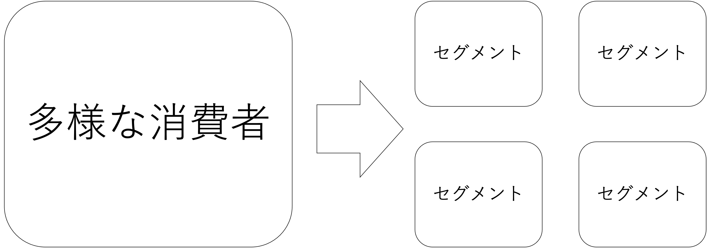
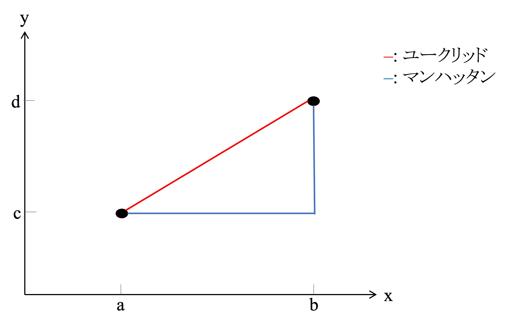
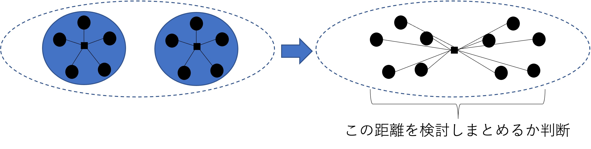
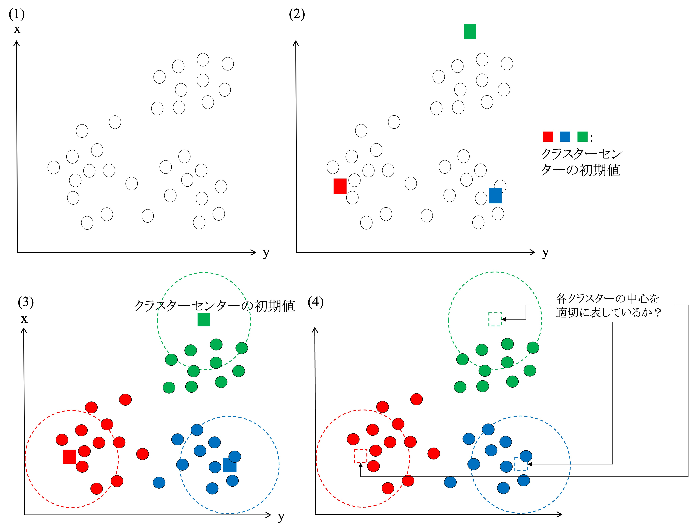
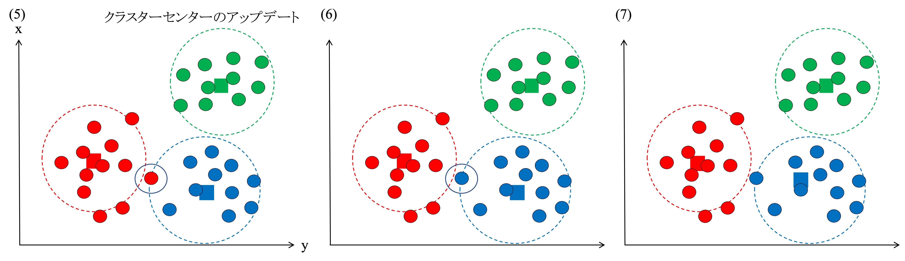

# セグメントとクラスター分析{#cluster}
本章では、マーケティング意思決定に密接に関わる手法として、クラスター分析を紹介する。クラスター分析は、複数の量的変数情報に基づいて、データのサンプルをいくつかのグループに分類する方法である。この手法は、マーケティングにおける「セグメンテーション」に関連する。本章ではまず、マーケティングにおけるセグメンテーションについて説明をした後、クラスター分析のマーケティング領域への応用について説明する。

## セグメンテーションとマーケティング意思決定
セグメンテーションは、セグメンテーション・ターゲティング・ポジショニング（STP）に代表される基本的なマーケティング枠組みを構成する重要な要素である。マーケティングにおいて企業は、製品やサービスを通じて顧客に対し価値を提供することを目指すのだが、そのためには、対象となる市場においてどの部分（セグメント）を狙うのかを特定化する必要がある。市場を構成する消費者は、多様な好みや特徴を持っている。その中から似た好みや特徴を持つ消費者グループを見つけ出し特定化することがセグメンテーション（市場細分化）である。

市場におけるセグメントを明らかにすることは、より効果的に標的への価値提供を行うことにつながると期待できる。セグメンテーションを行わない場合、様々な消費者の好みからバランスを取るように、平均的な特徴をもつような製品・サービスを開発することになる。例えば、ホットティーが好きな人もいれば、アイスティーが好きな人もいる。しかしながら、これらの間を取った「ぬるいお茶」を提供しても、誰の好みにも響かない可能性がある。つまり、万人受けを狙って中途半端な製品・サービスを提供することを避けるためにも、市場を細分化して、共通の好みを持つ消費者グループを判別することはとても重要になる。

セグメンテーションを行うための分類基準として、企業はいろいろな情報を活用すると考えられる。理想的には、企業は消費者が求めている便益や好みに基づき市場を細分化したいと考えるだろう。例えば自動車市場において、ある消費者は技術的革新性を、別の消費者は快適性を求めるかもしれない。このような消費者のニーズに基づき市場を細分化することができれば、より効果的な標的市場を決定できる。しかしながら、消費者のニーズに関するデータを直接的に入手できない場合も多い。そのようなときには、（1）消費者属性、（2）心理的情報、（3）行動的情報についてのデータをニーズにつながる代理指標として用いてセグメンテーションを行うことが多い。

消費者属性としては、人口統計的情報や地理的情報が用いられる。人口統計的情報には、年齢、職業、所得、世帯人数、教育水準などが含まれる。これらの情報が消費者のニーズと連動している場合には、人口統計的情報に基づく市場細分化は効果的であると言える。例えば、高品質だが高価格な製品と低価格だが質の低い製品がある場合、所得による市場細分化は効果的になるかもしれない。また、子供がいる世帯といない世帯では、異なるニーズを持っていることも予想できる。

地理的情報として、消費者の居住地域によって異なる好みを表すことがある。例えば、関東と関西のように、食品の味付けに関する好みについて日本国内の地域間で違いがうかがえる。カップうどんやスナック菓子においては、このような味付けに関する地域差を反映させた製品開発を行っており、製品を販売する地域に応じて味付けを変えている。このような人口統計・地理的情報は、測定可能性・容易性が高いという利点を有している。自社内部データや自治体の人口動態情報などによって、自社顧客や特定地域における消費者特性の情報について得ることができる。これらの情報が消費者のニーズや好みと連動している場合には、非常に有力なデータとなるものの、マーケティングの本来的な目的はこれらの情報に基づくセグメントを発見することではないことには、注意が必要である。あくまで、これらの情報の背後にある消費者のニーズの代理指標として利用していることを理解することが求められる。

心理的情報としては、ライフスタイルや価値観、志向といった、特定の商品への評価そのものではない消費者の心理的特性を捉えた指標が用いられる。これらの情報については、アンケート調査などを用いた心理学的手法を用いることによって把握することができる。例えば、低価格志向や環境意識などは製品・サービスに求める価値観と近い心理的特性であるため、例えば自社の既存顧客や店舗を出店しているエリア内において環境問題への関心に基づきセグメントを確認することは、製品開発上重要な情報になりうる。

また、行動につながる心理的な態度（ブランドに対する好意）を捉えた類型も可能になる。これにより、どのようなセグメントが何を好むかを把握することができる。例えば、英国における "comfortable green" というセグメントは、Fairtrade や Green & Black's を好むが、Asdaやコカ・コーラは嫌っているだと言われている（Jobber and Elis-Chadwick, 2020）。

<!-- ライフスタイル類型の代表例が、1980年代にスタンフォード大学研究センターによって開発された Values and Lifestyles (VALS) があり、日本においても、日本版VALSが開発されている（池尾ほか,2010）。また近年の類型では、ライフスタイルによるグローバル・セグメントの類型も提示されている。 例えば、ユーロモニター -->

行動的情報の代表的なものとしては、購買行動に関する情報が挙げられる。例えば、製品やサービスの購買・利用頻度を顧客によるブランドロイヤルティの代理指標として用いることも多い。セグメンテーションを行うためにはまず、「どの情報に基づきセグメンテーションを行うのか」という基準となる情報の選定が求められる。

セグメンテーションは、図\@ref(fig:segment) に示されるように、市場に存在する多様な消費者をいくつかのグループに分類することである。セグメンテーションが可能であることの前提には、（1）市場における消費者の好みが異質であることと、（2）共通した好みを持つ消費者のまとまりは見いだせるが、同時に見出したまとまり間での好みの差異も見いだせることである。つまり、異なる好みを持つ消費者の中から、「グループ内類似性」と「グループ間差異」とを基準に複数のグループを見出すことがセグメンテーションであるといえる。

```{r segment, echo=FALSE, fig.cap = "セグメンテーション概要"}

```

## STPその後

セグメンテーションが完了すると企業はターゲティングを行う。ターゲティングにおいては、発見したセグメントの中から標的とする特定のセグメントを選ぶ。その際、自社にとって魅力的なセグメントを選ぶのだが、その魅力は主に以下の要因によって規定される（Jobber and Ellis-CHadwick, 2020）：

- 市場要因：セグメントのサイズ、成長率、収益性
- 競争要因：競争の状態（数量的情報だけでなく、質的情報も重要）、新規参入者、差別化可能性
- 政治・社会・環境要因：政治的・社会的傾向、環境問題、技術的変化

基本的に企業にとっては、規模が大きく、成長性も収益性も高いセグメントは魅力的である。しかし、そのようなセグメントに対しては競争も激しくなると予想できる。そこで、競争の状態を観察するのだが、ここでは競合の数だけではなく競合の持っている強みが自社とどのように異なるかを検討することも重要になる。例えば、自動車メーカーにとってアメリカ市場は非常に魅力的なマーケットである。しかしながら、伝統的に欧米の自動車会社が市場を席巻しており、他地域の企業にとっては厳しい競争環境に見えるかもしれない。しかしながら、欧米の自動車会社が持っていた弱点をうまく利用し、競争を優位に進めたのは日本の自動車会社である（Jobber and Ellis-CHadwick, 2020）。つまり、競争の状態に関する質的な側面も含めてセグメントの魅力を評価すべることが重要となる。

政治・社会・環境要因の例として、近年のジェンダーや性役割に関する消費者の認識の変化が挙げられる。このような変化は、新たなセグメントの成長性へ影響を与えるかもしれない。伝統的な価値観のもとでは、女性が育児の中心を担うと思われる傾向があったが、それとは異なる価値観が台頭することによって、育児に関する製品群において男性も魅力的なセグメントになるかもしれない。例えば、自転車小売業者のサイクルベースあさひは、直線的で無骨なデザインながら、チャイルドシートや荷台を追加しやすい機能を有した「88サイクル（ハチハチサイクル）」という製品を販売している。あさひはこの製品を「パパチャリ」としてフレーミングし、家庭内での役割を果たす男性のに向けた自転車としての市場を捉えようと試みている。

セグメントの選択においては、セグメントの魅力だけでなく、自社の能力も考慮する必要がある。どれだけ魅力的なセグメントがあったとしても、そのセグメントのニーズに応えるための能力がなければ、そのセグメントを狙うことは適切ではない。また、自社能力を評価するときには、既存もしくは潜在的な競合との比較のもとで相対的に能力を評価することが大切になる。例えば、自社として製品品質に自信があったとしても、同程度の価格帯でより品質の高い製品を製造できる競合がいた場合には、相対的に能力は低いことになる。

ターゲットを決めた後企業は、製品や提供物を決定し、市場において特有のポジションを専有しようと試みる。この段階をポジショニングという。ポジショニング段階にある企業は、競争的な優位性を得ることに焦点を合わせるのだが、この時消費者に自社製品が優れていると認識されるような情報伝達も必要になる。ポジショニングと消費者の認識との関係については \@ref(factor) 章にて説明を行う。

次節では、定量的なデータを用いたセグメントの探索・発見方法としてのクラスター分析を紹介する。なお、本資料においてはクラスター分析の概要とRを用いた基礎的な分析方法に着目する。そのため、理論的背景や発展的手法については他の資料や著書を参照してほしい。

## セグメンテーションの実行とクラスター分析
セグメンテーションでは、基準となる情報を選定し、その情報を用いて消費者の類型を発見する。その発見の方法として照井・佐藤（2023）では、（1） 経験、（2）クラスタリング、（3）潜在クラス、の3つの方法を紹介している。経験によるセグメンテーションでは、マーケティング担当者の経験や既存のリサーチによる知見を参考に消費者を類型する。この方法は、十分な知識や経験が蓄積されており、基準となる情報が限定的かつニーズと関連的である場合には有効になる。例えば、消費者の年齢がニーズと関連していることがわかっている場合、年齢に基づくセグメンテーションは特別な分析を介さずとも有効な手法となりうる。しかしながら、経験的な知見が不足している場合には、セグメンテーションの信頼性を損なうことに加えて、考慮すべき情報が複数ある場合には、情報処理が複雑になり、類型化が困難になる。

クラスタリングによるセグメンテーションは、クラスター分析を用いたセグメンテーションである。基準となる情報を（多くの場合複数）選択し、その情報をもとに各観測の類似性を求めることで、類型化を行う。この方法は、多くの情報をセグメンテーションの基準として用いることができる点や、分析方法についての資料やソフトウェアが充実しているため、分析の実現可能性が高いという利点を持つ。本資料ではこのクラスター分析を中心に議論を進める。第三の潜在クラスによるセグメンテーションでは、潜在クラスモデルと呼ばれる統計モデルを用いた方法である。これは発展的な手法であり、セグメントに関する統計的推測も行えるという利点を持っている。また、この方法では消費者が確率的に複数のグループに属することも許容するため、より現実的な手法とも評価されている（照井・佐藤,2023）。しかしながら、この方法には相対的に多くのデータを必要とし、発展的な統計的知識が必要になる。本講義においては潜在クラスモデルを用いた手法は扱わない。

本資料では、消費者や顧客のセグメントを発見するための方法としてクラスター分析を紹介する。クラスター分析は、2つ以上の基準となる情報（変数）に基づいて、対象または人を相互に排他的で網羅的なグループに分類するために使用される統計的手法である。クラスター分析にはいくつかのアプローチが存在するが、それらに共通するのはサンプル間の類似性を確認し、グループとして分割していくというプロセスを有しているということである。ここでは主に階層的クラスター分析と、被階層的クラスター分析を紹介する。階層的クラスター分析は類似する観測同士を段階的にまとめていき、グループ（クラスター）を形成していく方法である。一方で非階層的クラスター分析は、分析者の定めた前提のもと、非階層的にクラスターを形成する方法である。本資料ではおもに、これら2つのアプローチについて紹介する。

### 階層的クラスター分析{#Hier}
本節では、階層的クラスター分析について説明する。階層的クラスター分析では、データの中から類似している観測値を段階的にクラスターとしてまとめていき、最終的にすべてのデータが1つのクラスターになるまでそれを繰り返す方法である。

このプロセスにおいて類似度は観測値同士の距離として測られる。距離の測定方法には色々とあるが、ここではユークリッド距離とマンハッタン距離を紹介する。ユークリッド距離は、観測値同士の各座標の差の二乗和の平方根であり、マンハッタン距離は観測値同士の各座標の差の絶対値の合計であるといえる。例えば、以下の図\@ref(fig:distance) における2点をつなぐ赤い線がユークリッド距離、青い線がマンハッタン距離だといえる。以降では、実際の分析においても頻繁に用いられるユークリッド距離に主に焦点を合わせ、手法を紹介する。

```{r distance, echo=FALSE, out.width="60%",fig.cap = "距離定義概要"}

```

階層的クラスター分析では、図\@ref(fig:dendrogram) で示されているデンドログラム（樹形図）を得ることで、各観測が段階的に集約されていく様子が可視化される。例えば、図 \@ref(fig:dendrogram)の左（1）では、6個の観測が3つのクラスターにまとめ・分類されている一方で、右（2）では、2つのクラスターに集約されている事がわかる。これらの図を見ると、aはbと最も近く、cはdと最も近いことがうかがえる。また、aとbで構成されたクラスターは、cdクラスターとは近いが、efとは遠いことがうかがえる。デンドログラムの解釈方法については後述するが、まずはデンドログラムを得るプロセスについて説明する。

ここでは、以下の表\@ref(tab:exampledata) で示されている、2つの変数（x, y）に関する6個のデータが与えられた場合を考える。この場合の各観測値は図  \@ref(fig:distanceplot)のように示される。

```{r exampledata, echo=FALSE}
library(tidyverse)
library(ggrepel)
library(ggforce)
name <- c("a", "b", "c", "d", "e", "f")
x <- as.numeric(c(1, 2, 2, 3, 7, 6))
y <- as.numeric(c(2, 3, 5, 5, 2, 3))
d1 <- tibble::as_tibble(cbind(name, x, y))
d1 <- tibble::column_to_rownames(d1, var = "name")
d1$x <- as.numeric(d1$x)
d1$y <- as.numeric(d1$y)
knitr::kable(d1, caption = "データ例")
```

```{r distanceplot, echo=FALSE, fig.cap = "階層的クラスター分析"}
p <- ggplot(d1, mapping = aes(x = x, y = y))

p + geom_point() + 
  geom_text_repel(mapping = aes(label = rownames(d1))) +
  scale_x_continuous(breaks = seq(1,7, by = 1)) +
  scale_y_continuous(breaks = seq(1,7, by = 1)) +
  geom_ellipse(aes(x0 = 1.5, y0 = 2.5, 
                   a = 0.5, b = 1, angle = - pi/4)) +
  geom_ellipse(aes(x0 = 2.5, y0 = 5, 
                   a = 0.5, b = 1, angle = pi/2)) +
  geom_ellipse(aes(x0 = 6.5, y0 = 2.5, 
                   a = 0.5, b = 1, angle = pi/4)) +
  geom_ellipse(aes(x0 = 2, y0 = 3.5, 
                   a = 1, b = 2.5, angle = -pi/8)) +
  coord_fixed()
```

この時、各データ同士の類似度をユークリッド距離で測るとする。例えば、a と最も近いデータは b である。a と b の距離は、以下のように求まる。
$$
\sqrt{(2-3)^2+(1-2)^2}=\sqrt{2}=1.414
$$
同様に、c（e）と最も近いデータは d（f）であり、その類似度もユークリッド距離で求めることができる。これによって、各観測点から最も近い観測点同士を結びつける形で、3つのクラスター（図\@ref(fig:dendrogram) 左に対応）が初期段階のものとして形成される。次に、まとめた3つのクラスターと、他の観測点もしくは他クラスターとの距離を計算し、より大きな（多くの観測点が含まれる）クラスターを形成する。例えば、クラスター（a, b）は、（e, f）よりも（c, d）のほうに近いため、図\@ref(fig:distanceplot) に示されているように、（a, b, c, d）というクラスターとしてまとめる（合併する）ことができる（図\@ref(fig:dendrogram) 右に対応）。このように段階的にデータをまとめていくと、最終的にはすべてのデータを一つのクラスターとしてまとめることができる。これが、階層的クラスター分析の直感的プロセスである。

```{r dendrogram, echo=FALSE, message=FALSE,warning=FALSE,fig.cap = "デンドログラム"}
library("cluster")
library("factoextra")
library("gridExtra")

theme_set(theme_gray(base_size = 10, base_family = "HiraMinProN-W3"))

Hier_ex1 <- d1 %>% 
  dist("euclidian") %>% 
  hclust("complete")
den1 <- Hier_ex1 %>% 
  fviz_dend(k = 3, rect = TRUE, 
            rect_fill = TRUE) +
  labs(title = "(1) Stage: 3 Clusters")
den2<- Hier_ex1 %>% 
  fviz_dend(k = 2, rect = TRUE, 
            rect_fill = TRUE) +
  labs(title = "(2) Stage: 2 Clusters")
grid.arrange(den1, den2, nrow = 1)
```

図 \@ref(fig:dendrogram) のようなデンドログラムでは、一番下に全観測値が表示される。横軸と平行の線は、クラスタとしての併合を意味しており、下でのつながりほど初期に併合されたクラスタであることを示す。そのため、最終的には（一番上では）すべてが一つのクラスタにまとまっていることがうかがえる。この時、デンドログラムの高さ（縦軸）は距離を示している。したがってデンドログラムは、どの程度の離れ具合を許容するかによって何組でデータをまとめられるかが変わることを表している。例えば図\@ref(fig:dendrogram) では、高さを2に定めれば3つのクラスターにまとめることができ、4を設定すれば2つのクラスターにまとめることができる。

階層的クラスター分析ではクラスター同士を段階的に合併させていくのだが、クラスター同士の類似性を測るための方法もいくつか存在する。ここでは、代表的なものをいくつか紹介する。クラスター同士の距離の決め方として、図 \@ref(fig:clusterdis) に示すように、最短距離法（Single linkage method）、再遠距離法（Complete linkage method）群平均法（Group average method）がある。最短（遠）距離法はクラスタ間の最も近い（遠い）観測の組み合わせの距離を測るものである。一方で群平均法は、クラスタ間のすべての観察の組についての距離を計算する方法である。

また、非常に頻繁に使われる手法としてウォード法も存在する。ウォード法は最小分散法とも呼ばれ、クラスター内の平均までの二乗距離を最小化する方法である。

```{r clusterdis, echo=FALSE, fig.cap = "クラスター類似性測定手法"}
knitr::include_graphics("cluster/cluster_comb.jpg")
```

ウォード方では、異なるクラスター間の類似性について、まずそれらを構成する観測値を一括にして捉えた仮のクラスターを形成し、そのまとめられたクラスター内の観測値同士の距離が近い（分散が小さい）ものから併合される。図 \@ref(fig:wards)ではその直感的な概略図を示している。ウォード法ではこのようにクラスター間の類似性を分散の形式で測定することで段階的に併合するグループを決定していく。

```{r wards, echo=FALSE, fig.cap = "クラスター類似性測定手法"}

```

階層的クラスター分析におけるクラスター数の決定は、分析者の判断に依存し、絶対的な基準は存在しない。しかしながら、多くの場合、分類の「効率性」と「有効性」のバランスから効果的なクラスター数が決定される。効率性は分類によってどれだけ多くの情報を説明できているかを表しており、より少ないクラスター数で多くのデータを説明できたほうが情報の集約による効果が大きいと考えられる。例えば、表 \@ref(tab:exampledata) で示されているような6つのデータを6つのクラスターで説明しても、クラスター分析としては不適切だといえる。一方で、得たクラスター分類がどの程度現実的に含意のある分類をできているか、を捉えたのが有効性である。効率性を意識しすぎて少ないクラスター数による分類を採用しても、あまりに大雑把過ぎる分類だと分析結果が有益にならない。例えば、図 \@ref(fig:distanceplot) において、1つのクラスターで6個のデータを説明するよりも、2つか3つのクラスターで説明したほうがより直感的かつ実務的な含意を得ることができるかもしれない。このように、階層的クラスター分析は、クラスターがどのように形成されていくかの段階を示すことによって、おおよそどのようなクラスター分類を行うことが良さそうかを判断することにつながる。

## 非階層的クラスター分析：K-means法{#k-means}
非階層的クラスター分析では、段階的なクラスターの分類ではなく、事前に決められたクラスター数に基づき、データを分類する。本資料では代表的な非階層的クラスタリング法である、K-means法について紹介する。K-means法の分析では、分析者が事前にクラスター数を決める必要がある。その仮定の下、Sequential threshold method と言われる以下のようなプロセスによってクラスターが決定される。

1. 初期クラスターの形成
2. クラスターセンターのアップデートと更新
3. アップデートの収束と最終クラスターの決定

図 \@ref(fig:kmeans1)と\@ref(fig:kmeans2) はK-means法のプロセスに関する直感的説明を段階的に図示化したものである。ここでは、図 \@ref(fig:kmeans1) (1) のようなデータに対し、3つのクラスター数を仮定した場合を考える（このプロセスは任意の $k$ 個のクラスターに対して適応可能）。 

```{r kmeans1, echo=FALSE, fig.cap = "K-means法直感１"}

```

まず初めに図\@ref(fig:kmeans1) (2) に着目してほしい。ここでは、与えられたデータの空間に対して3つのクラスターセンター初期値（初期シードとも言う）をランダムにとる。次に各観測個体をそれぞれの最も近い初期センターに割り当てる形で3つのクラスターを作成する（図\@ref(fig:kmeans1) (3)）。ここで、作成された3つのクラスター（の観測値）と、初期値とを比較し、適切に中心を表しているかを検討する（図\@ref(fig:kmeans1) (4)）。例えば、図\@ref(fig:kmeans1) (4) における赤いクラスターについてはもう少し右上の方向にセンターを移動したほうがいいかもしれない。このように、各クラスターの観測値に基づき、クラスターセンターが計算され、アップデートされる。

```{r kmeans2, echo=FALSE, fig.cap = "K-means法直感２"}

```

しかしながら、クラスターセンターがアップデートされると、新たなセンターから各観測個体までの距離も変化する。例えば、図\@ref(fig:kmeans2) (5) を見ると、これまで赤クラスターに属していた個体のひとつが、クラスターセンターのアップデートに伴って赤のセンターよりも青のセンターから近くなっている。そのため、この個体は青クラスターに分類される（図\@ref(fig:kmeans2) (6)）。各観測個体のクラスターへの分類が変更されたため、クラスターセンターも当然修正されるべきであり、新たな分類に基づくクラスターセンターが再度計算される（図\@ref(fig:kmeans2) (7)）。K-means方においては、このようなプロセスをクラスターセンターが動かなくなるまで繰り返すことで、観測個体を分類する。

K-means法によるクラスターセンターの計算等については、ソフトウェアが行ってくれる。しかしながら、分析者は分析実行前にクラスター数の決定を行わなければならない。クラスター数の決定においては、\@ref(Hier)節でも述べた通り、分析者の恣意性を含む判断によって決定される。クラスター数の決定においては、伝統的には（1）ハーティガンルールと、（2）エルボー法という方法のいずれかもしくはその両方を用いるｋとが多い。

ハーティガンルールとは、$k$ 個と $k+1$ 個のクラスターにおける内部平方和（クラスター内部の分散）を比較する変量を計算し、その値が10を越えた場合は、$k+1$個のクラスター数を採用したほうが良いという考え方である。この値が10を越える状況は、$k+1$個の場合に比べ$k$個のクラスターを採用したほうが内部平方和（クラスター内部の分散）が大きくなることを意味している。

一方でエルボー法とは、$k$ 個のクラスター数それぞれに対応する内部平方和をプロットすることで、好ましいクラスター数を解釈する方法である。図\@ref(fig:elbow)に示すように、クラスター数の変化に伴い、内部平方和（クラスター内部の分散）がどのように変化するかをチェックすることができる。この図を用いた判断では、変化量（傾き）の変化に着目することも多い。変化量が小さい、つまりクラスター数が増えてもあまり内部平方和が減らない場合、効率性と有効性の観点からより少ないクラスター数を選ぶことが判断されやすい。例えば図\@ref(fig:elbow) の場合、4つのクラスターまではクラスター数の増加とともに内部平方和が下がっているものの、4を越えてからは傾きがほぼ水平になっていることがうかがえる。そのため、このような結果の場合には、4クラスターを仮定した非階層的クラスター分析を実行することが多い。


```{r elbow, echo=FALSE, message=FALSE, warning=FALSE, fig.cap="エルボー法例"}
library("cluster.datasets")
data(all.mammals.milk.1956)
milk <- all.mammals.milk.1956
rownames(milk) <- milk$name
milk <- milk %>% 
  select(-name)

fviz_nbclust(milk, kmeans, method = "wss")
```

ここで、セグメントの発見を目的とするような探索的なクラスター分析に関する手順を紹介する。非階層的クラスター分析は、階層的クラスター分析との組み合わせる形で実行されることも多い。顧客セグメントを探索するような目的で実行されるクラスター分析として、以下のような手順を紹介する：

1. 階層クラスター分析、ハーティガン、エルボーの確認
2. クラスター数 (k) を決定
3. k個のクラスター数に対する K-means クラスター分析の実行
  - $\rightarrow$ クラスターの図示化と記述による検討
4. クラスターのプロファイル情報を整理し、各クラスターを評価

次節では、この4つのプロセスに基づき、Rを使ったクラスター分析方法を紹介する。

## Rによるクラスター分析の実行
ここからは、Rを用いたクラスター分析の実行方法について紹介する。なお、本節では、吉田秀雄記念事業財団によって2023年に実施された消費者調査アンケートデータ、[研究⽀援消費者調査結果 2023年度下期](https://www.yhmf.jp/aid/data/data_aid_2023_later.html) のうち、（簡単化のために）特定の変数と回答者（兵庫と東京在住者のみ）を抽出して利用する^[なお、履修生によるデータの読み込みエラーを防ぐために、自由回答設問項目は削除している。]。ここでは、以下のリストにある変数を活用する。

- q12_4（ブランドロイヤリティ性向）：「たとえ多くのブランドを利用できる状況にあっても、何時も同じブランドを選ぶ。」
- q13_3（価格感度）：「大抵、一番安いものを買う。」
- 性別
- 年齢
- 結婚有無
- q5: 職業
- q7_2: 世帯年収

なお、q12_4とq13_3はどちらも5点リッカート尺度で回答を得ている。その他消費者属性情報の回答項目の詳細はエクセルファイルを参照してほしい。上記の条件に沿うデータは以下のように抽出することができ、その結果、1973件の回答を得た。

```{r clus_cons}
df_cons <- readxl::read_xlsx("data/回答データ【消費者調査2023年度下期調査】.xlsx", sheet = "回答データ【共通調査2023年度下期】",na = " ")
library(tidyverse)
#東京と兵庫の県番号リスト作成
list <- c(13, 28)
#回答者と項目を抽出
df_cons <- df_cons %>% 
  select(県番号, q12_4, q13_3, 性別, 年齢, 結婚有無, q5, q7_2) %>% 
    filter(県番号 %in% list,
           q12_4 != 999,
           q13_3 != 999) %>% 
  mutate(Pref = ifelse(県番号 == 13, "Tokyo", "Hyogo"),
         Gender = case_when(性別 == 1 ~ "Male",
                            性別 == 2 ~ "Female",
                            TRUE ~ "Others"),
         MaritalSt. = case_when(結婚有無 == 1 ~ "Married",
                            結婚有無 == 2 ~ "Not Married",
                            TRUE ~ "Others"))

```

本節でのクラスター分析の実行にあたっては、以下のパッケージをインストールし利用する。なお、クラスター分析自体は `cluster` パッケージで実行可能だが、`factoextra` を用いるともう少し洗練された可視化が可能になるため、こちらの紹介も行う。


```{r clusinstall, eval=FALSE}
install.packages(c("cluster", "factoextra","ggrepel", "useful"))
library(cluster)
library(factoextra)
library(ggrepel)
library(useful)
```

本節で我々は`df_cons`を用いて分析を行いたいのだが、クラスタリングの関数はデータセットに含まれているすべての変量間の類似性・相関を計算してしまうため、必要な変数のみを抽出し、分析に利用する。なお、クラスタリングの関数は文字列にも対応していないため、もしデータセットにそのような変数が含まれている場合には、この段階で取り除く必要がある。

ここではブランドスイッチ（q12_4）と価格志向（q13_3）に関する変数の抽出と、クラスター分析の実行を行うために、以下の手順を経る：

1. 階層的クラスター分析を実行し、デンドログラムを確認
2. デンドログラムとエルボー法によりクラスター数を決定
3. 2.で決定したクラスター数に従い、K-means法を実行
4. クラスター情報と元データ（df_cons）を結合し、プロファイル情報の整理と検討

まずは以下の通り、階層的クラスター分析を実行する。なお、階層的クラスター分析の実行においては、`agnes()` 関数を用いる。その際に用いる距離の計測方法は `metric =` という引数で設定できる。その後、階層的クラスター分析の結果を用いて `pltree()` 関数を実行することで、デンドログラムが出力される。
```{r consdendrom, fig.cap="消費者デンドログラム"}
clus_cons <- df_cons %>% 
  select(q12_4, q13_3)
Hier1 <- agnes(clus_cons, metric = "euclidian", method = "ward", stand = TRUE)

pltree(Hier1)
```

図\@ref(fig:consdendrom) の通り、本データは1973件の観測個体を有するため、デンドログラムも下部については識別が難しくなっている。しかしながら、例えば高さを40ぐらいに設定した場合、クラスターは4つか5つに分かれることがうかがえる。例えば4クラスターの場合、どのような分け方になるかについて、直感的に示すために、`factoextra` パッケージを用いると図\@ref(fig:factodendrogram)のようにデンドログラムを出力できる。この時、`fviz_dend()` 関数における `k = 4` という引数で、ここでのクラスター数を定義している。
```{r factodendrogram, message=FALSE, warning=FALSE, fig.cap="4クラスターデンドログラム"}
alt_Hier <- clus_cons %>% 
  dist("euclidian") %>% 
  hclust("ward.D")
alt_Hier %>% 
  fviz_dend(k = 4, rect = TRUE,
            rect_border = TRUE) 
```


続いて、上記の結果を踏まえ、エルボー法を実施する。

```{r conselbow, fig.cap="エルボー法結果"}
fviz_nbclust(clus_cons, kmeans, method = "wss")
```

図 \@ref(fig:conselbow) を確認すると、4もしくは5クラスターで傾きが小さくなっているように見える。ちなみに、5クラスターを採用したケースは、デンドログラムでは図\@ref(fig:factodendrogram2)のように示すことができる。
```{r factodendrogram2, message=FALSE, warning=FALSE, fig.cap="5クラスターデンドログラム"}
alt_Hier %>% 
  fviz_dend(k = 5, rect = TRUE,
            rect_border = TRUE) 
```

<!-- そこで、ハーティガンルールを用いてもう少し詳細にクラスター数について検討する。この分析においては、`useful` パッケージに含まれる `FitKMeans()` という関数を用いて以下のように結果を確認する。 -->

<!-- ```{r hartigan} -->
<!-- Clus1Best<- FitKMeans(clus_cons, max.clusters = 10, nstart = 3, seed = 123) -->
<!-- Clus1Best -->
<!-- ``` -->

4クラスターモデルと5クラスターモデルのどちらがいいのかについての判断は難しいが、ここでは便宜的に5つのクラスターを仮定する。K-means法の実施には、`cluster`パッケージの `kmeans()`関数を用いる。なお、初期クラスターセンターの割り振りはランダムで行うため、`set.seed()` を用いる。`set.seed()`のカッコの中に数値を入力することで、その数値を使う場合には常に同じ乱数を発生させることが可能になり、初期値の固定と再現性の確保ができる。

```{r conskmeans}
set.seed(343)
K_shopping <- kmeans(clus_cons,5) 
K_shopping
```
分析の結果表示される `Cluster means:`では、分析に用いた変数に関する各クラスターごとの平均値が出力される。例えば、クラスター1は、ブランドスイッチ（q12_4）については高いが、価格志向（q13_3）については低いことがうかがえる。結果の下部で表示される、`Within cluster sum of squares by cluster:`には、各クラスターの内部平方和（分散）が出力されている。その下の `between_SS / total_SS` は、全体の平方和に占めるクラスター間平方和の比率であり、全体の分散の何%を5つのクラスターが説明しているかを示している。

以下では、上述の結果について、`factoextra::fviz_cluster()`によって図示化する。図\@ref(fig:kmeansplot1) では、ブランドロイヤリティと価格志向のどちらも高い（低い）グループや、どちらか一方のみ高いグループに加え、価格志向は低いがブランドスイッチについては平均的というグループも確認できた。このように図示化することで、クラスター分析の結果についての解釈が容易になる。なお、4クラスターを採用した場合の結果については、\@ref(fig:kmeansplot2)で示されている。また、4クラスターでの分析を実行すると、`between_SS / total_SS =  65.6 %` という結果を得るはずなので、興味のある読者は自身で実行してみてほしい。

```{r kmeansplot1, message=FALSE, warning=FALSE, fig.cap="消費者価値観クラスター"}
fviz_cluster(K_shopping, data = clus_cons, geom = "point") +
  labs(title = "k = 5", x = "Brand switching (Std. score)", 
       y = "Price orientation (Std. score)")

```

```{r kmeansplot2, echo=FALSE,message=FALSE, warning=FALSE, fig.cap="4クラスターモデル図"}
set.seed(343)
K_shopping2 <- kmeans(clus_cons,4) 
fviz_cluster(K_shopping2, data = clus_cons, geom = "point") +
  labs(title = "k = 4", x = "Brand switching (Std. score)", 
       y = "Price orientation (Std. score)")
```


続いて、各クラスターに属する消費者についての情報を整理、検討する。ここでは、5クラスターモデルの結果に基づき、クラスター情報と元データとを結合する。結合した結果として以下の表 \@ref(tab:merged) に、元データにクラスター番号に関する変数 `cluster_id` が追加されていることがわかる。

```{r merged, message=FALSE}
df_cons$cluster_id <- factor(K_shopping$cluster)
knitr::kable(head(df_cons),caption = "結合データ")
```

以下では、各クラスターの平均的な消費者像について理解するために、個人属性情報をまとめる。その作業方法と結果は、以下のコードと表\@ref(tab:clusSummary) のとおりである。ここでは、表\@ref(tab:clusSummary)に基づき、いくつかのクラスターに絞り、それらの特徴を整理し解釈を行う。なお、本データでは東京在住者の観測数（1465）が兵庫在住者の観測数（508）を大きく上回っているため、居住エリアの比率については本データの比率（$1465/1973\approx 0.742$）を基準に、この比率と同等の東京在住者がいれば1を、それより多ければ1より大きい値を取るような比率で示している。

表\@ref(tab:clusSummary)におけるクラスター１は最も人数が少なく、価格志向は高くスイッチはやや低いことがうかがえる。そのため、このグループに属する消費者は、価格に基づいて選んだブランドを買い続ける傾向があるのかもしれない。また、このクラスターは他のクラスターよりも東京在住者の比率が高いこともうかがえる。クラスター6は、価格志向もスイッチもどちらも低いことがうかがえる。そのため、このクラスターに属する消費者は価格以外の属性に基づいて選んだブランドを買い続ける傾向があるかもしれない。また、このクラスターは既婚者率が高く、このような属性の特徴も価値観に影響しているのかもしれない。他のクラスターに関する解釈はここでは割愛するが、ぜひ読者においてもそれぞれのクラスターについての解釈を展開してみてほしい。

```{r clusSummary}
clus_summary <- df_cons %>% 
  group_by(cluster_id) %>% 
  summarize(N = n(),
            Loyalty_m = mean(q12_4),
            Price_m = mean(q13_3),
            Age_m = mean(年齢),
            Male_r = sum(Gender == "Male")/n(),
            Tokyo_r = (sum(Pref == "Tokyo")/n())/(1465/1973),
            Married_r = sum(MaritalSt. == "Married")/n())

knitr::kable(clus_summary, caption = "クラスターサマリー")
```

本節では、実際の消費者アンケートデータを用いてクラスター分析の実行手順を紹介した。クラスター分析を用いて探索的にセグメントを発見するためには、階層的クラスター分析と非階層的クラスター分析を組み合わせることが重要となる。ただし、クラスター分析ではクラスター数の決定や結果の解釈などにおいて、分析者の恣意性に依存することになる。しかしながら、このような限界も理解した上でうまく利用すれば、有益なセグメントを発見することにもつながりうる。

本節では観測数2000件弱のデータを利用したが、実際に我々がこれだけのデータを目視し、セグメントを発見することは困難である。クラスター分析は人間では処理困難な情報量を集約し、解釈可能にしてくれるという強みを持つ。もちろんもっと多量のデータを用いてクラスター分析を実行することも可能であるし、機械学習への応用や潜在クラスモデルの利用など、より発展的な手法も展開されているため、興味・関心のある学生においてはさらなる学習を進めてほしい。

## 参考文献
Jobber, D., & Ellis-Chadwick (2020). *Principles and Practices of Marketing 9th Edition*, McGraw-Hill Education.

照井伸彦・佐藤忠彦（2022）「現代マーケティング・リサーチ[新版]」,有斐閣.

