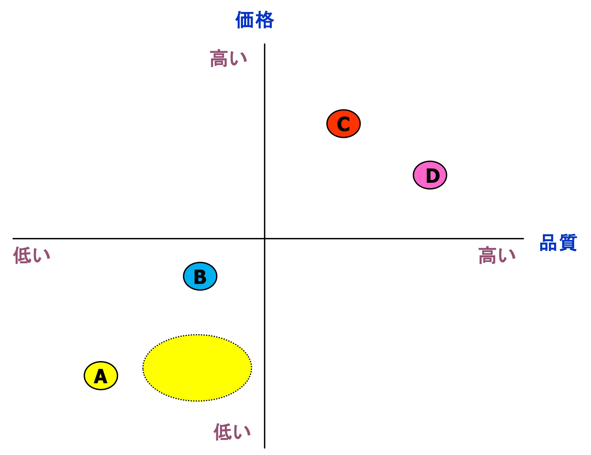
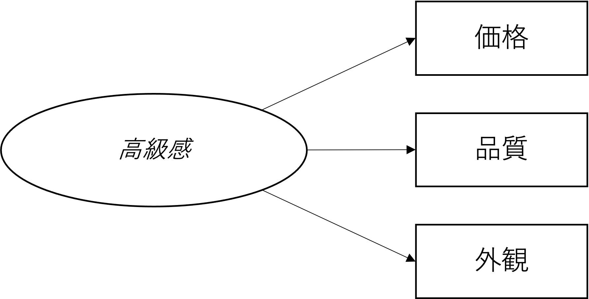
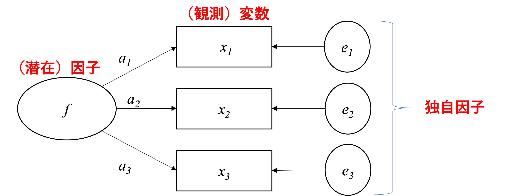
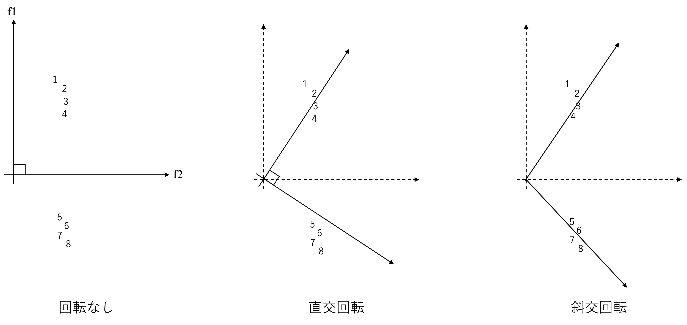
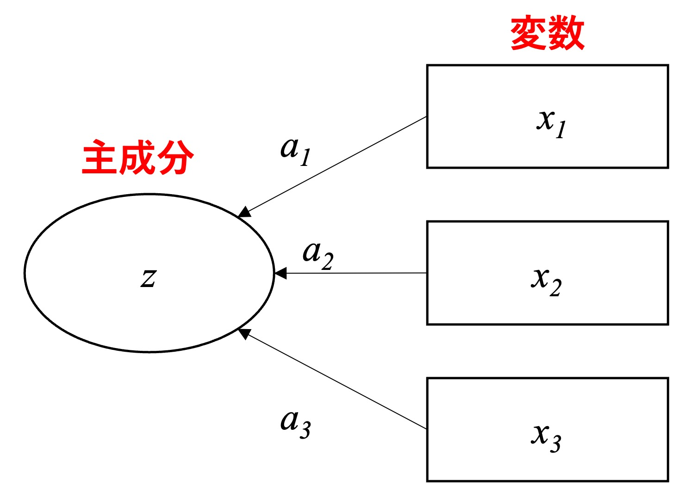

# 知覚マップと因子分析{#factor}
企業におけるマーケティング諸活動は、差別的優位性を獲得するための戦略に従って一貫性を保って提供される必要がある。そのための具体的な枠組みがSTPである。\@ref(cluster)章では、主にセグメンテーションとターゲティングに焦点を合わせ、クラスター分析のやり方を紹介した。しかしながら、企業は自社の定めた標的顧客に評価され、競合よりも優位で差別的な地位を獲得するために、具体的なマーケティング活動を調整・遂行する。4Ps（Product, Price, Place, Promotion）に代表されるマーケティングの諸活動は、このSTPの枠組みに基づくマーケティング戦略の実行手段となる。したがって、STPによるマーケティング戦略の策定は、4Psのようなマーケティング活動間の一貫性に貢献する。本章では主にポジショニングに着目し、消費者の知覚に基づく企業（または製品）ポジションの可視化について紹介する。

## ポジショニングと知覚マップ概要

ポジショニングとは、セグメンテーションとターゲティングの後、企業の製品や提供物を決定し、市場において特有のポジションを専有するための過程である。なお、この段階においては、製品やサービスを開発するだけではなく、自社が消費者のニーズを満たし、独自性を有するものだということを消費者に伝える必要がある。しかしながら自社の戦略とそれに準ずる製品属性を決定したからと言って、それによって自動的に企業のポジションが確立するわけではない。製品が消費者にどのように知覚されるかが問題になるため、消費者の知覚や評価に基づき、ポジションを理解する事が重要になる。

製品やサービスの特徴について、消費者知覚に焦点を合わせたポジショニングツールを「知覚マップ」という。知覚マップは市場に存在する企業・製品に対する消費者の認識の視覚的表現である。知覚マップの作成は、ある製品に関する（1）競合ブランドを特定する、（2）重要な製品属性を特定化する、（3）消費者の製品属性に関する評価をアンケート調査等から得る、（4）統計的分析を実施しプロットを描く、という段階を経る。例えば、製品の価格と品質の2点に関する消費者からの評価を製品 A, B, C, D について集計しプロットすると、知覚マップは、図\@ref(fig:perExp) のようなものとして示すことができる。このとき、AからBの各円は消費者による評価の集計結果を示しているとする。また、企業Aの狙いが点線で囲まれた黄色い楕円であったとする。この場合、A社の想定よりも品質が低く評価されていると言える。このような、企業自身想定と消費者からの評価とが一致しない場合もあるため、消費者からの評価について理解する必要がある。

```{r perExp, echo=FALSE,fig.cap = "知覚マップ例"}

```

では、我々消費者はどのように製品やサービスを知覚・評価しているのだろうか。消費者がある製品を購買する際、通常いくつかのブランドを購買候補として着目し比較を行う。その際に消費者は、それらの各ブランドがどのような特徴を持つものかについて知覚を構成する。例えば、我々が製品を語るとき、「コスパ（コストパフォーマンス）が良い」や「高級感がある」といった漠然とした印象を用いることが多い。しかし、これらの製品に対する印象は通常、製品に関する複数の異なる要素を観察することで形成される。例えば、「コスパが良いノートパソコン」という印象の背後で、消費者は製品のCPU、ディスプレイ画質、操作性、デザインなど、様々な要素を複合的に評価しているはずである。これらの製品に関する要素は属性と呼ばれ、製品は複数の属性の束として考えられる。製品開発を行う企業においても、企業やブランドレベルでのマーケティング戦略や目標を実現するために具体的な製品属性を決定していくことが、マーケティングにおける意思決定の原則である。

複数の製品属性について知覚マップを形成しようとすると、情報が複雑になり、解釈も難しくなる。そのため、各属性の特徴の背後には抽象的な概念（上述では印象という言葉を使った）が存在すると考え、その概念を捉える形で各属性についての情報を集約し、解釈を行うために「因子分析」を用いる。例えば、製品の高級感という印象は抽象的な概念として捉えられ、この概念自体は観察できない潜在的なものである。しかしこの潜在的な概念は、製品の価格や品質、外観といった様々な観察可能な属性に影響しているはずである（図\@ref(fig:luxurity)）。このように、製品の各属性に対する評価をある漠然とした概念として集約することに役立つ分析手法が因子分析である。本章では、因子分析の概要とその応用としての知覚マップの作成に焦点を合わせることで、企業が自社のポジションを把握するためのリサーチ手法を紹介する。

```{r luxurity, echo=FALSE,fig.cap = "概念と属性例（高級感）"}

```

## 因子分析概要

### 因子分析の概要とモデルの構造
本節では、因子分析の概要を説明する。因子分析とは観測された変数の背後に「潜在的」な共通因子 (common factor)が存在することを仮定し、その「潜在因子から観測変数への影響」の度合いを推定することで観測された変数同士の相関（まとまり）を説明しようとする方法である。因子分析は心理学分野で発展した手法であり、人々の心理的特徴（例えば、価格志向やコスモポリタニズム）を多面的に捉えることや、情報の複雑さを削減することができる。

因子分析には大きく分けて1つのアプローチが存在する。第1に、探索的因子分析である。これは、複数の観測変数間の相関関係から、その背後にいくつ潜在的な因子を導入すれば観測変数間の関係をうまく説明できるのかを探索的に調査・分析する方法である。第2に、確認的因子分析である。これは、先行研究などに基づき、因子の数と因子負荷量について仮説的な構造を想定し、その構造をデータに基づき検証する方法である。この手法は、共分散構造分析と呼ばれる分析手法を応用したものである。これら2つのうち本講義では、探索的因子分析に焦点を合わせる。

因子分析では、観測変数の値を規定するような、共通する潜在因子が存在すると考える。図\@ref(fig:factor) は、3つの観測変数と1つの潜在因子との関係を表す因子モデルを図示したものである。因子分析では観測変数間の相関を捉えており、観測変数間に高い相関があるということは、その背後に共通する因子があると考える。図\@ref(fig:factor) における $f$ は潜在因子、 $x_j~(j=1,2,3)$ は観測変数を表している。また、因子と変数の関連性は $a_j$ という因子負荷量で表現され、 $e_j$ は因子では説明できない変数のばらつきを表す独自因子と呼ばれる。図示化においては、一般的に観測変数は四角形、潜在因子と独自因子は円や楕円で表現される事が多い。

```{r factor, echo=FALSE,fig.cap = "因子分析モデル"}

```

図\@ref(fig:factor)のパス図は、以下のような式で表すことができる。

$$
x_{1i}=a_1f_i+e_{1i}\\
x_{2i}=a_2f_i+e_{2i}\\
x_{3i}=a_3f_i+e_{3i},
$$
ただし、$i$ は $1,..,n$ の個人を指す。そのため、因子分析のモデルは、各観測変数それぞれを被説名変数とし、潜在因子を説明変数とした回帰モデルのような形で捉えることができる。このことからも、潜在因子が観測変数を規定しているという考えのもとモデルが構築されていることがうかがえる。因子分析においては、上記の式をもとに、因子負荷量を求める^[詳細は、補足資料か南風原（2002）を参照。]のだが、ここで潜在因子を式に含めていることの問題が浮上する。説名変数として用いている潜在変数は、本来観察できないものであるため、単位や基準点が存在せず、式が変形可能になってしまい、因子負荷量についての解が定まらない（分寺、2022）。そこで、因子分析の実行においては以下のいずれかの制約をおく：

- 因子の分散が1、平均が0と仮定する。
- 1つ目の観測変数の因子負荷量を1に固定する。

このような仮定の下、因子負荷量を計算するのだが、因子負荷量の計算方法はいくつか存在する。詳細についてはぜひ分寺（2022）を参照してほしい。ここでは、分析後に算出されるいくつかの重要な指標について簡単に説明する。まずは、想定した因子モデルがどの程度うまく観測変数のばらつきを説明できているのかを表す共通性と独自性について説明する。
ここで、$j$ 番目の観測変数（$j=1,...,J$）に対応する以下のような因子モデルを考える。

$$
x_{ji}=a_jf_i+e_{ji}
$$
この時、$\hat{x}_{ji}$ は $x_{ji}$ の予測値、$\hat{e}_{ji}$ は 残差とすると、以下のような式を得ることができる。

$$
x_{ij}=\hat{x}_{ji}+\hat{e}_{ji}=\hat{a}_jf+\hat{x}_{ji}
$$

上記の式において説明変数に潜在因子が使われていることには注意が必要であるが、$x$ の分散と予測値や残差との関係について、回帰分析の場合と同様に、以下のように捉えることができる。

$$
\sum_{i=1}^n(x_{ji}-\bar{x}_j)^2=\sum(\hat{x}_{ji}-\bar{x}_j)+\sum(x_{ji}-\hat{x}_{ji})
$$

この時、$\sum(x_{ji}-\bar{x}_j)^2$ をSST（Total Sum of Squares）、$\sum(\hat{x}_{ji}-\bar{x}_j)$ をSSE（Sum of Squares Explained）、$\sum(x_{ji}-\hat{x}_{ji}$ をSSR（Residual Sum of Squares）と定義すると、以下のように変形できる。

$$
1=\frac{SSE}{SST}+\frac{SSR}{SST}
$$
この時、右辺第一項は共通性（観測変数全体の変動のうち、因子で説明できる部分）、第二項は独自性（観測変数全体の変動のうち、因子で説明できない部分）と呼ばれる。

これまでの因子モデルにおいて $a_j$として示された因子負荷量は、因子がそれぞれの観測変数にどの程度影響を与えているかを表しており、因子負荷量が高い程、因子と観測変数の関連が強いことを示す。また、因子分析を実行すると、因子寄与率（分散比率）が算出される。これは、観測項目全体の分散を因子によってどの程度説明しているかを示している。

### 2因子モデル
ここまでの説明では、1つの因子を想定した1因子モデルを紹介したが、因子分析は複数の因子を想定したモデルも採用できる。この場合も、基本的には1因子モデルと同じように計算が可能だが、複数因子モデルにおいては、（1）軸の回転と、（2）因子数の決定、という2点について追加的に考える必要が出てくる。複数因子モデルでは、因子$\times$因子負荷量の解の座標の取り方が一意定まらないという性質を持っている。例えば、観測変数を $J$個、潜在因子を2個含むモデルを行列表記を用いて以下のように示す。

$$
\boldsymbol{x}=\boldsymbol{Af}+\boldsymbol{e}
$$

ここで、上記の式は、任意の（$p\times p$）の正則行列（逆行列が存在する正方行列）$\boldsymbol{T}$を用いて以下のように示すこともできる。

$$
\boldsymbol{x}=\boldsymbol{Af}(\boldsymbol{TT}^{-1})+\boldsymbol{e} \\
= \boldsymbol{A}^*\boldsymbol{f}^*+\boldsymbol{e}
$$

この$\boldsymbol{A^*}$と$\boldsymbol{f^*}$もまた2因子モデルの解である。そのため、座標軸の変換についての不定性がうかがえる。因子分析の実行においては、この特徴を逆手にとり、解釈が容易になるよう（単純構造化した）軸を回転させることが可能になる。ここでいう単純構造とは各変数が1つの因子だけから強い影響を受け、他の因子からの影響が0に近くなるように見える構造を意味している。

軸の回転の方法としては主に、直交回転と斜交回転という2つのアプローチが存在する。直交回転とは、因子負荷量行列に直交行列をかけた解のことである。この方法では、因子間に相関がないことを仮定している。直交回転法代表例がバリマックス回転である。一方で斜交回転は、直交ではない回転を表しており、因子間の相関を認める方法である。斜交回転法の代表例はプロマックス回転である。図\@ref(fig:rotate) は、川端ほか（2019 p.180）を参照した因子軸の回転について直感的に示した概要図である。回転なしの図では、すべての観測変数が $f2$ に同じような負荷を持っていることがうかがえる。一方で、直交回転では、直交である条件は守ったままではあるが、$1\sim 4$はf1に高いがf2には低い値を取っていることがうかがえる。さらに斜交回転においては、軸の角度を自由に取ることができ、より単純構造化されていることがうかがえる。


```{r rotate, echo=FALSE,fig.cap = "因子軸の回転概要"}

```

因子分析では、モデルで採用する因子の数を自由に決定する事ができる。基本的には、より少ない因子数で全体を説明できることが好ましいのだが、説明力があり有力な因子は残すことも好ましい。ここでも、\@ref(cluster) 章での説明と同様、効率性と有効性のバランスを探ることになる。以下では、因子数を決めるために用いられている基準をいくつか紹介する。

第1に、各因子の固有値（eigen value）に基づく基準である。この基準では、各因子の確認し、1を越えていない因子についてはモデルに含めないと判断する。因子負荷量の行列は、データの相関行列を固有ベクトルと固有値（を持つ行列）にそれぞれ分解することで計算されている（分寺、2022）。この時計算される各因子の固有値はその因子の寄与率にも対応しており、固有値が1ということは、（直感的には）観測変数1項目分の分散を説明していると解釈することも可能である。そのため、固有値が1以上の因子のみをモデルに用いるという方法が慣習的に広く用いられている。しかしながら、この基準に対する批判も存在していることに注意が必要である。

第2の因子数判断基準にスクリープロットの活用がある。これは、因子数を横軸にとり、それに対応する固有値を縦にプロットしたものである。図\@ref(fig:scree) はスクリープロットの例である。スクリープロットでは、固有値そのものに加え、因子数を増やすことによる固有値の変化量（傾き）の変化にも着目する。例えば図\@ref(fig:scree) については、因子数が2から3への変化では傾きが急であるが、3以上になった点からプロットの傾きが緩やかになっている。この場合、3因子目は説明力が低く、それ以降の因子についても説明力が高くない事が伺える。そのため、\@ref(fig:scree) の結果では、2因子モデルを採用することが有力となる。

```{r scree, echo=FALSE, message=FALSE, warning=FALSE, fig.cap="スクリープロット"}
factor_exdata <- readxl::read_excel("data/factor_ex.xlsx", na = ".")
library(psych)
library(GPArotation)
library(tidyverse)

factor_exdata$V5 <- 8 - factor_exdata$V5
rownames(factor_exdata) <- factor_exdata$ID

factor_exdata <- factor_exdata %>% 
  select(-ID)
cor.exdata<-cor(factor_exdata)

VSS.scree(cor.exdata)

```

固有値とスクリープロットによる因子数の決定は伝統的に広く用いられている基準であるが、この他にも、乱数を用いて計算された固有値との比較（平行分析）などがあるので、関心がある人はぜひ学習してみてほしい。

### 因子スコア

因子分析ではその結果に基づき、各個体が因子に対してどれだけの特性値を持っているのか、因子の得点を割り振ることができる。このように割り振られた因子についての値を因子スコア（因子得点）という。これは、抽出された因子についての予測値として解釈でき、最も基本的なスコアの求め方は回帰推定法と呼ばれる計算方法である。この方法では、個人 $i$ における因子 $f$ に対して（簡単化のために1因子モデルを考える）$J$ 個の観測変数と、係数 $b$ を想定すると、因子スコアの理論モデルは以下のように示すことができる。

$$
f_i = b_1x_{i1}+ b_2x_{i2}+...+ b_Jx_{iJ}+u_{ij}\\
= \sum^J_{j = 1}b_{j}x_{ij} + u_{i}
$$
ただし、$u_{i}$ は、誤差項である。この因子の予測値を $\hat{f}_i$ とし、以下の $G1$ を最小化するような $b$ を求めるのが、回帰推定法である。

$$
G1 = \sum^n_{i = 1} \left(f_i-\hat{f}_i\right)
$$

### 小括

本節では、因子分析の概要についての説明を行った。因子分析の概念的な理解のためには、観測できる変数の背後に潜在因子というものが存在することを想定する必要がある。しかしながら観察できない潜在因子を測定するためには、観測変数間の共分散を用いる。ある変数同士が似ているということは、その背後に共通する因子が存在し、その因子から影響を受けているのではないかと考えているわけである。分析の結果、複数の変数を一纏めに捉えることができる因子が発見された場合、事後的に、「それはどのような因子か」を解釈し、名前をつける。このように、データに基づく結果を事後的に解釈することで因子を発見しようとするアプローチを「探索的因子分析」という。次節では、Rを用いた因子分析の実行方法を紹介しながら、探索的因子分析の手順や結果の解釈について説明する。

## Rによる因子分析の実行{#faex}

本節では、スマートフォンに関する個人の価値観について捉えた架空のデータセットを用いて、Rでの因子分析実行方法を紹介する。因子分析の実行においては、以下の手順を経ることが多い：

1. データの特徴を確認
2. 因子数の決定（固有値とスクリープロット確認）
3. 因子分析の実行
4. 抽出された因子の解釈
5. （必要ならば）因子スコアの計算と利用


本節で使用するデータセットでは、「スマートフォンを買う際に、あなた自身がの重視していることについて教えて下さい。」という質問に対応する以下の項目を含んでいる。なお、すべての項目が7点のリッカート尺度で構成されている。

- V1: 複数のアプリを同時に快適に使える製品を買うことが大切である。
- V2: 見た目が洗練されている製品が好きだ。
- V3: スマートフォンは、他の機器との無線通信が快適に使用できるべきである。
- V4: 人目を引くデザインをしている製品が好きだ。
- V5: 操作の容易性はスマートフォンにおいて重要な要素ではない（逆転項目）
- V6: スマートフォンを買う上で最も重視することは、形状を含むデザインである。

ただし、V5は値が高いほど重要性が低いことを意味する項目になっていることに注意が必要である。このような質問項目を、逆転項目（Reverse-coded item）と呼ばれ、分析の際に調整する必要がある。

ここからは実際にRを用いて分析を行っていくが、そのために `psych`と`GPArotation` というパッケージを新たに使うため、以下の要領でインストールしてほしい。

```{r package, eval=FALSE}
install.packages("psych")
install.packages("GPArotation")
```

まずは、データとパッケージの読み込みを行う。なお、今回因子分析で用いる`psych::fa()` という関数は、指定されているデータセットすべての変数を参照し分析を行ってしまう。そのため、このタイミングで、分析の対象となる変数のみを取り出したデータセットを作成、定義する。そのうえで、以下のコードではV1からV6までの変数間の相関関係を確認している。表\@ref(tab:faData) を見ると、V1はV3、V5と正の相関が高く、V2はV4、V6と正の相関が高いことが伺える。

```{r faData, warning=FALSE}
factor_exdata <- readxl::read_excel("data/factor_ex.xlsx", na = ".")
library(psych)
library(GPArotation)
library(tidyverse)

factor_exdata$V5 <- 8 - factor_exdata$V5
rownames(factor_exdata) <- factor_exdata$ID

factor_exdata2 <- factor_exdata %>% 
  select(-ID)
knitr::kable(summary(factor_exdata2))

knitr::kable(cor(factor_exdata2), caption="相関行列")
```

続いて、スクリープロットを描画し、固有値を確認する。図\@ref(fig:screeplot) を確認すると、因子数が2から3へ増える際に大きく固有値が低下しており、3つめの因子の固有値も1を下回っている。そのため、前節で確認した判断基準から、2因子モデルを採用し、因子分析を実行する。

```{r screeplot, warning=FALSE, message=FALSE, fig.cap="スマホデータスクリープロット"}

cor.exdata<-cor(factor_exdata2)

VSS.scree(cor.exdata)
```


因子分析では、`psych::fa()` という関数を用いるのだが、この関数では引数として因子数（`nfactors =`）、回転（`rotate =`）とモデルの推定方法（`fm =`）を指定する。以下では、斜交（プロマックス）回転を用いた2因子モデルを最尤法（`ml`）で分析している。

```{r faresults}
fa<-fa(r = factor_exdata2, nfactors=2,
        rotate = "promax",fm="ml")
fa
```

分析を実行すると、いくつかの数値が表示される。`Standardized loadings`は、各変数に対する標準化された因子負荷量を表示している。 ML1（ML2）は、最尤法によって算出された因子1（因子2）の因子負荷量を示している。そのうえでML1（因子1） はV1, 3, 5に対して因子負荷量が大きくかつそれらが正である。また、M2（因子2）はV2, 4, 6に対して因子負荷量が大きくかつそれらが正であることが示されている。また、その下の`SS loadings` は因子負荷の二乗和、`Propotion Var` は各因子の寄与率（説明された分散比率）、`Cumulative Var` は累積寄与率、`Proportion Explained` は潜在因子で説明されている分散のうち、各因子が占める分散の比率を表している。これらを踏まえると、因子1は「マルチタスクの快適性」、「無線通信」、「操作容易性」に、因子2は「洗練された見た目」、「人目を引くデザイン」、「デザイン」に影響を与えるものであり、2つの因子で全体の約74%を説明していることになる。この結果を踏まえ、これら2つの因子が何を表しているかを解釈することになる。例えば、因子1は「使いやすさ」、因子2は「デザインの良さ」という名前をつけるかたちで、上記の結果を解釈する事ができる。

Rを使うと簡単に、因子、観測変数と、因子負荷量との関係を図示化することもできる。`fa.diagram() `という関数をつかうのだが、これを用いると、高い因子負荷量を持つ因子からのみ矢印を引くように設定されている。`simple = FALSE` という引数を設定することで、複数の因子から線を引くことも可能であるが、図が複雑になり見にくくなる。そのため、デフォルトの設定で図示化を行うと、図\@ref(fig:factorplot) の通りの結果を得る。

```{r factorplot, message=FALSE, warning=FALSE, fig.cap="図示化された因子モデル"}
fa.diagram(fa)
```

因子スコアは、因子分析の結果から抽出できる。`fa` でストアされた結果の場合、`fa$scores` と指示することで、因子スコアにアクセスできる。ここでは、因子スコアを元データに結合してみる。

```{r fascoremerge}
fs <- data.frame(fa$scores)
factor_exdata2$rowname <- rownames(factor_exdata2)
fs$rowname <- rownames(fs)
factor_exdata2 <- left_join(factor_exdata2, fs, by = "rowname")
knitr::kable(head(factor_exdata2),caption = "結合後データ")
```

せっかくなので、今結合したデータを用いて、抽出された因子に基づくクラスター分析を実行してみる。まず、階層的クラスター分析を実施し、図\@ref(fig:fahier) を参照し、便宜的に3クラスターモデルを仮定する（エルボー法などは省略）。

```{r fahier, message=FALSE, warning=FALSE, fig.cap="2因子に基づくデンドログラム"}
library("cluster")
library("factoextra")
library("useful")
library("ggrepel")
ex_cluster <- factor_exdata2 %>% 
  select(ML1, ML2)
Hier1 <- agnes(ex_cluster, metric = "euclidian", stand = TRUE)
pltree(Hier1)
```

ここでは3クラスターを仮定し、K-means法でクラスター分析を実施し、その結果を図示化する。なお、以下では図のみを載せるが、関心のある学生はクラスター分析の結果も出力してみてほしい。図\@ref(fig:faclusterplot) を見ると、デザインと使いやすさのどちらも求めている顧客層はおらず、使いやすさを重視している人たちはあまりデザインを重視していない事が伺える。一方でデザインと使いやすさの両方で低いスコアを有しているグループもあり、このグループの人たちはデザインと使いやすさの両方に対するスコアが低い。

```{r faclusterplot,message=FALSE, warning=FALSE, fig.cap="2因子に基づくクラスター"}
cl_1<- kmeans(ex_cluster,3)
clus_fa <- data.frame(cl_1$cluster)
clus_fa$rowname <- rownames(clus_fa)
factor_exdata2 <- left_join(factor_exdata2, clus_fa, by = "rowname")
factor_exdata2$cl_1.cluster <- factor(factor_exdata2$cl_1.cluster)


##Visualizing the clusters with 2 factors
p1 <- ggplot(data = factor_exdata2,
             mapping = aes(x = ML1, y = ML2, color = cl_1.cluster))
p1 + geom_point() + 
  geom_text_repel(mapping = aes(label = rownames(factor_exdata2))) +
  labs(x = "Ease of use", y = "Design")

```

以上のように因子分析は、（1）データの確認、（2）因子数の決定、（3）因子分析の実行、（4）解釈と名前付け、（5）事後的な分析、というステップを経て実行される事が多い。特にマーケティングや消費者行動論の分野では、因子分析による因子の解釈で完結するのではなく、その後の分析に因子を活用する事が多い。また、本節では因子スコアを用いた事後分析を紹介したが、マーケティング領域においては高い因子負荷量を持つ項目のみを用いた「尺度得点」を用いることも多い。例えば、「使いやすさ（EoU）」を表す変数を、$EoU_i=(V1_i+V3_i+V5_i)/3$ という対応する変数の平均値によって定義する方法が。同様に、「デザインの良さ（Des）」は 、$Des_i=(V2_i+V4_i+V6_i)/3$ によって捉えられる。

このような変数作成を行うと、平均値算出で用いた変数以外（例えば、使いやすさに対するV2, V4, V6）は影響を与えないと仮定してよいのか、という疑問が残るだろう。実際に、それはとても強い仮定である。このような疑問に対して統計的な判断を与えるのが、確認的因子分析というアプローチである。因子分析において、モデルに含まれていない変数の因子負荷量がゼロであるという仮定のもと、その仮定に基づくモデルとデータとの適合度を調べるような方法を確認的因子分析と呼ぶ。この方法については発展的な内容になるため本講義では割愛するが、2010年代前半ごろまではマーケティング領域で広く用いられていた手法である。

## アンケートデータと知覚マップ

本節では、消費者の製品に対する知覚を図示化する形で企業のポジショニングを可視化する知覚マップの作成プロセスを紹介する。消費者の知覚について理解するためには、消費者に関する（主にアンケートによる）データが必要である。しかしながら、企業のポジションは企業同士の相対的な位置を表している。そのため、消費者レベルで収集したデータを企業レベルに集計し、企業に関する結果として図示化する必要がある。本節で紹介する知覚マップの作成は以下の手順で構成される。

1. 複数の製品属性を捉えた、いくつかの企業に対する評価アンケートを実施する（ただし、アンケート収集プロセスは本資料では省略）。
2. 消費者をサンプル（行）とするデータセットを、企業レベルの集計データ構造に変換する。
3. 各企業をサンプルとする因子分析を実行し、いくつかの因子を抽出する。
4. 抽出された各因子の因子に関する得点（因子スコアや尺度得点）をサンプル（企業）に割り当てる。
5. 2つの因子に関する得点の関係をプロットする。

ここでは、7つのカフェチェーンに対する5つの項目について関して11人の消費者から回答を得たと想定する演習用データを用いる。ここでは、以下の5つの各項目に対して5点リッカート尺度を用いて回答を得ている。

1. 提供されている飲み物の品質が高い
2. 提供されている食べ物の品質が高い
3. この企業の店舗は気持ちよく過ごせる環境である
4. この企業の店内は楽しい雰囲気に包まれている
5. この企業の店内は魅力的である


### データ構造の変更
多くのテキスト等で紹介、共有されている知覚マップの作成方法やそこで利用されているデータは、すでに企業レベルで集計されている事が多い。しかしながら、消費者から複数の企業に対する複数属性についてのアンケートを取ると、多くの場合表\@ref(tab:cafedata) のような構造を持つだろう。表\@ref(tab:cafedata)では、"y1_1" と "y2_1" はそれぞれ企業1への質問1、企業1への質問2を表している。そのため、例えば、"y1_2" は企業2への質問1を表している。なお、照井・佐藤（2022）のように、新聞等ですでに公表されている企業レベルで集計された調査結果を利用する場合、本節で紹介するデータの変換作業は不要である。

```{r cafedata, message=FALSE, warning=FALSE}
df_cafe <- readxl::read_excel("data/2021_cafeSurvey.xlsx")
knitr::kable(head(df_cafe), caption = "カフェデータ概要")
```

本資料では、知覚マップの作成についてデータ構造の変更から説明する。慣習としては、消費者についての平均値や合計をとって、製品$\times$項目の構造を持ったデータに修正する。本節で紹介する方法は、一般的に 「wide型データ」から「long型データ」への変換と呼ばれる作業である。以下では、合計を使って集計する形でデータ構造の変換作業を行っている。

```{r widetolong, warning=FALSE, message=FALSE}
#IDについての情報は含まない形で、データをlong型に変える。
#"names_to" と "values_to" によって列名が定義される。
data_reshaped <- df_cafe %>% 
  pivot_longer(-ID, names_to = "company", values_to = "y") 

#企業番号と変数をそれぞれ "company" と "k" として割り振る。
##"str_extract"によって正規表現を抽出
##"parse_number"によって特定の値を抽出
data_reshaped <- data_reshaped %>% 
  mutate(k = str_extract(company, "y[0-9]"),
         company = str_extract(company, "_[0-9]") %>% 
           parse_number())

#"k"をwide型に変換し、変数の列を作成する。
data_reshaped <- data_reshaped %>% 
  pivot_wider(names_from = "k", values_from = "y")

#企業名の割振りと、企業レベルデータへの集計
data_renamed <- data_reshaped %>%
  mutate(company = case_when(
    company ==1 ~ "A",
    company ==2 ~ "B", 
    company ==3 ~ "C", 
    company ==4 ~ "D",
    company ==5 ~ "E",
    company ==6 ~ "F",
    company ==7 ~ "G",
    TRUE~"else"
  ))

brand_based <- data_renamed %>% 
  group_by(company) %>% 
  summarize(q1_sum = sum(y1), 
            q2_sum = sum(y2),
            q3_sum = sum(y3), 
            q4_sum = sum(y4),
            q5_sum = sum(y5)) %>% 
  tibble::column_to_rownames(var = "company")
knitr::kable(brand_based, caption = "変換後データ") 
```
### 因子分析の実行
前述の通りデータ構造が企業レベルに変換できたら次は因子分析と図示化テクニックを使って知覚マップを作成する。以下では、簡単にそのプロセスを紹介する。まずはスクリープロットと固有値によって因子数を検討する。図\@ref(fig:pmsscreeplot) によると、傾きの変化、固有値どちらの観点からも2因子を採用することにする。

```{r pmsscreeplot, fig.cap="カフェデータスクリープロット"}
cor_b <- cor(brand_based)
VSS.scree(cor_b)
```

続いて、2因子モデルで因子分析を実行し、因子を解釈する。分析の結果、1つ目の因子は問1、2, 3, 5に高い因子負荷量を持っている。一方で、2つ目の因子は、問4に高い因子負荷量を持っている。また、因子1よりは低いものの、問3についても高い因子負荷量を有している。そこで、因子1を製品と環境、因子2を店舗の雰囲気と名付けることとする。また着目すべきは、因子1は問4（この企業の店内は楽しい雰囲気に包まれている）に、因子2は問2（提供されている食べ物の品質が高い）に対して負の因子負荷量を持っていることである。そのため、因子1と2は、因子の値が高まると、これらそれぞれの観測変数が低くなると考えられる。消費者の知覚・評価の中で、これらの因子や項目の間になんらかのトレードオフ構造があるかもしれない。

```{r pmfa}
Perc_cafe <- fa(r = brand_based, nfactors = 2,
     rotate = "promax")
Perc_cafe
```

上記の因子を反映した知覚マップは図\@ref(fig:pmcafe) で表されている。これを見ると、企業Aはどちらの因子についても高い評価を得ている事がわかる。一方で企業Cは、製品や環境については標準的な評価を得ているものの、雰囲気については評価がとても低くなっている。反対に、企業DやEのように、製品や環境について悪い評価を得ている企業も存在する。本節では簡単に図\@ref(fig:pmcafe) についての紹介を行っているが、実際にレポートを書く際には、このような結果から得られる含意や実務的示唆について詳しく論じる必要があることに注意してほしい。

```{r pmcafe, message=FALSE,warning=FALSE, fig.cap="カフェ知覚マップ"}
fs2 <- data.frame(Perc_cafe$scores)
brand_based <- brand_based %>% 
  rownames_to_column(var = "rowname")
fs2 <- fs2 %>% 
  rownames_to_column(var = "rowname")
brand_based2 <- left_join(brand_based, fs2, by = "rowname")

p1 <- ggplot(data = brand_based2,
             mapping = aes(x = MR1, y = MR2))
p1 + geom_point() + 
  geom_text_repel(mapping = aes(label = rowname)) +
  labs(x = "Atmosphere", y = "Product+environment")
```
本節では、データ構造の変換も含む知覚マップの作成手順について紹介した。このような方法により、「消費者が企業をどのように評価しているか」という観点から、自社や競合のポジションを把握する事ができる。また、この企業レベルでのデータに対して因子分析とクラスター分析を組み合わせることによって、図\@ref(fig:cafeclusterplot) のような図を描画できる。この演習データの場合には少し意義が見出しづらいかもしれないが、図\@ref(fig:cafeclusterplot)のような可視化はより明確な実務的含意につながりうる。具体的には、2つの因子間において類似する企業を特定することができ、市場の競争環境（特に誰が競合となりうるかなど）について可視化できると考えられる。

```{r cafeclusterplot, fig.cap="知覚マップ & クラスター"}
cafe_cluster <- brand_based2 %>% 
  column_to_rownames(var = "rowname") %>% 
  select(MR1, MR2)
#事前の階層的クラスター分析等は省略
#便宜的に3クラスターを想定している
cl_cafe<- kmeans(cafe_cluster,3)
clus_fa_cafe <- data.frame(cl_cafe$cluster)
clus_fa_cafe$rowname <- rownames(clus_fa_cafe)
brand_based2 <- left_join(brand_based2, clus_fa_cafe, by = "rowname")
brand_based2$cl_cafe.cluster <- factor(brand_based2$cl_cafe.cluster)

##Visualizing the clusters with 2 factors
p1 <- ggplot(data = brand_based2,
             mapping = aes(x = MR1, y = MR2, color = cl_cafe.cluster))
p1 + geom_point() + 
  geom_text_repel(mapping = aes(label = rownames(brand_based2))) +
  labs(x = "Atmosphere", y = "Product+environment",
       color = "Cluster",shape = "Cluster")
```

因子分析は、複数の観測変数の背後にある潜在的な因子を捉えようとする手法である。マーケティングや消費者行動では、この潜在的な因子に基づく議論も多く、因子分析は非常に重要な手法の1つである。特に、因子分析を行って因子を特定するだけではなく、それを知覚マップとして図示化したり、クラスター分析と組み合わせた分析を行うことで実務的含意を含む発見につながることが期待される。


## （おまけ）主成分分析との違い{#pcafa}
因子分析とよく対比される手法として主成分分析（Principal component analysis）がある。主成分分析は、複数の変数間の類似性を分析し、これらの変数をできるだけ少ない数の合成変数（主成分）にまとめることを目的とした分析手法である。そのため、この主成分はできるだけ高い寄与率を持つことが求められる。主成分分析は、変数が多いとき情報の損失を最小限に押さえながらできるだけ少ない（理想的にはひとつの）主成分に縮約する方法であるといえる。一方で因子分析は、観測変数を「メリハリのある分かれ方（単純構造）」にするように因子数の決定や負荷量の計算が行われる（分寺, 2022, p.55）。主成分の計算方法は本資料では省略するが、興味のある人は田中・脇本（1998）や、渡辺（2017）を参考にしてほしい。

主成分分析のモデルは、図\@ref(fig:pcafig) のように示される。因子分析のパス図（\@ref(fig:factor)）と比べると、矢印の向きに違いがあることがわかる。
```{r pcafig, warning=FALSE, echo=FALSE,fig.cap = "主成分分析モデル"}

```
同様に、主成分モデルを式で表すと以下のようになる：

$$
z_i=b_1x_{1i}+b_2x_{2i}+b_3x_{3i}
$$

主成分分析と因子分析とではモデル化のコンセプトが異なる。主成分分析では、変数から主成分を導き出すという想定でモデル化されていることが伺える。一方で因子分析はあくまで背後にある潜在因子が観測変数を規定すると想定している。そのため因子分析を用いる場合には、因子と変数の前後関係が想定できるような現象を捉えたデータにのみ有効である。また、誤差項（独自因子）を含まないということも主成分分析モデルの特徴である。

主成分分析は計算方法においても因子分析とは異なる点を有する。結論から述べると、主成分分析は因子分析の特殊形と考えられる（渡辺, 2017 参照）。計算上では、主成分分析は因子分析における主因子法というアプローチの特殊な場合と位置づけられる。主因子法とは、ある制約のもとで、各因子が観測変数の分散を説明する寄与率を最大にするように因子を求める計算方法である。この方法では、共通性を最初に計算し、因子負荷量を算出、因子数を決定した後再度共通性を計算する。そして新しく得られた共通性をもとに再度因子負荷量を算出するというプロセスを繰り返す。計算における共通性の初期値は1や、重相関係数の2乗値、相関行列の行の相関の最大絶対値などが使われる。

これに対して主成分分析は、共通性初期値を1とし、繰り返し計算を行わない主因子法といえる。より細かく述べれば、主成分分析によって求められる主成分係数（上式の $b_1, b_2, b_3$）は項目間分散共分散行列の固有ベクトルとして計算される一方で、因子負荷量は対角要素に共通性を代入した項目間相関行列の固有ベクトルに固有値の平方根を乗じたものだといえる（渡辺, 2017）。そのため、標準化された項目を用いた主成分分析によって得る主成分係数（項目間相関行列の固有ベクトル）に固有値の平方根を乗じると、対角要素を1とした項目間相関行列の因子負荷量（ただし、繰り返し計算は行わない）と等しくなる。

Rで主成分分析を行う際は、`psych::pca()` を用いる。ここで、\@ref(faex) 節で用いた演習用データを用いて、主成分分析を実行し、それが、「項目間相関行列の固有ベクトルに固有値の平方根を乗じたもの」と等しくなるかを検討する。まず主成分分析を実行するが、デフォルトでは軸の回転を行ってしまうので、ここでは `rotate = "none"`とする。

```{r pca}
factor_exdata3 <- factor_exdata %>% 
  select(-ID)
pca_res <- pca(factor_exdata3, nfactors = 2, rotate = "none")
pca_res
```

続いて、項目間相関係数の固有ベクトルを計算し、それに固有値の平方根を乗じる。その結果、表\@ref(tab:calculationcheck) は（PC2については符号は異なるものの）上記の主成分分析の結果と一致している事がわかる。

```{r calculationcheck}
#データの相関行列から固有値と固有ベクトルを抽出
cor_ex <- cor(factor_exdata3)
eigen_list <- eigen(cor_ex)
#固有ベクトルについての情報をオブジェクトとして定義
pc1_eig <- eigen_list$vectors[, 1]
pc2_eig <- eigen_list$vectors[, 2]
#固有ベクトルに、固有値の平方根を乗じる
PC1 <- pc1_eig* sqrt(eigen_list$values[1])
PC2 <- pc2_eig* sqrt(eigen_list$values[2])

knitr::kable(data.frame(cbind(PC1,PC2)), caption="計算結果")
```


## 参考文献
川端一光, 岩間徳兼, 鈴木雅之（2019）*Rによる多変量解析入門*, オーム社.

田中豊・脇本和昌（1998）*多変量統計解析法*，現代数学社.

照井伸彦・佐藤忠彦（2022）*現代マーケティング・リサーチ[新版]*,有斐閣.

南風原朝和（2002）*心理統計学の基礎（有斐閣アルマ）*，有斐閣.

分寺杏介（2022）「Chapter 6 因子分析」，*統計的方法論特殊研究(多 変量解析)講義資料*.

渡辺利夫（2017）*Rで多変量解析*, ナカニシヤ出版.
