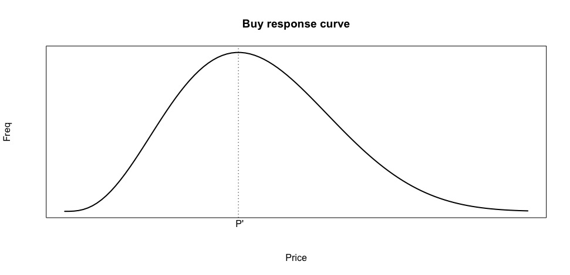

# 価格感度測定 (PSM) {#psm}

本章では、より直接的にマーケティング意思決定に関わるマーケティング調査法について紹介する。特に、本講義では「消費者に受け入れられる価格」について洞察を得るための方法として、価格感度測定（Price Sensitivity Meter; PSM）という手法について説明する。PSMは、マーケティング戦術決定に役立つ調査・分析手法でありながら、高度な分析手法を用いない。この手法はアンケート調査による簡便なアプローチとして広く実務的に用いられている。本章では、PSM の方法と結果の解釈に加えて、PSM に関する学術的背景についても説明することで、「PSM が何を明らかにしようとしているのか」を直感的に理解できるようになることを目的とする。そのために本章では、以下の順でPSMについての説明を行う。まず次節では、PSMでどのような情報を得ることができるのかを概観するため、PSMで用いる調査方法と、Rでの分析方法を紹介する。続いて、質問の背景に存在する価格概念について説明した後、PSMの背景に存在する学術的議論について簡単に触れる。

## PSMの実行と結果{#psmrunning}
価格は、マーケティング意思決定者が調整する重要なマーケティング戦術要因（4Ps）のひとつである。価格は4Psの中で唯一企業にとっての収入を生む要因であり、製品の需要量やイメージにも関連する重要な意思決定項目である。消費者の視点にたてば、価格は自身の予算制約のもとその製品が購入に値するかを判断する定量的かつ認知的な情報であると同時に、品質や高級感を推測するための心理的影響を持つ情報としても機能する。マーケティング意思決定者は、製品のマーケティング戦略や目標と一貫するように価格を設定する必要があるが、どれぐらいの価格で販売すれば、消費者が安い/高いと感じるのかを事前に把握したいと考えるだろう。このような背景のもと、PSMは、消費者の心理的側面を踏まえた価格に関する含意の提示を目的としている。

PSM では、4つの質問項目を用いて消費者の価格に対する認識を捉える。なお、質問においては、消費者の価格に関する知覚について知りたい対象（製品やサービス）を特定化する必要がある。例えば、具体的な設問の前に、製品の画像や情報を提示することで、回答者が参照する製品やサービスを特定化することも有効になる。その上で、PSMでは以下の4つの質問によって調査を行う。

1. （ある製品に対して）安すぎて買わない価格
  - 例：「（この製品を買う［サービスを利用する]のに）価格がいくらより低いと、買うには安すぎて品質に不安を感じますか？; （回答）〇〇円」
2. 安いと感じる価格
  - 例：「（この製品を買う［サービスを利用する]のに）価格がいくら以下だと、安いと感じますか？; （回答）〇〇円」
3. 高いと感じる価格
  - 例：「（この製品を買う［サービスを利用する]のに）価格がいくら以上だと、高いと感じますか？; （回答）〇〇円」
4. 高すぎて買わない価格
  - 例：「（この製品を買う［サービスを利用する]のに）価格がいくら以上だと、買うには高すぎると感じますか？; （回答）〇〇円」

なお、これらの回答の回答によって得た４つ価格は、$4 > 3 > 2 > 1$ という関係が成り立っている必要がある。これらの質問への回答により得たデータは、以下の図のように回答者ベースの構造をもつはずである。

{width=70%}

PSMでは、上記のデータから各価格レンジ（以下の例では、x円以下形式）に対して、安すぎる、安い、高い、高すぎる、と感じる人がどの程度いるかを集計する。ある価格水準に対し、安い（高い）や安すぎる（高すぎる）と感じる回答者がどれだけいるのかという（相対）頻度を求めることで分析を行う。以下の表はPSMでの集計を簡単に示したデータ構造である。

{width=70%}

Rを用いた分析においては、自身でデータ構造の変換を行う必要はない。Rでは、"pricesensitivitymeter" というパッケージの `psm_analysis()`という関数を用いることで分析を実行できる。なお、PSM用データ構造への集計作業もこのパッケージにおいて行ってくれる。

ここからは、実際にRを用いたPSMの実行手順を紹介する。まず分析の実行に際し、このパッケージをインストールし、起動する。

```{r psm_preparation, eval=FALSE}
install.packages("pricesensitivitymeter")
library(pricesensitivitymeter)
library(tidyverse)
```

```{r psm_package, include=FALSE}
library(pricesensitivitymeter)
library(tidyverse)
```

続いて、"psm_ex.csv" という演習用データを読み込み、`psm_ex` として定義する。


```{r psmdata}
psm_ex <- read.csv("data/psm_ex.csv", na = ".")
head(psm_ex)
```

このデータは、ある製品への価格について、安すぎる（tch）、安い（ch）、高い（ex）、高すぎる（tex）という上記4つの価格認識について、250人の消費者から回答を得た（と仮定する）人工データである。分析の実行においては以下のように、`psm_analysis()` という関数において、`toocheap`、`cheap`、`expensive`、`tooexpensive`という引数を用いて、データセットにおけるどの変数がPSMで用いる価格情報に対応するのかを指示する必要がある。

```{r psm_analysis,warning=FALSE}
output_psm <- psm_analysis(
  toocheap = "tch",
  cheap = "ch",
  expensive = "ex",
  tooexpensive = "tex",
  data = psm_ex
)

summary(output_psm)
```

`psm_analysis()` の実行結果として、Accepted price range（受容価格域）、Indifference price point（無差別価格）、Optimal price point（最適価格）が提示される。今回の分析の結果を見れば、受容価格域は `923-1253`、無差別価格は `1101`、最適価格は `1058` である。受容価格域とは、安すぎると感じる人と高すぎると感じる人が少ない価格域を表している。 また無差別価格とは、高いと感じる人と安いと感じる人がつりあっていて、高くもなく安くもない価格である。一方で最適価格とは、高すぎたり安すぎたりして買わないという人が最も少ない（受容する人が最も多い）価格である。

また、PSMでは分析結果を図示化する慣習もあるが、これも `psm_plot()` という関数を用いて、ggplot 形式のコマンドで簡単に出力できる。

```{r psmfigure, warning=FALSE, fig.cap="PSM Plot"}
psm_plot(output_psm) +
  labs(
    x = "Price",
    y = "Share of Respondents (0-1)",
    title = "Price Sensitivity Meter Plot",
    caption = "Shaded area: range of acceptable prices\nData: Randomly generated") +
  theme_minimal()
```

上記の図では、受容価格価格域、無差別価格、最適価格というそれぞれの結果が、"too cheap"（安すぎる）曲線、"too expensive"（高すぎる）曲線、"not cheap"（安いと感じない）曲線、"not expensive"（高いと感じない）曲線の交点によって導かれていることがうかがえる。次節以降では、これらの結果の背景にはどのような理論があるのかについて詳しく述べる。

## マーケティングにおける価格概念{#price_concept}
本節では、PSMの結果への理解を深めるために、マーケティングにおけるいくつかの価格概念を紹介する。PSMは消費者の内的な価格に対する認識や基準を集計する方法である。消費者の購買に関わる最も基本的な価格概念に、支払い意思額（Willingness to Pay: WTP） がある。WTPは、消費者が特定の製品に対して「最大いくらまで払ってもいい」と考えているかを捉えた価格である。単純化された理論的世界観のもとでは、消費者はある製品の価格が、自身の WTP を下回る場合には、その製品を購入すると考えられる。

しかしながら、消費者の心理的側面を考慮すると、価格が安ければいいというわけでもない。我々の日常的な買い物においては、ある製品が自身のWTPより高いので買えないということに加えて、安すぎる価格によって、（製品品質などに）不安を抱き買いたくないと考えることもあるだろう。製品やサービスの品質が事前にわからない場合、人々はなんらかの情報に基づいて品質を類推するが、価格がその手がかりになると考えられる。このように、製品の価格が安すぎても、高すぎても買ってもらえず、どうやら消費者にとって、ちょうどいい価格幅がありそうだといえる。そして、「安すぎて不安だから買いたくない」という価格から「高くて買えない」という価格で示される、消費者が受容する（製品を買う）価格帯のことを、受容価格帯（Accepted price range）という。

もう一つの心理的側面を捉えた価格概念に、内的参照価格がある。我々の日常的な買い物を振り返ると、自身が買える価格の範囲内であっても、その価格が高いもしくは安いと感じることはあるだろう。内的参照価格は、買い手がその価格が妥当かどうか判断する際の基準となる、個人の価値観を反映した価格である。つまり内的参照価格は、「高すぎて買えない」や「安すぎて買いたくない」というほど極端な価格ではないが、自身の持っている基準から消費者自身が「これは安いな」とか「これは高いな」と感じることを捉えた価格概念である。ただし、内的参照価格は対象となる製品やサービスの価値だけではなく、消費者個人の経験や他の関連製品の価格にも影響を受けることに注意が必要である。PSM では主に、受容価格と内的参照価格を中心に分析・図示化を行う。

## PSMに関する既存研究

### 受容価格に関する知見
本節ではまず、PSMのもとになっている、受容価格帯に基づく価格分析として Gabor and Grager (1966) について紹介する。PSMは主にマーケティング実務上での活用を前提提示された手法であり、学術研究分野ではあまり言及されることはない。しかしながら、PSMは前節で述べた受容価格帯と内的参照価格に関する学術的知見に基づき提唱されたという経緯がある。

受容価格帯に関する知見としては、Gabor and Granger (1966) による購買反応曲線（Buy Response Curve；以下、BRC）の知見が活かされている。本節では、この論文の知見を簡単に紹介する。詳細について関心がある場合にはぜひ論文を読んで見てほしい。逆に、PSMに関する理論的背景に関心がない場合には、「実務的に広く使われているPSMにも、学術的な蓄積がある」ということさえ頭に留めてくれれば、そのまま次節へ進んでもらっても構わない。

Gabor and Granger (1966)では価格に対する需要量の変化ではなく、ある価格においてその製品が購買される可能性（Plausibility）について捉えた議論を展開している。この研究では受容価格の上限と下限に着目し、ある価格Pにおいて、消費者がそれを安すぎると感じる確率を$L(P)$、価格Pにおいて、消費者がそれを高すぎると感じる確率を $H(P)$ とした（ただし、$0\leq L(P)\leq1$かつ$0\leq H(P)\leq1$）。これらの確率は、下図で示されるように、$H(P)$が単調増加である一方で、$L(P)$ は単調減少であり、$L(P)$ ではなく $1-L(P)$ が累積分布関数として捉えられる。

```{r LpHpfig, echo=FALSE, fig.cap = "L(P)とH(P)"}

```

これらを用いて、価格Pが消費者の受容価格範囲に入っている確率を $B(P) = 1- L(P) - H(P)$ と定義した。ただし、$H(P)$ と $L(P)$ はすべての $P$ に対して微分可能であり、$l(P)=dL(P)/dP$、$h(P)=dH(P)/dP$とする。$B(P)$は、ある価格Pを消費者が高すぎるとも安すぎるとも感じない確率と言い換えることができ、これを購買反応曲線（BRC）と呼んだ。BRCの形状は以下のように示すことができる。この形状から、$P'$ という価格水準を基準とし、それより高いないし低い価格において、購買される可能性が低くなることが予想される。

```{r referenceprice, echo=FALSE, fig.cap = "購買反応曲線"}

```


Gabor and Granger (1966)は思いつきや恣意的に曲線の形状を決めたのではなく、いくつかの仮説に基づき、BRCの形状について議論を発展させた。これが、彼らの研究の一番の理論的貢献である。特に、ここで想定されている仮説を確認することで、BRCの議論においてどのような消費者像が想定されているのかについて理解が可能になる。

例えば論文内では、１つ目の仮説（H1）として、先述の $l(P)$ と $h(P)$ をそれぞれ、低すぎ頻度関数と高すぎ頻度関数と呼び、これらが対数正規の密度関数に従うという仮説を述べた。つまり、$p = logP$ としたとき、$l(p)$ と $h(p)$ は正規分布に従うと考えられる。ここでは、Weber-Fechner law という、「ある刺激とそれに対する個人の知覚の関係は対数的である」とする理論に基づき、対数線形を用いた形状を仮定している。言い換えると、Gabor and Granger (1966) によるBRCは、価格の増加という刺激を感覚（お得感や割高感等）として知覚する消費者像を想定したモデルだと解釈できる。

仮説2（H2）では、ある価格と消費者グループにおいては、$l(p)$ と $h(p)$ の標準偏差は近似的にほぼ等しいと述べた。詳細は割愛するが、H1とH2を含む計4つの仮説と整合的な結果を得ることで、BRCの形状についての知見を獲得した。$1-L(p)$ と $H(p)$ が正規の確率分布関数に従うとするならば、$B(p) = 1- L(p) - H(p)$
の理論的な形状も推察できる。ただし、$B(p)$ 自体は確率密度関数ではない。Gabor and Granger (1966) では、$m_1$ と $m_2$ をそれぞれ、$l(p)$ と $h(p)$ の期待値とし、$b(p)=B(p)/(m_2-m_1)$ を確率密度関数と捉えた。単純化のために H2 を仮定すると、$b(p)$ は $(m_1+m_2)/2$ を中心に左右対称である。これらの仮説および議論のもと、$l(p)$、$h(p)$と、$b(p)$ は以下のように図示できる。このように、Gabor and Granger (1966)は、いくつかの仮定を満たすような状況では、消費者の価格に対する反応を数量的に分析することが可能になることを示した。

```{r brcfig, echo=FALSE, fig.cap = "購買反応密度関数"}

```


### 内的参照価格に関する知見
受容価格に関するBRCに加え、内的参照価格についての知見もPSMには重要である。詳しくは兼子（2014）を参照してほしいが、内的参照価格にも幅が存在すると考えられる。つまり、受容価格帯内において安いか高いかを知覚する価格は特定の水準だけでなく、価格幅として構成されると考えられる。ある製品の価格が消費者にとって高いと感じる価格帯よりも低く、安いと感じる価格帯よりも高い価格幅に含まれている場合、その価格は「安くも高くもない」価格として知覚される。言い換えると、この安くも高くもない価格幅に基づき、その上限よりも高い価格については高いと感じ、下限よりも低い価格については安いと感じると考えられる。以下では、兼子（2014）を参考に、受容価格帯（$P_4-P_1$）と内的参照価格帯（$P_3-P_2$）を図示する。

```{r acceptfig, echo=FALSE, fig.cap = "内的参照価格帯"}

```

上図における、$P_1$ を安すぎる価格の上限、$P_2$ を安いと感じる価格の上限、$P_3$を高いと感じる価格の下限、$P_4$ を高すぎる価格の下限と考える。そのため、$P_1$ より低い価格や、$P_4$ より高い価格の場合には消費者は購買しないと仮定する。一方で、$P_2-P_1$ の範囲では、安いと感じるが買うと考えられるし、$P_4-P_3$ の範囲では高いと感じるが買うと考えられる。このように、受容価格帯と内的参照価格帯の関係を捉えることで、「買う買わない」に加えた消費者の価格に対する感じ方も捉えた含意を得ることができる。

## 受容価格帯と内的参照価格帯の応用とPSM
PSM は、受容価格帯と内的参照価格帯に関わる知見に基づき提案されている価格決定手法である。PSMの特徴は、「安すぎる価格」、「安い価格」、「高い価格」と「高すぎる価格」の4つの質問に対する個人の価格水準を回答してもらう点にある。PSMでは特定の価格を提示しその価格に対する消費者の評価を得るという方法ではないことにも注意が必要である。つまり、「この製品が〇〇円だったらどのように感じますか？：1. 安い,...,7.高い」のような質問形態を取らない。

PSMでは、上記の4つの質問から得た回答をもとに、価格の変化に対する安い（または高い）と感じる人と安すぎる（高すぎる）と感じる人の累積比率を計算し図示化していくのだが、もう一点注意するべき点がある。それは、「高いと感じる人」の比率と「安いと感じる人」の比率を１（または100%）から引き、「高いと感じない人」と「安いと感じない人」についての比率を示す曲線を描画するということである。これらの高い（安い）と感じない人の比率を示した曲線は高い（安い）と感じる人の比率を反転させたもの（兼子，2014）や余事象（岸など，1999）と呼ばれている。以下の図は、「高い（安い）と感じない」という形に反転させた状態でのPSM分析結果例を表現した比率曲線である。下図のうち、"Too expensive" （青い実線）と "Too cheap"（赤い実線） 曲線はそれぞれ高すぎると安すぎる（と感じる人の）比率を表しており、"Not expensive" （青い破線）と "Not cheap"（赤い破線）曲線は高いと感じないと安いと感じない人の比率を示している。

```{r psmfig, echo=FALSE, fig.cap = "PSM結果例"}

```


PSMでは、上図内の各曲線の交点から、最適価格（$P^*$）、無差別価格（$\tilde{P}$）、最高価格（$\bar{P}$）、最低価格（$\underline{P}$）を算出する。$P^*$ は、受容価格帯に基づく価格点である。$P^*$は高すぎると感じる人と安すぎると感じる人の比率が最も少なくなり、受容不可能な消費者が最小となる価格である。$\tilde{P}$ は内的参照価格に基づく価格点である。$\tilde{P}$は、「安いと感じない」曲線と「高いと感じない」曲線の交点であり、安いとも高いとも感じない消費者が最多となる価格帯であり、前節 \@ref(fig:acceptfig) の図における $P_3-P_2$の範囲内だと感じている消費者が最も多い価格だと解釈できる。

それ以外の価格点の解釈は比率の余事象（例、高いと感じない、安いと感じない）を求めることで容易になっている。$\bar{P}$ は、高すぎると高いと感じないの曲線の交点である。この点は、「高いとは思うが高すぎるわけではない」と感じる消費者が多い点である。この点よりも低い価格では高いと感じる人が少ない（高くないと感じる人が多い）が、この点よりも高い価格では高すぎると感じる人が多くなる。言い換えると、前節における $P_4-P_3$ の範囲内だと感じている消費者が多い価格だと解釈できる。一方で $\underline{P}$ は安すぎると安いと感じないという二つの曲線の交点である。この点は、「安いとは思うが安すぎるわけではない」と感じる消費者が多い点であり、前節における $P_2-P_1$ の範囲内だと感じている消費者が多い価格だと解釈できる。


本節で述べた通り、\@ref(psmrunning) 節でも確認した PSM の分析結果では受容価格と内的参照価格に基づいて提示される価格水準や価格帯である。PSMは調査方法も（Rによる）分析方法も簡便であるが、それだけに結果の解釈については注意が必要である。例えば、PSMの分析結果において「最適価格」という言葉が用いられるが、この価格水準は、受容する人が最も多いことを示しており、他の文脈で用いられうる「最適」を意味しないことに注意が必要である。同様に、その他の価格帯・水準についても受容価格帯と内的参照価格帯との関連から解釈することが可能になる。PSMを利用する際には、その前提となる知識に基づき、結果に対する適切な解釈を行うことが重要になる。

## 集計方法に関する注意点
これまで紹介したPSMアプローチは、Westendorp (1976) によって提唱された方式であるが、、Newton et al. (1993) によって提唱された別のアプローチも広く採用されている。Newton et al. (1993) による方式（NMS型）でも、これまで説明した方式と同様の4つの質問を用いて最適価格、無差別価格、最高価格、最低価格を提示する。しかしながら、NMS型においては「高いと感じる」と「安いと感じる」消費者の比率の余事象は取らずに分析を行う。NMS型は広く用いられているものの、Newton et al. (1993) が誤った方法を紹介したことを起点に広まったとされている（兼子，2014）。

NMS型の PSM を用いると、最適価格と無差別価格は Westendorp 型の方式と等しい結果を得るが、最低価格と最高価格については異なる結果を得る。どちらの数値が正しいのかという点については議論があるものの、NMSは各曲線の交点についての論理的意味が見出しにくいという欠点を有している（兼子，2014）。

NMS型の考え方を簡易的に図示化する。安いおよび高いと感じる曲線を 1 (もしくは100%) から引く形で反転させない場合、最低価格（$\underline{P}$）は「高い」曲線（青い破線）と「安すぎる」曲線（赤い実線）との交点で求められる。これは、先述の図\@ref(fig:acceptfig)  で示されている $P_4-P_2$ の範囲に感じている回答者が多くなる価格を表している。 同様に、最高価格（$\bar{P}$）は安い曲線（赤い破線）と高すぎる曲線（青い実線）の交点で求められる。これは、$P_3-P_1$ の範囲に感じている回答者が多くなる価格を表している。これらのことから、NMS型では、最高価格と最低価格の解釈が困難になると考えられる（兼子，2014）。NMS型でも前節までに説明したものと似た結果を得ることはできるのだが、その結果が既存の価格概念と整合的かつ直感的かという点に関して、問題を有している。

```{r NSMfig, echo=FALSE, fig.cap = "NMS型概要図"}

```

オンライン上では、NMS型のPSMを紹介している記事も散見される。実務的にもNMS型の方法を用いる場合もあるが、PSMの背後にある受容価格と内的参照価格に関する理論的基盤を鑑みると、Westendorp (1976) 方式のPSMアプローチのほうが、より実務的な含意を得やすい明示的な方法であると考えられる。PSMは使用の容易さから広く用いられているアプローチではあるが、本資料を読んだ学生においては、その背後に想定されている「受容価格」と「内的参照価格」という価格概念を理解したうえで活用してほしい。

## 参考文献

Gabor, A., & Granger, C. W. J. (1966). Price as an Indicator of Quality: Report on an Enquiry. Economica, 33(129) 43-70.

兼子良久 (2014). 「Westendorpのprice sensitivity Meterに関する考察-活用上の注意点と粗問題-」, 鹿児島経済論集, 54(1-3), 29-60. 

岸邦宏・内田賢悦・佐藤馨一 (1999). 「航空運賃に対する利用者の価格感度に関する研究」, 土木計画学研究・論文集, 16, 187-194.

Van Westendorp, P (1976) NSS-Price Sensitivity Meter (PSM) – A new approach to study consumer perception of price. Proceedings of the 29th ESOMAR Congress, 139-167. Online available at https://www.researchworld.com/a-new-approach-to-study-consumer-perception-of-price/.

Newton, D, Miller, J, Smith, P, (1993) A market acceptance extension to traditional price sensitivity measurement. Proceedings of the American Marketing Association Advanced Research Techniques Forum.